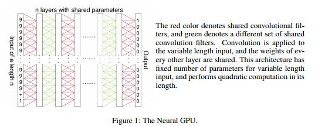

# 学界 | OpenAI 最新论文：神经 GPU 的扩展和限制

选自 arXiv.org

**机器之心编译**

**参与：吴攀**

> 
> 
> **摘要**
> 
> 神经 GPU（Neural GPU）是最近一种用来学习多位二进制加法和二进制乘法等算法的模型，其可以泛化到任意长度的输入。我们的研究表明存在两种提升神经 GPU 的表现的简单方法：通过谨慎地设计 curriculum 和增加模型的大小。后一种方法需要需要细致的内存管理，因为神经 GPU 的 naive implementation 有密集的内存需求。我们发现这些用来增加算法问题集的技术可以通过神经 GPU 解决：我们可以在参数被以十进制的形式给出（让人惊讶的是，这在以前还不可能办到）时学习执行所有的算术运算（以及泛化到任意长的数字）。我们也可以训练该神经 GPU 来评估带有多个操作数的长算术表达式，这些操作数遵守操作数的优先顺序，尽管这些操作数在它们的仅二进制表示下取得过成功，但并没有达到 100% 的精度。
> 
> 除此之外，我们尝试通过理解其出错模式来获取关于神经 GPU 的深入见解。我们发现可以正确泛化到任意长数字的神经 GPU 仍然无法在高对称的、非典型的输入上计算出正确答案。比如说，一个神经 GPU 可以在长达 100 位的数字的十进制乘法上实现近乎完美的泛化，但它仍然无法计算 000000…002×000000…002（尽管它可以计算 2×2）。这些出错模式使人想起了对抗性样本（adversarial examples）。
> 
> 
> 
> *图 1：神经 GPU。红色表示共享的卷积过滤器（shared convolutional filters），绿色表示共享的卷积过滤器的不同集合。卷积被应用于可变长度的输入，而每一层的权重都被共享。这个架构对于可变长度的输入有固定数量的参数，并且能在其长度上执行二次计算（quadratic computation）。*
> 
> **论文下载：https://arxiv.org/pdf/1611.00736v1.pdf**
> 
> ******©本文由机器之心编译，***转载请联系本公众号获得授权******。***
> 
> ✄------------------------------------------------
> 
> **加入机器之心（全职记者/实习生）：hr@almosthuman.cn**
> 
> **投稿或寻求报道：editor@almosthuman.cn**
> 
> **广告&商务合作：bd@almosthuman.cn**