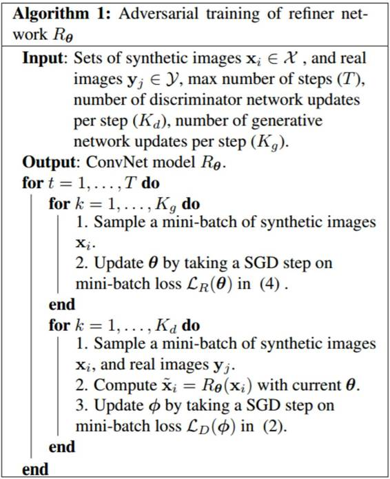
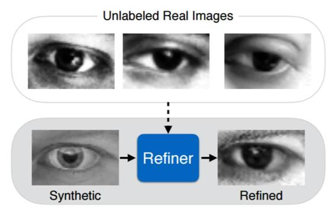
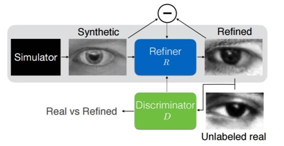
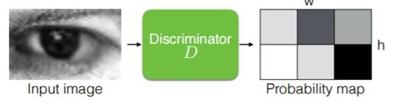
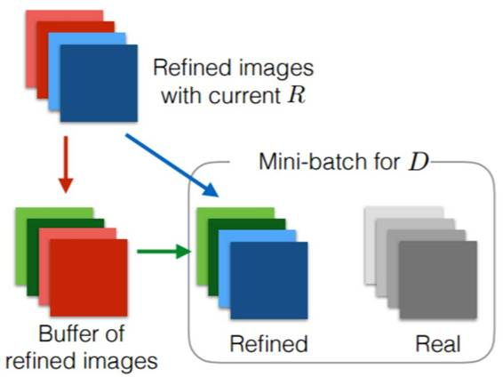
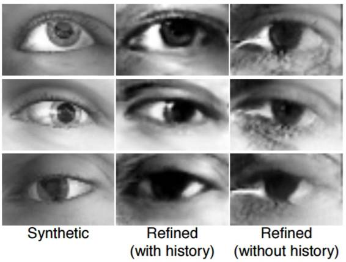
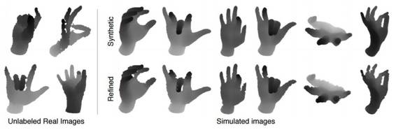

# 重磅 | 苹果发布第一篇人工智能研究论文：提出模拟+无监督方法改善合成图像质量

选自 TechCrunch 等

**机器之心编译**

**参与：吴攀、蒋思源、朱思颖**

> *在 12 月初的时候，[苹果正式向外界宣布允许其人工智能和机器学习研究员公开发布和分享他们的最新研究成果](http://mp.weixin.qq.com/s?__biz=MzA3MzI4MjgzMw==&mid=2650721102&idx=4&sn=32e8e8a2f58e31959979c69e5615e712&chksm=871b0f30b06c86268c98d32e1f2fdf455c7a0b78c6d504d297a09326abddfc6e70c1e1fad755&scene=21#wechat_redirect)，这一举措稍稍掀开了苹果久负盛名且神秘的创新研究进程的一角。仅在几周之后，他们的人工智能和机器学习研究的第一篇论文发表了，主要聚焦苹果在智能图像识别领域的研究。*

机器学习研究也许会在苹果内部引领新的潮流。该公司最近成立的机器学习小组中六位研究员发表了一篇论文，这篇论文描述了一种用于模拟+无监督学习（simulated + unsupervised learning）的新方法。其目的是提高合成训练图片的质量。这项研究展示了该公司希望在高速增长的人工智能领域中成为领导者的渴望。

谷歌、Facebook、微软还有其他技术类初创公司一直稳步发展他们的机器学习研究小组。这些公司都发表了几百份的学术研究。他们的学术追求都是公开且有据可查，但是苹果公司一直很固执地将研究成果保密。

变化是从本月初开始的。苹果的 AI 研究部主任 Russ Salakhutdinov 宣布该公司将很快开始发表研究成果。该研究小组的第一次尝试就是很及时很务实的。

近来，使用合成图像和视频训练机器学习模型的频率越来越高了。不使用真实世界的图像是因为其花费的成本和时间很高，而生成图像的成本更少，更容易获取和定制化。

在该研究中，苹果指出了与合成图像或计算机图像相比使用真实图像的优缺点，标注必须添加到真正的图像，这是一个「昂贵且耗时的任务」，需要一个人的劳动力单独标记图片中的物体。另一方面，计算机生成的图像能帮助促进这一过程，「因为标注是自动可用的。」

尽管如此，完全换成合成图像可能会导致程序的质量下降的问题。这是因为「合成数据往往不够现实」，往往会产生只对计算机生成的图像的细节才能反应良好的用户体验，而且还不能很好地泛化到它面对的任何真实世界的物体和图像上。

这就是这篇论文的初衷所在——在「对抗学习」中综合使用模拟和真实图像，创建出一个领先的人工智能图像程序： 

> *在这篇论文中，我们提出了模拟+无监督学习（S+U）学习，其目标是使用未标记的真实数据提升合成图像的真实性。经过提升的真实性能够在没有收集的真实数据或经过人类注释的大型数据集上实现更好机器模型训练。*
> 
> *我们发现这将实现高质量的真实图像的生成，而且经过了定性研究和用户研究的验证。*

论文剩下的部分介绍了苹果在该主题下的一些研究细节，包括已经开始操作的实验和支持其研究发现的一些数据理论。虽然这篇论文只关注单个图像，但是苹果的该研究团队指出他们最终期望的结果是「探讨精炼的视频」。

苹果提议使用生成式对抗网络（GANs）来提高这些合成图像的质量。生成式对抗网络并不新颖，但苹果正在修改它使其更加符合生成训练图片的目的。

生成式对抗网络很大程度上通过利用竞争性神经网络（competing neural networks）之间的对抗关系来工作。在苹果公司的论文中，模拟器通过精炼机（refiner）进行生成图像，然后将这些精炼过的图像发送到鉴别器（discriminator），鉴别器的任务就是区分真实图像和合成图像。

**论文：通过对抗训练从模拟的和无监督的图像中学习（Learning from Simulated and Unsupervised Images through Adversarial Training）**

摘要：随着近年来在图形（graphics）上的进步，在合成的图像上训练模型变得越来越可行了，这也潜在地避免了对昂贵的标注的需求。但是，由于合成图像分布和真实图像分布之间的差别，从合成的图像中学习可能无法得到预期的表现。为了弥合这种差距，我们提出了模拟+无监督学习（Simulated+Unsupervised (S+U) learning），其中的任务是使用无标签的真实数据来提升模拟器输出的真实性，同时也为保留来自该模拟器的标注信息。我们开发了一种用于 S+U 学习的方法，该方法使用了一个类似于生成对抗网络（GAN）的对抗网络，但它的输入是合成图像而非随机向量。我们在标准 GAN 算法的基础上做了一些关键的修改，从而可以保留标注、避免伪像（artifact）和使训练稳定：

i. 一个「自正则化（self-regularization）」项；

ii. 一个局部对抗损失（local adversarial loss）；

iii. 使用精细调节过的图像的历史来更新判别器。

我们的研究表明这能实现高真实度的图像生成——这在定性评估和用户研究上都得到了证明。我们通过训练用于注视估计和手姿态估计（gaze estimation and hand pose estimation）的模型而对生成的图像进行了量化评估。研究表明我们在使用合成图像上实现了显著的提升，并且在没有任何有标签的真实数据的情况下实现了在 MPIIGaze 数据集上的当前最佳结果。

 

*算法*

 

*图 1：模拟+无监督（S+U）学习。其任务是使用无标签的真实数据从模拟器中学习能够提升合成图像的真实度的模型，同时还能保留其标注信息。*

*图 2：SimGAN 概览。我们使用一个 refiner 神经网络 R 来改善模拟器的输出；该神经网络可以最小化局部对抗损失和一个「自正则化（selfregularization）」项的组合。这个对抗损失会试图欺骗一个判别器网络 D，而 D 则需要试图区分一张图像是否是真实的。上述的「自正则化」项可以最小化合成图像和改善过的图像的之间的图像差异。这保留了标注信息（即注视方向），使得改善过的图像可以用于训练机器学习模型。该 refiner 网络 R 和判别器网络 D 是交替更新的。*

*图 3：局部对抗损失（local adversarial loss）的图示。该判别器网络输出一个 w×h 的概率图。其对抗损失函数是在局部 patch 上的交叉熵损失（cross-entropy losses）的总和。*

*图 4：使用改善过的图像的历史（history of refined images）的图示*

*图 9：使用一个改善过的图像的历史来更新判别器。（左图）合成图像；（中图）使用改善过的图像的历史所得到的结果；（右图）没有使用改善过的图像的历史所得到的结果（而仅仅使用了时间最近的改善过的图像）。我们可以观察到明显的没有真实感的伪像，尤其是在眼角附近。*

*图 11：来自 NYU 手势数据集 [35] 的改善过的测试图像样本。（左图）真实图像；（右图）合成图像（上）和对应的 refiner 网络输出的改善过的图像。在真实图像中最大的噪声源是不平滑的深度边界（non-smooth depth boundaries）。该 refiner 网络学习了建模真实图像中的噪声存在，重要的是其不需要任何真实图像的标签。*

**点击阅读原文查看论文**

*原文链接：https://techcrunch.com/2016/12/26/apple-leaps-into-ai-research-with-improved-simulated-unsupervised-learning/*

***©本文由机器之心编译，***转载请联系本公众号获得授权***。***

✄------------------------------------------------

**加入机器之心（全职记者/实习生）：hr@almosthuman.cn**

**投稿或寻求报道：editor@almosthuman.cn**

**广告&商务合作：bd@almosthuman.cn**