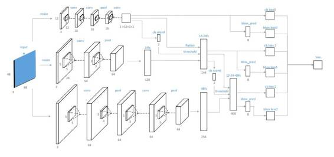
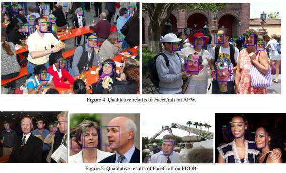

# CVPR 2016｜商汤科技论文解析：人脸检测中级联卷积神经网络的联合训练

商汤科技专栏

**论文：Joint Training of Cascaded CNN for Face Detection**

**论文作者：Hongwei Qin, Junjie Yan, Xiu Li, Xiaolin Hu**

**Grad.School at Shenzhen Tsinghua University（清华大学深圳研究生院），Tsinghua University（清华大学），SenseTime Group Limited（商汤科技）**

**本文作者：闫俊杰**

> *CVPR：IEEE Conference on Computer Vision and Pattern Recognition，即 IEEE 国际计算机视觉与模式识别会议。该会议是计算机视觉和模式识别领域的顶级会议，在中国计算机学会推荐国际学术会议的排名中，CVPR 为人工智能领域的 A 类会议。*
> 
> *商汤科技会在 CVPR 2016 上提交多篇论文，接下来，商汤科技的技术专家将在机器之心发布系列文章，对论文进行解读。*

人脸检测是一个各种人脸应用中最基础的一个模块。 几乎所有的人脸应用都需要首先使用检测器来得到人脸的具体位置，然后再进行更加精细的处理，包括关键点定位，美颜，识别等等。当我们用单反拍照，当我们用手机美颜，当我们登陆系统前进行人脸认证，甚至当我们经过某些监控摄像头，人脸检测算法时刻在运行着。

作为几乎是整个计算机视觉最重要、最成功的应用之一，人脸检测在 2000 年左右就有了一个令人信服的解决方案，当时 Viola 和 Jones 提出了积分图特征计算 +Adaboost+ 级联的方式来做检测。其中积分图特征计算的效率非常高，每个像素只要被遍历一次就可以得到积分图，然后可以快速的计算出一些人工设计的特征模式；Adaboost 算法可以把很多弱特征组合成一个更强的分类器；而级联可以快速过滤掉过多的背景。Viola 和 Jones 的方法非常成功，以至于至今依然被持续改进和大规模的使用。Viola&Jones 的改进和实用化的过程中，一个很重要的事件是黄畅博士的改进算法以及 Omron（欧姆龙）的劳世竑和他的团队把该算法做到了芯片上(很幸运的劳老师现在也在 SenseTime 工作)。

从 08 年 12 年之间，很多没有自己动手做过实验的人往往以为人脸检测已经解决了，计算机视觉的几个主流会议上甚至很少也看到人脸检测的工作。 这其中的原因，可能是之前大家做人脸识别等的实验，往往在一些比较规范的数据集上。但是对于真实世界的人脸，不管是学术界的 FDDB，MALF 还是工业界的一些实际使用场景，亲自做过实验的人都可以很明显的感受到基于 Viola-Jones 的这套框架的力不从心。不仅仅是性能方面，还有个严重的问题是，这些方法过多的依赖经验的积累。从头基于这套框架复现一个好的结果，并且维护一套性能优异的测试代码的时间成本和人力成本都非常非常的大，造成了一定的门槛。 由于大部分所谓的经验都是不公开的，这在某种程度上也阻碍了技术的进步。

好消息是整个领域进入了卷积神经网络（Convolutional Neural Network，既 CNN）的时代后，之前的很多传统方法的经验积累可以很快的被颠覆。人们很快发现，直接把通用物体检测的思路搬到人脸检测里面，并做一些简单的改进就很容易取得比传统方法更好的结果。于是 13 年到现在学术界的人脸检测数据集 FDDB、AFW 和 MALF 等被一次次的刷新着。这些方法至少在精度上比前一代算法提升了很多， 与当时很多商业软件里面的人脸检测器，比如 Google Picasa 等有接近的性能。笔者也在这个大潮中和伙伴们一起用几种不同的方法刷新了结果，但是和绝大多数的所谓科研一样，这些基本上都成了过眼云烟，除了几篇 paper 外并没有留下太多的实际意义。 这些方法本质上以最好的通用物体检测算法作为基础，加以改进。但是相比于通用物体检测，人脸检测有些不同，比如说人脸对精度和速度的要求更高；人脸有很多关键点和属性的标注可以利用；人脸比通用物体更容易设计有更多的先验等等，这些不同导致了近期非常多的基于卷积神经网络的人脸检测的工作，大部分也都取得了不错的结果。

我们的文章考虑了一个如何联合训练检测器的问题，可以认为是卷积神经网络方案中的一个，但是不局限于某个特定的 CNN 检测方法。不管是人工设计的特征的方法，还是基于卷积神经网络的检测算法，往往都需要做级联。而级联的缺点是不太好直接联合训练，这恰恰破坏了卷积神经网络可以端到端训练的性质。由于传统的级联训练往往是单步求解最优，得到的结果可能没有多步联合最优的效果好。

为此，我们提出了一种可以联合训练整个级联分类器的一种方式。得益于神经网络可以反向传播的性质，我们给出了如何联合训练整个级联分类器。并且，我们说明了如何在简单的 cascade CNN 和更复杂一点的 faster-RCNN 上都可以用这种方式来联合训练，并且可以取得非常优异的性能。 特别是当网络的规模比较小的时候，这种联合训练的方法提升非常大。如下是一个简单的级联卷积神经网络的示例图。

 

这个工作做完之后，我们进一步大幅度提升了检测的速度和精度，并把完全基于 CNN 的方法做到了包括 ARM，CPU 和 GPU 各个平台上，并且跑到了非常好的速度。如今，商汤科技基于深度学习的人脸检测技术适配于多个品牌不同型号的手机上，支持着几十个各类 APP 的人脸分析功能；在单核 CPU 上可以跑到上百 FPS，并每天支持着大量的金融人脸认证服务；在单个 GPU 上可以实时的处理超过 12 路以上的高清视频，并运用到很多的安防监控系统中；甚至不久的将来，还会集成到相机前端的人脸抓拍芯片中。

如今众多的产品需求为技术的进步提供了海量的数据，也提出了越来越高的需求。我们知道，技术远远没有极限。很多现在感觉平常的技术，甚至半年前都难以想象；一些我们现在觉得难以逾越的技术障碍，有可能半年内被很好地解决。为此，我们默默的积累着，也希望更多的小伙伴一起在技术进步的道路上流下自己的汗水。

> *个人简介：*
> 
> ***闫俊杰****，商汤科技主任研发工程师，15 年博士毕业于中科院自动化所，研究领域主要是物体检测和人脸识别，发表了超过 10 篇 CVPR\ECCV\ICCV 论文。在 SenseTime 负责监控产品线的技术研发以及检测技术的基础研究。*

✄------------------------------------------------

**加入机器之心（全职记者/实习生）：hr@almosthuman.cn**

**投稿或寻求报道：editor@almosthuman.cn**

**广告&商务合作：bd@almosthuman.cn**

**点击「阅读原文」，浏览全部论文内容↓↓↓**