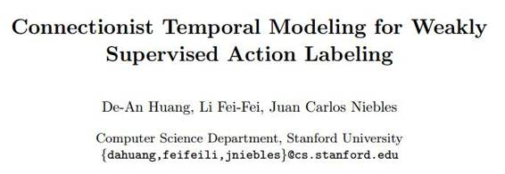

# 学界 | 斯坦福大学李飞飞最新论文：弱监督动作标记的连接时序模型

选自 arXiv.org

**作者： De-An Huang、李飞飞、Juan Carlos Niebles**

**机器之心编译**

**参与：李亚洲**

**摘要**

我们提出了一种为视频中的动作进行标记的弱监督框架，在训练过程中所需要的只有行为动作发生的顺序。主要的挑战是在训练中，输入（视频）与标记（动作）序列之间的每一帧校准（per-frame alignments）都是未知的。我们通过引入 Extended Connectionist Temporal Classification（ECTC）框架高效地评估所有可能的校准，这一过程经由动态编程和明确地强制它们与帧到帧视觉相似之间的一致性来实现。这在没有时时监督的情况下，能保护模型不受视觉不一致或退化校准的干扰。当视频中的一些帧被解析注释时，我们进一步地将框架拓展到了半监督案例中。在每个视频只有不超过 1 %的帧被标记的情况下，我们的方法能够超过已有的半监督方法，并能得到与完全监督的方法相媲美的表现。

***©本文由机器之心编译，***转载请联系本公众号获得授权***。***

✄------------------------------------------------

**加入机器之心（全职记者/实习生）：hr@almosthuman.cn**

**投稿或寻求报道：editor@almosthuman.cn**

**广告&商务合作：bd@almosthuman.cn**

**点击「阅读原文」，下载 PDF↓↓↓**