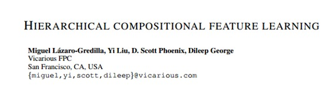

# 学界 | Vicarious 在 ICLR 2017 提交无监督学习论文，提出层级组合特征学习

选自 Open Review

**机器之心编译**

**参与：李亚洲、吴攀**

> *人工智能领域的明星创业公司 Vicarious 一直受到了业内的极大关注，亚马逊 CEO 贝佐斯，Facebook CEO 扎克伯格，Salesforce CEO Marc Benioff 和 Box CEO Aaron Levie 等都是其投资人。近日，Vicarious 发表了他们的一篇有关无监督学习的新论文，该论文已提交 ICLR 2017。点击阅读原文可下载此论文。*

**摘要**

我们介绍了一种层级组合网络（hierarchical compositional network，HCN），它是一种定向的生成式模型（directed generative model），能够在无监督的情况下发现并解开二值图像（binary images）集合的构建模块。这些构建模块是被层级式地定义为网络后层中一些特征（以某种特别的形式排布）的组合的二值特征。从高层面来说，HCN 类似于带有池化的 S 型信念网络（sigmoid belief network）。HCN 中的推断和学习非常具有挑战性，而且现有的变分近似法的效果不太令人满意。该研究的一个主要贡献是发现：使用经过特别安排的（不需要 EM）max-product message passing（MPMP），刚才提到的两个问题都能解决。而且，使用 MPMP 作为 HCN 推断引擎使得新任务更为简单：加入监督信息、分类图像或执行图像修复——全部都对应于将模型的一些变量固定于模型的已知值，然后在剩余部分上运行 MPMP。当被用于分类时，HCN 的快速推断几乎与带有线性激活函数和二值权重的卷积神经网络有同样的函数形式。然而，HCN 的特征在质量上却有很大的不同。

关键词：无监督学习

******©本文由机器之心编译，***转载请联系本公众号获得授权******。***

✄------------------------------------------------

**加入机器之心（全职记者/实习生）：hr@almosthuman.cn**

**投稿或寻求报道：editor@almosthuman.cn**

**广告&商务合作：bd@almosthuman.cn**