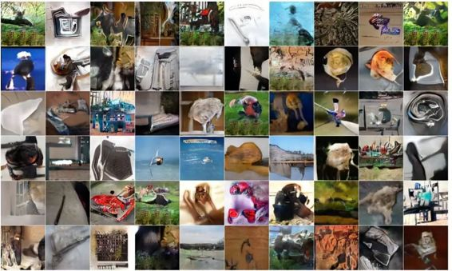

# 学界 | Yann LeCun 最新论文：基于能量的生成对抗网络（附论文）

选自 arxiv.org

**机器之心编译**

**作者：Junbo Zhao, Michael Mathieu, Yann LeCun**

**参与：吴攀**

**摘要**

我们在这里介绍「基于能量的生成对抗网络（Energy-based Generative Adversarial Network，简称 EBGAN）」模型，该网络将 GAN 框架中的鉴别器（discriminator）视为与数据流形（data manifold）和其它所有更高能量的区域的低能量区域相关联的能量函数（energy function）。和概率 GAN 类似，需要训练一个生成器（generator）来产生具有最小能量的对比样本，同时还要训练该能量函数将高能量分配给那些生成的样本。将鉴别器视为能量函数让我们可以在通常的二元判别网络之外还能使用范围广泛的架构和损失函数。在 EBGAN 的所有实例中，其中之一是沿着作为重构误差（reconstruction error）的能量使用一个自动编码器（auto-encoder）。我们研究表明这种形式的 EBGAN 能在训练过程中得到比通常的 GAN 更稳定的表现。我们也表明只需训练一个单尺度（single-scale）的架构就能生成高分辨率的图像。

**1 导语**

生成对抗网络（GAN，Goodfellow et al., 2014）已经为图像生成（Denton et al., 2015; Radford et al., 2015; Im et al., 2016; Salimans et al., 2016）、视频预测（Mathieu et al., 2015）以及一些其它领域带来了显著的进步。GAN 的基本思想是同时训练一个鉴别器和一个生成器。训练鉴别器的目的是为了将来自真实数据集的样本和生成器产生的「假」样本区分开；而训练生成器的目的是产生鉴别器无法将其与真实数据样本区分开的样本。要做到这一点，该生成器使用了来自一个易于取样的随机源的输入向量，然后生成被送入鉴别器的「假」样本。在训练过程中，生成器通过接收鉴别器对应输入的输出的梯度来进行「欺骗」。在 Goodfellow et al. (2014) 中的原始配方的 GAN 中，鉴别器输出一个概率，而在特定的情况下，当生成器产生的分布和数据分布匹配时会发生收敛（convergence）（Goodfellow et al., 2014）。从优化的角度看，GAN 的收敛可被看作是达到一个目标函数的一个鞍点（saddle point），该目标函数在对应于此时的鉴别器参数时值最小，在对应于生成器参数时值最大。

在这项成果中，我们通过将鉴别器作为能量函数（或对比函数）而非概率的形式从基于能量（energy-based）的角度明确地构建了该 EBGAN 框架。也就是说，该能量函数被看作是一个可训练的惩罚函数（penalty function），它会将低能量值赋予高数据密度的区域，并将更高的能量值赋予其它区域。我们断定这种角度的 GAN 训练为架构和训练流程的选择提供了更大的灵活性。尽管通常可以通过吉布斯分布（Gibbs distribution）将能量转换成概率（更多详情在 2.3 节），但在这种基于能量的角度中对规范化的规避为鉴别器在学习合适的对比函数上提供了更大的自由。在这种基于能量的解读（energy-based interpretation）的范围中，Goodfellow et al. (2014) 提出的一般的二元鉴别器可被看作是许多定义对比函数和损失函数的方法中的一种，正如 LeCun et al. (2006) 为监督式和弱监督式设置及 Ranzato et al. (2007) 为无监督设置所描述的那样。为了进行概念验证，我们采用了一种自动编码器架构，其中用重构损失（reconstruction loss）作为鉴别器。更多关于基于能量的学习和 GAN 的解读可见附录 5.

**我们的主要贡献总结如下：**

(i) 我们为 GAN 提供了一种基于能量的解释，并据此提出了一套新架构；

(ii) 通过一个详尽的网格搜索实验，我们验证了一个关于一个全连接的 workhouse 中 GAN 和 EBGAN 的超参数和架构设置的完整集合。在不同的超参数的元参数（架构）设置下，EBGAN 表现出了更好的训练稳定性和增强了的稳健性（robustness），从而可以减少用于调节 GAN 的人类工作；

(iii) 基于编码器表征（encoder representation），我们引入了一个 pull-away 项，其可以帮助防止生成器仅关注一种或少数几种模式；

(iv) 我们的研究表明我们的模型能够在单尺度（single-scale）的配置下从 256×256 的 ImageNet 数据集中生成合理的高分辨率图像。

**2 模型**

一种 EBGAN 实例如图 1 所示。具体而言，生成器 G 以随机向量 z 作为输入，并将其转换成像素空间 G(z)。鉴别器 D 被看作是能量函数，它既接收真实图像，也接收生成的图像，并据此评估能量值 E，其中 E ∈ R。

 

*图 1：EBGAN 架构*

**4 实验**

4.2 MNIST

 

*图 5：根据 MNIST 上网格搜索的模型样本生成。左图 (a)：最好的 GAN 生成；中图 (b)：最好的 EBGAN 生成；右图 (c)：最好的 EBGAN-PT 生成。*

4.3 LSUN & CELEBA

*图 6：根据 LSUN 卧室全图像的生成。左图 (a)：DCGAN 生成；右图 (b)：EBGAN-PT 生成*

** 

*图 7：根据 LSUN 卧室增强图像块的生成。左图 (a)：DCGAN 生成；右图 (b)：EBGAN-PT 生成*

*图 8：根据 CelebA 脸部数据集的生成。左图 (a)：DCGAN 生成；右图 (b)：EBGAN-PT 生成*

4.4 IMAGENET

*图 9：使用一个 EBGAN-PT 的 ImageNet 128×128 图像生成*

**

*图 10：使用一个 EBGAN-PT 的 ImageNet 256×256 图像生成*

******©本文由机器之心编译，***转载请联系本公众号获得授权******。***

✄------------------------------------------------

**加入机器之心（全职记者/实习生）：hr@almosthuman.cn**

**投稿或寻求报道：editor@almosthuman.cn**

**广告&商务合作：bd@almosthuman.cn**

**点击「阅读原文」，下载论文↓↓↓**