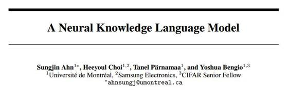

# 学界 | Yoshua Bengio 最新论文：一种神经知识语言模型

选自 arXiv.org

**作者：  Sungjin Ahn、Heeyoul Choi、Tanel Pärnamaa、Yoshua Bengio**

**机器之心编译**

**参与：吴攀**

> *Bengio 组最新论文：神经知识语言模型（NKLM），结合知识图谱符号知识，较之单纯 RNN 语言模型具有更强大的命名实体识别、预测、生成能力。*

**摘要**

交流知识是语言的一个主要目的。但是，目前的语言模型在编码或解码知识的能力上还存在显著的限制。这主要是因为它们是基于统计共现（statistical co-occurrences）获取知识的，但大部分描述知识的词基本上都不是被观察到的命名实体（named entities）。在这篇论文中，我们提出了一种神经知识语言模型（NKLM: Neural Knowledge Language Model ），该模型结合了知识图谱提供的符号知识（symbolic knowledge）与 RNN 语言模型。在每一个时间步骤，该模型都能够预测被观察到的词应该是基于哪种事实。然后，就会从词汇库生成或从知识图谱中复制出一个词。我们在一个名叫 WikiFacts 的新数据集上训练和测试了这个模型。我们的实验表明，NKLM 能在生成远远更小量的未知词的同时显著提升困惑度（perplexity）。此外，我们发现其中被取样的描述包含了曾在 RNN 语言模型中被用作未知词的命名实体。

***©本文由机器之心编译，***转载请联系本公众号获得授权***。***

✄------------------------------------------------

**加入机器之心（全职记者/实习生）：hr@almosthuman.cn**

**投稿或寻求报道：editor@almosthuman.cn**

**广告&商务合作：bd@almosthuman.cn**

**点击「阅读原文」，下载此论文↓↓↓**