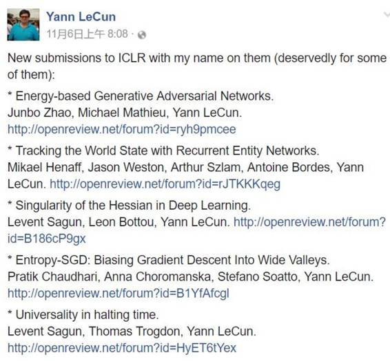
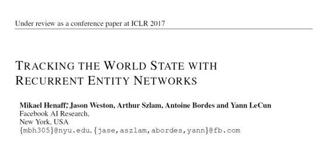
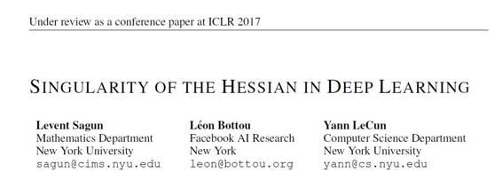
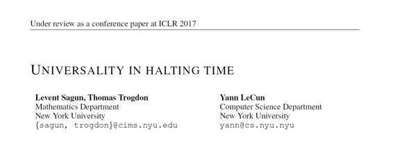

# 深度 | Yann LeCun 提交 ICLR 2017 论文汇总：从生成对抗网络到循环实体网络等

选自 OpenReview

**机器之心编译**

**参与：李泽南、杜夏德、吴攀**

> *国际学习表征会议 ICLR 2017 的论文提交已经于近日结束。作为机器学习领域的顶级会议之一，ICLR 自然也得到了很多重量级研究者和机构的亲睐。据大概统计，ICLR 2017 已经收到了大约 500 篇论文，这些论文都已经开放 open review，任何人都可以在 http://openreview.net/group?id=ICLR.cc/2017/conference 看到所有提交的论文。机器之心之前已经整理过了几篇重要的提交给 ICLR 2017 的论文[《谷歌 ICLR 2017 论文提出超大规模的神经网络：稀疏门控专家混合层》](http://mp.weixin.qq.com/s?__biz=MzA3MzI4MjgzMw==&mid=2650720367&idx=3&sn=15551131dbd1d1fad15d2752dd78fe83&chksm=871b0c11b06c8507b17d846e7d09b8fc4f0f12267d2f7dd019afa3d0ca3345a8774041ef5c84&scene=21#wechat_redirect)、[《Vicarious 在 ICLR 2017 提交无监督学习论文，提出层级组合特征学习》](http://mp.weixin.qq.com/s?__biz=MzA3MzI4MjgzMw==&mid=2650720285&idx=5&sn=583751084a6855b35f684f582afd7976&chksm=871b0c63b06c857523341e94380cd6b87e84502854886f7aa8fa40ff665166db4ffda8a5ea1b&scene=21#wechat_redirect)、[《OpenAI 最新论文：神经 GPU 的扩展和限制》](http://mp.weixin.qq.com/s?__biz=MzA3MzI4MjgzMw==&mid=2650720257&idx=3&sn=4dfc480bfc70691f5baa44a75a0c1b82&chksm=871b0c7fb06c85696574d7f15d160afd3f45aa669bad4d1589f908c2fe0f56a3f34946bb6e73&scene=21#wechat_redirect)。这篇文章将介绍 Yann LeCun 参与的在 ICLR2017 上提交的所有论文（共 5 篇）。点击文末「阅读原文」可下载这 5 篇论文。*

**论文：基于能量的生成对抗网络**

**** 

摘要：我们在这里介绍「基于能量的生成对抗网络（Energy-based Generative Adversarial Network，简称 EBGAN）」模型，该网络将 GAN 框架中的鉴别器（discriminator）视为与数据流形（data manifold）和其它所有更高能量的区域的低能量区域相关联的能量函数（energy function）。和概率 GAN 类似，需要训练一个生成器（generator）来产生具有最小能量的对比样本，同时还要训练该能量函数将高能量分配给那些生成的样本。将鉴别器视为能量函数让我们可以在通常的二元判别网络之外还能使用范围广泛的架构和损失函数。在 EBGAN 的所有实例中，其中之一是沿着作为重构误差（reconstruction error）的能量使用一个自动编码器（auto-encoder）。我们研究表明这种形式的 EBGAN 能在训练过程中得到比通常的 GAN 更稳定的表现。我们也表明只需训练一个单尺度（single-scale）的架构就能生成高分辨率的图像。

**论文：用循环实体网络跟踪世界状态**

**** 

摘要：我们提出一个新的模型，循环实体网络（Recurrent Entity Network (EntNet)）。它配备了一个动态的长期记忆，能让它随着接收新数据来维持和更新世界的状态的表征。在语言理解任务中，它能一边读取数据一边运行推理，不像 Sukhbaatar 等人在 2015 年提出的记忆网络（Memory Network）(Sukhbaatar et al., 2015) 需要要求它回答或回应某个问题。它很像 Graves 等人分别在 2014 和 2016 年提出的神经图灵机器（Neural Turing Machine）或者可微神经计算机（Differentiable Neural Computer），可以保持一个固定大小的记忆并能学习去定位，基于内容读取数据，写下操作过程。然而，和这些模型不一样的是，它有一个简单的并行架构，能够同时更新若干个记忆位置。该 EntNet 在 bAbI 任务上实现了目前最佳的水平，并且是第一个能在 10000 个训练样本场景中解决所有任务的方法。我们证明了它能在大量事实支持的条件下解决推理任务，这是其他方法无法办到的。它还可以概括过去的训练水平。在实践中，它还能被使用到大规模的数据集中，比如 Children』s Book Test，在这个数据集处理任务中，该模型的表现极具竞争力，它能一次读取儿童书的故事。

**论文：深度学习中 Hessian 的奇异性**

****

我们分别在训练前后检查了一个损失函数的 Hessian 特征值。观察到的特征值分为两部分：主体部分集中在 0 附近，边缘值散落在 0 周边较远的位置。我们的实验证据显示主体部分的特征值过于参数化，而边缘区域的特征值指示了输入数据的复杂性。

**论文：Entropy-SGD：偏压梯度进入宽河谷**

本论文提出了一种训练深度神经网络的优化算法：Entropy-SGD。这种方法的灵感来自于能量图景（energy landscape）局部几何关系的解决方案，这种方案在梯度下降中发现。具有低泛化误差（generalization error）的局部极值在 Hessian 中具有很大比例的几乎为零的特征值，正特征值或负特征值则非常少。我们利用这一观察来构建基于局部熵的目标，其有利于位于能量图景的平坦区域中的良好可概括的解，同时避免位于尖锐山谷（sharp valleys）中的不可概括的解。我们的算法类似于 SGD 的两个嵌套循环，其中我们使用 Langevin dynamics 来在每次更新权重时计算局部熵的梯度。本研究证明了将局部熵并入目标函数中可形成更为平滑的能量图景，同时它均衡的稳定性展示了比 SGD 更好的泛化边界。在竞争性基线中的的实验结果表明，Entropy-SGD 可以提升泛化性能，有增加训练准确性的潜力。

**论文：停止时间中的普遍性**

摘要：作者提出了应用于 spin glasses 和深度学习这两种随机系统的优化算法的停止时间（通过达到给定精度的迭代次数测量）经验分布。对于一个我们采用了优化流程（optimization routine）和随机图景（random landscape）形式的算法，停止时间（halting time）的波动遵循一个分布，该分布能在输入彻底变化后仍然不变。我们观察两个主要类：在谷歌搜索、人类做决策时、QR 因式分解和 spin glasses 中出现的 Gumbel 形式的分布；以及出现在共轭梯度方法、带有 MNIST 数据输入的深度网络和带有随机数据输入的深度网络的高斯形式的分布。对于其的实验表明：存在一类分布——其停止时间在某些条件下与底层分布无关。

******©本文为机器之心编译文章，***转载请联系本公众号或作者获得授权******。***

✄------------------------------------------------

**加入机器之心（全职记者/实习生）：hr@almosthuman.cn**

**投稿或寻求报道：editor@almosthuman.cn**

**广告&商务合作：bd@almosthuman.cn**