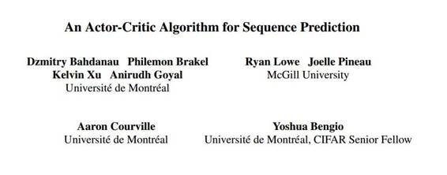
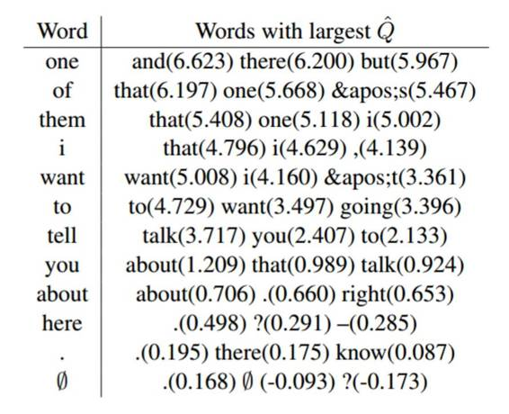

# 学界 | Yoshua Bengio 最新论文：用于序列预测的 actor-critic 算法

选自 arxiv

**作者： ****Dzmitry Bahdanau****, ****Philemon Brakel****, ****Kelvin Xu****, ****Anirudh Goyal****, ****Ryan Lowe****, ****Joelle Pineau****, ****Aaron Courville****, ****Yoshua Bengio**

**机器之心编译**

**参与：吴攀、李亚洲**

**摘要**

我们提出了一种训练神经网络的方法以使用来自强化学习的 actor-critic 方法来生成序列。现在的对数似然训练方法受到训练与测试模式之间的差异限制，因为模型必须以他们之前的猜测为条件来生成 token，而不是直接生成 ground-truth（指准确客观的数据） token。在给定一个执行器网络（actor network）策略的情况下，我们通过引入一个评价网络（ critic network）解决此问题，该评价网络是为了预测输出 token 的值而训练的。这个训练过程中的结果更接近测试阶段的结果，并且让我们可以对 BLEU 等特定任务的得分进行优化。至关重要地，因为我们是在监督学习环境中，而非传统的强化学习环境下利用这一技术，所以我们根据 ground-truth 输出来对评价网络进行调节。结果显示，我们的方法提升了在合成任务（synthetic task）以及德英机器翻译任务上的表现。我们的分析为这样的方法在自然语言生成任务上的应用铺平了道路，比如机器翻译、图片描述生成、对话模型。

**导语**

在机器学习很多重要的应用中，都需要开发一个能产生给定输入的离散 token 的序列的系统。近期的研究显示，在给定输入以及之前的 token 的情况下，当训练循环神经网络预测下一个输出 token 时，其能在很多这样的任务中表现出卓越的性能。该方法已被成功应用于机器翻译（Sutskever et al., 2014; Bahdanau et al., 2015）、图片描述生成（Kiros et al., 2014; Donahue et al., 2015; Vinyals et al., 2015; Xu et al., 2015; Karpathy and Fei-Fei, 2015）以及语音识别（Chorowski et al., 2015; Chan et al., 2015）中。

训练 RNN 生成序列的标准方法是：在给定先前的正确 token 情况下，最大化「正确」token 的对数似然。这种方法通常被称为 teacher forcing（教师强迫）。在评估阶段，通常是根据学习到的分布通过近似搜索最相似的候选产生输出序列。在搜索的过程中，模型以自己的猜测为条件；而这个猜测可能是不正确的，并可能会因此导致错误的混合（Bengio et al., 2015）。尤其在序列长度更大时会更加突出。由于这一矛盾，可以看出最大似然训练可能是次优的（Bengio et al., 2015; Ranzato et al., 2015）。在这些工作中，作者们认为在给定模型产生的输出的情况下，网络的训练应该持续产生正确结果，而不是像 teacher forcing 中那样的 ground-truth 输出。这为决定网络下一层输出的目标造成了挑战性难题。Bengio et al. （2015）使用来自 ground-truth 答案的 token k 作为网络在步骤 k 的目标。然而，Ranzato et al. （2015）依靠 REINFORCE 算法（Williams，1992）决定来自简单预测的 token 能否产生在特定任务上的高得分，比如 BLEU（Papineni et al., 2002）或者 ROUGE（Lin and Hovy, 2003）。

在此论文中，我们提出并研究了另一种训练序列预测网络的方法，目标是直接改善他们的测试时间标准。特别地，我们训练一个额外的名为 critic 的网络来输出每一个 token 值，像在特定任务上期望的得分那样，我们把它定义为如果该网络输出 token 它才会得到 token 值，并且根据其概率分布持续对输出进行采样。而且，我们展示了如何使用预测值训练主要序列预测网络，我们将其称为 actor。我们方法的理论基础是：在 critic 计算确切值的假设下，我们用来训练 actor 网络的表达是一个期望特定任务得分的梯度的无偏见评估。

我们的方法的灵感来自于强化学习（RL）领域，并从中借用了术语（Sutton and Barto, 1998），特别是 actor-critic 方法（Sutton, 1984; Sutton et al., 1999; Barto et al., 1983）。强化学习研究了对一些代理行为进行奖励形式的弱监督学习中行为效率的难题。在我们的案例中，奖励类似于关乎预测的特定任务得分。然而，我们考虑的任务是监督学习，关键的不同是让 critic 使用 ground truth 答案作为输入。为了训练 critic 网络，我们采用了来自 RL 文献的时间差分方法。然而，尽管非线性函数逼近器的强化学习方法并不是新的（Tesauro, 1994; Miller et al., 1995），但是近期却变得流行起来，从而引发了深度强化学习（Mnih et al., 2015）领域的兴盛。我们的结果显示近期深度强化学习开发的一些技术，比如加入一个目标网络，可能也能获益于序列预测。

此论文的贡献总结如下：1）我们描述了强化学习中像 actor-critic 方法这样的方法能被应用于带有结构化输出的监督学习问题上，2）我们调查了新方法在合成任务以及机器翻译这样的真实世界任务上的表现与行为，展示了由 actor- critic 带来的在最大似然方法以及 REINFORCE 方法上的改进。

 **结论**

我们提出了一个序列预测的 actor-critic 方法。我们的方法在训练过程中考虑到了任务目标，并且使用 ground-truth 在其对 actor 网络的中间目标的预测中帮助 critic 网络。结果显示，我们的方法在合成任务以及机器翻译基准上，都比最大似然训练方法有重大改进。在机器翻译任务上，相比于 REINFORCE 训练，actor-critic 能更快的拟合训练数据，并产生有更好的最终表现的结果。最终，我们定性展示了 critic 网络在给定文本任务中，会合理地为单词匹配更高的分值。

*Table 3：在产生翻译的中间步骤，根据 critic 网络得来的 3 个最佳单词。括号内的数字为预测值 Q^。原德文是「uber eine ¨ davon will ich hier erzahlen 」，参考翻译是「and ¨ there’s one I want to talk about」。*

在合成任务上，我们发现在我们提高任务难度时，最大似然方法与我们方法之间的字母错误率差距也会增加。这与我们的预期一致，因为用于训练的 ground-truth 序列与能够生产的序列之间的差异越大，最大似然方法受影响越大。 我们的系统在翻译任务相比于基线模型也能得到更好的 BLEU 分数。与我们预期不符的是，在训练数据上的 BLEU 得分要比基线模型低。这就引发了一个问题，我们的模型表现更好是因为通过更直接的优化 BLEU？还是因为正则化（regularization）影响？然而，我们在合成任务上的结果表明：该方法在过拟合不可能的时候会是有益的。

在训练我们的模型时，我们遇到了数个优化难题。我们首先发现，critic 网络有时会根据 actor 网络为非常低可能性的行为匹配非常高的值。我们能够通过在 critic 网络的方差上使用惩罚（penalty）来解决这个问题。此外，actor 网络有时在适应 critic 网络的需求上会出现问题。我们注意到，行为分布（action distribution ）趋向于饱和并变得确定（deterministic），在这个例子中梯度消失了。然而，这些问题未能阻止我们训练模型，如果解决这些问题我们可能会得到更好的结果。

虽然在此论文中我们只考虑了序列预测，我们的方法应该也适用于其它类型的结构化预测——其中预测过程可被投射为离散决策的序列，例如构建解析树（parse tree）的例子。未来的研究应该可以将我们的方法拓展至其它领域并研究解决上面提到的优化问题。

***©本文由机器之心编译，***转载请联系本公众号获得授权***。***

✄------------------------------------------------

**加入机器之心（全职记者/实习生）：hr@almosthuman.cn**

**投稿或寻求报道：editor@almosthuman.cn**

**广告&商务合作：bd@almosthuman.cn**

**点击「阅读原文」，下载 PDF↓↓↓**