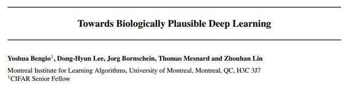

# 学界 | Yoshua Bengio 最新修改版论文：迈向生物学上可信的深度学习

选自 arXiv.org

**机器之心编译**

**作者：Yoshua Bengio、Dong-Hyun Lee、Jorg Bornschein、Thomas Mesnard、Zhouhan Lin**

**参与：无我、李亚洲、黄清纬**

> *此篇论文 Yoshua Bengio 最早发表于 2015 年 2 月，于昨日公开第三次修改版本，读者可点击「阅读原文」进行下载。*

**摘要**

神经科学家长期以来批评深度学习算法与当前的神经生物学知识彼此不相容的现状。我们探索了更加符合生物学逻辑的深度表征学习版本，本文主要关注无监督式学习，但是也关注开发一个能解释监督式、无监督式和强化学习的学习机制。我们要讨论的第一点是，基础的管理突触权重更新（依赖于动作电位尖峰时间的突触可塑性）的学习规则源于一个简单的很有意义的机器学习观点更新规则，并且，只要神经的动态活动能将激发率推向更好地某些目标函数值（可能是监督式、无监督式或奖赏驱动的），就能用梯度下降法将该学习规则集成到这些目标函数中。第二个主要观点是，这与变分 EM 法的形式相对应，也就是使用神经动力学实现的近似而非精确的事后估值。本文的另一个贡献是，需要在上面的变分解释（  variational interpretation  ）中更新隐藏层的梯度可以使用近似值来估算，只需要将激活的信息向前和向后传播，并且需要成对的层来学习形成降噪自动编码器。最后，我们拓展了关于自动编码器的概率论解释，从而证明基于降噪自动编码器的生成式解释的改进抽样计划是正确的，而且我们用生成式学习任务证实了这些想法。

**导语**

深度学习和人工神经网络已经从大脑获得灵感，但大部分是在计算表现形式上的灵感（大多是生物学的，比如 spike 的存在留待考虑）。然而，如今缺少的是对生物神经元中存在的学习规则的一个可信的机器学习说明，从而能够解释一个深度神经网络有效的联合训练，也就是通过一个神经连接长链说明信任分配（credit assignment）。因此，解决信任分配难题也意味着确认神经元与权重，这二者与得到想要的输出和改变参数有关。反向传播提供了一个机器学习答案，然而就像下一段讨论的那样，它并非生物学上可信的。寻找一个生物学上可信的机器学习方法进行深度网络中的信任分配是一个主要的长期问题，也是此论文贡献的方向。

首先，让我们思考一下依赖看起来生物学可信的机制的顶尖的深度学习算法，比如梯度反向传播，这一机制也就是计算一个关于神经激活和参数的目标函数梯度。下列是有关反向传播的生物学可信性的难题：（1）反向传播计算（从输出层到更低的隐层）是纯线性的，然而生物神经元是交错线性和非线性操作的。（2）如果大脑中存在的已知反馈通道（它们自己的突触，或者可能是自己的神经元）被用于通过反向传播来传送信任分配，他们就需要有关操作点（operating point）上非线性关系衍生物的准确知识，在前馈通道上对应的前馈计算上使用到这一操作点。（3）相似的，这些前馈通道也要使用准确的前馈连接的对称权重（有同样连接、转置）。（4）真正的神经元通过（可能是随机的）二进制值（尖峰）通信，而不是完全的连续值。（5）计算必须要精准的在时间上对应前馈和反向传播阶段之间的替换物（因为后者需要前者的结果）。（6）输出目标出自哪里不清楚。此论文中提出的这一方法意图解决所有的这些问题，尽管一些可能的生物实现还留有一些问题，而且更多需要考虑的生物学的细节在此论文中并未涉及到。

注意反向传播不只被用于经典的监督学习，也被用于很多无监督学习算法，包括所有类型的自动编码器：稀疏自动编码器（Ranzato et al., 2007; Goodfellow et al., 2009），降噪自动编码器（Vincent et al., 2008），收缩自动编码器（Rifai et al., 2011）以及更近期的变分自动编码器（Kingma、Welling, 2014）。其他不依赖反向传播的无监督学习算法，比如各种玻尔兹曼机器学习算法（Hinton and Sejnowski, 1986; Smolensky, 1986; Hinton et al., 2006; Salakhutdinov and Hinton, 2009）。玻尔兹曼机可能是最我们目前知道的进行深度架构的最生物学可信的学习算法，但就这一点而言，他们也有数个问题，比如获取对称权重的权重传输问题（上面的问题 3），以及正相 vs 反相的同步问题（类似于上面的问题 5）。

在 Sec.2 中我们首先提出了一个在生物突触中观察到的主要学习规则的解释：脉冲时间相关的突触可塑性（STDP）受到了先前思路的启发（Xie and Seung, 2000; Hinton, 2007），我们首先通过直观的参数和模拟展示，如果神经元只被一个既不增加也不降低神经元激发率的，与有关神经元电势的目标函数梯度成正比的前馈信号驱动的情况下，STDP 能被看做随机梯度下降。

在 Sec.3 中，我们展现了 STDP 的首次机器学习释义，带来了通过多层的有效信用分配。我们首先表示，上面关于 STDP 的解释表明神经动态（它在神经激活中由于反馈和侧壁连接创造了以上变化）相当于对神经结构的推论，这种结构更符合彼此以及观察值（输入、目标或奖励）。当玻尔兹曼机不需要获得来自一个 MCMC 平稳分布（ stationary distribution）的表征样本时，这个观点类似于对玻尔兹曼机推论的解释。除了 Hinton 的提议，它天然表明训练流程对应 EM 的一个变分形式（Neal and Hinton, 1999），可能基于 MAP（maximum a posteriori）或者 MCMC （Markov Chain Monte-Carlo）近似。

在 Sec.4 中，我们展示了这一数学框架如何表示对一个带有很多潜在变量层的深度直接生成式网络的训练流程。然而，上面的解释仍然需要计算一些梯度。另一贡献（Sec.6）是表明人们能够通过一个只涉及普通神经计算并且没有明确派生物的近似值来评估这些梯度，这追随了先前在目标传播（Bengio, 2014; Lee et al., 2014）上的研究。我们引入了一个新的针对差异目标传播（Lee et al., 2014）的 justification，利用了这样的一个事实：提出的学习机制能被解释为训练一个降噪自动编码器。就像在 Sec.5 中讨论的，这一模型的解释提供了从中采样的不同方式，而且我们发现能够获得更好的样本。

***©本文由机器之心编译，***转载请联系本公众号获得授权***。***

✄------------------------------------------------

**加入机器之心（全职记者/实习生）：hr@almosthuman.cn**

**投稿或寻求报道：editor@almosthuman.cn**

**广告&商务合作：bd@almosthuman.cn**

**点击阅读原文，下载此论文↓↓↓**