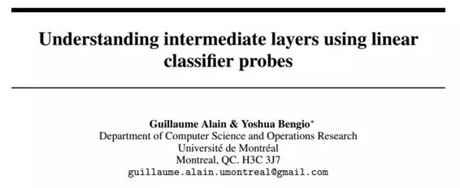

# 学界 | Yoshua Bengio 论文：使用线性分类器探头理解中间层

选自 arXiv

**机器之心编译**

**参与：吴攀**

> *日前，Yoshua Bengio 对其论文 Understanding intermediate layers using linear classifier probes 进行了修改，这是最新版本的，点击阅读原文下载。*

**论文：使用线性分类器探头理解中间层（Understanding intermediate layers using linear classifier probes）**

 

摘要：神经网络模型在黑箱方面的问题可谓是尽人皆知。我们提出了一种用于更好地理解中间层的作用和动态的新方法。这对这样的模型的设计有直接的后果，而且它让专家可以证明特定的启发式方法（比如 Inception 模型中的辅助头（auxiliary heads））。我们的方法使用了被称为「探头（probe）」的线性分类器，其中一个探头只能使用一个给定的中间层的隐藏单元作为判别特征。此外，这些探头不能影响模型的训练阶段，而且它们一般是在训练之后才被加进去的。它们允许用户可视化模型在多个训练步骤的状态。我们演示了这种方法可以被如何被用于开发关于已知模型的更好的直觉知识（intuition）和诊断潜在的问题。

******©本文由机器之心编译，***转载请联系本公众号获得授权******。***

✄------------------------------------------------

**加入机器之心（全职记者/实习生）：hr@almosthuman.cn**

**投稿或寻求报道：editor@almosthuman.cn**

**广告&商务合作：bd@almosthuman.cn**

