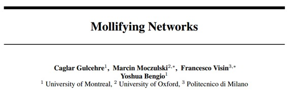

# 学界 | Yoshua Bengio 最新论文：Mollifying Networks

选自 arXiv.org

**作者：Caglar Gulcehre, Marcin Moczulski, Francesco Visin, Yoshua Bengio**

**机器之心编译**

**参与：吴攀**

**摘要**

深度神经网络的优化要比传统的凸优化问题（convex optimization problem）更具挑战性，这是由于损失函数的高度非凸特性，比如：其可能涉及鞍表面（saddle-surface）这样的病理学图景（pathological landscapes），而鞍表面对基于简单梯度下降的算法来说是难以逃逸（escape）的。在这篇论文中，我们通过从一个平滑的——即 mollified ——目标函数开始尝试解决高度非凸的神经网络的优化问题，该目标函数会随训练过程变得越来越复杂。我们提议的方法受到了最近的延拓法（continuation method）研究的启发，该方法类似于课程方法（curriculum method）——我们开始时学习一个更轻松（可能是凸的）目标函数，然后让其在训练过程中进化，直到它最终变回原来的难以优化的目标函数。mollified network 的复杂性受控于训练过程中退火的（annealed）的单个超参数。我们的结果在多种不同的优化任务上实现了提升，并将用于神经网络的延拓法和 mollifier 两者的最近成果联系了起来。

***©本文由机器之心编译，***转载请联系本公众号获得授权***。***

✄------------------------------------------------

**加入机器之心（全职记者/实习生）：hr@almosthuman.cn**

**投稿或寻求报道：editor@almosthuman.cn**

**广告&商务合作：bd@almosthuman.cn**

**点击「阅读原文」，下载此论文↓↓↓**