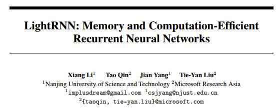
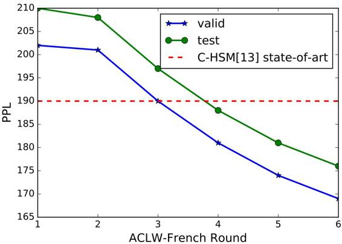
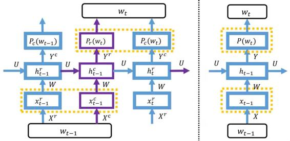

# 学界 | 微软重磅论文提出 LightRNN：高效利用内存和计算的循环神经网络

选自 arXiv.org

**机器之心编译**

**参与：李泽南、吴攀、蒋思源**

**** 

**摘要**

循环神经网络（RNN）已经在许多自然语言处理任务上取得了最出色的表现，比如语言建模和机器翻译。然而当词汇量很大时，RNN 模型会变得很大（可能超过 GPU 最大的内存能力），这样训练将变得很低效。在这项工作中，我们提出一种全新的方法来解决这一挑战。其中的关键思想是使用二分量（2-Component(2C)）共享的词表征的嵌入（embedding for word representations）。

我们将词汇表中的每一个词都分配到一个表格中，其中每一行都关联了一个向量，每一列则关联了另一个向量。根据一个词在表中的位置，该词可由行向量和列向量两个维度联合表示。因为该表中同一行具有相同的行向量，同一列具有相同的列向量，所以我们仅仅需要 2p|V|个向量来表示带有|V|个词的词汇表，这远远少于现有的方法所需要的向量数|V|。基于二分量（2-Component）共享嵌入的方法，我们设计了一种新的 RNN 算法，并且使用几个基准数据集上的语言建模任务对其进行了评估。

结果表明，我们的算法可以显著地减少模型的大小，并且能在不牺牲精度的情况下加快训练速度（它实现了与当前最佳的语言模型相近或更好的困惑度（perplexity））。值得注意的是，在 One-Billion-Word 基准数据集上，我们的算法实现了和以前语言模型差不多的困惑度，同时却将模型的大小减小了 40 到 100 倍、训练过程也加快了 2 倍。我们将我们提出来的算法命名为 LightRNN, 这主要是反应它在模型大小上的精简和很快的训练速度。

 

*训练 ACLW-French 时的困惑度对比*

**引言**

最近，循环神经网络（RNN）已被用于处理多种自然语言处理（NLP）任务，例如语言建模、机器翻译、情绪分析和问答。有一种流行的 RNN 架构是长短期记忆网络（LSTM），其可以通过记忆单元（memory cell）和门函数（gating function）建模长期依赖性和解决梯度消失问题。因为这些元素，LSTM 循环神经网络在当前许多自然语言处理任务中都实现了最佳的表现，尽管它的方式几乎是从头开始学习。

虽然 RNN 越来越受欢迎，但它也存在一个局限性：当应用于大词汇的文本语料库时，模型的体量将变得非常大。比如说，当使用 RNN 进行语言建模时，词首先需要通过输入嵌入矩阵（input-embedding matrix）从 one-hot 向量（其维度与词汇尺寸相同）映射到嵌入向量。然后为了预测下一词的概率，通过输出嵌入矩阵（output-embedding matrix）将顶部隐藏层投射成词汇表中所有词的概率分布。当该词汇库包含数千万个不同的词时（这在 Web 语料库中很常见），这两个嵌入矩阵就会包含数百亿个不同的元素，这会使得 RNN 模型变得过大，从而无法装进 GPU 设备的内存。以 ClueWeb 数据集为例，其词汇集包含超过 1000 万词。如果嵌入向量具有 1024 个维度并且每个维度由 32 位浮点表示，则输入嵌入矩阵的大小将为大约 40GB。进一步考虑输出嵌入矩阵和隐藏层之间的权重，RNN 模型将大于 80GB，这一数字远远超出了市面上最好的 GPU 的能力。

即使 GPU 的内存可以扩容，用于训练这样体量模型的计算复杂度也将高到难以承受。在 RNN 语言模型中，最耗时的运算是计算词汇表中所有词的概率分布，这需要叠乘序列每个位置处的输出嵌入矩阵和隐藏状态。简单计算一下就可以知道，需要使用目前最好的单 GPU 设备计算数十年才能完成 ClueWeb 数据集语言模型的训练。此外，除了训练阶段的难题，即使我们最终训练出了这样的模型，我们也几乎不可能将其装进移动设备让它进入应用。

为了应对这些挑战，在本研究中我们提出了将二分量（2-Component）共享的嵌入用于循环神经网络中词表征的方法。我们将词汇表中的所有词放入一个表中，每一行都与一个向量关联，每一列都与另一个向量关联。这样我们就能够通过两个组件来表示一个词：对应的行向量和列向量。因为该表中同一行具有相同的行向量，同一列具有相同的列向量，所以我们仅仅需要 2p|V|个向量来表示带有|V|个词的词汇表，这样可以大幅度减少模型体积（相比而言，vanilla 方法需要|V|个不同的向量）。同时，由于模型尺寸的减小，RNN 模型的训练速度将会显著加快。因此，我们将这一新算法称为 LightRNN，以表示模型的小尺寸和极高的训练速度。这种方法的最大技术难题是如何将词合适地分配到表中。

 

*LightRNN（左）对比常规 RNN（右）* 

为了这个目的，我们提出一个引导框架：（1）首先随机初始化词分配（word allocation），并训练 LightRNN 模型。（2）解决训练了的嵌入向量（对应为表格中的行和列向量），然后细化分配来最小化训练损失（training loss），这是图论（graph theory）最小权重完美匹配问题，我们能够有效地解决。（3）重复第二步，直到满足确切的终止标准。

我们使用在多个基准数据集进行语言建模任务来评价 LightRNN。实验表明，在困惑度（perplexity）上面，LightRNN 实现了可与最先进的语言模型媲美或更好的准确度。同时还减少了模型大小高达百倍，加快了训练过程两倍。请注意，对于高度紧凑的模型来说这个可预见的（没有准确性下降）。

首先，这使得将 RNN 模型运用到 GPU 甚至是移动设备成为了可能。其次，如果训练数据很大，需要执行分布式数据平行训练时，聚合本地工作器（worker）的模型所需要的交流成本会很低。通过这种方式，我们的方法使先前昂贵的 RNN 算法变得非常经济且规模化了。因此，它将会对用于人工自然语言处理（NLP）任务的深度学习有深远的影响。

**结论和未来的方向**

在本研究中，我们提出了一个全新的算法 LightRNN，该算法可用于自然语言处理任务。通过用于词表征的二分量共享的嵌入（2-Component shared embedding for word representations），LightRNN 在模型尺寸和运行时间上都取得了高效的表现，特别是在具有大词汇量的语料库中。在未来，这种算法有很多方向可以进一步研究。首先，我们计划将 LightRNN 应用于更大的语料库中，如 ClueWeb 数据集——传统的 RNN 模型还不能将其装进一个现代的 GPU 中。第二，我们会将 LightRNN 应用于机器翻译和问答等其它自然语言处理任务中。第三，我们会探索 k-分量分享嵌入（k>2）并研究 k 在权衡效率和有效性之间的作用。最后，我们将会整理我们的代码，以便在近期通过 CNTK 将其发布出来。

*   **论文下载：https://arxiv.org/pdf/1610.09893v1.pdf**

******©本文由机器之心编译，***转载请联系本公众号获得授权******。***

✄------------------------------------------------

**加入机器之心（全职记者/实习生）：hr@almosthuman.cn**

**投稿或寻求报道：editor@almosthuman.cn**

**广告&商务合作：bd@almosthuman.cn**