# 深度 | 微软 NLP 团队齐聚 ACL 2016，自然语言技术逼近人类对话水平（附论文）

选自 Microsoft Research

**机器之心编译**

**作者：Bill Dolan**

**参与：无我、杜夏德、黄清纬**

> *ACL 2016 在柏林洪堡大学召开（8.7-8.12）。作为该会议的黄金赞助商，微软将有 20 多名研究人员出席该大会，参选论文 16 篇。论文集中了微软近期关于自然语言处理和语音方面的大量研究，如「基于角色的神经对话模式」，这篇论文阐述了最先进的神经建模技术如何训练「听起来像」特殊人物的对话助理。这篇论文还揭示了这些技术如何允许角色调整其语言从而匹配用户的语言行为，以及人类自然对话特有的一个微妙又至关重要的现象。我们贴出了除第 13 篇论文外（未公开）的 15 篇论文的摘要，点击「阅读原文」下载全部论文。*

今年 8 月 7 日到 12 日，国际计算语言协会（ ACL ）年度会议在德国柏林的洪堡大学召开。 ACL 是关于自然语言处理（ NLP ）系统和计算语言学的顶级会议。作为黄金赞助商（ Gold sponsor ），微软有 20 多位研究员出席 ACL 2016 。

微软最近的研究工作主要专注于语言生成：将「声音」传送给机器，形成代码和结构化数据，这样用户就可以自然地，流畅地与他们的设备对话，从而高效地合作，机器也因此成为了一个积极的可交谈合作者。例如，今年被 ACL 收录的其中一篇论文揭示了如何针对一张照片生成有道理的、常识性的问题；还有一篇论文探索了如何在自然语言和代码之间「做出翻译」。

本次大会中微软也展示了最新工作进展，这些工作旨在从人类自然发生的海量对话中训练神经交流模型（ neural conversational models ），学习如何在会话中的每个点上从零开始生成声音自然逼真的对话。随着自然语言对话变成交互设计中日益重要的方向，这种数据驱动的方法——由微软研究领头——作为关键的研究领域正冉冉升起。一个重要的挑战涉及到沉浸式游戏/虚拟现实角色以及独特的私人化助理，以致于它们动态生成的回应听上去就好像它们由特殊的、真实的智能生产出来的。

作为关于 NLP 表征学习的第一期  Workshop 的共同发起人之一，微软将在这里讨论在「语义的向量空间模型，深度神经网络的含义和应用，以及针对 NLP 的谱方法（ spectral methods ）」方面的最新进展，还将探索未来的研究方向。

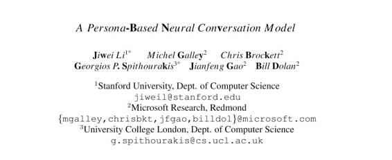 **1.论文： 一种基于角色的神经对话模式**

作者： Jiwei Li, Michel Galley, Chris Brockett, Jianfeng Gao 和 Bill Dolan

摘要：我们提出了基于人物角色的模式，用于处理神经反应生成（ neural response generation ）中的说话者一致性问题。一个说话者模型在分布式嵌入中编码角色，这个角色能扑捉个人特征，比如背景信息和说话风格。一个二进的说话者-接受者模型抓住两名对话者的互动特性。我们的模型在困惑度和 BLUE 得分上都产生了定性的性能改进，超过基线序列到序列模型（ baseline sequence-to-sequence models ），在通过人类判断来测量说话者一致性上也得到了相似的收获。

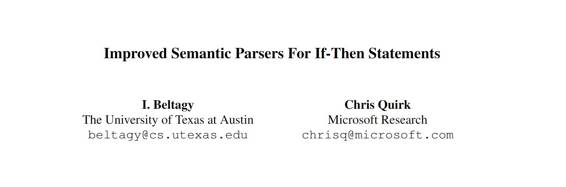
**2.论文：If-Then 句式的改进的语义解析器**

作者： I. Beltagy 和 Chris Quirk

摘要：数字个人助手正在变得更加普遍和有用。个人助手中主要的自然语言处理挑战是机器理解：将自然语言使用者的命令翻译成可执行的表达。这篇论文关注的是写成 If - Then 句式的理解规则，但是该技术也应该适用于其他的语义分析任务。我们将理解看作结构预测并展示了使用传统技术和神经网络模型的改进模型。我们也讨论了改进一般化和降低过拟合的多种方法：从释义、语法组合、特征选择和多系统集成中合成的训练数据。这些技术的集成达到了一个新的最佳结果，精确度提升了 8% 。

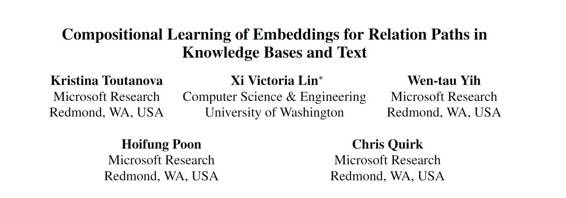

**3.论文：知识库和文本中关系路径的嵌入组合学习**

作者：Kristina Toutanova, Victoria Lin, Wen-tau Yih, Hoifung Poon 和 Chris Quirk

摘要：建模关系路径已经在嵌入模型中为知识库（ KB ）的完善做出了重要贡献。但是，列举出两个实体间的路径非常昂贵，而且现有的路径大多都诉求于具有抽样子集的逼近。当文本被  KB  关系联合建模并用于为其中提到的事实提供直接证据时，这个问题尤其严重。本文中，我们提出了第一个准确的动态规划算法，这个算法能让有界长度的所有关系路径有效结合，同时为组合路径表示法中这些关系类型和中间节点建模。我们对这种方法的效率增益进行了理论分析。两个数据集的实验显示，它解决了之前方法中的表示性限制，并提升了 KB 完善中的精确度。

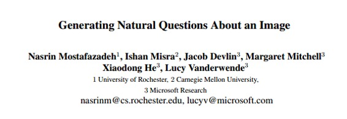

**4.论文：生成关于一张图像的自然问题**

作者：Nasrin Mostafazadeh, Ishan Misra, Jacob Devlin, Margaret Mitchell, Xiaodong He 和 Lucy Vanderwende

摘要：过去几年里，视觉和语言团队中的研究爆发式增长，包括了从图像字幕到视频转录，以及回答图像相关问题。这些任务已经聚焦于图像的文字描述。为了超越文字，我们选择探索一张图像的问题通常是如何针对常识推理的，以及图像中对象诱发的抽象事件。在这篇论文中，我们介绍了视觉问题生成（VQG）的新任务。当展示给它一张图像时，该系统的任务是问出一个自然且相关的问题。我们提供了三个数据集，覆盖了从以对象为中心到以事件为中心的多种图像，它们的训练数据比到目前为止所提供的最先进的字幕系统还要更抽象。我们训练并测试若干生成和检索模型来解决 VQG 任务。评估结果显示，虽然这样的模型对多种图像问出了合理的问题，但是与人类问出的问题还有很大差距。人类的问题可以推动连接图像与常识知识和语用学的进一步工作。我们提出的任务给这个社群带来了一个新挑战，我们希望他们对探索视觉和语言之间更深的联系能有更多的兴趣。

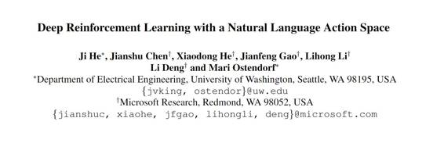
**5.论文：带有自然语言动作空间的深度强化学习**

作者：Ji He, Jianshu Chen, Xiaodong He, Jianfeng Gao, Lihong Li, Li Deng 和 Mari Ostendorf

摘要：这篇论文介绍了带有深度神经网络的一个新的强化学习架构，该架构用于处理带有自然语言特征的状态和动作空间，就像基于文本的游戏一样。它被称为深层加固关联网络（DRRN），表示带有分开的嵌入向量的动作和状态空间，并结合了一个交互功能来接近强化学习中的 Q- function。我们在现有的两个流行的文本游戏中评估了该 DRRN，结果显示它的性能要优于其他深度 Q-learning 结构。被释义的动作描述的实验显示，该模型正在提取意义而不是简单地记忆文本字符串。

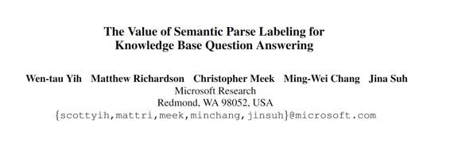
**6.论文：知识库问答中的语义解析标注的价值**

作者： Wen-tau Yih, Matthew Richardson, Chris Meek, Ming-Wei Chang 和 Jina Suh

摘要：我们证明了收集知识库问题回答的语义分析标注的价值。具体有，（1）与之前的小规模数据集研究不同，我们的研究显示，从标注的语义分析中学习，极大地提升了整体性能。与从答案中学习相比，它有 5 个点的收益。（2）我们的研究显示，有一个适当的用户界面就能获取高精确度的语义分析，成本相当于或低于仅获取答案，和（3）我们已经创造并分享了最大的语义分析标注数据集，以推进问题回答中的研究。

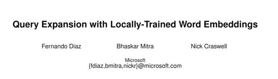

**7.论文：带有局部训练的词嵌入的查询扩展**

作者：Fernando Diaz, Bhaskar Mitra 和 Nick Craswell

摘要：在自然语言处理和机器学习社群中，连续的空间词嵌入已经因为其建模术语相似性和其他关系的能力而获得大量关注。我们研究了用于临时信息检索的查询扩展语境中术语关联性的使用。我们证明了诸如词 2vec 和 GloVe 这样的词嵌入在进行全局训练时，其表现低于语料库，并查询检索任务的具体嵌入。这些结果表明，从全局嵌入中获益的其他任务或许也会从局部嵌入中获益。

**8.论文：使用 Matrix Sketching 的可扩展的半监督分类查询 **

作者：Young-Bum Kim, Karl Stratos 和 Ruhi Sarikaya

摘要：现在使用超大规模的未标注文本需要可扩展的方案，用于语言处理中的表征学习。例如，在本论文中，我们对用户查询意图的分类感兴趣。虽然我们的标注数据十分有限，但是我们获得了几乎无限量的无标注查询，可以用来导出有用的表征：以主成分分析（PCA）为例。因为受到内存大小限制，即便在内存中存储数据也是被禁止的，更不用说应用传统的批处理算法。在该研究中，我们应用了最近提出的 matrix sketching 算法来避免可扩展性上的问题（Liberty，2013）。该算法逼近一个指定内存限制内的数据，同时保留了 PCA 中需要的协方差结构。使用 matrix sketching 后，我们利用大量未标记的查询极大地改进了用户意图分类的精确度。

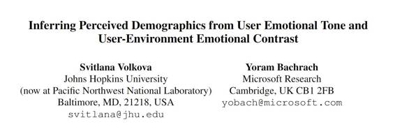

**9.论文：从用户情感基调和用户环境情感对比来推断感知的人口统计**

作者：Svitlana Volkova 和 Yoram Bachrach

摘要：我们检查了社交网络中的交流以研究用户情绪对比（ emotional contrast ）——与邻居相比，这些用户表达不同情绪的倾向。我们的分析是基于大规模的 Twitter 数据集，涵盖了来自美国和加拿大的 123,523 位用户在 Twitter 上发的信息。根据 Ekman 基本情绪理论，我们分析了这些用户表达的情绪基调以及他们邻居的不同情绪类型，并将这些区别与感知到的用户人口统计学数据联系起来。我们证明了许多感知到的人口统计学特征与用户和他们邻居之间的情绪对比存在关联。不像其它仅仅依赖于用户交流内容推断用户特征的方法，我们探索了网络结构并证明了仅仅基于用户和他们邻居产生的情绪而精确预测一系列感知到的人口统计特征是可能的。

**10.论文：采用门控递归半马尔可夫条件随机场的分段序列建模**

作者：Jingwei Zhuo, Jun Zhu, Yong Cao, Zaiqing Nie 和 Bo Zhang

摘要：在自然语言处理中，大多数序列标记任务需要用某种句法角色或句子的语义识别语义段。它们通常用条件随机场（ Conditional Random Fields ，简称 CRFs ）来处理， CRFs 并不是直接根据词级特征进行词级建模（ word-level modeling over word-level features ），因此不能充分利用段级（ segment-level ）信息。半马尔科夫条件随机场（ Semi-Markov Conditional Random Fields ，简称 Semi-CRFs ）直接构建语义段模型，但是为 Semi-CRFs 提取段级特征仍然是一个充满挑战的难题。这篇论文呈现了门控递归的 Semi-CRFs （简称 grSemi-CRFs ），这种语义段模型通过门控递归卷积神经网络直接且自动地学习段级特征。我们在文本切分（ text chunking ）和命名实体识别（ named entity recognition ）方面的实验表明， grSemi-CRFs 通常比其他神经网络表现得更出色。

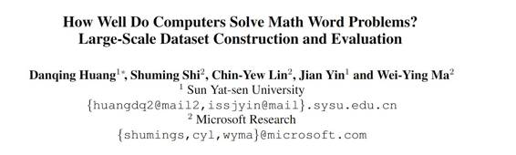

**11.论文：计算机解决数学应用题能有多好？大规模数据集建立和评估**

作者：Danqing Huang, Shuming Shi, Chin-Yew Lin, Jian Yin 和 Wei-Ying Ma

摘要：最近几个自动化解决数学应用题的系统已报道了颇有前景的成果。然而，用于评估的数据集在规模和多样性上都有所局限。在本篇论文中，我们构建了一个大规模数据集，比之前的大 9 倍之多，而且包含更多的问题类型。数据集中的问题会半自动化地从社区问题-回答（简称 CQA ）网页上获得。一个高级的支持向量机（简称 SVM ）模型被训练自动从 CQA 用户提供的答案文本中提取问题的答案，这明显地减少了人们做注释的成本。用新的数据集进行的实验引出了有趣而令人惊讶的结果。

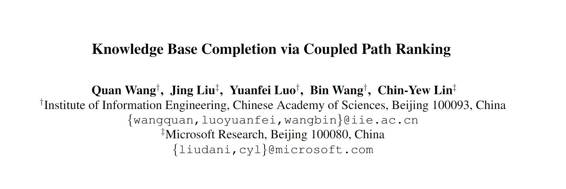
**12.论文：通过耦合路径排序的知识库完善**

作者： Quan Wang, Jing Liu, Yuanfei Luo, Bin Wang 和 Chin-Yew Lin

摘要：知识库（简称 KB ）经常是不完整的，这就让完善知识库成为必需。路径排序算法（ path ranking algorithm ，简称 PRA ）是完成这项任务的最有希望的方法。之前对 PRA 的研究一般是遵循单任务学习范式，为它们及其训练数据的每个独立关系构建一个预测模型。它忽略了某些关系中有意义的联系，而且因为更低频的联系而得不到足够的训练数据。这篇论文为 PRA 提出了一个新颖的多任务学习框架，称之为紧密耦合的 PRA （ CPRA ）。它首先设计一个凝聚式聚类策略，自动发现高度相关的关系，然后利用多任务学习策略有效地结合对这种关系的预测。就像这样， CPRA 将这些关系都考虑进来，使得内隐数据在它们之间分享。我们以 Freebase 创造的数据为基准，从经验上评估 CPRA 。实验结果表明， CPRA 能有效地确认出有逻辑关联的集群，它们彼此是高度相关的。就预测的准确率和模型的可解释性而言，通过进一步结合这种关系， CPRA 明显地优于 PRA 。

**13.论文：带有内隐和外显语义的新闻引用推荐（未公开）**

作者：Hao Peng, Jing Liu and Chin-Yew Lin

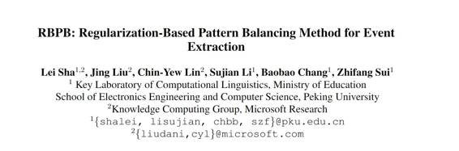

**14.论文：RBPB：事件提取的基于正则化的模式平衡方法**

作者：Lei Sha, Jing Liu, Chin-Yew Lin, Sujian Li, Baobao Chang, Zhifang Sui

摘要：事件提取是一种挑战性相当大的信息提取任务，要从原文本中识别并分类事件的触发和参数。在最近的工作中，当决定事件的类型（触发分类）时，大多工作要么仅是模式的（pattern-only），要么仅是特征（feature-only）的。然而，即使模式无法覆盖一个事件所有的表征，它仍是一个非常重要的特征。另外，当识别并分类参数时，先前的工作忽略参数之间的关系，分别考虑每个候选参数。本论文提出了一个基于正则化的模式平衡方法（RBPB）。受到表征学习过程的启发，我们将触发器嵌入，句子水平的嵌入和模式特征都作为我们的触发器分类特征，以平衡模式和其他有用的特征的影响。另外，RBPB 使用了一个正则化方法来利用参数之间的关系。实验显示，我们所提出方法的结果比目前最先进的方法要好。

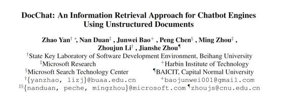

**15.论文：DocChat：一种使用非结构文档的聊天机器人引擎的信息检索方法**

作者： Zhao Yan, Nan Duan, Junwei Bao, Peng Chen, Ming Zhou, Zhoujun Li and Jianshe Zhou

摘要：大多现存的聊天机器人引擎被设计成基于现有的话语-回复（或者问题-回复）对来回答用户的话语。在本论文中，我们呈现了 DocChat，一种新式的信息检索式聊天机器人引擎，它能够利用结构混乱的文档，而不是 Q-R 对，来回复用户的话。我们提出了针对不同粒度级别设计出的带有特征的排名模型学习，来直接测量用户的话和回复之间的相关性。我们在英语和中文中评估了我们所提出的方法：（i）对于英文，我们基于 WikiQA 和 QASent （两个回复语句选择任务）来评估 DocChat，并将结果与最前沿的方法比较。我们观察到了理想的改进和不错的适应性。（ii）对于中文，我们将 DocChat 与小冰比较，一个中国著名的聊天引擎，并行评估的结果显示，DocChat 完美补充了以 Q-R 对作为主要回复源的聊天机器人引擎。

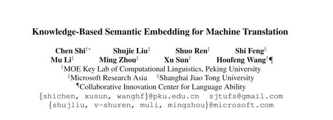

**16.论文：用于机器翻译的基于知识的语义嵌入**

作者：Chen Shi, Shujie Liu, Shuo Ren, Shi Feng, Mu Li, Ming Zhou, Xu Sun and Houfeng Wang

摘要：本论文中，在知识库的帮助下，我们构建并规划了一个语义空间，用来连接源语言与目标语言，并且我们将其应用到序列到序列框架中，从而提出了一个基于知识的语义嵌入（KBSE）方法。在我们的 KBSE 方法中，源句子首先被映射到一个基于知识的语义空间，然后使用一个保留内在含义的循环神经网络生成目标句子。我们做了电子商务数据和电影数据这两种翻译任务的实验，其结果显示，比起传统 SMT 方法和目前的编码-解码方法，我们所提出的方法的表现要更加出色。

***©本文由机器之心编译，***转载请联系本公众号获得授权***。***

✄------------------------------------------------

**加入机器之心（全职记者/实习生）：hr@almosthuman.cn**

**投稿或寻求报道：editor@almosthuman.cn**

**广告&商务合作：bd@almosthuman.cn**

**点击阅读原文，下载 PPT↓↓↓**