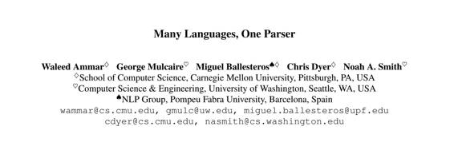
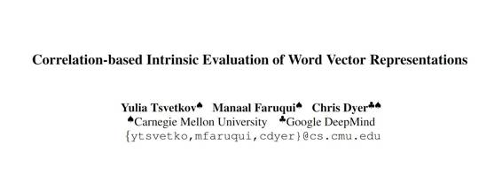

# 重磅 | 自然语言顶级会议 ACL 2016 开幕，谷歌 18 篇参选论文概览（附论文）

选自 ACL 2016 

**机器之心编译**

**参与：吴攀、杜夏德**

> *本周，德国柏林正在举办 2016 年国际计算语言学协会年会（ACL 2016）（当地时间 8 月 7 日到 12 日），这是计算语言学领域的顶级盛会，涵盖自然语言计算方法的范围广泛的多个领域。谷歌作为自然语言处理领域的领先者和该大会的白金赞助商（Platinum Sponsor ），在这次大会上也展示了自己在多个领域的研究和应用，这些领域其中包括：句法、语义、话语、对话、多语言建模、情绪分析、问答、摘要、以及一般意义上的使用有标注和无标注数据构建更好的学习器、当前最好的建模方法和从间接监督中进行学习。*

我们的系统在谷歌的产品中得到了许多方式的应用，影响着我们的搜索、移动、应用、广告和翻译等众多服务的体验。我们的研究工作涵盖所有传统的自然语言处理任务，还加上支撑更特定领域系统的通用目的的句法和语义算法。 

我们的研究者是自然语言处理和机器学习领域的专家，并且将方法论研究和应用科学结合了起来。我们的研究者既在参与长期的研究工作，也在推动我们的技术在当前的应用。

如果你也在参加 ACL 2016，我们希望你能在展位前看看我们的演示，和我们的研究者谈谈谷歌的项目和机会，这可能有助于解决与十几亿人相关的问题。本文梳理了谷歌在 ACL 2016 上被接受的论文，更多情况可访问谷歌的自然语言理解团队的页面：http://research.google.com/teams/nlu/

**一、Paper**

**1\. 标题：通过控制参数实现的基于广义变换的依存分析**

作者：Bernd Bohnet, Ryan McDonald,Emily Pitler, Ji Ma 

摘要：在本论文中，我们提出了一种基于广义变换（generalized transition）的解析框架，其中解析器根据一组控制参数进行实例化，这些参数限制了解析器状态之间的变换。在理论和实践的两个角度上看，这种概括都为描述和比较多种基于变换的解析方法提供了一个统一的框架。这涵盖了广为人知的变换系统，也包含了一些之前从未研究过的系统。

**2\. 标题：使用贝叶斯优化学习课程，用于特定任务词表征学习**

作者：Yulia Tsvetkov, Manaal Faruqui,Wang Ling (Google DeepMind), Chris Dyer (Google DeepMind)

摘要：我们使用贝叶斯优化来学习用于词表征学习的课程（curricula），优化了依赖于所学到的表征作为特征的下游任务（downstream task）的表现。这个课程是使用线性排序函数（linear ranking function）建模得到的，该函数是一个所学到的权重向量和一个设计出的特征向量的标量积——其中的特征向量描述了训练语料中每个实例的复杂度的不同方面的特征。我们的结果表明：相比于自然语料的顺序，学习这样的课程可以提升随机顺序的各种下游任务的表现。

**3\. 标题：使用基于图的半监督学习的形态句法词汇生成**

作者：Manaal Faruqui,Ryan McDonald,Radu Soricut

 

摘要：形态句法词汇（morpho-syntactic lexicon）能提供语言中关于词的形态和句法作用的信息。并不是所有的语言都可使用这样的词汇，而且即使可用的时候，它们的范围也很有限。我们提出了一种可使用词之前的形态、句法和语义关系自动从小型种子数据集中构建范围广泛的词汇集的基于图谱的半监督学习方法。我们的方法不受限于特定语言，而且我们的结果表明我们可以在 11 种语言中将一个 1000 词的词典的大小高质量地扩展 100 多倍。此外，这种自动创造出的词典能提供可改善两种下游任务（形态标记和依存分析）的表现的特征。

**4\. 标题：多种语言，一个解析器**

作者：Waleed Ammar, George Mulcaire, Miguel Ballesteros,Chris Dyer (Google DeepMind), Noah A. Smith

摘要：我们为依存分析训练了一个多语言模型，并使用它来解析不同语言的句子。这个解析模型使用了 (i)多语言词簇和嵌入；(ii) token 级的语言信息；(iii)特定语言的特征（细粒度 POS 标注）。该输入表征不仅能让解析器有效地解析多种语言，还能基于语言的通用相似性和拓扑相似性进行跨语言的归纳，从而可以更加高效地从受限的标注中进行学习。我们的解析器的表现与多种数据方案中强大的基准相比都毫不逊色，这些方案中包括目标语言有一个用于训练的大型树库（treebank）、一个小型树库或没有树库的情况。

**5\. 标题：用于代码生成的隐预测器网络（Latent Predictor Networks for Code Generation）**

作者：Wang Ling (Google DeepMind), Phil Blunsom (Google DeepMind), Edward Grefenstette (Google DeepMind),Karl Moritz Hermann (Google DeepMind),Tomáš Kočiský (Google DeepMind)Fumin Wang (Google DeepMind),Andrew Senior (Google DeepMind)

摘要：许多语言生成任务都需要在结构化和非结构化的输入上进行文本的生成。我们提出了一种全新的神经网络架构，其可在任意数量的输入函数上生成输出序列。重点在于，我们的方法允许选择边缘化调节语境或生成的粒度（granularity），例如字符和 token，从而实现可扩展的且高效的训练。使用这种框架，我们解决了从自然语言和结构化指标的混合中生成程序代码的问题。我们为从收集交易卡牌游戏 Magic the Gathering and Hearthstone 中派生出的这一范式创造了两个新的数据集。在这两个数据集和第三个已有的语料上，我们表明边缘化多个预测器让我们的模型可以实现优于高基准的表现。

**6\. 标题：使用多焦点注意的集体实体解析（Collective Entity Resolution with Multi-Focal Attention）**

作者：Amir Globerson, Nevena Lazic,Soumen Chakrabarti,Amarnag Subramanya,Michael Ringgaard,Fernando Pereira

摘要：实体解析（Entity Resolution）是将文本中每个实体提及的内容链接到知识库（KB）中对应记录的任务。实体解析的一致性模型（coherence model）可让一个文档中的所有指称表达（referring expression）都解析至知识库中相关的实体。我们为一致性探索了类似注意（attention）的机制，其中每一个候选项的依据都基于一个小型的强关联集合，而非与文档中所有其它实体的关联。其基本原理是：非突出的实体或在知识库中连接不紧密的实体可能并没有文档层次的支持。我们提出的系统在 CoNLL 2003、TAC KBP 2010、2011 和 2012 任务上都优于当前最佳的系统。

**7\. 标题：Plato：一种用于实体解析的选择语境模型、**

作者：Nevena Lazic, Amarnag Subramanya,Michael Ringgaard,Fernando Pereira

摘要：我们提出了一种用于实体解析的概率模型 Plato，其包含了一种用于处理噪声和没有信息的特征的全新方法，其使用了源自维基百科的有标注训练数据，并使用了一个非常大的无标注文本语料作为补充。我们提出的这个模型的训练和推理可以轻松分布到许多服务器，让它可以扩展到 10 个实体以上。我们在 3 个用于实体解析的标准数据集上对 Plato 进行了评估。我们的方法在 TAC KBP 2011 上得到了当前最好的结果，同时在 CoNLL 2003 和 TAC KBP 2012 上也都极具竞争力。

**8\. 标题：WIKIREADING：一个对于维基百科的新大规模语言理解任务**

 作者：Daniel Hewlett, Alexandre Lacoste, Llion Jones,Illia Polosukhin,Andrew Fandrianto,Jay Han,Matthew Kelcey，David Berthelot 

摘要：我们提出了 WIKI READING，这是一个大规模自然语言理解任务和带有 1800 万个实例的公开可用的数据集。该任务是通过阅读相应的维基百科文章的文本，从结构化的知识库 Wikidata 中预测文本值。该任务包含了丰富多样的具有挑战性的分类和提取子任务，这使它非常适合端到端的模型，如深度神经网络（DNN）。我们比较了各种最目前先进的用于文档分类、信息抽取、和问答系统的基于 DNN 的架构。我们发现支持丰富的答案空间（比如词或词序列）的模型表现最好。我们的最佳模型是一个词级序列到序列（sequence to sequence）模型，它带有一种复制词汇外的词（ out-of-vocabulary words）的机制，精确度达到了 71.8%。

**9\. 标题：堆栈传播：改进的句法表征学习**

作者：Yuan Zhang,David Weiss 

摘要：传统的句法模型通常通过手调模板构建特征来调整词性（POS）信息。我们证明了一个更好的方法是利用 POS 标注作为学习表征的一个正则化项（regularizer ）。我们提出了一个简单的方法来学习模型的堆叠管道（stacked pipeline），我们称之为「堆栈传播（stack-propagation）」。我们将此应用到依存句法分析（dependency parsing）和标记，我们使用标记器网络（tagger network）的隐含层作为解析器（parser）的输入 token 的一个表征。在测试期间，我们的解析器不需要已经预测好的 POS 标注。在 Universal Dependencies 中的 19 种语言上，我们的方法的精确度比基于图谱的最佳方法要精确 1.3% ，比最可比的贪婪模型（greedy model）精确 2.7%

**10\. 标题：词嵌入的跨语言模型：一个实证比较**

作者：Shyam Upadhyay, Manaal Faruqui, Chris Dyer (Google DeepMind), Dan Roth

摘要：尽管使用跨语言知识学习词嵌入来执行多种任务的研究吸引了很多人的兴趣，但是在系统地比较可能的方法途径上的文献还比较少。我们对引导跨语言嵌入的四种流行方法进行了延伸的评估，每一种方法都需要不同形式的监督，来监督四个类型不同的语言对（language pairs）。我们的评估设置跨越四个不同的任务，包括对单语言和跨语言的相似性的内在评价，以及对下游语义（downstream semantic）和句法应用的外在评价。我们的结果表明：需要昂贵跨语言知识的模型几乎总是表现更好，但廉价的监督模型在执行特定任务时往往比较有竞争力。

**11\. 标题：基于全局标准化变换的神经网络**

作者：Daniel Andor,Chris Alberti, David Weiss, Aliaksei Severyn,Alessandro Presta,Kuzman Ganchev, Slav Petrov,Michael Collins

摘要：我们引进了一个基于全局标准化变换（globally normalized transition）的神经网络模型，这个模型达到了词性标注、依存句法分析和句子压缩结果的最好水平。我们的模型是一个简单的前馈神经网络，它在一个特定任务变换系统上运行，但是在精确度上能比肩循环神经网络，甚至比它还要好。我们讨论了全局而不是局部标准化的重要性：一个关键的见解是，标注偏置问题意味着全局标准化模型可以比局部标准化模型更具表现力。

**12\. 标题：基于类的语言模型的跨语言映射**

作者：Beat Gfeller, Vlad Schogol, Keith Hall

摘要：本论文提出了一种用于训练基于类的语言模型的跨语言模型技术。我们将之前映射 POS 标注和 NER mentions 的成功经验借用到一个训练过的基于类的语言模型。我们使用一个 CFR 来训练模型去预测一个词序列何时成为一个给定类中的一员，并使用这个来标记我们的语言模型训练数据。结果表明我们能成功地为这些跨语言对的类映射语境线索，并在无监督的类数据的语言中保留一个高质量的类模型。我们还展示了该映射模型的质量及其对下游语音识别目标的影响的实践结果。与用人类标注训练的模型相比，使用映射的类模型时，我们能够让 WER  减少超过 70%。

**13\. 标题：用于机器翻译的合成复合词**

作者：Austin Matthews,Eva Schlinger, Alon Lavie, Chris Dyer (Google DeepMind)

 

摘要：大部分机器翻译系统从目标词形式的封闭式词汇中建构翻译，这为翻译成有生产复合过程（ productive compounding processes）的语言提出了问题。我们提出了一个简单且有效的方法分两步来解决这个问题。首先，我们构建了一个分类器来确定输入文本的跨度，这个输入文本可以翻译成目标语言中的一个单一复合词。然后，对于每个确定的跨度，我们生成一个可能的复合词的池，将这个池加到翻译模型中，作为「合成」短语翻译。实验显示（i）我们可以有效地预测什么跨度可以复合；（ii）我们的复合生成模型可以产生良好的复合；（iii）在端到端的英语-德语和英语-芬兰翻译任务中，适度的改进是可能的。我们还介绍了 KomposEval——一个新的英语短语多参考数据集和其德语复合的翻译。

**14\. 标题：低资源语言的跨语言形态标注**

作者：Jan Buys,Jan A. Botha

摘要：形态丰富的语言往往缺乏注释的语言资源，这些资源对于开发精确的自然语言处理工具来说是必要的。我们提出了适合在低资源语言中用丰富的标注集来训练形态标注，而不需要使用直接监督的模型。我们的方法使用 bitext 来推断一个给定词类型或标记的可能的标注上的约束，从而扩展了跨语言映射词性标注的现有方法。我们提出了一种利用 Wsabie 的标注模型，一种判别式的基于嵌入的模型，它带有基于排序的学习。在我们对 11 种语言的评估中，平均而言，该模型的表现与一个基线弱监督的隐马尔可夫模型（HMM）不相上下，而且更具扩展性。多语言实验表明，该方法在相关的语言对（language pair）之间投射时表现最佳。尽管存在固有的有损映射，我们发现我们的模型预测的形态标注将一个解析器的下游表现平均提高了 +0.6 LAS。

**二、Workshops**  

在第一场自然语言处理表征学习的  Workshop  中，Google DeepMind 的 Raia Hadsell 发表了 keynote 演讲。这场 Workshop 的组织者包括：Edward Grefenstette (Google DeepMind), Phil Blunsom (Google DeepMind), Karl Moritz Hermann (Google DeepMind) 

计划委员会成员包括： Tomáš Kočiský (Google DeepMind), Wang Ling (Google DeepMind), Ankur Parikh (Google), John Platt (Google),Oriol Vinyals (Google DeepMind)

在第一场评价自然语言处理向量空间表征的 Workshop 中，谷歌贡献了两篇论文：

**1\. 标题：用词相似性任务评估词嵌入的问题**

作者：Manaal Faruqui, Yulia Tsvetkov, Pushpendre Rastogi, Chris Dyer (Google DeepMind)

摘要：在词的向量表征中，由于缺乏标准的外在评价方法，自然语言处理社区已经开始严重依赖词相似性任务作为词向量的内在评价的代理。词相似性评估将向量间距与人类对「语义相似性」的判断关联起来，这项研究非常吸引人，因为它计算起来非常便宜而且迅速。在这篇论文中，我们提出了关于在词相似性数据集中评估词向量的几个问题，并总结了现有的几个解决方法。我们的研究表明使用词相似性任务评估词向量是不合适的，并且在评估方法上还需要更深入的研究。

**2\. 标题：基于关联的词向量表征内在评估**

作者：Yulia Tsvetkov, Manaal Faruqui, Chris Dyer (Google DeepMind)

摘要：我们介绍了 QVEC - CCA——一个词向量表征的内在评估指标，这个评估指标基于被学习的向量关联，其带有从语言资源中提取的特征。我们发现 QVEC - CCA  分数是一系列外在语义和句法任务的有效代理。我们还发现，与现有的基于词相似性的词相似性的内在评价方法相比，本文提出的评价获得了与下游任务更高和更一致的相关性。

在统计的自然语言处理和权重自动机的 SIGFSM Workshop 上，Google 贡献了两篇论文：

**1\. 标题：基于 WFST 的 n-gram 模型的分布式表征和评估**

作者：Cyril Allauzen, Michael Riley, Brian Roark

摘要：我们提出了将一个 n-gram 语言模型的加权有限状态传感器（WFST）表征划分为多个模块（block）或碎片（shard）的方法，他们每一个都是一个具有自己工作范围的单独的 WFST n-gram 模型，可以使用已有的算法进行处理。在经过了在每个碎片上的规范化（normalization）、平滑和修剪等独立的评估之后，这些碎片可被重组成单个 WFST，这个重组的 WFST 与不分片（sharding）的评估的模型所得到的结果是一样的。然后我们提出了一种使用结合了 WFST 分片的数据划分的方法，从而可以评估比使用单个进程可以做到的数量级更多的数据。我们提出了一些当大型模型从非常大的数据集中得到训练时的分片特征的数量。支持分布式 n-gram 建模的功能也已被添加到了开源的 OpenGrm 库中。

**2\. 标题：Pynini：一个用于加权有限状态语法编译的 Python 库**

作者：Kyle Gorman

摘要：我们提出了一个开源库 Pynini，该库可用于加权有限状态语法（WFST）和字符串的下推传感器（PDT：pushdown transducers）的编译、独立于语境重写规则、和递归转移网络（RTN）。Pynini 使用 OpenFst 库来进行 WFST 和 PDT 的编码、修正和应用。我们描述了这个库和算法的设计，以及用于编译、优化和应用的接口；我们还提供了使用该库的两个例子。

***©本文由机器之心编译，***转载请联系本公众号获得授权***。***

✄------------------------------------------------

**加入机器之心（全职记者/实习生）：hr@almosthuman.cn**

**投稿或寻求报道：editor@almosthuman.cn**

**广告&商务合作：bd@almosthuman.cn**

**点击「阅读原文」，下载全部论文↓↓↓**