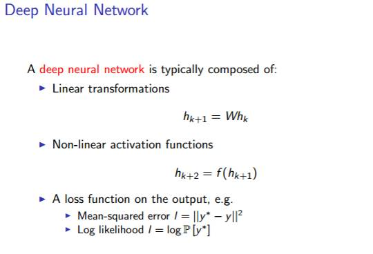
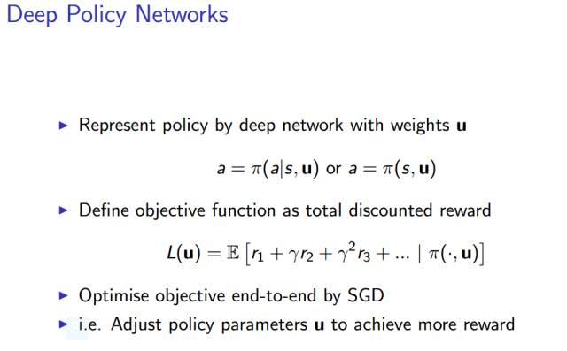

# 深度 | David Silver 全面解读深度强化学习：从基础概念到 AlphaGo

机器之心原创

**作者：Duke Lee**

**参与：马亚雄、吴攀、吴沁桐、Arac Wu**

*强化学习在与之相关的研究者中变得越来越流行，尤其是在 DeepMind 被 Google 收购以及 DeepMind 团队在之后的 AlphaGo 上大获成功之后。在本文中，我要回顾一下 David Silver 的演讲。David Silver 目前任职于 Google DeepMind 团队。他的演讲可以帮助我们获得对强化学习（RL）和深度强化学习（Deep RL）的基本理解，这不是一件特别难的事。*

*David Silver 的演讲视频可在这里查看：http://techtalks.tv/talks/deep-reinforcement-learning/62360/*

*在这个演讲视频中，David 做了对深度学习（DL）和强化学习（RL）的基本介绍，并讨论了如何将这两种学习方法结合成一种方法。有三种不同的可以结合深度学习和强化学习的方法：基于价值（value-based）、基于策略（policy-based）以及基于模型（model-based）的方法。在这个演讲中，David 提供了许多他们自己的实验的实例，最后以对 AlphaGo 的简单讨论结束了演讲。*

**概览**

演讲分为五个部分：

*   介绍深度学习

*   介绍强化学习

*   基于价值的深度强化学习

*   基于策略的深度强化学习

*   基于模型的深度强化学习

然而，当我看完讲座、理解了各个主题之后，便决定在上述的演讲结构中引入一个新的部分——做一个深度强化学习（Deep RL）的概述。这篇文章将会按照如下组织：

*   介绍深度学习

*   介绍强化学习

*   深度强化学习概述

*   基于价值的深度强化学习

*   基于策略的深度强化学习

*   基于模型的深度强化学习

希望上述的文章结构能够帮助大家更好地理解整个主题。我会重点关注演讲视频中的重点，并尽可能去解释一些问题的复杂概念。我也会给出我自己的观点、建议以及一些可以帮助到大家的参考资料。

在深入研究更加复杂的强化学习（RL）主题之前，我会尽可能提供一些关于深度学习和强化学习的基本知识，因为对不了解这两个主题的基本知识的人而言，这个演讲是有一定难度的。希望这些基本知识可以帮助大家。如果你对自己的知识非常有信心，那么，你可以跳过文章的前两部分。

**深度学习介绍**

什么是深度学习？

深度学习是表征学习的通用框架，它有以下特点：

*   给定一个目标（objective）

*   学习能够实现目标的特征

*   直接的原始输入

*   使用最少的领域知识

深度学习（deep learning）的意思就是深度表征（deep representation）。

如图所示，一个深度表征由很多函数组成，它的梯度可以通过链式法则来反向传播。

「深（deep）」的程度可以由函数或者参数的数量来推断。计算机硬件以及算法的发展使得计算机能够在合适的时间范围内完成上图所述的函数的计算，这是深度学习异军突起背后的原因。

反向传播（backpropagation）算法在解决深度问题中起着至关重要的作用。对任何一个想学习深度学习的人而言，理解反向传播是很重要的。

请不要混淆深度神经网络与深度学习。深度学习是一项实现机器学习的技术 [3]。它仅仅是一种机器学习的方法。而深度神经网络通常被人们用来理解深度表征。

深度神经网络通常包括以下内容：

线性变换、非线性激活函数、以及关于输出的损失函数，例如均方差和对数似然值。

我们用随机梯度下降的方法来训练神经网络。

如上图所示，按照能够使得损失函数 L(W) 减小的方向去调整参数 W.

实践中一个常用的有效方法就是权值共享（Weight Sharing），它是减少参数数量的关键。有两种神经网络能够实现权值共享，即循环神经网络（Recurrent Neural Network）和卷积神经网络（ConvolutionalNeural Network）。

如上图所示，循环神经网络在时间步长之间共享权值，卷积神经网络在空间区域共享权值。

**强化学习简介**

什么是强化学习？

在这个讲座中，David 给出了一张图表明强化学习在不同领域中的复杂地位，如下图所示：

尽管我们在机器学习社区中广泛使用强化学习，但强化学习不仅仅是一个人工智能术语。它是许多领域中的一个中心思想，因此图片的标题是「强化学习的多个方面（Many Face of Reinforcement Learning）」。事实上，许多这些领域面临着与机器学习相同的问题：如何优化决策以实现最佳结果。

这就是决策科学（scienceof decision-making）。在神经科学中，人类研究人脑并发现了一种遵循著名的强化算法的奖励系统。在心理学中，人们研究的经典条件反射和操作性条件反射，也可以被认为是一个强化问题。类似的，在经济学中我们研究理性博弈论；在数学中我们研究运筹学；在工程学中我们研究优化控制。所有的这些问题都可以被认为一种强化学习问题—它们研究同一个主题，即为了实现最佳结果而优化决策。

强化学习是一个由行为心理学启发的机器学习领域 [4]。举个例子，一个学生名叫 Mike，如果他今天阅读了一篇与强化学习相关的论文，他将会在昨天的分数的基础上获得 1 分的奖励（称作正反馈）。如果他打了一整天的篮球，他的分数将会被扣掉 1 分（称为负反馈）。因而，如果 Mike 想每天都想获得更多的奖励（正反馈），他会每天都去学习。

「本质上，这些都是闭环系统，因为学习系统的行为会影响它之后的输入。此外，(1) 学习系统没有像很多其它形式的机器学习方法一样被告知应该做出什么行为;(2) 相反，必须在尝试了之后才能发现哪些行为会导致奖励的最大化；(3) 在大多数有趣并且有挑战性的例子中，当前的行为可能不仅仅会影响即时奖励，还会影响下一步的奖励以及后续的所有奖励。这三个特征是强化学习中最重要的三个区分特征，作为闭环系统的本质、没有关于该采取什么行动和后续的包括奖励信号和完成学习的时间的直接指示。」[2]

强化学习和标准监督学习的区别就在于从来不呈现正确的输入/输出对，也不存在次优化的行为被显式地修正。此外，还关注在线性能。在线性能涉及在对未知领域的探索和当前领域知识的利用之间寻求一个平衡。[4]

我们曾经介绍过强化学习:

*   [深度 | 深度学习漫游指南：强化学习概览](http://mp.weixin.qq.com/s?__biz=MzA3MzI4MjgzMw==&mid=2650719294&idx=1&sn=f1a01cd6710e6ea9629619cd3324d102&chksm=871b0040b06c895642ff961a6fe81f05c5e9776aff5da4845f2d3d874f88213863afd2059833&scene=21#wechat_redirect)

并且还有一个视频演示：

https://v.qq.com/iframe/preview.html?vid=l0387nr7rov&width=500&height=375&auto=0

前面说了一下什么是强化学习的问题，那么，我们为什么要关注强化学习呢? 简而言之，强化学习是一个通用的决策框架。实际上我们关心的是开发一个能够在现实世界中做出决策的代理（agent）。我们不仅想给它算法并让它采取行动。我们还想让代理做决策。而强化学习可以让代理学会做决策。

*   强化学习用于具有行动能力的代理

*   每一个动作（action）都能影响代理将来的状态（state）

*   通过一个标量的奖励（reward）信号来衡量成功

*   目标：选择一系列行动来最大化未来的奖励

在每一个时刻 t,代理会执行一个动作 at, 收到一个观测信号 Ot, 收到一个标量奖励 rt。外界环境会收到一个动作 at, 发出一个观测信号 Ot+1，发出一个奖励信号 rt+1。

由于每个问题都有其各自不同的特点，所以，为了实现「通用」的目标，我们需要找到它们的共同点和一些规律性的东西。希望大家可以在没有解释的情况下理解上图的内容。图中的大脑是我们所说的代理，图中的地球是代理所处的环境。任何时刻，当代理执行一个动作 at 之后，它将会收到对环境的观测量 Ot 以及来自环境的奖励 rt，同时，收到动作 at 之后，环境会发出下一个观测量 Ot+1，以及奖励 rt+1。这就引入了一个新的概念：状态。

如上图所示，状态是所有经历（experience）的总和，经历就是上图中的第一个序列函数。某时刻 t 的状态 st 是该时刻以及之前所有时刻的所有观测量、奖励以及动作序列的函数。但是，当代理所处的环境具有一种我们所说的完全可观测性之后，就有了上图中的第二个状态函数——某时刻的状态仅仅是该时刻的观测值 Ot 的函数，这样一来，整个经历似乎具备了某种类似于马尔可夫性的性质。

然后，就有了三个新的想法：策略（policy）、价值函数（value function）和模型（model）。

一个强化学习系统的主要组成

一个强化学习的代理可能包含一个或多个下述的组成：

*   策略：代理的行为函数

*   价值函数 (Value function)：评价一个状态或者行为的好坏及其程度

*   模型（Model）：代理对环境的表征

策略指的是代理的行为，它是从状态到行为的映射。包括确定策略和随机策略。

确定策略：a =π(s)

随机策略：π(a|s)= P[a|s]

**价值函数**

价值函数是对未来奖励的预测，表示在状态 s 下，执行动作 a 会得到多少奖励？

Q 价值函数表示奖励总值的期望。表示在给定一个策略π，贴现因子γ，和状态 s 下，执行动作 a，获得奖励的综合的期望是多少？

Q 价值函数还能够分解为上图描述的贝尔曼方程。

贝尔曼方程，以其提出者 Richard Bellman 命名，也被称作动态规划方程。它是与动态规划有关的数学优化相关的优化问题的必要条件 [5]。

优化价值函数就是使得价值函数达到可实现的最大值。以此为条件就会得到整个问题的最优解，以及相应的最优策略π*。

**模型：**

整个模型就是从经历中学习的过程。

由于我们已经定义了强化学习代理的三个组成部分，所以不难理解，优化其中的任何一个都会得到一个较好的结果。

有三种实现强化学习的途径，分别基于不同的原则。即：基于价值的强化学习，基于策略的强化学习，以及基于模型的强化学习。

*   基于价值的强化学习，需要估计 Q 价值函数的最大值 Q*，这是在任意策略下能够得到的最大 Q 价值函数。

*   基于策略的强化学习，直接搜索最佳的策略π*，这将得到能够最大化未来奖励的策略π*。

*   基于模型的强化学习，构建一个环境的模型，用模型进行诸如前向搜索的规划。

**深度强化学习（DeepReinforcement Learning）**

什么是深度强化学习？简言之，就是强化学习＋深度学习。

将强化学习和深度学习结合在一起，我们寻求一个能够解决任何人类级别任务的代理。强化学习定义了优化的目标，深度学习给出了运行机制——表征问题的方式以及解决问题的方式。强化学习＋深度学习就得到了能够解决很多复杂问题的一种能力——通用智能。

DeepMind 中深度强化学习的例子有：

*   游戏：Atari 游戏、扑克、围棋

*   探索世界：3D 世界、迷宫

*   控制物理系统：操作、步行、游泳

*   与用户互动：推荐、优化、个性化

那么，我们如何结合强化学习和深度学习呢？

*   用深度神经网络来代表

*   价值函数

*   策略

*   模型

*   用随机梯度下降来优化损失函数

下面的三部分，我们分别讨论三种结合强化学习和深度学习的方法。

**基于价值的深度强化学习**

基于价值的深度强化学习的基本思想就是建立一个价值函数的表示，我们称之为 Q 函数。

其中：

*   s =状态

*   a =动作

*   w =权值

正如我们在上边图片中看到的一样，基本上就是一个黑盒子，将状态和动作作为输入，并输出 Q 和一些权值参数。

我们会用到基于 Q 学习的基本方法。这种方法会想出我们需要的损失函数，而且是以贝尔曼方程作为开始的。

如上图所示，我们等号右边作为优化的目标。现在逐步解释这个算法：将左侧的内容移到等号右边。

随后我们用随机梯度下降的方法去最小化最小均方差 (MSE)，一般这个方法在优化的过程中都会奏效的。如果每一个状态和动作都有一个单独的值，那么在这个方法下，价值函数会收敛到一个最优值。不幸的是，由于我们使用的是神经网络，会有两个问题出现：

1.  采样之间的相关性：加入我是一个四处走动的机器人，通过实际数据来学习。我将算法中的每一步视为采取行动的状态，如此一来，这些状态和动作就会和上一次执行的动作非常接近。也就是说，我们采取的方法中存在很强的相关性。

2.  我们从中学习到的目标依赖于目标本身，因此这些都是非平稳的动态。正是由于非平稳动态的存在，我们的近似函数会螺旋式失控，并且导致我们的算法崩溃。

如果我们继续使用神经网络，上述两个问题是不会被解决的。

为了实现稳定的深度强化学习，我们引入的第一个方法是被称为 DQN 的深度强化网络。如下面的 PPT 所描述的，这在 Q 学习的基础上引入了根本的提升。其中的思想非常简单：通过让代理从自己的经历中构建数据集，消除非平稳动态中的所有相关性。然后从数据集中抽取一些经历并进行更新。

在解释完前面的东西之后，David Silver 给大家举了一个他们 DeepMind 团队的一个例子：Atari 游戏。他们训练出了一个能够将 Atari 游戏玩的很好的系统。相信下面的插图能够有助于读者理解代理和环境（包括状态、动作以及奖励）之间的关系

Atari 中的 DQN

*   从状态 s 中端对端地学习 Q 价值函数 Q(s,a)。

*   输入状态 s 是最近 4 帧的原始像素组成的堆栈

*   输出的 Q 价值函数 Q(s,a) 用于 18 个操纵杆/按钮的位置

*   奖励就是每一步动作所对应的得分的变化

这是一个卷积神经网络 (CNN)

网络结构和超参数在所有的游戏中都是固定不变的。

**采用深度 Q 网络的 Atari 的 Demo：**

*   Nature 上关于深度 Q 网络 (DQN) 论文:

    http://www.nature.com/articles/nature14236

*   GoogleDeep Mind 团队深度 Q 网络 (DQN) 源码:

    http://sites.google.com/a/deepmind.com/dqn/

*   我们之前也介绍过一次深度 Q 网络 (DQN) :[重磅 | 详解深度强化学习，搭建 DQN 详细指南（附论文）](http://mp.weixin.qq.com/s?__biz=MzA3MzI4MjgzMw==&mid=2650716425&idx=1&sn=bf52c653b7cd054ce721ce5be928c623&scene=21#wechat_redirect)

继 Nature 上发表深度 Q 网络之后，有好多关于 DQN 的改进。但 David 主要关注以下三点：

双深度 Q 网络（Double DQN）:

要理解第一个改进，我们首先必须明白 Q 学习中存在的一个问题。问题就踹 MAX 算子上。事实上那样得到的近似值不足以做出决定，并且这个偏差可能在实际应用中导致一系列问题。因此，为了解决这个问题，我们用了两个深度 Q 网络把评价动作的方式分解为两个路径。一个深度 Q 网络用来选择动作，另一个用来评价动作，这在实践中确实很有帮助。

确定优先级的经历回放：

第二个改进就是我们做经历回放的方式。旧方法做经历回放的时候会给所有的经历附一个相同的权重。然而相等的权重并不是一个好的思想，如果给所有的经历给一个优先级，你可能做得更好一些。我们仅仅采用了以此误差的绝对值，它表示在一个时刻的某一个特定状态有多么好或者多么差。那些你并没有很好的理解的经历才是所有的经历中你最想回放的。因为需要更多的更新来矫正你的键值。

决斗网络（DuelingNetwork）

第三个改进就是把 Q 网络分成两个信道。一部分用来计算当你忽略了一些动作的时候你会得到多少奖励（幻灯片中的 action-independent），另一部分用来计算实际中当你采取了某一个特定的动作之后你会做得多么好。然后将两个网络的计算结果求和。然后取两者的总和。正如前面视频中演示的，如果你把这个结果正则化，结果会发现这两个通道会闪烁，因为它们有不同的扩展（scaling）属性。将两个网络分开，去帮助神经网络学习更多的东西，这实际上是很有帮助的。

它们通过在 Google 利用下面的结构（Gorila）来让系统加速，这很适合海量数据。

Gorila 结构运行在很多不同的机器上，这让它们可以共同运行深度 Q 网络。我们有许多个代理并行运行的实例，有我们环境的许多不同的实例，这些环境都是基于许多不同的机器，这样便能让我们在力所能及的情况下生成尽可能多的经历。

这些经历被存放在一个分布式的经历回放记忆（experience replay memory）中。本质上就是将所有并行的代理的经历收集起来并且以分布式的方式存储。我们由很多学习器能够在这些经历中并行采样。一旦你有了这个经历回放的缓存，我们可以从中读取很多不同的东西并且将其应用于系统的更新上。然后，从那些学习器返回的参数更新将被共享到我们存储的分布式神经网络中，然后在实际上运行在这些机器上的每个代理共享。

那么，在没有 Google 的资源的情况下，我们如何做才能加速强化学习呢？可以使用异步强化学习：

*   利用标准 CPU 的多线程

*   将一个代理的多个实例并行执行

*   线程间共享网络参数

*   并行地消除数据地相关性

*   经历回放的可替代品

*   在单个机器上进行类似于 Gorila 的加速！

**基于策略的深度强化学习**

深度策略网络

策略梯度

Actor-Critic 算法

异步优势 Actor Critic 算法（A3C）

Labyrinth 中的异步优势 Actor Critic 算法（A3C）

*   从输入的像素中进行 softmax 策略 π(a|st) 的端到端学习。对环境的观测量 ot 是当前帧的原始像素。状态 st= f(o1, …, ot) 是一个循环神经网络（LSTM）。网络在策略π(a|s) 下同时输出价值 V(s) 和激活函数 softmax 的结果值。任务是收集苹果（+1 分奖励）和逃跑（+10 分奖励）。

深度强化学习中采用异步方法的演示:Labyrinth，如下

https://v.qq.com/iframe/preview.html?vid=g0387u8wb7y&width=500&height=375&auto=0

**我们如何处理高维连续动作空间？**

与深度 Q 网络类似，我们在这里有 DPG 算法。希望你现在对深度 Q 网络有了较好的理解，这将有助于你理解下一部分内容。

确定策略梯度（DPG/DeterministicPolicy Gradient）算法

下面是 DavidSilver 关于 DPG 的论文的链接：

http://www.jmlr.org/proceedings/papers/v32/silver14.pdf_

**深度确定策略梯度**

模拟物理中的确定策略梯度算法:

*   在 MuJoCo 上模拟物理域

*   从原始输入的状态 s 中进行控制策略的端对端学习

*   输入状态 s 是最近 4 个帧 (4 个状态) 的原始数据

*   对价值 Q 和策略π使用两个分离的卷积神经网络

*   策略π被朝着能够最大程度提成价值 Q 的方向调节

图为两个分离的卷积神经网络，分别对应 Q 价值函 Q（s,a）和策略π(s)。

然后我们来看一看其他的经典游戏，例如扑克。我们能够使用深度强化学习的方法在多代理的游戏中找到纳什均衡吗？纳什均衡就像多代理决策问题中的解决方案。在这个均衡下，每个代理都满足它们的策略，没人愿意偏离当前的策略。

因此，如果我们找到了纳什均衡，我们就解决了这个小问题。很多研究都在关注如何在更加庞大、有趣的博弈游戏中实现这种均衡。

这里的思想是，我们首先学习一个价值 Q 网络，然后学习一个策略网络，然后挑选一些最佳相应和平均最佳相应之间的动作。

代理在游戏中进行虚拟自我对抗 (FSP)。

下面的幻灯片阐述了在德州扑克进行 FSP 的结果：随着迭代次数的增加，不同的算法都收敛了。

基于模型的深度强化学习

**学习环境的模型**

*   Demo:Atari 的生成模型

*   复杂的误差使规划富有挑战

*   传递模型中的误差会在轨迹上复合

*   规划的轨迹会与执行的轨迹有所不同

*   在长时间的不正常轨迹结束时，奖励是完全错误的

学习一个模型，即如何用深度学习完成基于模型的强化学习，并不是这个问题的难点。我们知道了如何规定学习模型的问题。事实上这不过是一个监督学习的问题罢了「如果你想预测：假设我采取了这个动作之后，环境会变成什么样子」。在这次讲座中，他没有太多地谈论这个问题，他只是展示了一个来自密歇根大学的视频，演示你如何能够建立一个模型，以及建立这个模型有多困难。这是该视频的屏幕截图：左侧是预测，右侧是真实情况。但是，这是很难实现的。

然而，如果我们有一个完美的模型呢？也就是说，游戏规则是已知的。是的，我们知道，AlphaGo 就是这样的。

Nature 上关于 AlphaGo 的论文：

http://www.nature.com/articles/nature16961

AlphaGo 相关的资源: deepmind.com/research/alphago/

为什么下围棋对于计算机而言是很困难的？

暴力搜索是很难处理的。

 1\. 搜索空间是巨大的

 2\. 对计算机而言，评价哪一个玩家占据上风，「几乎是不可能的」。但是在一些诸如象棋的游戏中，就比较容易判断了。

过去很多人都认为找到一个解决这个问题的好方法是不可能的。

DeepMind 建立了一个卷积神经网络（CNN），这个网络将每一个状态（只要由棋子落下）看作一幅图像。然后用卷积神经网络去构造两个不同的神经网络。

一个代表价值网络

另一个代表策略网络：

为了训练它，我们结合了监督学习和强化学习，共有三个步骤，如下所示：

经过每一步之后的表现：

价值网络和策略网络的效果：

总结

*   通用、稳定并且可拓展的强化学习现在是可能的

*   用深度网络去代表价值、策略和模型

*   在 Atari、Labyrinth、物理、扑克、围棋中取得了成功

*   使用一系列深度强化学习的范例

强化学习是一个受行为心理学启发的机器学习领域。它正在变得越来越流行。在需要构建一个可以像人类一样甚至超越人类能力去做一些事的人工智能时，它是非常有用的，比如 AlphaGo。然而，在我看来，在开始学习强化学习之前，我们首先应该理解一些基本的机器学习相关的知识。良好的数学背景将会非常有助于你的学习，并且，这至关重要！

好运！我希望在下一届 ICML 会议上看到你的论文。

**参考文献以及推荐的阅读材料：**

*1.http://videolectures.net/rldm2015_silver_reinforcement_learning/*

*2.Sutton, Richard S., and Andrew G. Barto. *Reinforcement learning: Anintroduction*. Vol. 1\. No. 1\. Cambridge: MIT press, 1998.*

*3.https://blogs.nvidia.com/blog/2016/07/29/whats-difference-artificial-intelligence-machine-learning-deep-learning-ai/*

*4.https://en.wikipedia.org/wiki/Reinforcement_learning*

*5.https://en.wikipedia.org/wiki/Bellman_equation*

*6.https://devblogs.nvidia.com/parallelforall/deep-learning-nutshell-reinforcement-learning/  *

******本文为机器之心原创，***转载请联系本公众号获得授权******。***

✄------------------------------------------------

**加入机器之心（全职记者/实习生）：hr@jiqizhixin.com**

**投稿或寻求报道：editor@jiqizhixin.com**

**广告&商务合作：bd@jiqizhixin.com**