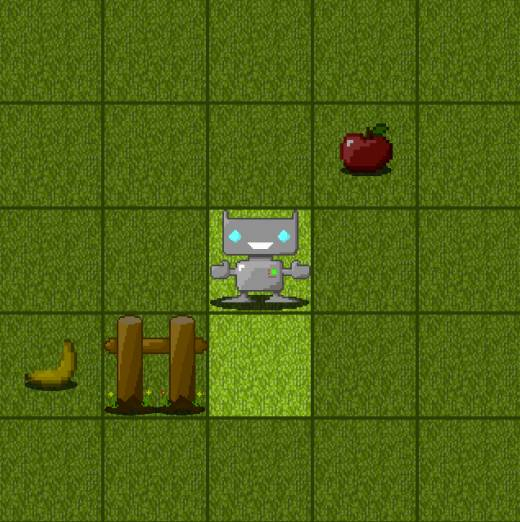
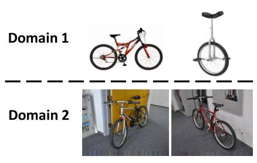
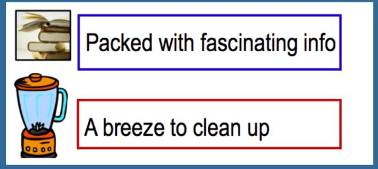

# 深度 | 迁移学习全面概述：从基本概念到相关研究

选自 sebastianruder.com

**作者：Sebastian Ruder**

**机器之心编译**

**参与：马亚雄、吴攀、李亚洲**

> *将在一个场景中学习到的知识迁移到另一个场景应用中一直是人工智能研究领域的一个热门领域，本文从迁移学习的基本概念谈起，介绍了迁移学习的技术、应用和方法。本文作者为 Insight Research Centre for Data Analytics 的自然语言处理与深度学习博士生 Sebastian Ruder，他同时也是爱尔兰都柏林的文本分析创业公司 AYLIEN 的研究科学家。*

**目录：**

1.什么是迁移学习？

2.为什么现在需要迁移学习？

3.迁移学习的定义

4.迁移学习的场景

5.迁移学习的应用

*   从模拟中学习

*   适应到新的域

*   跨语言迁移知识

6.迁移学习的方法

*   使用预训练的 CNN 特征

*   学习域不变的表征

*   让表征更加相似

*   混淆域

7.相关的研究领域

*   半监督学习

*   更有效地使用可用的数据

*   提高模型的泛化能力

*   让模型更加稳健

*   多任务学习

*   持续学习

*   zero-shot 学习

8.总结

近年来，我们越来越擅长训练深度神经网络，使其能从大量的有标签的数据中学习非常准确的输入到输出的映射，无论它们是图像、语句还是标签预测。

我们的模型仍旧极度缺乏泛化到不同于训练的环境的能力。什么时候需要这种能力呢？就是你每一次将你的模型用到现实世界，而不是精心构建的数据集的时候。现实世界是混乱的，并且包含大量全新的场景，其中很多是你的模型在训练的时候未曾遇到的，因此这又使得模型不足以做出好的预测。将知识迁移到新环境中的能力通常被称为迁移学习（transfer learning），这就是本文将讨论的内容。

在这篇文章中，我首先会将迁移学习与机器学习的最普遍和成功的范式——监督学习——做一下对比。然后我会概括一下迁移学习值得我们去关注的原因。随后，我会给出一个更加技术性的定义以及介绍多个不同的迁移学习的场景。然后，我会提供一些迁移学习的应用的例子，再探究一些可以被用来迁移知识的实际方法。最后，我会概述一下相关的研究方向，并展望一下未来的前景。

**什么是迁移学习？**

在机器学习的经典监督学习场景中，如果我们要针对一些任务和域 A 训练一个模型，我们会假设被提供了针对同一个域和任务的标签数据。我们可以在图 1 中清楚地看到这一点，其中我们的模型 A 在训练数据和测试数据中的域和任务都是一样的（后面我会详细地定义什么是任务（task），以及什么是域（domain））。现在，让我们假设，一个任务就是我们的模型要去执行的目标，例如，识别图片中的物体；而域就是数据的来源，例如，来自于旧金山的咖啡店的照片。

*图 1：机器学习领域中传统监督学习的设置*

现在我们可以在这个数据集上训练一个模型 A，并期望它在同一个任务和域中的未知数据上表现良好。在另一种情况下，当给定一些任务或域 B 的数据时，我们还需要可以用来训练模型 B 的有标签数据，这些数据要属于同一个任务和域，这样我们才能预期能在这个数据集上表现良好。

当我们没有足够的来自于我们关心的任务或域的标签数据来训练可靠的模型时，传统的监督学习范式就支持不了了。

如果我们要训练一个模型来检测在夜间拍摄的照片上的行人，我们可以用一个在相似的域中训练的模型，例如白天拍摄的图片。然而，实际上，我们经常会遭遇表现上的衰退或者崩溃，因为模型已经继承了它的训练数据中的偏差，不知道如何泛化到新的域中。

如果我们要训练一个模型来执行新的任务，例如检测骑自行车的人，我们甚至不能够使用已有的模型，因为任务之间的标签都是不一样的。

迁移学习允许我们通过借用已经存在的一些相关的任务或域的标签数据来处理这些场景。我们尝试着把在源域中解决源任务时获得的知识存储下来，并将其应用在我们感兴趣的目标域中的目标任务上去，如图 2 所示。

*图 2：迁移学习的设置*

在实践中，我们力求将尽可能多的知识从源环境迁移到目标任务和域中。依据数据的不同，这种知识有不同的形式：它可以涉及物体是如何组成的，以允许我们更加容易地识别新的对象；也可以是关于人们用来表达观点的普通词汇，等等。

**为什么现在需要迁移学习？**

前百度首席科学家、斯坦福的教授吴恩达（Andrew Ng）在[广受流传的 2016 年 NIPS 会议的教程中](http://mp.weixin.qq.com/s?__biz=MzA3MzI4MjgzMw==&mid=2650721081&idx=1&sn=d557968703d4af879b5cf6461069dacd&chksm=871b0f47b06c865185865fcd5ef92af7726e84ae9e689b7ced9986a08c9fe3113df296a8469a&scene=21#wechat_redirect)曾经说过：「迁移学习将会是继监督学习之后的下一个机器学习商业成功的驱动力」。

*图 3：吴恩达在 2016 年 NIPS 上谈论迁移学习*

特别地，他在白板上画了一个图表，我尽可能忠实地将它复制在如下所示的图 4 中（抱歉坐标轴没有详细的标注）。据吴恩达说，迁移学习将成为机器学习在产业界取得成功的一个关键驱动力。

*图 4：吴恩达心中机器学习产业成功的驱动力*

不容置疑，机器学习在产业界的应用和成功主要是受监督学习的驱动。受到深度学习中的进步、更强大的计算资源以及大量的标签数据集的推动，监督学习是人们对人工智能的兴趣复苏浪潮、多轮融资以及收购的主要原因，尤其是我们近年来看到的机器学习的应用，它们已经成为了我们生活的一部分。如果我们忽视关于另一个人工智能寒冬的怀疑和传言，并且相信吴恩达的预见，这种成功很可能会持续下去。

然而，不太清楚为什么已经存在了大约几十年并且至今在产业界很少被使用的迁移学习会出现吴恩达所预言的那种爆炸式增长。更有甚者，与机器学习的其他领域（如无监督学习和强化学习等）相比，迁移学习目前受到的关注更少。而且那些领域也正越来越受欢迎：无监督学习是实现通用人工智能的关键成分（如图 5 中 Yann LeCun 所说），人们对此兴趣已经复苏，尤其是在生成对抗网络（GAN）的推动下。反过来，强化学习在 Google DeepMind 的牵头下已经实现游戏 AI 的进步，AlphaGo 的成功堪称典范，并且也早已在现实世界中实现了成功，例如将 Google 数据中心的冷却费用降低了 40%。这两个领域虽然很有希望，但是在可预见的未来可能只会有着相对较小的商业影响力，并且大部分还停留在前沿研究论文的范围之内，因为它们仍然面临着许多挑战。

*图 5：显然迁移学习没有出现在 Yann LeCun 的蛋糕成分问题中*

什么使得迁移学习与众不同呢？下面我们会看一下在我看来驱使了吴恩达的预见的因素，并且总结一下现在正是重视迁移学习的时机的原因。

目前产业界对机器学习的应用分为两类：

一方面，在过去几年中，我们已经获得了训练越来越准确的模型的能力。我们现在所处的阶段，对很多任务而言，最先进的模型已经达到了这样的水平：它们的表现是如此的好以至于对使用者来说不再有障碍了。有多么好呢？最新的 ImageNet 上的残差网络 [1] 在进行物体识别时实现了超越人类的性能；Google 的 Smart Reply 系统 [2] 可以处理所有移动手机中的回复的 10%；语音识别的错误率在持续降低，并且比键盘输入更加准确 [3]；我们已经实现了和皮肤科医师一样好的自动皮肤癌识别；Google 的神经机器翻译系统（NMT）[4] 已被用在了超过 10 种以上的语言对的生产中；百度可以实时地生成逼真的语音；类似的还有很多很多。这种成熟度允许将这些模型大规模地部署到数百万的用户上，并且已经得到了广泛的采用。

另一方面，这些成功的模型都是极其地重视数据的，依靠大量的标签数据来实现它们的性能。对一些任务和域而言，经过了多年的精心收集，这种数据是可以得到的。在少数情况下，数据是公开的，例如 ImageNet[5]，但是在很多语音或者 MT 的数据集中，大量的标签数据都是有专利的，或者是很昂贵的，因为它们在竞争中提供了前沿参考。

同时，把机器学习的模型应用在自然环境中时，模型会面临大量之前未曾遇到的条件，它不知道如何去处理；每一个用户都有他们自己的偏好，也需要处理和生成不同于之前用来训练的数据；要求模型执行很多和训练相关但是不相同的任务。在所有这些情况下，尽管我们最先进的模型在它们被训练的任务和域上展示出了和人类一样甚至超越人类的性能，然而还是遭遇了明显的表现下降甚至完全失败。

迁移学习可以帮助我们处理这些全新的场景，它是机器学习在没有大量标签数据的任务和域中规模化应用所必须的。到目前为止，我们已经把我们的模型应用在了能够容易获取数据的任务和域中。为了应对分布的长尾，我们必须学会把已经学到的知识迁移到新的任务和域中。

为了做到这个，我们需要理解迁移学习所涉及到的概念。基于这个原因，我会在下面的内容中给出更加技术性的定义。

**迁移学习的定义**

为了这个定义，我会紧密地遵循 Pan 和 Yang(2010) 所做的杰出的综述 [6]，并以一个二元文档分类为例。

迁移学习涉及到域和任务的概念。一个域 D 由一个特征空间 X 和特征空间上的边际概率分布 P(X) 组成，其中 X=x1,…, xn∈X。对于有很多词袋表征（bag-of-words representation）的文档分类，X 是所有文档表征的空间，xi 是第 i 个单词的二进制特征，X 是一个特定的文档。（*注：这里的 X 有两种不同的形式，这里不太好呈现，具体请参考原文。*）

给定一个域 D={X,P(X)}，一个任务 T 由一个标签空间 y 以及一个条件概率分布 P（Y|X） 构成，这个条件概率分布通常是从由特征—标签对 xi∈X,yi∈Y 组成的训练数据中学习得到。在我们的文档分类的例子中，Y 是所有标签的集合（即真（True）或假（False）），yi 要么为真，要么为假。

给定一个源域 Ds，一个对应的源任务 Ts，还有目标域 Dt，以及目标任务 Tt，现在，迁移学习的目的就是：在 Ds≠Dt，Ts≠Tt 的情况下，让我们在具备来源于 Ds 和 Ts 的信息时，学习得到目标域 Dt 中的条件概率分布 P（Yt|Xt）。绝大多数情况下，假设可以获得的有标签的目标样本是有限的，有标签的目标样本远少于源样本。

由于域 D 和任务 T 都被定义为元组（tuple），所以这些不平衡就会带来四个迁移学习的场景，我们将在下面讨论。

**迁移学习的场景**

给定源域和目标域 Ds 和 Dt，其中，D={X,P(X)}，并且给定源任务和目标任务 Ts 和 Tt，其中 T={Y,P(Y|X)}。源和目标的情况可以以四种方式变化，我们仍然以我们的文档分类的例子在下面描述：

1.  XS≠XT。源域和目标域的特征空间不同，例如，文档是用两种不同的语言写的。在自然语言处理的背景下，这通常被称为跨语言适应（cross-lingual adaptation）。

2.  P(Xs)≠P(Xt)。源域和目标域的边际概率分布不同，例如，两个文档有着不同的主题。这个情景通常被称为域适应（domain adaptation）。

3.  YS≠YT。两个任务的标签空间不同，例如，在目标任务中，文档需要被分配不同的标签。实际上，这种场景通常发生在场景 4 中，因为不同的任务拥有不同的标签空间，但是拥有相同的条件概率分布，这是极其罕见的，

4.  P（Ys|Xs）≠P（Yt|Xt）。源任务和目标任务的条件概率分布不同，例如，源和目标文档在类别上是不均衡的。这种场景在实际中是比较常见的，诸如过采样、欠采样以及 SMOTE[7] 这些方法被广泛应用。

在明白了与迁移学习相关的概念和常被用到的一些场景之后，我们将要介绍一些能够说明它的潜力的应用。

**迁移学习的应用**

**从模拟中学习**

一个非常令我兴奋并且我认为我们在将来会见到更多的迁移学习应用就是从模拟中学习。对很多依靠硬件来交互的机器学习应用而言，在现实世界中收集数据、训练模型，要么很昂贵，要么很耗时间，要么只是太危险。所以最好能以某些风险较小的其他方式来收集数据。

模拟是针对这个问题的首选工具，在现实世界中它被用来实现很多先进的机器学习系统。从模拟中学习并将学到的知识应用在现实世界，这是迁移学习场景 2 中的实例，因为源域和目标域的特征空间是一样的（仅仅依靠像素），但是模拟和现实世界的边际概率分布是不一样的，即模拟和目标域中的物体看上去是不同的，尽管随着模拟的逐渐逼真，这种差距会消失。同时，模拟和现实世界的条件概率分布可能是不一样的，因为模拟不会完全复制现实世界中的所有反应，例如，一个物理引擎不会完全模仿现实世界中物体的交互。

*图 6：谷歌的自动驾驶车辆（来源： Google Research 博客）*

从模拟中学习有利于让数据收集变得更加容易，因为物体可以容易地被限制和分析，同时实现快速训练，因为学习可以在多个实例之间并行进行。因此，这是需要与现实世界进行交互的大规模机器学习项目的先决条件，例如自动驾驶汽车。谷歌无人车的技术主管 Zhaoyin Jia 说，「如果你真的想做无人驾驶车，模拟是必需的」。Udacity 已经开源了它用来进行无人驾驶汽车工程纳米学位教学的模拟器，在图 7 中可以看到，OpenAI 的 Universe 平台将可能允许用《侠盗飞车 5(GTA 5)》或者其他视频游戏来训练无人驾驶汽车。

*图 7：Udacity 的无人驾驶汽车模拟器*

另一个必需从模拟中学习的领域是机器人：在实际的机器人上训练模型是非常缓慢和昂贵的。从模拟中学习并且将知识迁移到现实世界的机器人上的方式能缓解这个问题，并且这种方面最近正得到越来越多的关注 [8]。图 8 中可以看到一个在现实世界和模拟中操作数据的一个例子。

*图 8：机器人和模拟图片 (Rusu et al., 2016)*

最后，另一个方向是通向通用人工智能的途径，其中模拟会是一个必需的组成部分。在现实世界中直接训练一个代理来实现通用人工智能的代价太高，并且不必要的复杂度还会在初始的时候阻碍训练。相反，如果基于诸如 CommAI-env [9] 的模拟环境的话，学习也许会更加成功，如图 9 所示。

*图 9：Facebook 人工智能研究院的 CommAI-env (Mikolov et al., 2015)*

**适应到新的域**

尽管从模拟中学习是域适应的一个特例，总结一些域适应的其他例子也是有价值的。

域适应在视觉中是一个常规的需求，因为标签信息易于获取的数据和我们实际关心的数据经常是不一样的，无论这涉及到如图 11 所示的识别自行车还是自然界中的其他物体。即使训练数据和测试数据看起来是一样的，训练数据也仍然可能包含人类难以察觉的偏差，而模型能够利用这种偏差在训练数据上实现过拟合 [10]。

*图 10：不同的视觉域 (Sun et al., 2016)*

另一个常见的域适应场景涉及到适应不同的文本类型：标准的自然语言处理工具（例如词性标签器或者解析器）一般都是在诸如华尔街日报这种新闻数据上进行训练，这种新闻数据在过去都是用来评价这些模型的。然而，在新闻数据上训练出的模型面临挑战，难以应对更加新颖的文本形式，例如社交媒体信息。

*图 11：不同的文本类型/风格*

即使在产品评价这样的域中，人们采用不同的词汇和短语去表达同样的观点。因此，在一种类型的评论上训练出的模型应该能够解决人们使用的通用和特定领域的意见词，以免被域的变化所混淆。

*图 12：不同的主题*

最后，尽管以上的挑战都是处理一般的文本或者图像类型，如果我们考虑涉及到单个用户或者用户组的域，问题就被放大了：以自动语音识别（ASR）为例。语音指定会成为下一个大平台，据预测，到 2020 年，我们所有搜索的 50% 将会通过语音执行。大多数自动语音识别系统都在由 500 位说话人组成的标准数据集上进行传统测试。如此一来，大多数拥有标准口音的人则是幸运的，然而，移民、非标准口音的人、语音障碍的人以及儿童则会不容易被理解。现在比以往任何时候都需要能够适应个体用户和少数群体的系统，以确保每个人的声音都能被听懂。

*图 13：不同的口音*

**跨语言迁移知识**

最后，在我看来，迁移学习的另一个杀手级别的应用是将知识从一种语言迁移到另一种语言，我曾经在此处写过一篇关于跨语言环境的嵌入式模型的文章（博文链接：http://sebastianruder.com/cross-lingual-embeddings/index.html）。可靠的跨语言域的方法会允许我们借用大量的已有的英文标签数据并将其应用在任何一种语言中，尤其是没有足够服务且真正缺少资源的语言。已有的最先进的方法看起来仍然太过理想，但是以 zero-shot 翻译 [11] 为例的最近的进展已在这个领域取得了快速的进步。

虽然到目前为止我们已经考虑过一些迁移学习的特殊应用，但是现在我们要研究一下文献中那些解决了一些挑战的实际方法和方向。

**迁移学习的方法**

在解决前文提及的四种迁移学习场景上，迁移学习拥有悠久的研究和技术的历史。深度学习的出现导致了一系列迁移学习的新方法，我们下面将会概览其中的一些。参考文献 [6] 可以看到一些早期方法的综述。

**使用预训练的 CNN 特征**

为了了解目前应用中最常见的迁移学习方式，我们必须理解在 ImageNet 上大型卷积神经网络所取得的杰出成功 [12]。

**理解卷积神经网络**

虽然这些模型工作方式的许多细节仍然是一个谜，但我们现在已经意识到，较低的卷积层捕获低级图像特征，例如边缘（见图 14），而较高的卷积层捕获越来越复杂的细节，例如身体部位、面部和其他组合性特征。

*图 14:AlexNet 学习得到的实例滤波器 (Krizhevsky et al., 2012)*

最后的全连接层通常被认为是捕获了与解决相应任务相关的信息，例如 AlexNet 的全连接层可以指出哪些特征与在 1000 个物体类中分类一张图片相关的。

然而，尽管知道一只猫有胡须、爪子、毛皮等是将一个动物识别为猫所必需的（参见图 15），但它并不能帮助我们识别新物体或解决其他共同的视觉任务（如场景识别、细粒度识别、属性检测和图像检索）。

*图 15：这篇博文的标志猫*

然而，能够帮助我们的是捕获关于一幅图像是如何组成的以及它包括什么样的边缘和形状组合的通用信息。正如我们之前所描述的，这种信息被包含在在 ImageNet 上训练出的卷积神经网络的最后卷积层或者最后一层之前的全连接层。

所以，对于一个新任务，我们可以简单地使用这种由最先进的卷积神经网络在 ImageNet 上预训练出的现成特征，并在这些抽象的特征上面训练出新的模型。在实际中，我们要么保持预训练的参数固定不变，要么以一个较小的学习率来调节它们，以保证我们不会忘记之前学习到的知识。这个方法已经被证明可以在一系列的视觉任务 [13] 以及一些依靠图像作为输入的任务（例如看图说话）上实现出色的结果。在 ImageNet 上训练出的模型似乎能够捕获到关于动物以及物体的构造和组成方式的细节，这种方式通常在处理图像的时候是有价值的。因此，ImageNet 上的任务似乎对于一般的计算机视觉问题来说是一个很好的代理（proxy），因为在其中所需的相同知识也与许多其他任务相关。

**学习图像的隐含结构**

一个类似的假设被用来推动生成模型：当训练一个生成模型的时候，我们假设生成逼真图像的能力需要对图像隐含结构的理解，它反过来可以被用在很多其他任务中。这个假设本身也依赖一个前提，即所有图像都由一个低维度的流形结构决定，这就是说，可以用一个模型来抽象出图像的隐含结构。利用生成对抗网络来生成逼真图片的最新进展揭示，这种模型或许真的存在，如图 16 所示，卧室空间的点之间的逼真过渡证明了这个模型的能力。

*图 16：行走在卧室的图像流形中*

预训练的特征在视觉之外的领域有用吗？

现成的卷积神经网络特征在视觉任务上有着无出其右的结果，但是问题在于，使用其它的数据，在其它领域（例如语言）能否复制这种成功？目前，对自然语言处理而言没有能够实现与图像领域一样令人惊叹结果的现成特征。为什么呢？这样的特征是否存在呢？如果不存在，那为什么视觉比语言更有利于这种形式的迁移呢？

诸如词性标注或分块这类低级别任务的输出就可以被比作现成的特征，但是在没有语法学的帮助下，不能采集到更细粒度的特征。正如我们看到的，可概括的现成特征似乎存在似乎存在于众多任务中原型任务中。在视觉中，物体识别就占据了这样的地位。在语言中，最接近的类似物可能是语言建模：为了预测给定词汇序列中的下一个单词或者句子，模型需要处理语言是如何构造的知识，需要理解那些单词很可能是相关的，那些单词很可能是彼此跟随出现的，需要对长期依赖关系进行建模，等等。

尽管最先进的语言模型越来越接近人类的水平 [15]，但是它们的功能使用是有限的。同时语言建模方面的进步已经为其他任务也带来了正面的结果：用语言模型的目标函数对一个模型进行预训练能够提升性能 [16]。此外，在一个大规模的无标签的语料库上用一个近似的语言模型目标函数进行预训练的单词嵌入已经变得普遍 [17]。虽然它们不如视觉中的现成特征那样有效，但仍然能够带来相当大的收益 [18]，并且它们可以被看做是从大规模的无标签的语料库向通用域知识的一种简单形式的迁移。

尽管自然语言处理领域的通用代理任务（general proxy）在当前似乎是无法企及的，但是辅助任务可以采用局部代理的形式。不管是通过多任务目标 [19] 还是综合任务目标 [20,21]，它们都可以被用来为模型增加更多的相关知识。

使用预训练特征是目前做迁移学习的最直接、最常用的方式。然而，到目前为止它并不是唯一的一种。

**学习域不变的表征**

在实际中，预训练特征通常被用在我们想适应的新任务的场景适应中 3。对其他场景而言，另一个由深度学习实现知识迁移的方式是学习基于域而不会改变的表征。这个方法在概念上和我们思考过的使用预训练的卷积神经网络特征非常相似：两者都只编码关于域的一般知识。然而，给非视觉任务创建基于特定域的不变表征要比为所有任务生成有用的表征要更加经济，更加可行。ImageNet 已经花费了多年、数千个小时来创建，然而为了创建域不变的表征，我们通常只需要每个域中的无标签数据。这种表征通常用大量的去噪自动解码器学习得到，而且已经在自然语言处理中取得了和视觉中一样的成功 [22,23]。

**让表征更加相似**

为了提高学到的表征从源域到目标域的可迁移性，我们希望两个域之间的表征尽可能相似，这样一来，我们就不用考虑可能阻碍迁移的特定域的特征，只需要考虑域之间的共同点。

与其仅仅让我们的自动解码器学到一些表征，不如积极地激励以让两个域中的表征和彼此变得更加相似。我们可以像预处理步骤一样把这个直接应用在我们的数据表证过程中 [25,26]，然后把新的表征用来训练。我们也可以促使我们的模型中的表征变得更加相似 [27,28]。

**混淆域**

另一个最近变得流行的、用来确保两个域的表征之间相似性的方式就是在现有的模型上增加一个目标函数来鼓励两个域的混淆 [29,30]。这个域混淆的损失函数就是常规的分类损失函数，模型尝试预测输入样例的类别。然而，又和常规的损失函数有所不同，如图 17 所示，从损失函数到网络的剩余部分的流动是反向的。

*图 17:用一个梯度反向层（gradient reversal layer）来混淆域。*

梯度反向层会导致模型最大化误差，而不是学着去最小化域分类的损失函数的误差。在实际中，这意味着该模型会学习那些允许最小化原目标函数的表征，同时不允许区分两个域，这样有利于知识迁移。如图 18 所示，尽管仅仅使用常规的目标函数训练的模型可以基于它学到的表征清晰地区分两种域，但是用域方法增强的目标函数训练得到的模型却不能做到这一点。

*图 18：常规模型和域混淆模型的域分类得分比较 (Tzeng et al, 2015)*

**相关的研究领域**

尽管这篇博文是关于迁移学习的，但是到今天为止，迁移学习并不是唯一一个试图利用有限的数据、在新的任务上使用学到的知识、并让模型在新环境上具有较好的泛化能力的机器学习领域。所以，在下面的内容中，我们会介绍一些其他的与迁移学习相关或者能够补充迁移学习目标的方向。

**半监督学习**

迁移学习力图最大效率地使用某些任务或者域中的无标签数据。这也是半监督学习所恪守的准则，半监督学习遵循经典机器学习的设定，但是它仅仅采用有限数量的标签数据来训练。如此，半监督域适应本质上就是在域变化的情况下进行半监督学习。许多来自于半监督学习的教训和思想同样地适用于迁移学习。文献 [31] 是一个很不错的关于半监督学习的综述。

**更有效地使用可用的数据**

另外一个与迁移学习和半监督学习相关的方向是让模型在有限数量的数据上运行得更好。

这个可以用几种方式实现：你可以使用无监督学习或者半监督学习从无标签数据中抽取信息，以减少对有标签样本的依赖；你可以允许模型能够获取一些数据的固有属性，同时减轻正则化过程中的过拟合倾向；最后，你还可以使用至今仍然被忽视或者位于不明显的地方的一些数据。

作为用户生成内容的意外结果，这种巧合的数据 [32] 可能会被创建，例如能够提升命名实体和词性标注的超链接；它也可能作为注释的副产品存在，例如注释器不一致（annotator disagreement) 可能改进标注或者解析；或者来源于用户行为的数据，例如视线追踪或者键入变化，可以影响自然语言处理的任务。虽然这些数据只是以有限的方式被利用，但是这样的例子鼓励我们在意外的地方查找数据，并研究检索数据的新方法。

**提高模型的泛化能力**

让模型更好地泛化也是与此相关的一个方向。为了实现更好的泛化能力，我们首先必须理解大规模神经网络的行为和错综复杂的结构，并且去研究它们泛化的原因和方式。最近的工作已经朝着这个目标迈出了大有希望的步伐 [33]，但是很多问题仍然等待解答。

**让模型更加稳健（robust)**

尽管提升我们的模型的泛化能力这方面已经比较成功了，在类似的例子上面我们也许泛化得很好，但是在出乎意料或者者非典型的输入情况下仍然会失败。所以，一个关键的补充目标就是让我们的模型更加稳健。在近来对抗学习的进步的推动下，这个方向越来越受关注，并且，最近的方法研究了很多让模型在最糟糕的情况下或者面对不同设置的对抗样本时变得更加稳健的方式 [34,35]。

**多任务学习**

在迁移学习中，我们主要关心在我们的目标任务和域上友好的表现。相反，多任务学习中的目标是在所有可用的任务上都要表现良好，尽管某个标签数据通常都被假定在一个任务上。虽然多任务学习的方法没有直接用在迁移学习上，但是对多任务学习有利的关于任务的思想 [19] 仍然能够指引迁移学习的决策。

**持续学习**

虽然多任务学习允许我们在许多任务中保留知识，而不会对我们的源任务造成性能损失，但只有在所有任务都处于训练时间的情况下，这才是可能的。对于每个新任务，我们通常需要重新训练我们所有任务的模型。

然而，在现实世界中，我们希望一个代理能够通过使用它以往的一些经验来处理逐渐变得复杂的任务。为了达到这个目的，我们需要让一个模型在不忘记的情况下持续地学习。这个机器学习的领域被称为学会学习 [36]、元学习、终生学习，或者持续学习。持续学习在最近的强化学习 (强化学习以 Google DeepMind 对通用学习代理的探索而著称) 上已经取得了成功 [37,38,39]，也正在被用于序列到序列的模型上 [40]。

**zero-shot 学习**

最后，如果我们把迁移学习使用到极限，并且想要仅仅从很少的（一个，甚至 0 个）实例中学习，这就分别得到了 few-shot、one-shot 以及 zero-shot 学习。让模型执行 one-shot 和 zero-shot 学习，无疑属于机器学习中最艰难的问题。而另一方面，这却是我们人类天生就会的：幼年的时候，为了让我们能够认出任何狗狗，我们仅仅需要被告知一次「这是一条狗」，然而成年人可以仅通过在文中阅读就理解一个东西的本质，不需要事先见过它。

one-shot 学习的新进展利用了这样的思想，即为了在测试的时候实现好的性能，模型需要显式地被训练，从而进行 one-shot 学习 [41,42]。但更加逼真、具有概括性的 zero-shot 学习设置在最近已经引起了注意，在零点学习中训练类别出现在测试的时候 [43]。

**总结**

总之，迁移学习提供了很多令人兴奋的研究方向，特别是许多应用需要能够将知识迁移到新的任务和域中的模型。希望我在这篇博客中为你们给出了关于迁移学习的概述并且激发了你们的兴趣。

**参考文献：**

因参考文献太多，超出微信字数限制，读者可点击以下原文链接查看。

*原文链接：http://sebastianruder.com/transfer-learning/*

******本文为机器之心编译，***转载请联系本公众号获得授权******。***

✄------------------------------------------------

**加入机器之心（全职记者/实习生）：hr@jiqizhixin.com**

**投稿或寻求报道：editor@jiqizhixin.com**

**广告&商务合作：bd@jiqizhixin.com**