# 深度 | 理解深度学习中的卷积

机器之心经授权转载

**来源****：码农场**

> *译者按：本文译自 Tim Dettmers 的 Understanding Convolution in Deep Learning。有太多的公开课、教程在反复传颂卷积神经网络的好，却都没有讲什么是「卷积」，似乎默认所有读者都有相关基础。这篇外文既友好又深入，所以翻译了过来。文章高级部分通过流体力学量子力学等解释卷积的做法在我看来有点激进，这些领域恐怕比卷积更深奥，所以只需简略看看即可。以下是正文：*

卷积现在可能是深度学习中最重要的概念。正是靠着卷积和卷积神经网络，深度学习才超越了几乎其他所有的机器学习手段。但卷积为什么如此强大？它的原理是什么？在这篇博客中我将讲解卷积及相关概念，帮助你彻底地理解它。

网络上已经有不少博客讲解卷积和深度学习中的卷积，但我发现它们都一上来就加入了太多不必要的数学细节，艰深晦涩，不利于理解主旨。这篇博客虽然也有很多数学细节，但我会以可视化的方式一步步展示它们，确保每个人都可以理解。文章第一部分旨在帮助读者理解卷积的概念和深度学习中的卷积网络。第二部分引入了一些高级的概念，旨在帮助深度学习方向的研究者和高级玩家进一步加深对卷积的理解。

**第一部分：什么是卷积**

整篇博客都会探讨这个问题，但先把握行文脉络会很有帮助。那么粗略来讲，什么是卷积呢？

你可以把卷积想象成一种混合信息的手段。想象一下装满信息的两个桶，我们把它们倒入一个桶中并且通过某种规则搅拌搅拌。也就是说卷积是一种混合两种信息的流程。

卷积也可以形式化地描述，事实上，它就是一种数学运算，跟减加乘除没有本质的区别。虽然这种运算本身很复杂，但它非常有助于简化更复杂的表达式。在物理和工程上，卷积被广泛地用于化简等式——等会儿简单地形式化描述卷积之后——我们将把这些领域的思想和深度学习联系起来，以加深对卷积的理解。但现在我们先从实用的角度理解卷积。

**我们如何对图像应用卷积**

当我们在图像上应用卷积时，我们在两个维度上执行卷积——水平和竖直方向。我们混合两桶信息：第一桶是输入的图像，由三个矩阵构成——RGB 三通道，其中每个元素都是 0 到 255 之间的一个整数。第二个桶是卷积核（kernel），单个浮点数矩阵。可以将卷积核的大小和模式想象成一个搅拌图像的方法。卷积核的输出是一幅修改后的图像，在深度学习中经常被称作 feature map。对每个颜色通道都有一个 feature map。

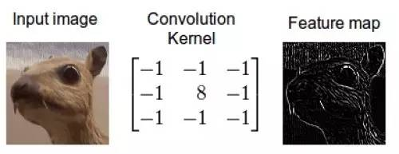

*边缘检测卷积核的效果*

这是怎么做到的呢，我们现在演示一下如何通过卷积来混合这两种信息。一种方法是从输入图片中取出一个与卷积核大小相同的区块——这里假设图片为 100×100，卷积核大小为 3×3，那么我们取出的区块大小就是 3×3——然后对每对相同位置的元素执行乘法后求和（不同于矩阵乘法，却类似向量内积，这里是两个相同大小的矩阵的「点乘」）。乘积的和就生成了 feature map 中的一个像素。当一个像素计算完毕后，移动一个像素取下一个区块执行相同的运算。当无法再移动取得新区块的时候对 feature map 的计算就结束了。这个流程可以用如下的动画演示：

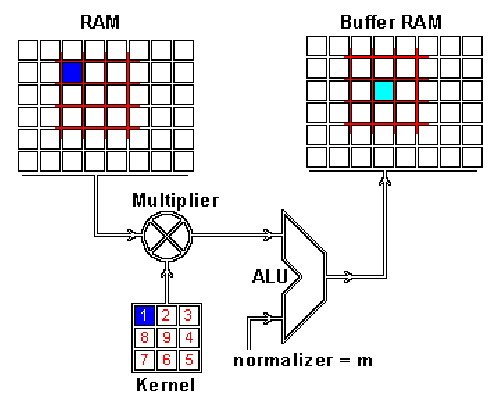

*RAM 是输入图片，Buffer 是 feature map*

你可能注意到这里有个正规化因子 m，这里 m 的值为 kernel 的大小 9；这是为了保证输入图像和 feature map 的亮度相同。

**为什么机器学习中图像卷积有用**

图像中可能含有很多我们不关心的噪音。一个好例子是我和 Jannek Thomas 在 Burda Bootcamp 做的项目。Burda Bootcamp 是一个让学生像黑客马拉松一样在非常短的时间内创造技术风暴的实验室。与 9 名同事一起，我们在 2 个月内做了 11 个产品出来。其中之一是针对时尚图像用深度编码器做的搜索引擎：你上传一幅时尚服饰的图片，编码器自动找出款式类似的服饰。

如果你想要区分衣服的式样，那么衣服的颜色就不那么重要了；另外像商标之类的细节也不那么重要。最重要的可能是衣服的外形。一般来讲，女装衬衫的形状与衬衣、夹克和裤子的外观非常不同。如果我们过滤掉这些多余的噪音，那我们的算法就不会因颜色、商标之类的细节分心了。我们可以通过卷积轻松地实现这项处理。

我的同事 Jannek Thomas 通过索贝尔边缘检测滤波器（与上上一幅图类似）去掉了图像中除了边缘之外的所有信息——这也是为什么卷积应用经常被称作滤波而卷积核经常被称作滤波器（更准确的定义在下面）的原因。由边缘检测滤波器生成的 feature map 对区分衣服类型非常有用，因为只有外形信息被保留下来。

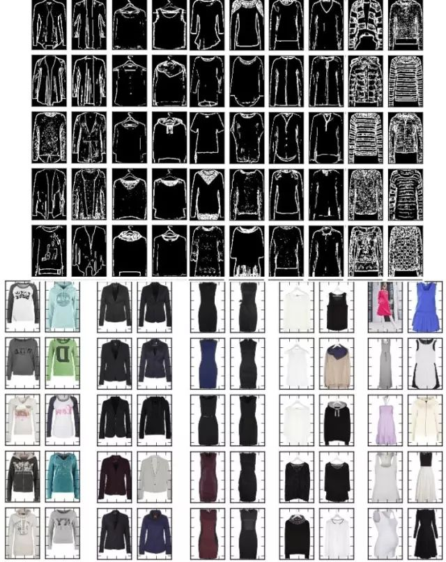

*彩图的左上角是搜索 query，其他是搜索结果，你会发现自动编码器真的只关注衣服的外形，而不是颜色。*

再进一步：有许多不同的核可以产生多种 feature map，比如锐化图像（强调细节），或者模糊图像（减少细节），并且每个 feature map 都可能帮助算法做出决策（一些细节，比如衣服上有 3 个纽扣而不是两个，可能可以区分一些服饰）。

使用这种手段——读入输入、变换输入、然后把 feature map 喂给某个算法——被称为特征工程。特征工程非常难，很少有资料帮你上手。造成的结果是，很少有人能熟练地在多个领域应用特征工程。特征工程是——纯手工——也是 Kaggle 比赛中最重要的技能。特征工程这么难的原因是，对每种数据每种问题，有用的特征都是不同的：图像类任务的特征可能对时序类任务不起作用；即使两个任务都是图像类的，也很难找出相同的有效特征，因为视待识别的物体的不同，有用的特征也不同。这非常依赖经验。

所以特征工程对新手来讲特别困难。不过对图像而言，是否可以利用卷积核自动找出某个任务中最适合的特征？

**进入卷积神经网络**

卷积神经网络就是干这个的。不同于刚才使用固定数字的卷积核，我们赋予参数给这些核，参数将在数据上得到训练。随着卷积神经网络的训练，这些卷积核为了得到有用信息，在图像或 feature map 上的过滤工作会变得越来越好。这个过程是自动的，称作特征学习。特征学习自动适配新的任务：我们只需在新数据上训练一下自动找出新的过滤器就行了。这是卷积神经网络如此强大的原因——不需要繁重的特征工程了！

通常卷积神经网络并不学习单一的核，而是同时学习多层级的多个核。比如一个 32x16x16 的核用到 256×256 的图像上去会产生 32 个 241×241（latex.png）的 feature map。所以自动地得到了 32 个有用的新特征。这些特征可以作为下个核的输入。一旦学习到了多级特征，我们简单地将它们传给一个全连接的简单的神经网络，由它完成分类。这就是在概念上理解卷积神经网络所需的全部知识了（池化也是个重要的主题，但还是在另一篇博客中讲吧）。

**第二部分：高级概念**

我们现在对卷积有了一个良好的初步认识，也知道了卷积神经网络在干什么、为什么它如此强大。现在让我们深入了解一下卷积运算中到底发生了什么。我们将认识到刚才对卷积的讲解是粗浅的，并且这里有更优雅的解释。通过深入理解，我们可以理解卷积的本质并将其应用到许多不同的数据上去。万事开头难，第一步是理解卷积原理。

卷积定理

要理解卷积，不得不提 convolution theorem，它将时域和空域上的复杂卷积对应到了频域中的元素间简单的乘积。这个定理非常强大，在许多科学领域中得到了广泛应用。卷积定理也是快速傅里叶变换算法被称为 20 世纪最重要的算法之一的一个原因。

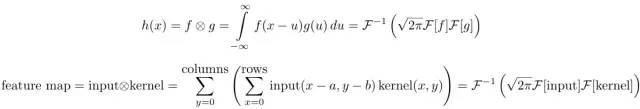

第一个等式是一维连续域上两个连续函数的卷积；第二个等式是二维离散域（图像）上的卷积。这里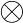指的是卷积，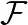指的是傅里叶变换，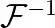表示傅里叶逆变换，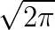是一个正规化常量。这里的「离散」指的是数据由有限个变量构成（像素）；一维指的是数据是一维的（时间），图像则是二维的，视频则是三维的。

为了更好地理解卷积定理，我们还需要理解数字图像处理中的傅里叶变换。

**快速傅里叶变换**

快速傅里叶变换是一种将时域和空域中的数据转换到频域上去的算法。傅里叶变换用一些正弦和余弦波的和来表示原函数。必须注意的是，傅里叶变换一般涉及到复数，也就是说一个实数被变换为一个具有实部和虚部的复数。通常虚部只在一部分领域有用，比如将频域变换回到时域和空域上；而在这篇博客里会被忽略掉。你可以在下面看到一个信号（一个以时间为参数的有周期的函数通常称为信号）是如何被傅里叶变换的：

*红色是时域，蓝色为频域*

你也许会说从没见过这些东西，但我敢肯定你在生活中是见过的：如果红色是一首音乐的话，那么蓝色值就是你在你的 MP3 播放器屏幕上看到的频谱：

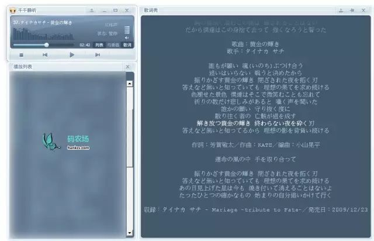

**傅里叶域上的图像**

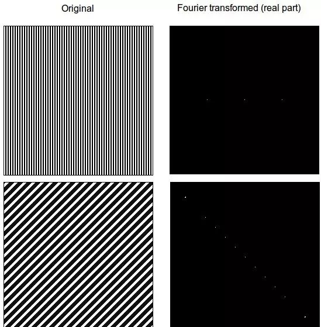

我们如何想象图片的频率呢？想象一张只有两种模式的纸片，现在把纸片竖起来顺着线条的方向看过去，就会看到一个一个的亮点。这些以一定间隔分割黑白部分的波就代表着频率。在频域中，低频率更接近中央而高频率更接近边缘。频域中高强度（亮度、白色）的位置代表着原始图像亮度改变的方向。这一点在接下来这张图与其对数傅里叶变换（对傅里叶变换的实部取对数，这样可以减小像素亮度的差别，便于观察更广的亮度区域）中特别明显：

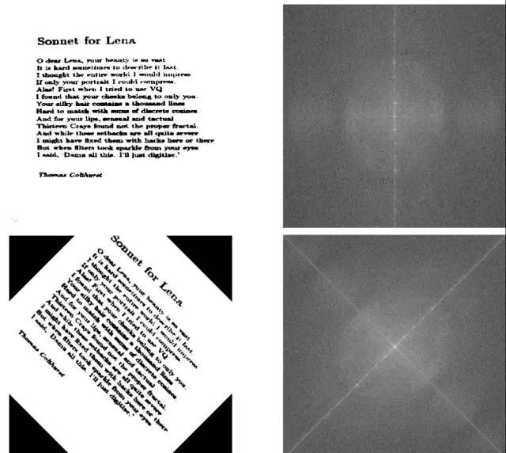

我们马上就可以发现傅里叶变换包含了关于物体朝向的信息。如果物体被旋转了一个角度，从图像像素上可能很难判断，但从频域上可以很明显地看出来。

这是个很重要的启发，基于傅里叶定理，我们知道卷积神经网络在频域上检测图像并且捕捉到了物体的方向信息。于是卷积神经网络就比传统算法更擅长处理旋转后的图像（虽然还是比不上人类）。

**频率过滤与卷积**

为什么卷积经常被描述为过滤，为什么卷积核经常被称为过滤器呢？通过下一个例子可以解释：

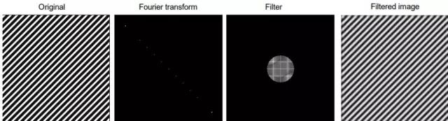

如果我们对图像执行傅里叶变换，并且乘以一个圆形（背景填充黑色，也就是 0），我们可以过滤掉所有的高频值（它们会成为 0，因为填充是 0）。注意过滤后的图像依然有条纹模式，但图像质量下降了很多——这就是 jpeg 压缩算法的工作原理（虽然有些不同但用了类似的变换），我们变换图形，然后只保留部分频率，最后将其逆变换为二维图片；压缩率就是黑色背景与圆圈的比率。

我们现在将圆圈想象为一个卷积核，然后就有了完整的卷积过程——就像在卷积神经网络中看到的那样。要稳定快速地执行傅里叶变换还需要许多技巧，但这就是基本理念了。

现在我们已经理解了卷积定理和傅里叶变换，我们可以将这些理念应用到其他科学领域，以加强我们对深度学习中的卷积的理解。

**流体力学的启发**

流体力学为空气和水创建了大量的微分方程模型，傅里叶变换不但简化了卷积，也简化了微分，或者说任何利用了微分方程的领域。有时候得到解析解的唯一方法就是对微分方程左右同时执行傅里叶变换。在这个过程中，我们常常将解写成两个函数卷积的形式，以得到更简单的表达。这是在一个维度上的应用，还有在两个维度上的应用，比如天文学。

**扩散**

你可以混合两种液体（牛奶和咖啡），只要施加一个外力（汤勺搅拌）——这被称为对流，而且是个很快的过程。你也可以耐心等待两种液体自然混合——这被称为扩散，通常是很慢的过程。

想象一下，一个鱼缸被一块板子隔开，两边各有不同浓度的盐水。抽掉板子后，两边的盐水会逐步混合为同一个浓度。浓度差越大，这个过程越剧烈。

现在想象一下，一个鱼缸被 256×256 个板子分割为 256×256 个部分（这个数字似乎不对），每个部分都有不同浓度的盐水。如果你去掉所有的挡板，浓度类似的小块间将不会有多少扩散，但浓度差异大的区块间有巨大的扩散。这些小块就是像素点，而浓度就是像素的亮度。浓度的扩散就是像素亮度的扩散。

这说明，扩散现象与卷积有相似点——初始状态下不同浓度的液体，或不同强度的像素。为了完成下一步的解释，我们还需要理解传播子。

**理解传播子**

传播子就是密度函数，表示流体微粒应该往哪个方向传播。问题是神经网络中没有这样的概率函数，只有一个卷积核——我们要如何统一这两种概念呢？

我们可以通过正规化来讲卷积核转化为概率密度函数。这有点像计算输出值的 softmax。下面就是对第一个例子中的卷积核执行的 softmax 结果：

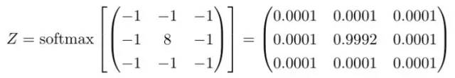

现在我们就可以从扩散的角度来理解图像上的卷积了。我们可以把卷积理解为两个扩散流程。首先，当像素亮度改变时（黑色到白色等）会发生扩散；然后某个区域的扩散满足卷积核对应的概率分布。这意味着卷积核正在处理的区域中的像素点必须按照这些概率来扩散。

在上面那个边缘检测器中，几乎所有临近边缘的信息都会聚集到边缘上（这在流体扩散中是不可能的，但这里的解释在数学上是成立的）。比如说所有低于 0.0001 的像素都非常可能流动到中间并累加起来。与周围像素区别最大的区域会成为强度的集中地，因为扩散最剧烈。反过来说，强度最集中的地方说明与周围对比最强烈，这也就是物体的边缘所在，这解释了为什么这个核是一个边缘检测器。

所以我们就得到了物理解释：卷积是信息的扩散。我们可以直接把这种解释运用到其他核上去，有时候我们需要先执行一个 softmax 正规化才能解释，但一般来讲核中的数字已经足够说明它想要干什么。比如说，你是否能推断下面这个核的的意图？

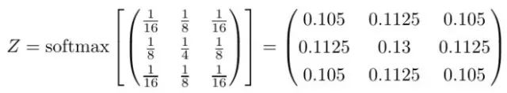

**等等，有点迷惑**

对一个概率化的卷积核，怎么会有确定的功能？我们必须根据核对应的概率分布也就是传播子来计算单个粒子的扩散不是吗？

是的，确实如此。但是，如果你取一小部分液体，比如一滴水，你仍然有几百万水分子。虽然单个分子的随机移动满足传播子，但大量的分子宏观上的表现是基本确定的。这是统计学上的解释，也是流体力学的解释。我们可以把传播子的概率分布解释为信息或说像素亮度的平均分布；也就是说我们的解释从流体力学的角度来讲是没问题的。话说回来，这里还有一个卷积的随机解释。

**量子力学的启发**

传播子是量子力学中的重要概念。在量子力学中，一个微粒可能处于一种叠加态，此时它有两个或两个以上属性使其无法确定位于观测世界中的具体位置。比如，一个微粒可能同时存在于两个不同的位置。

但是如果你测量微粒的状态——比如说现在微粒在哪里——它就只能存在于一个具体位置了。换句话说，你通过观测破坏了微粒的叠加态。传播子就描述了微粒出现位置的概率分布。比如说在测量后一个微粒可能——根据传播子的概率函数——30% 在 A，70% 在 B。

通过量子纠缠，几个粒子就可以同时储存上百或上百万个状态——这就是量子计算机的威力。

如果我们将这种解释用于深度学习，我们可以把图片想象为位于叠加态，于是在每个 3*3 的区块中，每个像素同时出现在 9 个位置。一旦我们应用了卷积，我们就执行了一次观测，然后每个像素就坍缩到满足概率分布的单个位置上了，并且得到的单个像素是所有像素的平均值。为了使这种解释成立，必须保证卷积是随机过程。这意味着，同一个图片同一个卷积核会产生不同的结果。这种解释没有显式地把谁比作谁，但可能启发你如何把卷积用成随机过程，或如何发明量子计算机上的卷积网络算法。量子算法能够在线性时间内计算出卷积核描述的所有可能的状态组合。

**概率论的启发**

卷积与互相关紧密相连。互相关是一种衡量小段信息（几秒钟的音乐片段）与大段信息（整首音乐）之间相似度的一种手段（youtube 使用了类似的技术检测侵权视频）。

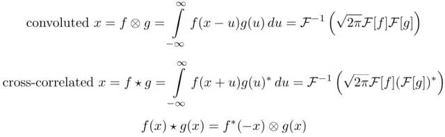

虽然互相关的公式看起来很难，但通过如下手段我们可以马上看到它与深度学习的联系。在图片搜索中，我们简单地将 query 图片上下颠倒作为核然后通过卷积进行互相关检验，结果会得到一张有一个或多个亮点的图片，亮点所在的位置就是人脸所在的位置。

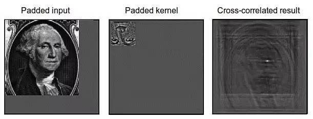

这个例子也展示了通过补零来使傅里叶变换稳定的一种技巧，许多版本的傅里叶变换都使用了这种技巧。另外还有使用了其他 padding 技巧：比如平铺核，分治等等。我不会展开讲，关于傅里叶变换的文献太多了，里面的技巧特别多——特别是对图像来讲。

在更底层，卷积网络第一层不会执行互相关校验，因为第一层执行的是边缘检测。后面的层得到的都是更抽象的特征，就有可能执行互相关了。可以想象这些亮点像素会传递给检测人脸的单元（Google Brain 项目的网络结构中有一些单元专门识别人脸、猫等等；也许用的是互相关？）

**统计学的启发**

统计模型和机器学习模型的区别是什么？统计模型只关心很少的、可以解释的变量。它们的目的经常是回答问题：药品 A 比药品 B 好吗？

机器学习模型是专注于预测效果的：对于年龄 X 的人群，药品 A 比 B 的治愈率高 17%，对年龄 Y 则是 23%。

机器学习模型通常比统计模型更擅长预测，但它们不是那么可信。统计模型更擅长得到准确可信的结果：就算药品 A 比 B 好 17%，我们也不知道这是不是偶然，我们需要统计模型来判断。

对时序数据，有两种重要的模型：weighted moving average 和 autoregressive 模型，后者可归入 ARIMA model (autoregressive integrated moving average model)。比起 LSTM，ARIMA 很弱。但在低维度数据（1-5 维）上，ARIMA 非常健壮。虽然它们有点难以解释，但 ARIMA 绝不是像深度学习算法那样的黑盒子。如果你需要一个可信的模型，这是个巨大的优势。

我们可以将这些统计模型写成卷积的形式，然后深度学习中的卷积就可以解释为产生局部 ARIMA 特征的函数了。这两种形式并不完全重合，使用需谨慎。

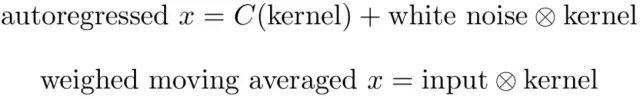

C 是一个以核为参数的函数，white noise 是正规化的均值为 0 方差为 1 的互不相关的数据。

当我们预处理数据的时候，经常将数据处理为类似 white noise 的形式：将数据移动到均值为 0，将方差调整为 1。我们很少去除数据的相关性，因为计算复杂度高。但是在概念上是很简单的，我们旋转坐标轴以重合数据的特征向量：

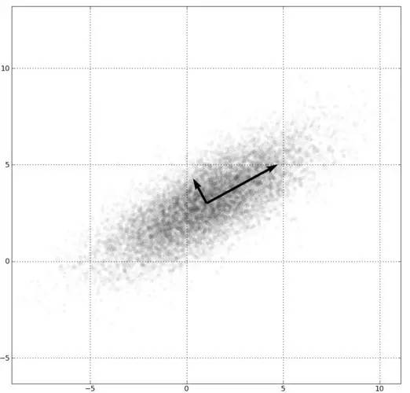

现在如果我们将 C 作为 bias，我们就会觉得这与卷积神经网络很像。所以卷积层的输出可被解释为白噪音数据经过 autoregressive model 的输出。

weighted moving average 的解释更简单：就是输入数据与某个固定的核的卷积。看看文末的高斯平滑核就会明白这个解释。高斯平滑核可以被看做每个像素与其邻居的平均，或者说每个像素被其邻居平均（边缘模糊）。

虽然单个核无法同时创建 autoregressive 和 weighted moving average 特征，但我们可以使用多个核来产生不同的特征。

**总结**

这篇博客中我们知道了卷积是什么、为什么在深度学习中这么有用。图片区块的解释很容易理解和计算，但有其理论局限性。我们通过学习傅里叶变换知道傅里叶变换后的时域上有很多关于物体朝向的信息。通过强大的卷积定理我们理解了卷积是一种在像素间的信息流动。之后我们拓展了量子力学中传播子的概念，得到了一个确定过程中的随机解释。我们展示了互相关与卷积的相似性，并且卷积网络的性能可能是基于 feature map 间的互相关程度的，互相关程度是通过卷积校验的。最后我们将卷积与两种统计模型关联了起来。

个人来讲，我觉得写这篇博客很有趣。曾经很长一段时间我都觉得本科的数学和统计课是浪费时间，因为它们太不实用了（哪怕是应用数学）。但之后——就像突然中大奖一样——这些知识都相互串起来了并且带了新的理解。我觉得这是个绝妙的例子，启示我们应该耐心地学习所有的大学课程——哪怕它们一开始看起来没有用。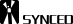

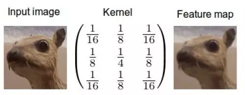

*上文高斯平滑核问题的答案*

**Reference**

*http://timdettmers.com/2015/03/26/convolution-deep-learning/ *

*R. B. Fisher, K. Koryllos,「Interactive Textbooks; Embedding Image Processing Operator Demonstrations in Text」, Int. J. of Pattern Recognition and Artificial Intelligence, Vol 12, No 8, pp 1095-1123, 1998.*

*原英文链接：http://timdettmers.com/2015/03/26/convolution-deep-learning/*

*码农场该文章链接：http://www.hankcs.com/ml/understanding-the-convolution-in-deep-learning.html*

******本文为机器之心转载，***转载请联系原作获得授权******。***

✄------------------------------------------------

**加入机器之心（全职记者/实习生）：hr@jiqizhixin.com**

**投稿或寻求报道：editor@jiqizhixin.com**

**广告&商务合作：bd@jiqizhixin.com**