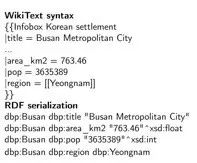
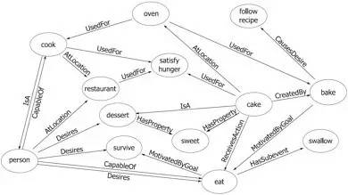
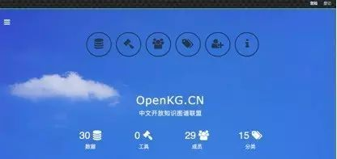
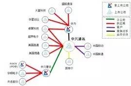
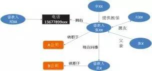

# 综述 | 知识图谱研究进展

机器之心转载

**公众号：PaperWeekly**

**作者：漆桂林、高桓、吴天星**

> *编者按：想要了解更多知识图谱的内容，可参考机器之心之前对漆桂林教授的专访文章**：*[*专访 | 东南大学漆桂林教授：知识图谱不仅是一项技术，更是一项工程*](http://mp.weixin.qq.com/s?__biz=MzA3MzI4MjgzMw==&mid=2650719022&idx=2&sn=6efb98d3650bd963122744b14b09e1d9&scene=21#wechat_redirect)

 *本文首先简要回顾知识图谱的历史，探讨知识图谱研究的意义。其次，介绍知识图谱构建的关键技术，包括实体关系识别技术、知识融合技术、实体链接技术和知识推理技术等。然后，给出现有开放的知识图谱数据集的介绍。最后，给出知识图谱在情报分析中的应用案例。

*— 漆桂林、高桓、吴天星*

*东南大学计算机科学与工程学院*

*本文节选自《情报工程》2017 年第 1 期，知识图谱专题稿件。*

## **1 知识图谱构建技术**

本节首先给出知识图谱的技术地图，然后介绍知识图谱构建的关键技术，包括关系抽取技术、知识融合技术、实体链接技术和知识推理技术。

## **1.1 知识图谱技术地图**

构建知识图谱的主要目的是获取大量的、让计算机可读的知识。在互联网飞速发展的今天，知识大量存在于非结构化的文本数据、大量半结构化的表格和网页以及生产系统的结构化数据中。为了阐述如何构建知识图谱，本文给出了构建知识图谱的技术地图，该技术地图如图 1 所示。整个技术图主要分为三个部分，第一个部分是知识获取，主要阐述如何从非结构化、半结构化、以及结构化数据中获取知识。第二部是数据融合，主要阐述如何将不同数据源获取的知识进行融合构建数据之间的关联。第三部分是知识计算及应用，这一部分关注的是基于知识图谱计算功能以及基于知识图谱的应用。

**1.1.1 知识获取**

在处理非结构化数据方面，首先要对用户的非结构化数据提取正文。目前的互联网数据存在着大量的广告，正文提取技术希望有效的过滤广告而只保留用户关注的文本内容。当得到正文文本后，需要通过自然语言技术识别文章中的实体，实体识别通常有两种方法，一种是用户本身有一个知识库则可以使用实体链接将文章中可能的候选实体链接到用户的知识库上。另一种是当用户没有知识库则需要使用命名实体识别技术识别文章中的实体。若文章中存在实体的别名或者简称还需要构建实体间的同义词表，这样可以使不同实体具有相同的描述。在识别实体的过程中可能会用到分词、词性标注，以及深度学习模型中需要用到分布式表达如词向量。同时为了得到不同粒度的知识还可能需要提取文中的关键词，获取文章的潜在主题等。当用户获得实体后，则需要关注实体间的关系，我们称为实体关系识别，有些实体关系识别的方法会利用句法结构来帮助确定两个实体间的关系，因此在有些算法中会利用依存分析或者语义解析。如果用户不仅仅想获取实体间的关系，还想获取一个事件的详细内容，那么则需要确定事件的触发词并获取事件相应描述的句子，同时识别事件描述句子中实体对应事件的角色。

在处理半结构化数据方面，主要的工作是通过包装器学习半结构化数据的抽取规则。由于半结构化数据具有大量的重复性的结构，因此对数据进行少量的标注，可以让机器学出一定的规则进而在整个站点下使用规则对同类型或者符合某种关系的数据进行抽取。最后当用户的数据存储在生产系统的数据库中时，需要通过 ETL 工具对用户生产系统下的数据进行重新组织、清洗、检测最后得到符合用户使用目的数据。

**1.1.2 知识融合**

当知识从各个数据源下获取时需要提供统一的术语将各个数据源获取的知识融合成一个庞大的知识库。提供统一术语的结构或者数据被称为本体，本体不仅提供了统一的术语字典，还构建了各个术语间的关系以及限制。本体可以让用户非常方便和灵活的根据自己的业务建立或者修改数据模型。通过数据映射技术建立本体中术语和不同数据源抽取知识中词汇的映射关系，进而将不同数据源的数据融合在一起。同时不同源的实体可能会指向现实世界的同一个客体，这时需要使用实体匹配将不同数据源相同客体的数据进行融合。不同本体间也会存在某些术语描述同一类数据，那么对这些本体间则需要本体融合技术把不同的本体融合。最后融合而成的知识库需要一个存储、管理的解决方案。知识存储和管理的解决方案会根据用户查询场景的不同采用不同的存储架构如 NoSQL 或者关系数据库。同时大规模的知识库也符合大数据的特征，因此需要传统的大数据平台如 Spark 或者 Hadoop 提供高性能计算能力，支持快速运算。

**1.1.2 知识计算及应用**

知识计算主要是根据图谱提供的信息得到更多隐含的知识，如通过本体或者规则推理技术可以获取数据中存在的隐含知识；而链接预测则可预测实体间隐含的关系；同时使用社会计算的不同算法在知识网络上计算获取知识图谱上存在的社区，提供知识间关联的路径；通过不一致检测技术发现数据中的噪声和缺陷。通过知识计算知识图谱可以产生大量的智能应用如可以提供精确的用户画像为精准营销系统提供潜在的客户；提供领域知识给专家系统提供决策数据，给律师、医生、公司 CEO 等提供辅助决策的意见；提供更智能的检索方式，使用户可以通过自然语言进行搜索；当然知识图谱也是问答必不可少的重要组建。

*图 1*  

从上图可以看出，知识图谱涉及到的技术非常多，每一项技术都需要专门去研究，而且已经有很多研究成果。由于篇幅的限制，本文重点介绍知识图谱构建和知识计算的几个核心技术。

## **1.2　实体关系识别技术**

最初实体关系识别任务在 1998 年 MUC（Message Understanding Conference）中以 MUC-7 任务被引入，目的是通过填充关系模板槽的方式抽去文本中特定的关系。1998 后，在 ACE（Automatic Content Extraction）中被定义为关系检测和识别的任务；2009 年 ACE 并入 TAC (Text Analysis Conference)，关系抽取被并入到 KBP（knowledgeBase Population）领域的槽填充任务。从关系任务定义上，分为限定领域（Close Domain）和开放领域（Open IE）；从方法上看，实体关系识别了从流水线识别方法逐渐过渡到端到端的识别方法。

基于统计学的方法将从文本中识别实体间关系的问题转化为分类问题。基于统计学的方法在实体关系识别时需要加入实体关系上下文信息确定实体间的关系，然而基于监督的方法依赖大量的标注数据，因此半监督或者无监督的方法受到了更多关注。

（1）监督学习：Zhou[13] 在 Kambhatla 的基础上加入了基本词组块信息和 WordNet，使用 SVM 作为分类器，在实体关系识别的准确率达到了 55.5%，实验表明实体类别信息的特征有助于提高关系抽取性能； Zelenko[14] 等人使用浅层句法分析树上最小公共子树来表达关系实例，计算两颗子树之间的核函数，通过训练例如 SVM 模型的分类器来对实例进行分。但基于核函数的方法的问题是召回率普遍较低，这是由于相似度计算过程匹配约束比较严格，因此在后续研究对基于核函数改进中，大部分是围绕改进召回率。但随着时间的推移，语料的增多、深度学习在图像和语音领域获得成功，信息抽取逐渐转向了基于神经模型的研究，相关的语料被提出作为测试标准，如 SemEval-2010 task 8[15]。基于神经网络方法的研究有，Hashimoto[16] 等人利用 Word Embedding 方法从标注语料中学习特定的名词对的上下文特征，然后将该特征加入到神经网络分类器中，在 SemEval-2010 task 8 上取得了 F1 值 82.8% 的效果。基于神经网络模型显著的特点是不需要加入太多的特征，一般可用的特征有词向量、位置等，因此有人提出利用基于联合抽取模型，这种模型可以同时抽取实体和其之间的关系。联合抽取模型的优点是可以避免流水线模型存在的错误累积[17-22]。其中比较有代表性的工作是[20]，该方法通过提出全新的全局特征作为算法的软约束，进而同时提高关系抽取和实体抽取的准确率，该方法在 ACE 语料上比传统的流水线方法 F1 提高了 1.5%，；另一项工作是 [22]，利用双层的 LSTM-RNN 模型训练分类模型，第一层 LSTM 输入的是词向量、位置特征和词性来识别实体的类型。训练得到的 LSTM 中隐藏层的分布式表达和实体的分类标签信息作为第二层 RNN 模型的输入，第二层的输入实体之间的依存路径，第二层训练对关系的分类，通过神经网络同时优化 LSTM 和 RNN 的模型参数，实验与另一个采用神经网络的联合抽取模型[21]相比在关系分类上有一定的提升。但无论是流水线方法还是联合抽取方法，都属于有监督学习，因此需要大量的训练语料，尤其是对基于神经网络的方法，需要大量的语料进行模型训练，因此这些方法都不适用于构建大规模的 Knowledge Base。

（2）半（弱）监督学习：半监督学习主要是利用少量的标注信息进行学习，这方面的工作主要是基于 Bootstrap 的方法。基于 Bootstrap 的方法主要是利用少量的实例作为初始种子的集合，然后利用 pattern 学习方法进行学习，通过不断的迭代，从非结构化数据中抽取实例，然后从新学到的实例中学习新的 pattern 并扩种 pattern 集合。Brin[23]等人通过少量的实例学习种子模板，从网络上大量非结构化文本中抽取新的实例，同时学习新的抽取模板，其主要贡献是构建了 DIPRE 系统；Agichtein[24]在 Brin 的基础上对新抽取的实例进行可信度的评分和完善关系描述的模式，设计实现了 Snowball 抽取系统；此后的一些系统都沿着 Bootstrap 的方法，但会加入更合理的对 pattern 描述、更加合理的限制条件和评分策略，或者基于先前系统抽取结果上构建大规模 pattern；如 NELL（Never-EndingLanguage Learner）系统[25-26]，NELL 初始化一个本体和种子 pattern，从大规模的 Web 文本中学习，通过对学习到的内容进行打分来提高准确率，目前已经获得了 280 万个事实。

（3）无监督学习： Bollegala[27]从搜索引擎摘要中获取和聚合抽取模板，将模板聚类后发现由实体对代表的隐含语义关系; Bollegala[28]使用联合聚类(Co-clustering)算法，利用关系实例和关系模板的对偶性，提高了关系模板聚类效果，同时使用 L1 正则化 Logistics 回归模型，在关系模板聚类结果中筛选出代表性的抽取模板，使得关系抽取在准确率和召回率上都有所提高。

无监督学习一般利用语料中存在的大量冗余信息做聚类，在聚类结果的基础上给定关系，但由于聚类方法本身就存在难以描述关系和低频实例召回率低的问题，因此无监督学习一般难以得很好的抽取效果。

## **1.3　知识融合技术**

知识融合（knowledge fusion）指的是将多个数据源抽取的知识进行融合。与传统数据融合（datafusion）[29]任务的主要不同是，知识融合可能使用多个知识抽取工具为每个数据项从每个数据源中抽取相应的值，而数据融合未考虑多个抽取工具[30]。由此，知识融合除了应对抽取出来的事实本身可能存在的噪音外，还比数据融合多引入了一个噪音，就是不同抽取工具通过实体链接和本体匹配可能产生不同的结果。另外，知识融合还需要考虑本体的融合和实例的融合。

文献[30]首先从已有的数据融合方法中挑选出易于产生有意义概率的、便于使用基于 MapReduce 框架的、有前途的最新方法，然后对这些挑选出的方法做出以下改进以用于知识融合：将每个抽取工具同每个信息源配对，每对作为数据融合任务中的一个数据源，这样就变成了传统的数据融合任务；改进已有数据融合方法使其输出概率，代替原来的真假二值；根据知识融合中的数据特征修改基于 MapReduce 的框架。文献[31]提出一个将通过不同搜索引擎得到的知识卡片（即结构化的总结）融合起来的方法。针对一个实体查询，不同搜索引擎可能返回不同的知识卡片，即便同一个搜索引擎也可能返回多个知识卡片。将这些知识卡片融合起来时，同文献[30]中提出的方法类似，将知识融合中的三维问题将为二维问题，再应用传统的数据融合技术。不过，文献[31]提出了一个新的概率打分算法，用于挑选一个知识卡片最有可能指向的实体，并设计了一个基于学习的方法来做属性匹配。

在知识融合技术中，本体匹配扮演着非常重要的角色，提供了概念或者实体之间的对应关系。截止目前，人们已经提出了各种各样的本体匹配算法，一般可以分为模式匹配（schema matching）和实例匹配（instance matching），也有少量的同时考虑模式和实例的匹配[32-34]。从技术层面来讲，本体匹配可分为启发式方法、概率方法、基于图的方法、基于学习的方法和基于推理的方法。下面围绕模式匹配和实例匹配，具体介绍各自分类中几个具有代表性的匹配方法。 

模式匹配主要寻找本体中属性和概念之间的对应关系，文献[35]和[36]给出比较详尽的综述。文献[37]提出一个自动的语义匹配方法，该方法首先利用像 WordNet 之类的词典以及本体的结构等信息进行模式匹配，然后将结果根据加权平均的方法整合起来，再利用一些模式（patterns）进行一致性检查，去除那些导致不一致的对应关系。该过程可循环的，直到不再找到新的对应关系为止。文献[38]也是考虑多种匹配算法的结合，利用基于术语的一些相似度计算算法，例如 n-gram 和编辑距离，这里算法计算的结果根据加权求和进行合并，还考虑了概念的层次关系和一些背景知识，最后通过用户定义的权重进行合并。为了应对大规模的本体，文献[39]提出一个使用锚（anchor）的系统，该系统以一对来自两个本体的相似概念为起点，根据这些概念的父概念和子概念等邻居信息逐渐地构建小片段，从中找出匹配的概念。新找出的匹配的概念对又可作为新的锚，然后再根据邻居信息构建新的片段。该过程不断地重复，直到未找到新的匹配概念对时停止。文献[40]则以分而治之的思想处理大规模本体，该方法先根据本体的结构对其进行划分获得组块，然后从不同本体获得的组块进行基于锚的匹配，这里的锚是指事先匹配好的实体对，最后再从匹配的组块中找出对应的概念和属性。现有的匹配方法通常是将多个匹配算法相结合，采用加权平均或加权求和的方式进行合并。但是，由于本体结构的不对称性等特征，这种固定的加权方法显出不足。文献[41]基于贝叶斯决策的风险最小化提出一个动态的合并方法，该方法可以根据本体的特征，在计算每个实体对的相似度时动态地选择使用哪几个匹配算法，如何合并这些算法，其灵活性带来了很好的匹配结果。

实例匹配是评估异构知识源之间实例对的相似度，用来判断这些实例是否指向给定领域的相同实体。最近几年，随着 Web 2.0 和语义 Web 技术的不断发展，越来越多的语义数据往往具有丰富实例和薄弱模式的特点，促使本体匹配的研究工作慢慢的从模式层转移到实例层[42]。文献[43]提出一个自训练的方法进行实例匹配，该方法首先根据 owl:sameAs、函数型属性（functional properties）和基数（cardinalities）构建一个核（kernel），再根据区别比较明显的属性值对递归的对该核进行扩展。文献[44]利用现有的局部敏感哈希（locality-sensitivehashing）技术来大幅提高实例匹配的可扩展性，该方法首先需要定义用于实例相似性分析的粒度，然后使用分割好的字符串技术实例相似度。文献[45]首先使用向量空间模型表示实例的描述性信息，再基于规则采用倒排索引（inverted indexes）获取最初的匹配候选，在使用用户定义的属性值对候选进行过滤，最后计算出的匹配候选相似度用来作为整合的向量距离，由此抽取出匹配结果。虽然已有方法中已有不少用于处理大规模本体的实例匹配问题，但是同时保证高效和高精度仍然是个很大的挑战。文献[46]提出了一个迭代的框架，充分利用特征明显的已有匹配方法来提高效率，同时基于相似度传播的方法利用一个加权指数函数来确保实例匹配的高精度。

## **1.4　实体链接技术**

歧义性和多样性是自然语言的固有属性，也是实体链接的根本难点。如何挖掘更多、更加有效的消歧证据，设计更高性能的消歧算法依然是实体链接系统的核心研究问题，值得进一步研究。下面按照不同的实体消歧方法进行分类。

基于概率生成模型方法：韩先培和孙乐[47]提出了一种生成概率模型，将候选实体 e 出现在某页面中的概率、特定实体 e 被表示为实体指称项的概率以及实体 e 出现在特定上下文中的概率三者相乘，得到候选实体同实体指称项之间的相似度评分值。Blanco 和 Ottaviano 等人[48]提出了用于搜索查询实体链接的概率模型，该方法采用了散列技术与上下文知识，有效地提高了实体链接的效率。

基于主题模型的方法：Zhang 等人[49]通过模型自动对文本中的实体指称进行标注，生成训练数据集用于训练 LDA 主题模型，然后计算实体指称和候选实体的上下文语义相似度从而消歧得到目标实体。王建勇等人[50]提出了对用户的兴趣主题建模的方法，首先构建关系图，图中包含了不同命名实体间的相互依赖关系，然后利用局部信息对关系图中每个命名实体赋予初始兴趣值，最后利用传播算法对不同命名实体的兴趣值进行传播得到最终兴趣值，选择具有最高兴趣值的候选实体。

基于图的方法：Han 等人[51]构造了一种基于图的模型，其中图节点为所有实体指称和所有候选实体；图的边分为两类，一类是实体指称和其对应的候选实体之间的边，权重为实体指称和候选实体之间的局部文本相似度，采用词袋模型和余弦距离计算得出。另一类是候选实体之间的边，权重为候选实体之间的语义相关度，采用谷歌距离计算。算法首先采集不同实体的初始置信度，然后通过图中的边对置信度进行传播和增强。Gentile 和 Zhang[52]等人提出了基于图和语义关系的命名实体消歧方法，该方法在维基百科上建立基于图的模型，然后在该模型上计算各个命名实体的得分从而确定了目标实体，该方法在新闻数据上取得了较高的准确率。Alhelbawy 等人[53]也采用基于图的方法，图中的节点为所有的候选实体，边采用两种方式构建，一种是实体之间的维基百科链接，另一种是使用实体在维基百科文章中句子的共现。图中的候选实体节点通过和实体指称的相似度值被赋予初始值，采用 PageRank 选择目标实体。Hoffart 等人[54]使用实体的先验概率，实体指称和候选实体的上下文相似度，以及候选实体之间的内聚性构成一个加权图，从中选择出一个候选实体的密集子图作为最可能的目标实体分配给实体指称。

基于深度神经网络的方法：周明和王厚峰等人[55]提出了一种用于实体消歧的实体表示训练方法。该方法对文章内容进行自编码，利用深度神经网络模型以有监督的方式训练实体表示，依据语义表示相似度对候选实体进行排序，但该方法是一种局部性方法，没有考虑同一文本中共同出现的实体间相关性。黄洪钊和季姮等人[56]基于深度神经网络和语义知识图谱，提出了一种基于图的半监督实体消歧义方法，将深度神经网络模型得到的实体间语义关联度作为图中的边权值。从实验结果得出：基于语义知识图谱的 NGD 和 VSM[57]方法比起 Wikipedia anchor links 无论在关联性测试上还是在消歧性能上都具有更好的测试结果。相比 NGD 和 VSM，基于 DNN[58]的深度语义关联方法在关联性测试上还是在消歧性能上都具有更好的关联性和更高的准确性。但该方法存在两点不足，一方面在构建深度语义关联模型时采用词袋子方法，没有考虑上下文词之间位置关系，另外一方面在消歧的过程中，构建的图模型没有充分利用已消歧实体，边权值和顶点得分随着未消歧实体增加保持不变，并没有为后续的歧义实体增加信息量。

## **1.5　知识推理技术**

知识库推理可以粗略地分为基于符号的推理和基于统计的推理。在人工智能的研究中，基于符号的推理一般是基于经典逻辑（一阶谓词逻辑或者命题逻辑）或者经典逻辑的变异（比如说缺省逻辑）。基于符号的推理可以从一个已有的知识图谱，利用规则，推理出新的实体间关系，还可以对知识图谱进行逻辑的冲突检测。基于统计的方法一般指关系机器学习方法，通过统计规律从知识图谱中学习到新的实体间关系。

**1.5.1 基于符号逻辑的推理方法**

为了使得语义网络同时具备形式化语义和高效推理，一些研究人员提出了易处理（tractable）概念语言，并且开发了一些商用化的语义网络系统。这些系统的提出，使得针对概念描述的一系列逻辑语言，统称描述逻辑（description logic），得到了学术界和业界广泛关注。但是这些系统的推理效率难以满足日益增长的数据的需求，最终没能得到广泛应用。这一困局被利物浦大学的 Ian Horrocks 教授打破，他开发的 FaCT 系统可以处理一个比较大的医疗术语本体 GALEN，而且性能比其他类似的推理机要好得多。描述逻辑最终成为了 W3C 推荐的 Web 本体语言 OWL 的逻辑基础。

虽然描述逻辑推理机的优化取得了很大的进展，但是还是跟不上数据增长的速度，特别是当数据规模大到目前的基于内存的服务器无法处理的情况下。为了应对这一挑战，最近几年，研究人员开始考虑将描述逻辑和 RDFS 的推理并行来提升推理的效率和可扩展性，并且取得了很多成果。并行推理工作所借助的并行技术分为以下两类：1）单机环境下的多核、多处理器技术，比如多线程，GPU 技术等；2）多机环境下基于网络通信的分布式技术，比如 MapReduce 计算框架、Peer-To-Peer 网络框架等。很多工作尝试利用这些技术实现高效的并行推理。

单机环境下的并行技术以共享内存模型为特点，侧重于提升本体推理的时间效率。对于实时性要求较高的应用场景，这种方法成为首选。对于表达能力较低的语言，比如 RDFS、OWL EL，单机环境下的并行技术将显著地提升本体推理效率。Goodman 等人在[59]中利用高性能计算平台 Cray XMT 实现了大规模的 RDFS 本体推理，利用平台计算资源的优势限制所有推理任务在内存完成。然而对于计算资源有限的平台，内存使用率的优化成为了不可避免的问题。Motik 等人在[60]工作中将 RDFS，以及表达能力更高的 OWL RL 等价地转换为 Datalog 程序，然后利用 Datalog 中的并行优化技术来解决内存的使用率问题。在[61]中，作者尝试利用并行与串行的混合方法来提升 OWL RL 的推理效率。Kazakov 等人在 [62]中提出了利用多线程技术实现 OWL EL 分类(classification)的方法，并实现推理机 ELK。

尽管单机环境的推理技术可以满足高推理性能的需求，但是由于计算资源有限（比如内存，存储容量），推理方法的可伸缩性（scalability）受到不同程度的限制。因此，很多工作利用分布式技术突破大规模数据的处理界限。这种方法利用多机搭建集群来实现本体推理。

Mavin[63]是首个尝试利用 Peer-To-Peer 的分布式框架实现 RDF 数据推理的工作。实验结果表明，利用分布式技术可以完成很多在单机环境下无法完成的大数据量推理任务。很多工作基于 MapReduce 的开源实现（如 Hadoop，Spark 等）设计提出了大规模本体的推理方法。其中较为成功的一个尝试是 Urbani 等人在 2010 年公布的推理系统 WebPIE [64]。实验结果证实其在大集群上可以完成上百亿的 RDF 三元组的推理。他们又在这个基础上研究提出了基于 MapReduce 的 OWL RL 查询算法[65]。利用 MapReduce 来实现 OWL EL 本体的推理算法在 [66]中提出，实验证明 MapReduce 技术同样可以解决大规模的 OWL EL 本体推理。在[67]的工作中，进一步扩展 OWL EL 的推理技术，使得推理可以在多个并行计算平台完成。

**1.5.2 基于统计的推理方法**

知识图谱中基于统计的推理方法一般指关系机器学习方法。下面介绍一些典型的方法。

**实体关系学习方法**

实体关系学习的目的是学习知识图谱中实例和实例之间的关系。这方面的工作非常多，也是最近几年知识图谱的一个比较热的研究方向。按照文献[68]的分类，可以分为潜在特征模型和图特征模型两种。潜在特征模型通过实例的潜在特征来解释三元组。比如说，莫言获得诺贝尔文学奖的一个可能解释是他是一个有名的作家。Nickel 等人在[69]中给出了一个关系潜在特征模型，称为双线性（bilinear）模型，该模型考虑了潜在特征的两两交互来学习潜在的实体关系。Drumond 等人在[70]中应用两两交互的张量分解模型来学习知识图谱中的潜在关系。

翻译（translation）模型[71]将实体与关系统一映射至低维向量空间中，且认为关系向量中承载了头实体翻译至尾实体的潜在特征。因此，通过发掘、对比向量空间中存在类似潜在特征的实体向量对，我们可以得到知识图谱中潜在的三元组关系。全息嵌入（Holographic Embedding，HolE）模型[72]分别利用圆周相关计算三元组的组合表示及利用圆周卷积从组合表示中恢复出实体及关系的表示。与张量分解模型类似，HolE 可以获得大量的实体交互来学习潜在关系，而且有效减少了训练参数，提高了训练效率。

基于图特征模型的方法从知识图谱中观察到的三元组的边的特征来预测一条可能的边的存在。典型的方法有基于基于归纳逻辑程序（ILP）的方法[73]，基于关联规则挖掘（ARM）的方法[74]和路径排序（path ranking）的方法[75]。基于 ILP 的方法和基于 ARM 的方法的共同之处在于通过挖掘的方法从知识图谱中抽取一些规则，然后把这些规则应用到知识图谱上，推出新的关系。而路径排序方法则是根据两个实体间连通路径作为特征来判断两个实体是否属于某个关系。

**类型推理（typeinference）方法**

知识图谱上的类型推理目的是学习知识图谱中的实例和概念之间的属于关系。SDType[76]利用三元组主语或谓语所连接属性的统计分布以预测实例的类型。该方法可以用在任意单数据源的知识图谱，但是无法做到跨数据集的类型推理。Tipalo[77]与 LHD[78]均使用 DBpedia 中特有的 abstract 数据，利用特定模式进行实例类型的抽取。此类方法依赖于特定结构的文本数据，无法扩展到其他知识库。

**模式归纳（schemainduction）方法**

模式归纳方法学习概念之间的关系，主要有基于 ILP 的方法和基于 ARM 的方法。ILP 结合了机器学习和逻辑编程技术，使得人们可以从实例和背景知识中获得逻辑结论。Lehmann 等在[79]中提出用向下精化算子学习描述逻辑的概念定义公理的方法，即从最一般的概念（即顶概念）开始，采用启发式搜索方法使该概念不断特殊化，最终得到概念的定义。为了处理像 DBpedia 这样大规模的语义数据，该方法在[80]中得到进一步的扩展。这些方法都在 DL-Learner[81]中得以实现。Völker 等人在[82]中介绍了从知识图谱中生成概念关系的统计方法，该方法通过 SPARQL 查询来获取信息，用以构建事务表。然后使用 ARM 技术从事务表中挖掘出一些相关联的概念关系。在他们的后续工作中，使用负关联规则挖掘技术学习不交概念关系[83]，并在文献[84]中给出了丰富的试验结果。

## **2 开放知识图谱**

本节首先介绍当前世界范围内知名的高质量大规模开放知识图谱，包括 DBpedia[85][86]、Yago[87][88]、Wikidata[89]、BabelNet[90][91]、ConceptNet[92][93]以及 Microsoft Concept Graph[94][95]等。然后介绍中文开放知识图谱平台 OpenKG。

**2.1 开放知识图谱**

DBpedia 是一个大规模的多语言百科知识图谱，可视为是维基百科的结构化版本。DBpedia 使用固定的模式对维基百科中的实体信息进行抽取，包括 abstract、infobox、category 和 page link 等信息。图 2 示例了如何将维基百科中的实体“Busan”的 infobox 信息转换成 RDF 三元组。DBpedia 目前拥有 127 种语言的超过两千八百万个实体与数亿个 RDF 三元组，并且作为链接数据的核心，与许多其他数据集均存在实体映射关系。而根据抽样评测[96]，DBpedia 中 RDF 三元组的正确率达 88%。DBpedia 支持数据集的完全下载。

Yago 是一个整合了维基百科与 WordNet[97]的大规模本体，它首先制定一些固定的规则对维基百科中每个实体的 infobox 进行抽取，然后利用维基百科的 category 进行实体类别推断（Type Inference）获得了大量的实体与概念之间的 IsA 关系（如：“Elvis Presley” IsA “American Rock Singers”），最后将维基百科的 category 与 WordNet 中的 Synset（一个 Synset 表示一个概念）进行映射，从而利用了 WordNet 严格定义的 Taxonomy 完成大规模本体的构建。随着时间的推移，Yago 的开发人员为该本体中的 RDF 三元组增加了时间与空间信息，从而完成了 Yago2[98]的构建，又利用相同的方法对不同语言维基百科的进行抽取，完成了 Yago3[99]的构建。目前，Yago 拥有 10 种语言约 459 万个实体，2400 万个 Facts，Yago 中 Facts 的正确率约为 95%。Yago 支持数据集的完全下载。

*图 2*

Wikidata 是一个可以自由协作编辑的多语言百科知识库，它由维基媒体基金会发起，期望将维基百科、维基文库、维基导游等项目中结构化知识进行抽取、存储、关联。Wikidata 中的每个实体存在多个不同语言的标签，别名，描述，以及声明（statement），比如 Wikidata 会给出实体“London”的中文标签“伦敦”，中文描述“英国首都”以及图 3 给出了一个关于“London”的声明的具体例子。“London”的一个声明由一个 claim 与一个 reference 组成，claim 包括 property:“Population”、value:“8173900”以及一些 qualifiers（备注说明）组成，而 reference 则表示一个 claim 的出处，可以为空值。目前 Wikidata 目前支持超过 350 种语言，拥有近 2500 万个实体及超过 7000 万的声明[100]，并且目前 Freebase 正在往 Wikidata 上进行迁移以进一步支持 Google 的语义搜索。Wikidata 支持数据集的完全下载。

*图 3 *

BabelNet 是目前世界范围内最大的多语言百科同义词典，它本身可被视为一个由概念、实体、关系构成的语义网络（Semantic Network）。BabelNet 目前有超过 1400 万个词目，每个词目对应一个 synset。每个 synset 包含所有表达相同含义的不同语言的同义词。比如：“中国”、“中华人民共和国”、“China”以及“people’srepublic of China”均存在于一个 synset 中。BabelNet 由 WordNet 中的英文 synsets 与维基百科页面进行映射，再利用维基百科中的跨语言页面链接以及翻译系统，从而得到 BabelNet 的初始版本。目前 BabelNet 又整合了 Wikidata、GeoNames、OmegaWiki 等多种资源，共拥有 271 个语言版本。由于 BabelNet 中的错误来源主要在于维基百科与 WordNet 之间的映射，而映射目前的正确率大约在 91%。关于数据集的使用，BabelNet 目前支持 HTTP API 调用，而数据集的完全下载需要经过非商用的认证后才能完成。

ConceptNet 是一个大规模的多语言常识知识库，其本质为一个以自然语言的方式描述人类常识的大型语义网络。ConceptNet 起源于一个众包项目 Open Mind Common Sense，自 1999 年开始通过文本抽取、众包、融合现有知识库中的常识知识以及设计一些游戏从而不断获取常识知识。ConceptNet 中共拥有 36 种固定的关系，如 IsA、UsedFor、CapableOf 等，图 4 给出了一个具体的例子，从中可以更加清晰地了解 ConceptNet 的结构。ConceptNet 目前拥有 304 个语言的版本，共有超过 390 万个概念，2800 万个声明（statements，即语义网络中边的数量），正确率约为 81%。另外，ConceptNet 目前支持数据集的完全下载。

*图 4*

Microsoft Concept Graph 是一个大规模的英文 Taxonomy，其中主要包含的是概念间以及实例（等同于上文中的实体）概念间的 IsA 关系，其中并不区分 instanceOf 与 subclassOf 关系。Microsoft Concept Graph 的前身是 Probase，它过自动化地抽取自数十亿网页与搜索引擎查询记录，其中每一个 IsA 关系均附带一个概率值，即该知识库中的每个 IsA 关系不是绝对的，而是存在一个成立的概率值以支持各种应用，如短文本理解、基于 taxonomy 的关键词搜索和万维网表格理解等。目前，Microsoft Concept Graph 拥有约 530 万个概念，1250 万个实例以及 8500 万个 IsA 关系（正确率约为 92.8%）。关于数据集的使用，MicrosoftConcept Graph 目前支持 HTTP API 调用，而数据集的完全下载需要经过非商用的认证后才能完成。

除了上述知识图谱外，中文目前可用的大规模开放知识图谱有 Zhishi.me[101]、Zhishi.schema[102]与 XLore[103]等。Zhishi.me 是第一份构建中文链接数据的工作，与 DBpedia 类似，Zhishi.me 首先指定固定的抽取规则对百度百科、互动百科和中文维基百科中的实体信息进行抽取，包括 abstract、infobox、category 等信息；然后对源自不同百科的实体进行对齐，从而完成数据集的链接。目前 Zhishi.me 中拥有约 1000 万个实体与一亿两千万个 RDF 三元组，所有数据可以通过在线 SPARQL Endpoint 查询得到。Zhishi.schema 是一个大规模的中文模式（Schema）知识库，其本质是一个语义网络，其中包含三种概念间的关系，即 equal、related 与 subClassOf 关系。Zhishi.schema 抽取自社交站点的分类目录(Category Taxonomy)及标签云（Tag Cloud），目前拥有约 40 万的中文概念与 150 万 RDF 三元组，正确率约为 84%，并支持数据集的完全下载。XLore 是一个大型的中英文知识图谱，它旨在从各种不同的中英文在线百科中抽取 RDF 三元组，并建立中英文实体间的跨语言链接。目前，XLore 大约有 66 万个概念，5 万个属性，1000 万的实体，所有数据可以通过在线 SPARQL Endpoint 查询得到。

**2.2 中文开放知识图谱联盟介绍**

中文开放知识图谱联盟（OpenKG）旨在推动中文知识图谱的开放与互联，推动知识图谱技术在中国的普及与应用，为中国人工智能的发展以及创新创业做出贡献。联盟已经搭建有 OpenKG.CN 技术平台，如图 5 所示，目前已有 35 家机构入驻。吸引了国内最著名知识图谱资源的加入，如 Zhishi.me， CN-DBPedia, PKUBase。并已经包含了来自于常识、医疗、金融、城市、出行等 15 个类目的开放知识图谱。

*图 5 中文开放知识图谱联盟*

## **3 知识图谱在情报分析的案例**

## **3.1 股票投研情报分析**

通过知识图谱相关技术从招股书、年报、公司公告、券商研究报告、新闻等半结构化表格和非结构化文本数据中批量自动抽取公司的股东、子公司、供应商、客户、合作伙伴、竞争对手等信息，构建出公司的知识图谱。在某个宏观经济事件或者企业相关事件发生的时候，券商分析师、交易员、基金公司基金经理等投资研究人员可以通过此图谱做更深层次的分析和更好的投资决策，比如在美国限制向中兴通讯出口的消息发布之后，如果我们有中兴通讯的客户供应商、合作伙伴以及竞争对手的关系图谱，就能在中兴通讯停牌的情况下快速地筛选出受影响的国际国内上市公司从而挖掘投资机会或者进行投资组合风险控制（图 6）。

*图 6 股票投研情报分析*

## **3.2 公安情报分析**

通过融合企业和个人银行资金交易明细、通话、出行、住宿、工商、税务等信息构建初步的“资金账户-人-公司”关联知识图谱。同时从案件描述、笔录等非结构化文本中抽取人(受害人、嫌疑人、报案人)、事、物、组织、卡号、时间、地点等信息，链接并补充到原有的知识图谱中形成一个完整的证据链。辅助公安刑侦、经侦、银行进行案件线索侦查和挖掘同伙。比如银行和公安经侦监控资金账户，当有一段时间内有大量资金流动并集中到某个账户的时候很可能是非法集资，系统触发预警（图 7）。

*图 7 公安情报分析*

## **3.3 反欺诈情报分析**

通过融合来自不同数据源的信息构成知识图谱，同时引入领域专家建立业务专家规则。我们通过数据不一致性检测，利用绘制出的知识图谱可以识别潜在的欺诈风险。比如借款人张 xx 和借款人吴 x 填写信息为同事，但是两个人填写的公司名却不一样, 以及同一个电话号码属于两个借款人，这些不一致性很可能有欺诈行为 （图 8）。

*图 8 反欺诈情报分析*

## **4 总结**

知识图谱是知识工程的一个分支，以知识工程中语义网络作为理论基础，并且结合了机器学习，自然语言处理和知识表示和推理的最新成果，在大数据的推动下受到了业界和学术界的广泛关注。知识图谱对于解决大数据中文本分析和图像理解问题发挥重要作用。目前，知识图谱研究已经取得了很多成果，形成了一些开放的知识图谱。但是，知识图谱的发展还存在以下障碍。首先，虽然大数据时代已经产生了海量的数据，但是数据发布缺乏规范，而且数据质量不高，从这些数据中挖掘高质量的知识需要处理数据噪音问题。其次，垂直领域的知识图谱构建缺乏自然语言处理方面的资源，特别是词典的匮乏使得垂直领域知识图谱构建代价很大。最后，知识图谱构建缺乏开源的工具，目前很多研究工作都不具备实用性，而且很少有工具发布。通用的知识图谱构建平台还很难实现。 

## *参考文献和完整原文阅读链接：http://tie.istic.ac.cn/ch/reader/view_abstract.aspx?file_no=201701002&flag=1&from=timeline&isappinstalled=0*

******本文为机器之心经授权转载，***转载请联系本公众号获得授权******。***

✄------------------------------------------------

**加入机器之心（全职记者/实习生）：hr@jiqizhixin.com**

**投稿或寻求报道：editor@jiqizhixin.com**

**广告&商务合作：bd@jiqizhixin.com***