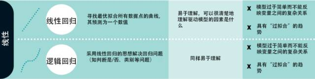
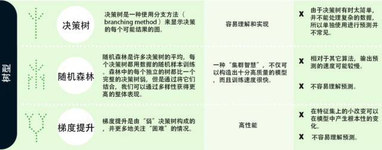
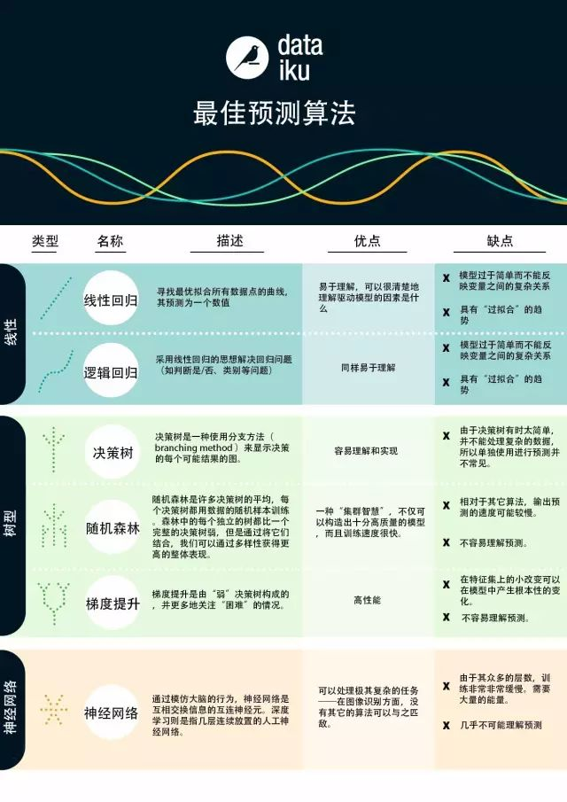

# 盘点 | 机器学习入门算法：从线性模型到神经网络

选自 Dataconomy

**机器之心编译**

**参与：王宇欣、吴攀、蒋思源**

近段时间以来，我们频频听到「机器学习（machine learning）」这个词（通常在预测分析（predictive analysis）和人工智能（artificial intelligence）的上下文中）。几十年来，机器学习实际上已经变成了一门独立的领域。由于现代计算能力的进步，我们最近才能够真正大规模地利用机器学习。而实际上机器学习是如何工作的呢？答案很简单：算法（algorithm）。

机器学习是人工智能（artificial intelligence）的一种，其本质上讲，就是计算机可以在无需编程的情况下自己学习概念（concept）。这些计算机程序一旦接触新的数据，就将会改变它们的「思考」（或者输出）。为了实现机器学习，算法是必需的。算法被写入计算机并在其剖析数据时给与其需要遵循的规则。

机器学习算法经常被用于预测分析。在商业中，预测分析可以用于告诉企业未来最有可能发生什么。例如，使用预测分析算法，在线 T 恤零售商可以使用当前的数据来预测下个月他们将会售出多少 T 恤。

**回归或分类**

虽然机器学习也可以用于其它的用途，但是我们将在本指南中着重于预测。预测是一种基于输入变量来估计输出变量的过程。比如，如果我们输入特定房子的特征，则可以预测售价。

预测问题分为两大类：

*   回归问题（Regression Problems）：我们想要预测的变量是数字（例如，房子的价格）

*   分类问题（Classification Problems）：我们想要预测的变量是「是/否」的答案（例如，某一设备是否会经历设备故障）

现在我们已经介绍了机器学习在预测方面的应用，我们可以讨论机器学习算法，其分为 3 个组别：线性模型（linear models）、树型模型（tree-based models）、和神经网络（neural networks）。

**什么是线性模型算法**

线性模型使用简单的公式通过一组数据点来查找「最优拟合」线。通过你已知的变量方程（比如，原料），你可以求出你想要预测的变量（例如，烘烤蛋糕需要多长时间）。为了求出预测量，我们输入已知的变量得到答案。换句话说，为了求出烘烤蛋糕需要多长时间，我们只需要输入原料。

例如，要烘烤蛋糕，分析过后我们得到这个方程：t = 0.5x + 0.25y，其中 t 烤蛋糕的时间，x 为蛋糕糊的重量，y = 1 表示为巧克力蛋糕而 0 表示为非巧克力蛋糕。所以让我们假设，我们有 1kg 的蛋糕糊并且我们想要一个巧克力蛋糕，我们输入我们的数字来建立这个方程：t = 0.5(1) + (0.25)(1) = 0.75，即 45 分钟。

有不同形式的线性模型算法，我们将要讨论线性回归（linear regression）和逻辑回归（logistic regression）。

**线性回归**

线性回归，也称为「最小二乘回归（least squares regression）」，是线性模型的最标准的形式。对于回归问题（我们设法预测的变量是数字），线性回归是最简单的线性模型。

**逻辑回归**

逻辑回归是为分类问题进行简单调整过的线性回归（我们设法预测的变量是「是/否」的答案）。由于其构造，逻辑回归非常适合于分类问题

**线性回归和逻辑回归的缺点**

线性回归和逻辑回归都有着相同的缺点。两者都具有「过拟合（overfit）」的趋势，这意味着模型太适应于数据而牺牲了推广到先前未知的数据的能力。因此，这两个模型经常需要进行规范，这意味着它们有一定的惩罚（penalty）以防止过拟合。另一个线性模型的缺点是，因为它们太简单了，所以往往不能预测更复杂的行为。

**什么是树型模型**

树型模型有助于探索数据集，并可视化预测的决策规则。当你听到关于树型模型的东西时，你可以将其想成是决策树或分支操作序列。树型模型高度精确、稳定且更易于解释。与线性模型相反，它们可以映射非线性关系以求解问题。

**决策树（decision tree）**

决策树是一种使用分支方法（branching method）来显示决策的每个可能结果的图。例如，如果你想要订购莴苣、浇头和沙拉酱，决策树可以绘制出所有可能的结果（或者你可能最终得到的沙拉的品种）。

为了创建或者训练决策树，我们采用我们过去训练模型的数据，并找出哪些属性可以最佳分割目标训练集。

例如，我们在信用卡欺诈中使用决策树。我们可以发现最佳的欺诈风险预测的属性是消费明细（例如，有信用卡用户有非常大的消费）。这可能是第一次分割（或分支）——那些有着异常高消费的卡和没有的卡。然后我们使用第二个最佳属性（例如，经常使用的信用卡）来创建下一次分割。然后我们可以继续直到我们有足够的属性来满足我们的需要。

**随机森林（random forest）**

随机森林是许多决策树的平均，每个决策树都用数据的随机样本训练。森林中的每个独立的树都比一个完整的决策树弱，但是通过将它们结合，我们可以通过多样性获得更高的整体表现。

随机森林是当今机器学习中非常流行的算法。它非常容易训练（或构建），且它往往表现良好。它的缺点是，相比于其他算法，其输出预测可能较慢。所以当你需要快如闪电般地预测，你也许不会使用它。

**梯度提升（gradient boosting）**

梯度提升和随机森林类似，都是由「弱」决策树构成的。最大的区别是，在梯度提升中树是被一个接一个相继训练的。每个随后的树主要用被先前树错误识别的数据进行训练。这使得梯度提升更少地集中在容易预测的情况并更多地集中在困难的情况。

梯度提升训练速度也很快且表现非常好。然而，训练数据的小变化可以在模型中产生彻底的改变，因此它可能不会产生最可解释的结果。

**什么是神经网络**

生物学中的神经网络是互相交换信息的相互连接的神经元。这个想法现在已经适用于机器学习的世界，并被称为人工神经网络（ANN）。深度学习（deep learning）是一个经常出现的词，是指几层连续放置的人工神经网络。

人工神经网络（ANN）包含了许多可以学习类似人脑的认知能力的模型。其它算法不能处理的极其复杂的任务（如图像识别），神经网络就可以办到。然而，就像人类的大脑，它需要很长时间来训练模型，且需要很多的能量（想一想我们为了保持大脑的工作，我们吃了多少东西）。 

*原文地址：**http://dataconomy.com/2017/03/beginners-guide-machine-learning*

******©本文为机器之心编译，***转载请联系本公众号获得授权******。***

✄------------------------------------------------

**加入机器之心（全职记者/实习生）：hr@jiqizhixin.com**

**投稿或寻求报道：editor@jiqizhixin.com**

**广告&商务合作：bd@jiqizhixin.com**