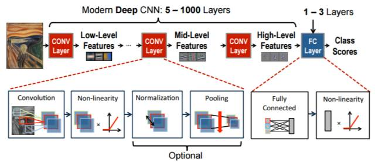
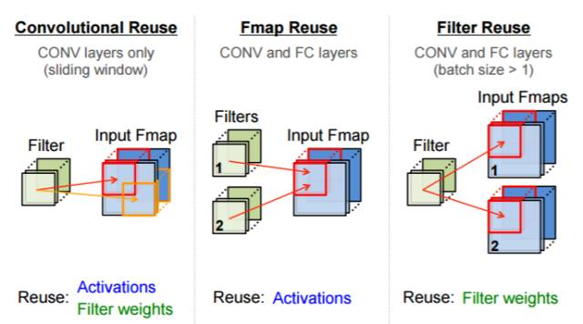

# 深度神经网络全面概述：从基本概念到实际模型和硬件基础

选自 arxiv

**作者：Joel Emer 等**

**机器之心编译**

> *深度神经网络（DNN）所代表的人工智能技术被认为是这一次技术变革的基石（之一）。近日，由 IEEE Fellow Joel Emer 领导的一个团队发布了一篇题为《深度神经网络的有效处理：教程和调研（Efficient Processing of Deep Neural Networks: A Tutorial and Survey）》的综述论文，从算法、模型、硬件和架构等多个角度对深度神经网络进行了较为全面的梳理和总结。鉴于该论文的篇幅较长，机器之心在此文中提炼了原论文的主干和部分重要内容，更多内容请点击文末「阅读原文」下载原论文了解。*

论文地址：https://arxiv.org/pdf/1703.09039.pdf

目前，包括计算机视觉、语音识别和机器人在内的诸多人工智能应用已广泛使用了深度神经网络（deep neural networks，DNN）。DNN 在很多人工智能任务之中表现出了当前最佳的准确度，但同时也存在着计算复杂度高的问题。因此，那些能帮助 DNN 高效处理并提升效率和吞吐量，同时又无损于表现准确度或不会增加硬件成本的技术是在人工智能系统之中广泛部署 DNN 的关键。

本文旨在提供一个关于实现 DNN 的有效处理（efficient processing）的目标的最新进展的全面性教程和调查。特别地，本文还给出了一个 DNN 综述——讨论了支持 DNN 的多种平台和架构，并强调了最新的有效处理的技术的关键趋势，这些技术或者只是通过改善硬件设计或者同时改善硬件设计和网络算法以降低 DNN 计算成本。本文也会对帮助研究者和从业者快速上手 DNN 设计的开发资源做一个总结，并凸显重要的基准指标和设计考量以评估数量快速增长的 DNN 硬件设计，还包括学界和产业界共同推荐的算法联合设计。

读者将从本文中了解到以下概念：理解 DNN 的关键设计考量；通过基准和对比指标评估不同的 DNN 硬件实现；理解不同架构和平台之间的权衡；评估不同 DNN 有效处理技术的设计有效性；理解最新的实现趋势和机遇。

**I. 导语**

深度神经网络（DNN）目前是许多人工智能应用的基础 [1]。由于 DNN 在语音识别 [2] 和图像识别 [3] 上的突破性应用，使用 DNN 的应用量有了爆炸性的增长。这些 DNN 被部署到了从自动驾驶汽车 [4]、癌症检测 [5] 到复杂游戏 [6] 等各种应用中。在这许多领域中，DNN 能够超越人类的准确率。而 DNN 的出众表现源于它能使用统计学习方法从原始感官数据中提取高层特征，在大量的数据中获得输入空间的有效表征。这与之前使用手动提取特征或专家设计规则的方法不同。

然而 DNN 获得出众准确率的代价是高计算复杂性成本。虽然通用计算引擎（尤其是 GPU），已经成为许多 DNN 处理的砥柱，但提供对 DNN 计算更专门化的加速方法也越来越热门。本文的目标是提供对 DNN、理解 DNN 行为的各种工具、有效加速计算的各项技术的概述。

该论文的结构如下：

*   Section II 给出了 DNN 为什么很重要的背景、历史和应用。

*   Section III 给出了 DNN 基础组件的概述，还有目前流行使用的 DNN 模型。

*   Section IV 描述了 DNN 研发所能用到的各种资源。

*   Section V 描述了处理 DNN 用到的各种硬件平台，以及在不影响准确率的情况下改进吞吐量（thoughtput）和能量的各种优化方法（即产生 bit-wise identical 结果）。

*   Section VI 讨论了混合信号回路和新的存储技术如何被用于近数据处理（near-data processing），从而解决 DNN 中数据流通时面临的吞吐量和能量消耗难题。

*   Section VII 描述了各种用来改进 DNN 吞吐量和能耗的联合算法和硬件优化，同时最小化对准确率的影响。

*   Section VIII 描述了对比 DNN 设计时应该考虑的关键标准。

**II. 深度神经网络（DNN）的背景**

在这一部分，我们将描述深度神经网络（DNN）在人工智能这个大框架下的位置，以及一些促进其发展的的概念。我们还将对其主要的发展历程和现阶段主要的应用领域做一个简单的介绍。

**A. 人工智能和深度神经网络**

根据 John McCarthy 的论述，深度神经网络（也称为深度学习）是人工智能（AI）大框架下的一部分。而人工智能（AI）是利用科学与工程学创造具有如同人类那样能实现目标的智能机器。人工智能这个词就是这位计算机科学家在上个世纪 50 年代所创造出的。深度学习和整个人工智能的关系就如下图所示。

*图 1：深度学习在人工智能大框架下的位置*

**B. 神经网络和深度神经网络（DNN）**

神经网络从神经元涉及对输入值求加权和进行计算这一概念而获得灵感。这些加权和对应于突触完成值的缩放以及其和神经元值间的组合。此外，因为计算与神经元级联相关联，并且其为简单线性代数的运算，所以神经元不会仅仅输出加权和。相反，在神经元中有函数执行组合输入的运算，而这种函数应该是非线性运算。在非线性运算的过程中，神经元只有在输入超过一定阀值时才生成输出。因此通过类比，神经网络将非线性函数运用到输入值的加权和中。我们等一下会描述一些非线性函数。

*图 2：简单的神经网络例子。(a) 神经元和突触，(b) 为每一层计算加权和，(c) 前向和反向（循环）网络，(d) 全连接与稀疏*

（a）中展示了计算神经网络的示意图。图的前端是输入层，该层会接受输入数据值。这些数据值前向传播到神经网络中间层的神经元中，中间层也常称为神经网络的隐藏层。一个或多个隐藏层的加权和最终前向传播到输出层，该输出层会最终向用户呈现神经网络的输出结果。为了将脑启发的术语和神经网络相匹配，神经元的输出通常称为激活（activation），并且突触如（a）所示通常称为权重（weight）。

在上方表达式中，W_ij 代表着权重、x_i 为输入激活、y_i 是输出激活，而 f(·) 就代表着在 III-2 中描述的非线性激活函数。

在神经网络的领域内，有一门称为深度学习的研究。普通神经网络基本上层级不会很多，而在深度学习里，神经网络的层级数量十分巨大，现如今基本上神经网络可以达到 5 到 1000 多层。

**C. 推理 vs 训练**

这一节中，如图 4 所示，我们将把图像分类用作训练 DNN 的一个强劲的实例。评估 DNN 时，我们输入一个图像，DNN 为每一个对象分类输出分值向量；分值最高的分类将成为图像中最有可能的对象分类。训练 DNN 的总体目标是决定如何设置权重以最大化正确分类（来自标注的训练数据）的分值并最小化其他不正确分类的分值。理想的正确分值与 DNN 基于其当前权重计算的分值之间的差被称为损失值（L）。因此训练 DNN 的目标是找到一组权重以最小化大型数据集中的平均损失值。

*图 4：图像分类任务*

**D. 开发历史**

*   1940 年代 - 神经网络被提出 

*   1960 年代 - 深度神经网络被提出 

*   1989 年 - 识别数字的神经网（LeNet）出现 

*   1990 年代 - 浅层神经网硬件出现（Intel ETANN）

*   2011 年 - DNN 语音识别取得突破性进展（Microsoft）

*   2012 年 - 用于视觉的 DNN 开始替代人工放大（AlexNet）

*   2014 年+ - DNN 加速器研究兴起（Neuflow、DianNao 等等）

图 5 的表柱是这些年来 ImageNet 竞赛中每届冠军的表现。你可以看到最初算法精确度的错误率在 25% 或更多。2012 年，多伦多大学的 AlexNet 团队通过 GPU 来提升其计算能力并采用深度神经网络方法，把错误率降低了近 10% [3]。他们的成功带来了深度学习风格的算法的井喷，以及图像识别技术的持续进步。

*图 5：ImageNet 竞赛 [10] 结果*

**E. DNN 的应用**

从多媒体到医疗，DNN 对很多应用大有裨益。在这一节中，我们将展示 DNN 正在发挥影响的领域，并凸显 DNN 有望在未来发挥作用的新兴领域。

*   图像和视频

*   语音和语言

*   医疗

*   游戏

*   机器人

**F. 嵌入 vs 云**

执行 DNN 推断处理的嵌入平台有着严格的能耗、计算和存储成本限制。当 DNN 推断在云中执行时，语音识别等应用经常有强烈的延迟需求。因此，在本文中，我们将聚焦于推断处理而不是训练的计算需求。

**III. 深度神经网络概述**

根据应用情况不同，深度神经网络的形态和大小也各异。流行的形态和大小正快速演化以提升模型准确性和效率。所有深度神经网络的输入是一套表征网络将加以分析处理的信息的值。这些值可以是一张图片的像素，或者一段音频的样本振幅或者某系统或者游戏状态的数字化表示。

处理输入的网络有两种主要形式：前馈以及循环（图 2c）。前馈网络中，所有计算都是在前一层输出基础上进行的一系列运作。最终一组运行就是网络的输出，比如，这张图片包括某个特定物体的概率是多少，某段音频出现某个单词的概率是多少，或者下一步行动的建议等。在这类深度神经网络中，网络并无记忆，输出也总是与之前网络输入顺序无关。

相反，循环网络（LSTM 是一个很受欢迎的变种）是有内在记忆的，允许长期依存关系影响输出。在这些网络中，一些中间运行生成的值会被存储于网络中，也被用作与处理后一输入有关的其他运算的输入。在这篇文章中，我们关注的是前馈网络，因为到目前为止，少有人关注硬件加速，特别是循环网络的。

深度神经网络也可以是全连接的（FC，也指多层感知器），如图 2（d）最左部分所示。在一个全连接层中，所有输出与所有输入都是相连接的。这需要相当数量的存储和计算空间。谢天谢地，在许多应用中，我们可以移除激活（activations）之间的一些连接，方法就是将权重设置为零而不影响准确性。结果会产生一个稀疏连接层。图 2（d）最右端的层就是一个稀疏连接层。

通过限制对结果有影响的权重数量，我们也可以实现更高效的计算。如果每个输出仅仅是一个固定大小输入窗口的函数，就会出现这类结构化稀疏性。如果这套权重被用于每一个输入计算，就会进一步提高效率。这一权重共享能显著降低权重的存储要求。

通过将计算构建为卷积，一种非常流行的窗口式的权重共享的网络诞生了，如图 6(a) 所示，其仅使用少量临近的激活来计算加权和的输出（即，该过滤器有一个有限的接受域，与输入的距离超过特定值的所有权重都将被设置为 0），而且这一套权重能被每个输入共享来计算（即，滤波器是空间不变的）。这种结构稀疏性的形式正交于源自网络（修改情况如本文部分 VII-B2 所述）的稀疏性。所以，卷积神经网络就是一种受欢迎的深度神经网络形式 [35]。

**1) 卷积神经网络（CNN）**

*图 6：卷积的维度。(a) 传统图像处理中的二维卷积，(b) CNN 中的高维卷积*

*图 7：卷积神经网络*

*表 1：CONV/FC 层的形状参数*

给定表 I 中的形状参数（shape parameters），卷积层的计算可以定义为：

**2）非线性（Non-Linearity）**

*图 8：多种形式的非线性激活函数（来自 Caffe Tutorial [43]）*

**3）池化（Pooling）**

*图 9：多种形式的池化（来自 Caffe Tutorial [43]）*

**4）归一化（Normalization）**

控制输入在层级中的分布能显著地加快训练速度并提升准确度。因此，输入激活在层级上的分布（σ, µ）需要归一化处理，使其变换为均值为 0、标准差为 1 的分布。在批量归一化（batch normalization）中，归一化值如方程（2）所示将进一步缩放和平移，参数（γ, β）是从训练 [44] 中学到的两个小常数，它们能避免数值问题。

**A. 流行的 DNN 模型**

在过去的二十多年里出现了很多种 DNN 模型。每一种都称其拥有不同的「网络架构」，因为他们依据不同层级数量、滤波器形状（如过滤尺寸，滤波器和通道的数量）、层级类型以及连接方式而划分。正确地理解这些不同的方法和它们发展的趋势对于提高 DNN 引擎的效率至关重要。

其中包括：

*   LeNet [9] 于 1989 年提出，是最早的 CNN 方式之一。其中最为人熟知的是第八版的 LeNet-5，其中包含两个卷积层和两个全连接层 [45]。

*   AlexNet[3] 是第一次赢得 ImageNet 挑战赛的 CNN 网络（2012 年）。它由五个卷积层和三个全连接层组成。

*   Overfeat [46] 与 AlexNet 具有非常相似的架构：五个卷积层和三个全连接层。

*   VGG-16 [47] 更进一步，使用了 16 层的深度神经网络，其中包含 13 个卷积层，3 个全连接层。

*   GoogLeNet[48] 更深，有 22 个层，它首次引入了起始模块（见下图）。

*   ResNet [11]，即残差网络（Residual Net），使用残差连接可以让层级更加深入（34 层以上）。该网络第一次让 DNN 在 ImageNet 挑战赛中的表现超过了人类，top-5 错误率在 5% 以下。

*图 11：GoogleNet[48] 的起始模块（Inception module）通道长度实例，其中每个 CONV 层在 ReLU 层之后（图中未显示）。*

*图 12：ResNet[11] 中的快捷模块。其中最后一个 CONV 层之后的 ReLU 层被快捷连接。*

*表 2：目前流行的 DNN [3, 11, 45, 47, 48] 模型，其中正确率都基于在 ImageNet [10] 中 TOP-5 误差。*

**IV. DNN 开发资源**

DNN 得以快速发展的一个关键因素是研究社区与产业界使得一系列开发资源变得可用。这些资源对 DNN 加速器的开发也很关键，提供工作负载的特性、在模型复杂性和准确率上促进权衡性的探索。这一章节将描述了对此领域感兴趣的人能快速上手的一些资源。

**A. 框架（Frameworks）**

为了 DNN 开发的简便以及让训练网络可共享，不同的团队开发出了不同的深度学习框架。这些开源库包含了面向 DNN 的软件库。Caffe 在 2014 年由 UC 伯克利大学开源，它支持 C、C++、Python 和 MATLAB。TensorFlow 由谷歌团队 2015 年开源，支持 C++和 Python，也支持多 CPU 和 GPU。它要比 Caffe 更灵活，计算表达是数据流图到张量管理（多维度阵列）。另一个流行的框架是 Torch，由 Facebook 和 NYU 开发，它支持 C、C++和 Lua。当然，还有其他的一些框架，比如 Theano、MXNet、CNTK，这在 [57] 中有所描述。

这些框架的存在不只是方便了 DNN 研究人员和应用设计者，它们对编程高性能或更高效的 DNN 计算引擎也是无价的。例如，大部分框架可以使用英伟达的 cuDNN 库在 GPU 上进行快速运算。这一加速对框架的使用者而言是很明显的。类似地，硬件加速器这种如此易懂的结合也能在 Eyeriss 这样的芯片上获得 [58]。

最终，这些框架对硬件研究人员来说也是无价的资源（工作负载），它们可被用于设计不同工作负载的实验、性能分析（profiling）不同的工作负载、探索硬件与软件之间的权衡。

**B. 模型（Model）**

**C. 流行的分类数据集**

在许多公开的数据集中有许多人工智能任务可用来评估 DNN 的准确率。公开数据集对对比不同方法的准确率而言非常的重要。最简单也最常见的任务是图像分类。图像分类涉及到在给定的完整图像中，选择出 N 类物体中的 1 类，它不需要进行定位于检测。

其中包括：

*   MNIST：它包含手写数字的 28×28 像素的灰度图像，里面有 10 大类别（10 个数字）、6 万张训练图像和 1 万张测试图像。

*   CIFAR：这是一个包含不同物体 32×32 像素的彩色图像数据集。

*   ImageNet：它包含的图像是 256×256 彩色像素，有 1000 多类。

*图：13 MNIST 数据集（10 类、6 万张训练图像、1 万张测试图像）[59] vs. ImageNet 数据集 (1000 多类、130 万张训练图像、10 万张测试图像）[10]*

**D. 用于其它任务的数据集**

**V. 用于 DNN 处理的硬件**

在这部分里，我们将讨论在不同的硬件平台中进行高效处理而不降低准确性的策略（所有在本节中的方法都要输出完全相同的结果）。

*   对于 CPU 与 GPU 这样的时间敏感架构，我们将讨论在它们的运行中如何减少乘法次数以增加吞吐量。

*   对于加速器这样的空间敏感架构，我们讨论数据流如何能低成本地从存储器中被调用，以减少能耗。

*图 14：高度并行的计算范式*

**A. 在 CPU 和 GPU 平台上加速核（kernel）计算**

*图 15：映射到全连接层（a）的矩阵乘法，当从单个输入特征图计算单个输出特征图时，使用矩阵向量乘法。（b）当从 N 个输入特征图计算 N 个输出特征图时，使用矩阵乘法。*

*图 16：映射到卷积层的矩阵乘法（a）将卷积映射到 Toeplitz 矩阵。（b）将 Toeplitz 矩阵扩展到多个通道和滤波器。*

*图 17：用于加速 DNN 的 FFT。*

**B. 为加速器设计的 Energy-Efficient Dataflow**

*图 18：每个 MAC 的存取*

*图 19：存储层级和数据移动能量*

*图 20：DNN 中的数据复用机会*

 *

*图 22：DNN 的数据流。(a) 权重固定（WS），(b) 输出固定（OS），(c) 没有局部复用（NLR）*

**VI. 近场数据处理**

在上一章节中，我们强调了数据流通主导了能源的消耗。虽然空间架构尽可能将储存器安放在离计算很近的位置（如放入 PE），但同时我们也在努力将高密度存储器安置在近计算的位置，或者直接将计算集成到存储器本身中。在嵌入式系统中，我们还努力将计算放入到传感器（最先收集数据的元件）中。在本论文的这个章节中，我们将讨论如何通过使用混合信号回路（mixed-signal circuit）设计和高级存储技术将处理尽可能放置在离数据近的地方以减少数据流通。

A. DRAM

B. SRAM

C. 非易失性电阻式存储（Non-volatile Resistive Memories）

D. 传感器

*图 33。通过 (a) SRAM bit-cell 和 (b) 非易失性电阻式存储进行模拟计算*

**VII. DNN 模型和硬件的联合设计（CO-DESIGN）**

对 DNN 模型和 DNN 硬件进行联合设计可以为处理效率带来进一步的提升。在传统上，DNN 模型的设计目标是最大化准确度，而不会考虑太多实现的复杂性。但是，这可能会使得设计很难实现。DNN 模型和硬件和联合设计可以有效地联合最大化准确度和吞吐量，同时最小化能耗和成本，这能增加采用的可能性。这种方法已经在其它重要的且广泛应用的多媒体应用（比如视频压缩）中得到了证明。之前的时候，视频标准大多关注算法开发。从 MPEG-2 到 H.264/AVC，在编码效率上实现了 2 倍的提升，而解码器复杂性却增加了 4 倍 [110]。最近，最新的视频编码标准 H.265/HEVC [111] 使用了算法和硬件的联合设计；结果其相对于 H.264/AVC 在编码效率上实现了又 2 倍的提升 [112]，而解码器复杂性也只增加了 2 倍。在这一节，我们将重点介绍几个 DNN 模型和硬件联合设计方面的研究。注意和第 V 节不同，这一节所提出的技术可能会改变准确度；尽管其目标是在最小化准确度改变的同时显著减少能耗并提高吞吐量。

这些方法可以大致分为以下几类：

*   降低运算和操作数的精度。这包括将浮点数改为定点数、减少位宽、移到对数域和权重共享。

*   降低运算的数量和模型的大小。其中的技术包括：压缩、剪枝和设计紧凑的网络架构。

*表 3：为 AlexNet 降低数值精度的方法。这里的准确度是在 ImageNet 上测得的 top-5 error。* 表示不适用于第一层和/或最后的层*

**VIII. 用于 DNN 评估和比较的基准指标**

**A. DNN 模型的指标**

为了评估一个给定模型的属性，我们应该考虑以下元素：

*   在 ImageNet 这样的数据集上的 top-5 error 方面的模型准确度。另外，使用了哪种类型的数据增强（比如，多次裁剪、集成模型）。

*   对于该 DNN 模型，要么应该使用众所周知的模型，要么就应该报告模型的参数，包括层的数量、滤波器大小、滤波器的数量和通道的数量。

*   权重的数量会影响该模型的存储需求，应该报告。如果可能，也应该报告非零权重的数量，因为这能反映理论上的最小存储需求。

*   需要执行的 MAC 的量应被报告，因为其或多或少指示了给定 DNN 的运算量和吞吐量。如果可能，也应该报告非零 MAC 的量，因为这能反映理论上的最小计算需求。

*表 4：流行的 DNN 指标。稀疏性（sparsity）根据报告的非零（NZ）权重和 MAC 得到*

**B. DNN 硬件的指标**

为了测量 DNN 硬件的有效性，我们要考虑这些指标：

*   硬件设计的能量效率，包括每非零 MAC（非零权重和激活）的能量和 MAC 的位宽（bitwidth）。

*   片外（off-chip）带宽（如，DRAM 带宽）应该报告的包括片外的每非零 MAC（非零权重和激活）的访问和 MAC 的位宽

*   区域效率（area efficiency）衡量的是芯片的成本，要考虑内存（寄存器或 SRAM）的尺寸和类型和控制逻辑的量。

*   吞吐量（throughput）应该基于多种 DNN 的运行时间来报告，以考虑映射和内存带宽的影响，这能提供比峰值吞吐量更有用和信息更丰富的指标。 

*表 5：Eyeriss 基准指标示例 [90]*

**IX. 总结（略）**

**致谢和参考文献（略）** 

******本文为机器之心编译，***转载请联系本公众号获得授权******。***

✄------------------------------------------------

**加入机器之心（全职记者/实习生）：hr@jiqizhixin.com**

**投稿或寻求报道：editor@jiqizhixin.com**

**广告&商务合作：bd@jiqizhixin.com***