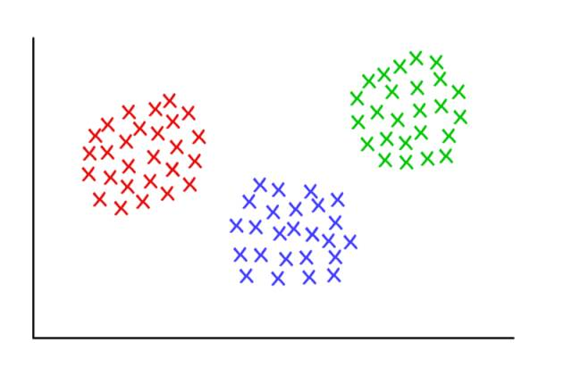

# 机器理解大数据的秘密：聚类算法深度详解

选自 Medium

**作者：Peter Gleeson**

**机器之心编译**

**参与：吴攀、蒋思源、李泽南、李亚洲**

> *在理解大数据方面，聚类是一种很常用的基本方法。近日，数据科学家兼程序员 Peter Gleeson 在 freeCodeCamp 发布了一篇深度讲解文章，对一些聚类算法进行了基础介绍，并通过简单而详细的例证对其工作过程进行了解释说明。*

看看下面这张图，有各种各样的虫子和蜗牛，你试试将它们分成不同的组别？

不是很难吧，先从找出其中的蜘蛛开始吧！

完成了吗？尽管这里并不一定有所谓的「正确答案」，但一般来说我们可以将这些虫子分成四组：蜘蛛、蜗牛、蝴蝶/飞蛾、蜜蜂/黄蜂。

很简单吧？即使虫子数量再多一倍你也能把它们分清楚，对吗？你只需要一点时间以及对昆虫学的热情就够了——其实就算有成千上万只虫子你也能将它们分开。

但对于一台机器而言，将这 10 个对象分类成几个有意义的分组却并不简单——在一门叫做组合学（combinatorics）的数学分支的帮助下，我们知道对于这 10 只虫子，我们可以有 115,975 种不同的分组方式。如果虫子数量增加到 20，那它们可能的分组方法将超过 50 万亿种。要是虫子数量达到 100，那可能的方案数量将超过已知宇宙中的粒子的数量。超过多少呢？据我计算，大约多 500,000,000,000,000,000,000,000,000,000,000,000 倍，已是难以想象的超天文数字！

但其中大多数分组方案都是无意义的，在那些浩如烟海的分组选择中，你只能找到少量有用的虫子分组的方法。

而我们人类可以做得很快，我们往往会把自己快速分组和理解大量数据的能力看作是理所当然。不管那是一段文本，还是屏幕上图像，或是对象序列，人类通常都能有效地理解自己所面对的数据。

鉴于人工智能和机器学习的关键就是快速理解大量输入数据，那在开发这些技术方面有什么捷径呢？在本文中，你将阅读到三种聚类算法——机器可以用其来快速理解大型数据集。当然，除此之外还有其它的算法，但希望这里的介绍能给你一个良好的开始！

在本文中，我将给出每种聚类算法的概述、工作方式的简单介绍和一个更细节的逐步实现的案例。我相信这能帮助你理解这些算法。

*3 个齐整的聚类，K=3*

**K-均值聚类（K-means clustering）**

**何时使用？**

当你事先知道你将找到多少个分组的时候？

**工作方式**

该算法可以随机将每个观察（observation）分配到 k 类中的一类，然后计算每个类的平均。接下来，它重新将每个观察分配到与其最接近的均值的类别，然后再重新计算其均值。这一步不断重复，直到不再需要新的分配为止。

**有效案例**

假设有一组 9 位足球运动员，他们中每个人都在这一赛季进了一定数量的球（假设在 3-30 之间）。然后我们要将他们分成几组——比如 3 组。

第一步：需要我们将这些运动员随机分成 3 组并计算每一组的均值。

第 1 组

运动员 A（5 个球）、运动员 B（20 个球）、运动员 C（11 个球）

该组平均=(5 + 20 + 11) / 3 = 12

第 2 组

运动员 D（5 个球）、运动员 E（9 个球）、运动员 F（19 个球）

该组平均=11

第 3 组

运动员 G（30 个球）、运动员 H（3 个球）、运动员 I（15 个球）

该组平均=16

第二步：对于每一位运动员，将他们重新分配到与他们的分数最接近的均值的那一组；比如，运动员 A（5 个球）被重新分配到第 2 组（均值=11）。然后再计算新的均值。

第 1 组（原来的均值=12）

运动员 C（11 个球）、运动员 E（9 个球）

新的平均=(11 + 9) / 2 = 10

第 2 组（原来的均值=11）

运动员 A（5 个球）、运动员 D（5 个球）、运动员 H（3 个球）

新的平均=4.33

第 3 组（原来的均值=16）

运动员 B（20 个球）、运动员 F（19 个球）、运动员 G（30 个球）、运动员 I（15 个球）

新的平均=21

不断重复第二步，直到每一组的均值不再变化。对于这个简单的任务，下一次迭代就能达到我们的目标。现在就完成了，你已经从原数据集得到了 3 个聚类！

第 1 组（原来的均值=10）

运动员 C（11 个球）、运动员 E（9 个球）、运动员 I（15 个球）

最终平均=11.3

第 2 组（原来的均值=4.33）

运动员 A（5 个球）、运动员 D（5 个球）、运动员 H（3 个球）

最终平均=4.33

第 3 组（原来的均值=21）

运动员 B（20 个球）、运动员 F（19 个球）、运动员 G（30 个球）、

最终平均=23

通过这个例子，该聚类可能能够对应这些运动员在球场上的位置——比如防守、中场和进攻。K-均值在这里有效，是因为我们可以合理地预测这些数据会自然地落到这三个分组中。

以这种方式，当给定一系列表现统计的数据时，机器就能很好地估计任何足球队的队员的位置——可用于体育分析，也能用于任何将数据集分类为预定义分组的其它目的的分类任务。

**更加细微的细节：**

上面所描述的算法还有一些变体。最初的「种子」聚类可以通过多种方式完成。这里，我们随机将每位运动员分成了一组，然后计算该组的均值。这会导致最初的均值可能会彼此接近，这会增加后面的步骤。

另一种选择种子聚类的方法是每组仅一位运动员，然后开始将其他运动员分配到与其最接近的组。这样返回的聚类是更敏感的初始种子，从而减少了高度变化的数据集中的重复性。但是，这种方法有可能减少完成该算法所需的迭代次数，因为这些分组实现收敛的时间会变得更少。

K-均值聚类的一个明显限制是你必须事先提供预期聚类数量的假设。目前也存在一些用于评估特定聚类的拟合的方法。比如说，聚类内平方和（Within-Cluster Sum-of-Squares）可以测量每个聚类内的方差。聚类越好，整体 WCSS 就越低。

**层次聚类（Hierarchical clustering）**

**何时使用？**

当我们希望进一步挖掘观测数据的潜在关系，可以使用层次聚类算法。

**工作方式**

首先我们会计算距离矩阵（distance matrix），其中矩阵的元素（i，j）代表观测值 i 和 j 之间的距离度量。然后将最接近的两个观察值组为一对，并计算它们的平均值。通过将成对观察值合并成一个对象，我们生成一个新的距离矩阵。具体合并的过程即计算每一对最近观察值的均值，并填入新距离矩阵，直到所有观测值都已合并。

**有效案例：**

以下是关于鲸鱼或海豚物种分类的超简单数据集。作为受过专业教育的生物学家，我可以保证通常我们会使用更加详尽的数据集构建系统。现在我们可以看看这六个物种的典型体长。本案例中我们将使用 2 次重复步骤。

步骤一：计算每个物种之间的距离矩阵，在本案例中使用的是欧氏距离（Euclidean distance），即数据点（data point）间的距离。你可以像在道路地图上查看距离图一样计算出距离。我们可以通过查看相关行和列的交叉点值来查阅任一两物种间的长度差。

步骤二：将两个距离最近的物种挑选出来，在本案例中是宽吻海豚和灰海豚，他们平均体长达到了 3.3m。重复第一步，并再一次计算距离矩阵，但这一次将宽吻海豚和灰海豚的数据使用其均值长度 3.3m 代替。

接下来，使用新的距离矩阵重复步骤二。现在，最近的距离成了领航鲸与逆戟鲸，所以我们计算其平均长度（7.0m），并合并成新的一项。

随后我们再重复步骤一，再一次计算距离矩阵，只不过现在将领航鲸与逆戟鲸合并成一项且设定长度为 7.0m。

我们再一次使用现在的距离矩阵重复步骤 2。最近的距离（3.7m）出现在两个已经合并的项，现在我们将这两项合并成为更大的一项（均值为 5.2m）。

紧接着，我们再一次重复步骤 2，最小距离（5.0m）出现在座头鲸与长须鲸中，所以继续合并它们为一项，并计算均值（17.5m）。

返回到步骤 1，计算新的距离矩阵，其中座头鲸与长须鲸已经合并为一项。

最后，重复步骤 2，距离矩阵中只存在一个值（12.3m），我们将所有的都合成为了一项，并且现在可以停止这一循环过程。先让我们看看最后的合并项。

现在其有一个嵌套结构（参考 JSON），该嵌套结构能绘制成一个树状图。其和家族系谱图的读取方式相近。在树型图中，两个观察值越近，它们就越相似和密切相关。

*一个在 R-Fiddle.org 生成的树状图*

通过树型图的结构，我们能更深入了解数据集的结构。在上面的案例中，我们看到了两个主要的分支，一个分支是 HW 和 FW，另一个是 BD、RD、PW、KW。

在生物进化学中，通常会使用包含更多物种和测量的大型数据集推断这些物种之间的分类学关系。在生物学之外，层次聚类也在机器学习和数据挖掘中使用。

重要的是，使用这种方法并不需要像 K-均值聚类那样设定分组的数量。你可以通过给定高度「切割」树型以返回分割成的集群。高度的选择可以通过几种方式进行，其取决于我们希望对数据进行聚类的分辨率。

例如上图，如果我们在高度等于 10 的地方画一条线，就将两个主分支切开分为两个子图。如果我们从高度等于 2 的地方分割，就会生成三个聚类。

**更多细节：**

对于这里给出的层次聚类算法（hierarchical clustering algorithms），其有三个不同的方面。

最根本的方法就是我们所使用的集聚（agglomerative）过程，通过该过程，我们从单个数据点开始迭代，将数据点聚合到一起，直到成为一个大型的聚类。另外一种（更高计算量）的方法从巨型聚类开始，然后将数据分解为更小的聚类，直到独立数据点。

还有一些可以计算距离矩阵的方法，对于很多情况下，欧几里德距离（参考毕达哥拉斯定理）就已经够了，但还有一些可选方案在特殊的情境中更加适用。

最后，连接标准（linkage criterion）也可以改变。聚类根据它们不同的距离而连接，但是我们定义「近距离」的方式是很灵活的。在上面的案例中，我们通过测量每一聚类平均值（即形心（centroid））之间的距离，并与最近的聚类进行配对。但你也许会想用其他定义。

例如，每个聚类有几个离散点组成。我们可以将两个聚类间的距离定义为任意点间的最小（或最大）距离，就如下图所示。还有其他方法定义连接标准，它们可能适应于不同的情景。

*红/蓝：形心连接；红/绿：最小连接；绿/蓝：最大连接*

**图团体检测（Graph Community Detection）**

**何时使用？**

当你的数据可以被表示为一个网络或图（graph）时。

**工作方式**

图团体（graph community）通常被定义为一种顶点（vertice）的子集，其中的顶点相对于网络的其它部分要连接得更加紧密。存在多种用于识别图的算法，基于更具体的定义，其中包括（但不限于）：Edge Betweenness、Modularity-Maximsation、Walktrap、Clique Percolation、Leading Eigenvector……

**有效案例**

图论是一个研究网络的数学分支，参考机器之心文章[《想了解概率图模型？你要先理解图论的基本定义与形式》](http://mp.weixin.qq.com/s?__biz=MzA3MzI4MjgzMw==&mid=2650725041&idx=1&sn=0c57ba70e2613e6af80c4ab61c996d44&chksm=871b1ecfb06c97d9547e50705d3e74a2b8c41254f0efc2dd88d2e89eec3bfac5da089f28c398&scene=21#wechat_redirect)。使用图论的方法，我们可以将复杂系统建模成为「顶点（vertice）」和「边（edge）」的抽象集合。

也许最直观的案例就是社交网络。其中的顶点表示人，连接顶点的边表示他们是朋友或互粉的用户。

但是，要将一个系统建模成一个网络，你必须要找到一种有效连接各个不同组件的方式。将图论用于聚类的一些创新应用包括：对图像数据的特征提取、分析基因调控网络（gene regulatory networks）。

下面给出了一个入门级的例子，这是一个简单直接的图，展示了我最近浏览过的 8 个网站，根据他们的维基百科页面中的链接进行了连接。这个数据很简单，你可以人工绘制，但对于更大规模的项目，更快的方式是编写 Python 脚本。这里是我写的一个：https://raw.githubusercontent.com/pg0408/Medium-articles/master/graph_maker.py

*用 R 语言 3.3.3 版中的 igraph 绘制的图*

这些顶点的颜色表示了它们的团体关系，大小是根据它们的中心度（centrality）确定的。可以看到谷歌和 Twitter 是最中心的吧？

另外，这些聚类在现实生活中也很有意义（一直是一个重要的表现指标）。黄色顶点通常是参考/搜索网站，蓝色顶点全部是在线发布网站（文章、微博或代码），而橙色顶点是 YouTube 和 PayPal——因为 YouTube 是由前 PayPal 员工创立的。机器还算总结得不错！

除了用作一种有用的可视化大系统的方式，网络的真正力量是它们的数学分析能力。让我们将上面图片中的网络翻译成更数学的形式吧。下面是该网络的邻接矩阵（adjacency matrix）：

每行和每列的交点处的值表示对应的顶点对之间是否存在边。比如说，在 Medium 和 Twitter 之间有一条边，所以它们的行列交点是 1。类似地，Medium 和 PayPal 之间没有边，所以它们的行列交点是 0.

该邻接矩阵编码了该网络的所有属性——其给了我们开启所有有价值的见解的可能性的钥匙。首先，每一行或每一列的数字相加都能给你关于每个顶点的程度（degree）——即它连接到了多少个其它顶点，这个数字通常用字母 k 表示。类似地，将每个顶点的 degree 除以 2，则能得到边的数量，也称为链接（link），用 L 表示。行/列的数量即是该网络中顶点的数量，称为节点（node），用 N 表示。

只需要知道 k、L 和 N 以及该邻接矩阵 A 中每个单元的值，就能让我们计算出该网络的任何给定聚类的模块性（modularity）。

假设我们已经将该网络聚类成了一些团体。我们就可以使用该模块性分数来评估这个聚类的质量。分数更高表示我们将该网络分割成了「准确的（accurate）」团体，而低分则表示我们的聚类更接近随机。如下图所示：

*模块性（modularity）是用于测量分区的「质量」的一种标准*

模块性可以使用以下公式进行计算：

这个公式有点复杂，但我们分解它，让我们可以更好地理解。

M 就是我们要计算的模块性。

1/2L 告诉我们将后面的部分除以 2L，即网络中边的数量的两倍。

Σ 符号表示求和，并且在该邻接矩阵 A 中的每一行和列上进行迭代。如果你对这个符号不熟悉，可以将 i, j = 1 和 N 理解成编程语言中的 for-loop。在 Python 里面，可以写成这样：

代码里面的 #stuff with i and j（带有 i 和 j 的那一坨）是什么？

括号中的内容表示从 A_ij 减去 ( k_i k_j ) / 2L。

A_ij 就是指该邻接矩阵中第 i 行、第 j 列的值。

k_i 和 k_j 是指每个顶点的 degree——可以通过将每一行和每一列的项加起来而得到。两者相乘再除以 2L 表示当该网络是随机分配的时候顶点 i 和 j 之间的预期边数。

整体而言，括号中的项表示了该网络的真实结构和随机组合时的预期结构之间的差。研究它的值可以发现，当 A_ij = 1 且 ( k_i k_j ) / 2L 很小时，其返回的值最高。这意味着，当在定点 i 和 j 之间存在一个「非预期」的边时，得到的值更高。

最后，我们再将括号中的项和 δc_i, c_j 相乘。δc_i, c_j 就是大名鼎鼎但基本无害的克罗内克 δ 函数（Kronecker-delta function）。下面是其 Python 解释：

是的，就是那么简单。克罗内克 δ 函数与两个参数，如何这两个参数相等则返回 1，如何不等，则返回 0.

也就是说，如果顶点 i 和 j 已经被放进了同一个聚类，那么δc_i, c_j = 1；否则它们不在同一个聚类，函数返回 0.

当我们将括号中的项与克罗内克 δ 函数相乘时，我们发现对于嵌套求和 Σ，当有大量「意外的（unexpected）」连接顶点的边被分配给同一个聚类时，其结果是最高的。因此，模块性是一种用于衡量将图聚类成不同的团体的程度的方法。

除以 2L 将模块性的上限值设置成了 1。模块性接近或小于 0 表示该网络的当前聚类没有用处。模块性越高，该网络聚类成不同团体的程度就越好。通过是模块性最大化，我们可以找到聚类该网络的最佳方法。

注意我们必须预定义图的聚类方式，才能找到评估一个聚类有多好的方法。不幸的是，使用暴力计算的方式来尝试各种可能以寻找最高模块性分数的聚类方式需要大量计算，即使在一个有限大小的样本上也是不可能的。

组合学（combinatorics）告诉我们对于一个仅有 8 个顶点的网络，就存在 4140 种不同的聚类方式。16 个顶点的网络的聚类方式将超过 100 亿种。32 个顶点的网络的可能聚类方式更是将超过 128 septillion（10²¹）种；如果你的网络有 80 个顶点，那么其可聚类的方式的数量就已经超过了可观测宇宙中的原子数量。

因此，我们必须求助于一种启发式的方法，该方法在评估可以产生最高模块性分数的聚类上效果良好，而且并不需要尝试每一种可能性。这是一种被称为 Fast-Greedy Modularity-Maximization（快速贪婪模块性最大化）的算法，这种算法在一定程度上类似于上面描述的 agglomerative hierarchical clustering algorithm（集聚层次聚类算法）。只是 Mod-Max 并不根据距离（distance）来融合团体，而是根据模块性的改变来对团体进行融合。

下面是其工作方式：

首先初始分配每个顶点到其自己的团体，然后计算整个网络的模块性 M。

第 1 步要求每个团体对（community pair）至少被一条单边链接，如果有两个团体融合到了一起，该算法就计算由此造成的模块性改变 ΔM。

第 2 步是取 ΔM 出现了最大增长的团体对，然后融合。然后为这个聚类计算新的模块性 M，并记录下来。

重复第 1 步和 第 2 步——每一次都融合团体对，这样最后得到 ΔM 的最大增益，然后记录新的聚类模式及其相应的模块性分数 M。

当所有的顶点都被分组成了一个巨型聚类时，就可以停止了。然后该算法会检查这个过程中的记录，然后找到其中返回了最高 M 值的聚类模式。这就是返回的团体结构。

**更多细节：**

哇！这个过程真是有太多计算了，至少对我们人类而言是这样。图论中存在很多计算难题，常常是 NP-hard 问题——但其也在为复杂系统和数据集提供有价值的见解上具有出色的潜力。Larry Page 就知道这一点，其著名的 PageRank 算法就是完全基于图论的——该算法在帮助谷歌在不到十年之内从创业公司成长为近乎世界主宰的过程中立下了汗马功劳。

团体检测（community detection）是现在图论中一个热门的研究领域，也存在很多可替代 Modularity-Maximization（尽管很有用，但也有缺点）的方法。

首先，它的聚集方式从指定尺寸的小团体开始，逐渐转向越来越大的。这被称为分辨率极限（resolution limit）——该算法不会搜索特定尺寸以下的团体。另一个挑战则是超越一个显著波峰的表现，Mod-Max 方法趋向于制造一个由很多高模块化分数组成的「高原」，这有时会导致难以确定最大分数。

其他算法使用不同的方式来确定团体。Edge-Betweenness 是一个分裂算法，把所有顶点聚合到一个大集群中。它会持续迭代去除网络中「最不重要」的边缘数据，直到所有顶点都被分开为止。这一过程产生了层级结构，其中类似的顶点在结构中互相靠近。

另一种算法是 Clique Percolation，它考虑了图团体之间可能的重叠。而另外一些算法基于图中的随机游动，还有谱聚类（spectral clustering）算法：从邻接矩阵及派生矩阵的特征分解开始。这些方法被应用于特征提取任务，如计算机视觉。

给出每个算法的深入应用实例超出了本介绍的探究范围。从数据中提取可用信息的有效方法在数十年前还是难以触及的事物，但现在已经成为了非常活跃的研究领域。

**结论**

希望本文能对你有所启发，让你更好地理解机器如何了解大数据。未来是高速变革的，其中的许多变化将会由下一代或两代中有能力的技术所驱动。

就像导语提到的，机器学习是一个非常有前景的研究领域，其中有大量复杂的问题需要以准确、有效的方式解决。对人类来说轻而易举的任务在由机器完成的时候就需要创新性的解决方案。

在此领域中，我们仍有大量的任务需要完成，无论谁为下一个重大突破贡献力量，无疑都会得到慷慨的回报。或许正在阅读这篇文章的某个人就会成为下一个强大的算法发明者？所有伟大想法都是从零开始的。 

*原文链接：https://medium.freecodecamp.com/how-machines-make-sense-of-big-data-an-introduction-to-clustering-algorithms-4bd97d4fbaba*

******本文为机器之心编译，***转载请联系本公众号获得授权******。***

✄------------------------------------------------

**加入机器之心（全职记者/实习生）：hr@jiqizhixin.com**

**投稿或寻求报道：editor@jiqizhixin.com**

**广告&商务合作：bd@jiqizhixin.com**