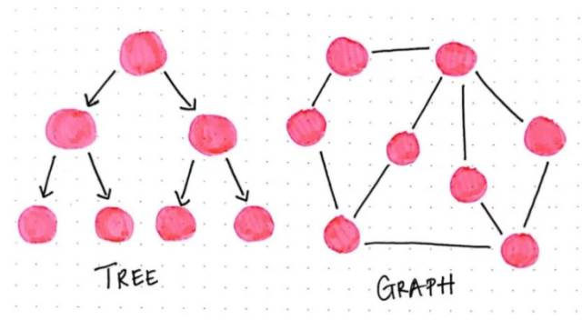
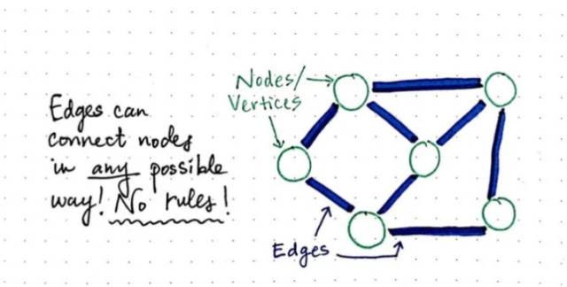
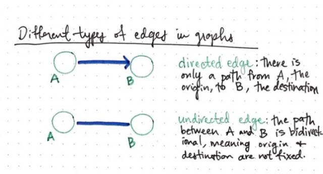
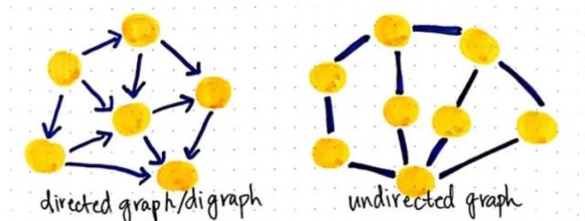
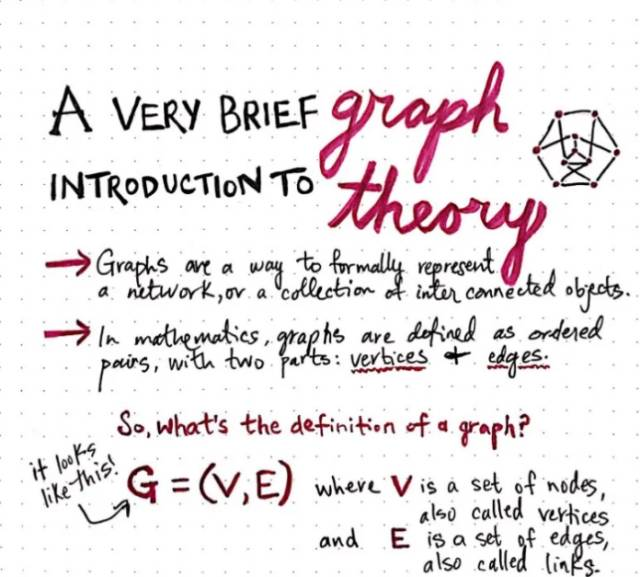
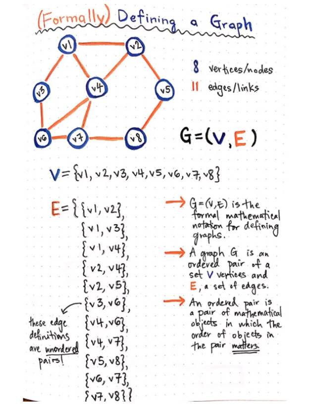
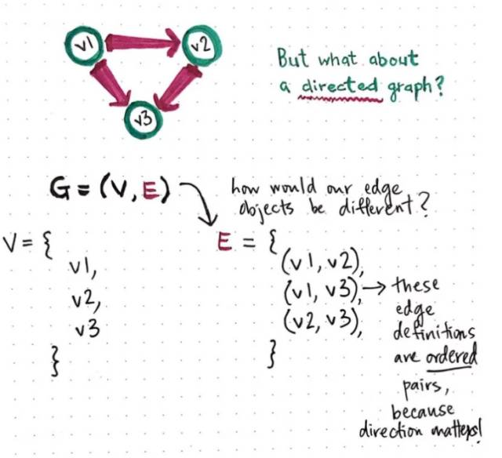
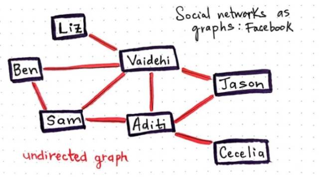
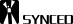

# 想了解概率图模型？你要先理解图论的基本定义与形式

选自 Dev To

**作者：vaidehijoshi 等**

**机器之心编译**

**参与：蒋思源、李泽南**

> *图论一直是数学里十分重要的学科，其以图为研究对象，通常用来描述某些事物之间的某种特定关系。而在机器学习的世界里，我们希望从数据中挖掘出隐含信息或模型。因此，如果我们将图中的结点作为随机变量，连接作为相关性关系，那么我们就能构造出图模型，并期望解决这一问题。本文将为构造该模型提供最基础的概念。*

我们都知道机器学习里的决策树，其可以表示为给定特征条件下类的条件概率分布。并且我们知道决策树由结点和有向边组成，结点又由表示特征的内部结点和表示类的叶结点构成。而通常决策树的学习又包括了特征的选择、决策树的生成和决策树的剪枝。那么这种树型算法又是来自哪呢？其实树型只是图的一个小分支，而接下来我们将进一步了解源于离散数学并十分重要的分支：图论（graph theory）。

如果这是你第一次涉足关于图论的内容，那么本篇文章将会给你一个清晰的概念。同时也希望本文能将图论的思想、基本模型阐述清楚，因此不论是对以后的机器学习模型构建还是概率图模型的理解都能提供一定的助力。

### **Loosey–goosey 图**

当第一次开始研究非线性结构时，我们需要学习它们最基础的特征：即数据并不遵循特有的顺序，至少是没有明显的数值关系，这一点就和我们看到的数组与链表一样。正如我们所了解的，树型结构从根结点开始，并能和其他结点相连接，也就是说一棵完整的树可以由其子树构成。树由一组规则定义而成：即一个根结点可能连接或不连接到其他结点，但最终所有叶结点或内部结点都能追溯到这个特定的位置。一些树有更多的特定规则，如二叉搜索树，该树在任意时间内每个结点都只和两个子结点相连。而机器学习常用的决策树就可以看成是 IF-THEN 规则的集合。即由决策树的根结点到叶结点的每一条路径构建一条规则，路径上内部结点的特征对应着规则的条件，而叶结点的类对应着规则的结论。

那我们是否能将构成树状的这些规则抛弃掉，不用再严格地遵守这些规则而生成图（graph）。当然这样做是不会出错的，只是生成不了树，也不能以树状的结构进行计算了。但是我们进一步能用图进行计算或处理任务。

> *树型只不过是一种受限图，只不过是遵循众多规则的图。树型永远是图中的一种，但图远远不止是树。*

那么到底是什么让树型有别于伞状图呢？

首先，一棵树只能朝一个方向传播，即树型是由有向边（directed edge）构成的。每一颗树都是由根节点开始，向下往子节点或叶节点传播。同样树型的每一条路径都是唯一的，并且路径上的所有子结点有且仅有一个父节点。所以这种树型结构一定不会存在循环结构或链路。

而通过图，所有的这些限制好像都突然消失了。因为图是没有任何「根结点」、「叶节点」和「单向边」等这些概念的，所以图中的结点可以连接多个子结点也可以有多个父结点，路径也可以是有向流或者无向边。或者如果想要图更加复杂一点，也可以采用有向流和无向边的组合，但是本文暂时并不会关注这些复杂系统。

**有向图和无向图**

现在我们已经知道图确实打破了构造树型的所有规则。但每一个图都必须遵守一个基本原则：即图有且至少有一个单结点。就像树型至少需要一个根结点才可以看作是「树」，图也至少需要一个单结点以便可以看作是「图」。只有一个结点的图通常称为「单例图」，基本上我们不会使用这种单例图处理任务。

通常能进行运算处理的图都是更复杂一些的图，但是不要太担心，本文所描述的图都不会太复杂，不过有些图真的是超级复杂的。

首先我们会探讨一下很容易辨认和理解的两种图：有向图（directed graphs）和无向图（undirected graphs）。这两种图在图论（graph theory）探讨的问题中十分常见。

在图中，结点和结点之间的连接并没有确切的规则，边（有时候也称为链接）能以任何方式连接结点。

不同类型的边或路径对定义和识别图时非常重要。边的类型实际上是图之间最大、最明显的区别之一。大多数情况下（只有一种例外），图会有两种类型的边：即具有方向或流向的边和不具有方向或流动的边。我们将其称为有向边（directed edges）和无向边（undirected edges）。

在有向边中，两个结点以特定的方式连接。如下图结点 A 连接结点 B 的方式所示，有向边规定了两个结点之间只有单一的方向，即只能从起始结点（origin）沿特定方向到目标结点（destination），永远不能反过来从目标结点到起始结点。这种类型的有向边在图论问题中十分常见。

现在，我们再介绍一下与有向边完全不同的无向边。在无向边（undirected edge）里，可通过的路径是双向的。也即两个结点之间的路径是双向互通的，起始结点和目标结点并没有固定。

这种差异是十分重要的，因为图中的边确定了图的类型。如果图中所有的边都是有向边，那么该图就是有向图（directed graph）。如果图所有的边都是无向边，那么该图就是无向图（undirected graph）。

以上所描述的图看起来很有结构性，但也许我们更应该关心两件事情：首先具体是什么条件或事件填充了图，其次我们具体要关注图的什么信息？

**轻轻地：我们来到了图的王国**

计算机科学喜欢借鉴其他学科。具体来说是喜欢借鉴逻辑学和数学的许多概念。而图论也是一样，其最开始就是数学的一个分支，且以图为研究对象，图论经常是研究顶点和边组成图的数学理论和方法。而我们所熟悉的图数据结构或树型算法等计算机概念实际上都来自于数学，而对图的研究就是图论（graph theory）。

在数学中，图是一种正式表征网络的结构，其基本上是所有互连对象的集合。

事实证明，当计算机科学家将图论应用于代码（创造出图数据结构或树型算法等）时，那些理论并没有改变多少。所以本文描述和实现图的术语就是在数学图论中的确切术语。

在数学术语中，我们将图描述为有序对（ordered pairs）。还记得以前学过的函数，它的定义就是在二维坐标轴上分布的有序对（x，y）集合。图也是使用类似的定义，只不过使用图的结点（vertices）v 和边（edges）e 代替 x 和 y。

因此，图的正式数学定义即为：G=（V，E）

但是问题来了，如果我们的图有多个结点和多条边怎么办，实际上有多个结点通常就会有多条边，那么这种情况又该怎么定义图呢。

实际上上述定义式并不会失效，因为有序对（V，E）实际上是由两组对象组成：一组结点，一组边。

现在广义的图定义变得更加有意义，但如果能有一个实例来说明的话，这个概念就会比较好理解，所以下图是我们使用 8 个结点，12 条边组成的一个无向图，我们会详细解释该图是如何用数学正式定义。

那么上图那个例子到底说了些什么。

我们将有序对记为（V，E），但因为每一项都是一个对象，所以我们必须把这些项写出来。V 已经定义为八个结点的无序集，而「无序」这一概念在这里非常重要。因为图与树型不同，其结点没有层次结构。因此排序并不重要，我们也不需要对它们进行排序。

我们还须将 E 定义为包含所有边的项。同样，边这一对象也是无序的。原因就在于图的边是无向边，它没有固定的流向或方向，也就是没有固定的起始节点和目标节点，所以每条边都是无序地。

当然，无向图的「无序」这一特性可能会引起一些疑惑，但有向图又有什么性质呢？下面是另一个案例，该图是由三个结点和三条有向边组成的有向图。

在有向图中，定义结点的方式和无向图中是一样的，但有向边和无向边的定义是不一样的。在有向图中，边的对象定义为有序对（使用圆括弧表示），因为这种情况下，边的方向十分重要。因为在有向图中，边只能是从起始结点到目标结点，所以边必须进行排序，从而定义 E 中有序对前一个元素为起始结点，后一个元素为目标结点。

所以以上就是我们如何定义一个图，但是在定义图之后，我们什么时候才能实际应用图呢。下面我们将一起来了解一下图的应用和计算。

**超级社交图**

图其实就在我们身边，只是我们不了解而已。

事实上，你在阅读这篇文章的时候，你就是处于一张图中。网络就是巨大的图结构，每个终端是一个结点，而互联网就是网络的边。网页也是，当我们点击网站并在 URL 之间来回浏览时，我们就是在图中浏览。有的网页之间是无向边，可以在两个网页之间来回切换，而有的是有向边，只能从一个网页转到另一个。

现在，我们使用一个更加生动的案例，以说明图与日常的交互：社交网络。

微信是一个庞大的社交网络，它也是一种图。如果我们能更多地去思考它实际的功能，那么我们可以更好地理解怎样定义和确定图的类型是什么。在微信上，如果我希望成为你的朋友，那么我需要添加你为好友，且你必须接受我的请求。在你不是我的微信好友情况下，我也会不是你的微信好友。两个用户之间的关系（图中的结点和边）是双向的。其没有起始节点和目标节点这一概念。

那你现在能判断微信的图是什么类型了么。

因此微信就是一种大型无向图，用户之间可以同时相互传递信息。

但另外一种社交网络微博却是有向图，因为在用户发布微博时，博文这一信息会在同时间点由用户向粉丝发送，这一过程是有方向不可逆的。

在了解了图论的基础概念和定义表达式后，或许我们可以进一步窥探一些概率图模型的重要思想。

机器学习的一个核心任务是从观测到的数据中挖掘隐含的知识，而概率图模型是实现这一任务的重要手段。概率图模型巧妙地结合了图论和概率论。从图论的角度来说，概率图模型就是一个包含结点与边的图。结点可以分为两类：隐含结点和观测结点。边可以分为有向边或无向边。从概率论的角度来看，概率图模型是一个概率分布，图中的结点对应于随机变量，边对应于随机变量的相关性关系。给定一个实际问题，我们通常会观测到一些数据，并且希望能够挖掘出隐含在数据中的知识。那么怎样才能使用概率图模型挖掘这些隐藏知识呢？通常情况下我们会构建一个图：用观测结点表示观测到的数据，用隐含结点表示潜在的知识，用边来描述知识与数据的相互关系，最后获得一个概率分布。给定概率分布之后，通过进行两个任务获取知识：即推断 (给定观测结点，推断隐含结点的后验分布）和学习 (学习概率分布的参数）。

基本的图模型可以大致分为两个类别：贝叶斯网络 (Bayesian Network) 和马尔可夫随机场 (Markov Random Field)。它们的主要区别在于采用不同类型的图来表达变量之间的关系：贝叶斯网络采用有向无环图 (Directed Acyclic Graph) 来表达因果关系，马尔可夫随机场则采用无向图 (Undirected Graph) 来表达变量间的相互作用。这种结构上的区别导致了它们在建模和推断方面的一系列微妙的差异。

至此，我们已经知道了图论到底是什么，也知道基本有向图和无向图的标准定义。在文章的最后，我们更是将图论的基本概念和概率论的基本思想相结合来理解概率图模型。但我们都知道概率图模型十分强大与重要，所以我们也许需要进一步专门地学习这一机器学习方法。 

这里有一些图论相关资源：

Difference between Trees and Graphs：http://suo.im/2qN4yS

What's the difference between the data structure Tree and Graph?：http://suo.im/1wjBzi

Applications of Graph Theory In Computer Science: An Overview：http://suo.im/4twRke

Graph Traversal：http://suo.im/2cu4oH

Data structures: Introduction to graphs（视频）：http://suo.im/4z1QbH

*注：为便于理解，机器之心在原文基础上进行了扩展，原文链接如下：https://dev.to/vaidehijoshi/a-gentle-introduction-to-graph-theory?utm_content=buffer6fb86&utm_medium=social&utm_source=twitter.com&utm_campaign=buffer*

******本文为机器之心编译，***转载请联系本公众号获得授权******。***

✄------------------------------------------------

**加入机器之心（全职记者/实习生）：hr@jiqizhixin.com**

**投稿或寻求报道：editor@jiqizhixin.com**

**广告&商务合作：bd@jiqizhixin.com**