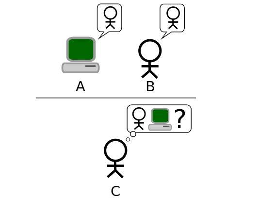
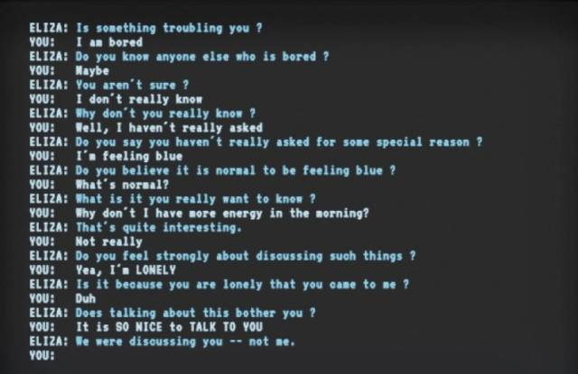
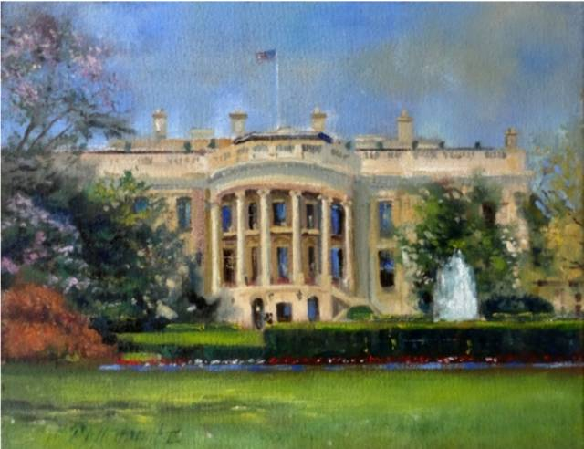
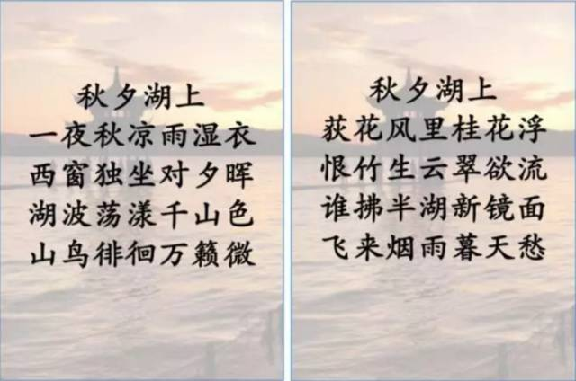

# 人工智能能骗过人类吗？愚人节特写：这不是玩笑

 *机器之心原创

**作者：吴攀**

 *> *人类自开始认识自己以来，大概就一直在梦想着能创造能与自己别无二致的存在（从偃师献给周穆王的歌舞艺伎到弗兰肯斯坦的怪物再到近段时间以来越来越栩栩如生的机器人和越来越智能的软件程序），或者至少让这样的存在无法与其他人类被区分开。人类有能力办到这一点吗？还是说我们已经实现了这一目标，抑或是这仅仅只是一个梦想而已？*

时值愚人节，我们就来看看人工智能在「愚弄」人类上已经走了多远了。

**从图灵测试说起**

1950 年，图灵发表了一篇划时代的论文，文中预言了创造出具有真正智能的机器的可能性。由于注意到「智能」这一概念难以确切定义，他提出了著名的图灵测试：如果一台机器能够与人类展开对话（通过某种设备）而不能被人类辨别出其机器身份，那么称这台机器具有智能。这一简化使得图灵能够令人信服地说明「思考的机器」是可能的。论文中还回答了对这一假说的各种常见质疑。图灵测试是人工智能哲学方面第一个严肃的提案。

*图灵测试：如果一个人（代号 C）使用测试对象皆理解的语言去询问两个他不能看见的对象任意一串问题。对象为：一个是正常思维的人（代号 B）、一个是机器（代号 A）。如果经过若干询问以后，C 不能得出实质的区别来分辨 A 与 B 的不同，则此机器 A 通过图灵测试。（来自维基百科·图灵测试）*

但近些年来图灵测试的有效性已经受到了很多的质疑，问题就在于图灵测试太容易作弊了——通过欺骗或假装无知便可以轻松通过测试。正如图灵本人所预测的那样，获胜的主要诀窍是避而不答。比如说，如果一个裁判问一个机器，你有感觉吗？机器必须撒谎才能通过测试。但是这种奇怪的扭曲不是特例，而是常态。通过图灵测试的方法其实就只能是欺骗。

研究者也在原始图灵测试思想的基础上提出了很多改进的版本或其它评价人工智能的方法，包括增加对更多种类的内容的理解或引入创造力测试等等；2015 年 io9 网站的一篇文章就盘点了其中 8 种有可能代替图灵测试的方法，其中包括测试推理能力的 Winograd Schema Challenge、评价创造力的 Lovelace Test 2.0、评价结构能力的 Construction Challenge、判断视觉能力的 Visual Turing Test……前段时间，心理学家和认知科学家 Gary Marcus 在《科学美国人》上也发文谈到了一些新的人工智能智能测试方式，比如其中一种是人类的标准化测试：

> *人工智能将接受人类学生在小学、中学阶段面临的考试，不给任何宽限。这一方法是将语义理解和解决各类问题的任务联系在一起的绝妙方式。这很像是图灵测试，但前者更加简单直接。只需让人工智能接受严格的标准化测试（如纽约市四年级科学考试的多选题），为机器配备足够的输入能力（如自然语言理解和机器视觉模块），然后开始考试吧。*

**那些或许通过了图灵测试的软件**

尽管寻求替代的呼声越来越大，但图灵测试在很多人心中它仍然是智能技术前进的一大圣杯，而到目前为止，已经有一些研究者声称自己开发的软件已经通过了图灵测试。

最早的可能通过了图灵测试的程序出现在 1966 年，那是著名计算机科学家 Joseph Weizenbaum 所开发的一个程序 ELIZA，其可以检测用户的输入并寻找其中的关键词。当找到了特定的关键词后，该程序会根据一个规则给出了一个回应句子；而如果没有找到任何可用的关键词，那么 ELIZA 会根据一种通用的方式用之前的一条评论来进行回应。据了解，Weizenbaum 还在 ELIZA 上复制了一种罗氏疗法（Rogerian therapy）的行为，让 ELIZA 可以自由地假装对这个世界一无所知。通过这些技术和带有欺骗性的技巧，ELIZA 成功让一些人相信与他们的交谈的是一个真正的人，甚至有评论说「很难相信 ELIZA 不是一个人类」。所以 ELIZA 大概是第一个通过了图灵测试的程序吧。

*与 ELIZA 的对话*

1972 年，致力于计算机科学和人工智能在精神病学中的理论和应用的美国精神病学家 Kenneth Colby 创造了一个程序 PARRY，该程序也被称为「有态度的 ELIZA（ELIZA with attitude）」。技术方面和 Weizenbaum 所使用的方法类似，PARRY 试图模仿妄想型精神分裂症患者的行为。在测试过程中，一组经验丰富的精神病学家通过电传打字机和 PARRY 与真实病人分别进行了对话，该对话的转录文本也被展示了另外的 33 位精神病学家。然后这两组专家被要求判别哪些「病人」是人类，哪些又是计算机。但最终他们仅有 48% 的正确率，跟随机乱猜差不多。这个程序大概也就此开创了通过装疯卖傻的方式愚弄人类的先河。

进入 21 世纪，更先进的技术和更强大的设备也带来了更强大的欺骗方式。

2014 年，举办图灵测试 2014 的英国雷丁大学宣称俄罗斯人 Vladimir Veselov 开发的人工智能软件 Eugene Goostman 通过了图灵测试，这被很多人看作是一个里程碑事件。据介绍，Eugene Goostman 软件模仿的是一位 13 岁的男孩。在当年共有 5 台超级计算机参赛的图灵测试竞赛上，Eugene Goostman 设法让受试者相信被测试者 33% 的答复为人类所为。而图灵测试的通过标准为 30%，这意味着这台超级计算机通过了图灵测试。

而在 2016 年，有研究者更是宣称发现了让任何软件都可以通过图灵测试的窍门：保持沉默。考文垂大学的研究者 Kevin Warwick 和 Huma Shah 通过论文《在图灵的模仿游戏中采用第五修正案（Taking the fifth amendment in Turing』s imitation game）》介绍了他们的发现：如果一台机器在测试中采用「第五修正案」，即在整个测试过程保持沉默，可以潜在地说它通过了该测试，并且可以因此将其视为一个有思想的存在。

但这些也许真的通过了图灵测试的软件真的就是智能了的吗？我们可能无法认同。正如机器之心在文章《[图灵测试通过事件的噱头以及沉思](http://mp.weixin.qq.com/s?__biz=MzA3MzI4MjgzMw==&mid=200269949&idx=1&sn=142f98ef4756b0e6ed7cb85b274f57c5&scene=21#wechat_redirect)》中所总结的那样，目前已经通过图灵测试的软件大都利用了四种欺骗性的技巧：

1.  用短句短词进行模棱两可的回答。

2.  根据裁判的社会习俗生活环境，进行相关处理。

3.  对问题进行反问式确认，比如裁判问到"你是从俄罗斯来的吗？"，那么反问策略则是「你为什么不确定我是从俄罗斯来的？」。采用这种方式对抗裁判，往往是杀手锏。这种反问式策略最初是心理咨询上的治疗手段，目前已被大量使用在图灵测试的游戏上。

4.  当人类回答的过于详细反而会被误认为是机器，参赛者可以抓住这一点引导裁判进行详细式提问，然后再进行模棱两可式的回答，而这种情况下，真正人类回答的反而更机械更像机器了。

**人工智能欺骗人类的能力越来越强**

其实除了上面提到了有些微妙的图灵测试，人工智能技术在欺骗人类方面实际上正在取得实实在在的进步。随着近些年深度学习的兴起和各种新型算法的出现，计算机在创造「以假乱真」的东西上已经取得了耀眼的成绩，甚至很多时候就连最顶级人类造假者也会自叹弗如，毕竟机器不仅做得好，还做得快。下面我们将介绍一些人工智能在生成无法与人类作品相区分的新作品上所取得的新进展，其中我们也会给出一些样例，看你是否能够分辨「真」与「假」。相关答案集中在文末公布，你能答对多少？

**1\. 谁在说话？**

如果你对机器人说话声音的认识还停留在一字一顿的阶段，那你可能还没尝试过谷歌助手（Google Assistant），它流畅的语音输出听起来就像是一个训练有素的《新闻联播》英语播音员。但谷歌并不是唯一一个在语音合成上取得突破的公司或机构。去年 9 月时，DeepMind 表示他们最新的深度生成模型 WaveNet 将机器语音合成的表现与人类之间水平的差距至少缩减了 50%。今年 Yoshua Bengio 领导的一个研究团队又提出了一种端到端语音合成技术 Char2Wav，可以学习直接根据文本生成音频。此外，百度最近所提出的 Deep Voice 模型更是一个高速度的完全由深度神经网络构建的高质量语音转文本系统。也许很快我们就无法区分电话那头的是人还是机器了。昨天，机器之心又报道了[谷歌最新的全端到端语音合成系统 Tacotron](http://mp.weixin.qq.com/s?__biz=MzA3MzI4MjgzMw==&mid=2650725012&idx=5&sn=0a563bffd5f9ca34560767cfb3064e99&chksm=871b1eeab06c97fc74242ddd85fcca962482bd1f76dcd52b139e0a78c4568fdbe08e4b6b3c43&scene=21#wechat_redirect)，该模型可接收字符的输入，输出相应的原始频谱图，然后将其提供给 Griffin-Lim 重建算法直接生成语音，实现了显著的速度提升。

除了语音合成，机器也在努力学习其它类型的声音合成。去年 6 月，MIT 计算机科学与人工智能实验室的研究者报道了一种新的声音模拟算法，并宣称其真实程度能骗过人类。在他们的相关介绍中写道：「最终这个算法能够精确模拟不同撞击的细微差别，从摇滚音乐断开的音节，到常青藤摇晃时发出的沙沙声。就连音高也不是问题，因为算法能合成的撞击声涵盖了从软沙发出的低音砰砰声到硬木头发出的高音咔哒声。」在实际测试中，受试者选择伪造声音的次数是真实声音的两倍。尤其是树叶、泥土这些声音不清楚的材料上，他们更难以分辨，可谓是做到了「比真实更真实」。来感受一下：

https://v.qq.com/iframe/preview.html?vid=s0306kxswtb&width=500&height=375&auto=0

扩展阅读：

*   [学界 | Yoshua Bengio 等人提出 Char2Wav：实现端到端的语音合成（附资源）](http://mp.weixin.qq.com/s?__biz=MzA3MzI4MjgzMw==&mid=2650723604&idx=4&sn=5aeb3df13d7565fb6c889450bb48b80b&chksm=871b116ab06c987c8c0dc36f437008c30ab7df5f8450c2de183f358662e14260995d8cdf10ce&scene=21#wechat_redirect)

*   [重磅 | DeepMind 最新生成模型 WaveNet，将机器合成语音水平与人类差距缩小 50%（附论文）](http://mp.weixin.qq.com/s?__biz=MzA3MzI4MjgzMw==&mid=2650719022&idx=1&sn=3eeb1958e695388817dd32b0d228ced9&scene=21#wechat_redirect)

*   [前沿 | MIT 人工智能实验室全新声音模拟算法，真实程度骗过人类](http://mp.weixin.qq.com/s?__biz=MzA3MzI4MjgzMw==&mid=2650716127&idx=4&sn=96139a8e917678b547b4b8d130962d47&scene=21#wechat_redirect)

*   [业界 | 百度提出 Deep Voice：实时的神经语音合成系统](http://mp.weixin.qq.com/s?__biz=MzA3MzI4MjgzMw==&mid=2650723769&idx=4&sn=7098361f7369fe813aed6b2d035394c8&chksm=871b11c7b06c98d11ff77ed0f23ac56ad1c55ae34756b628f215912f7feb815f290207ab13a6&scene=21#wechat_redirect)

*   [学界 | 谷歌全端到端语音合成系统 Tacotron：直接从字符合成语音](http://mp.weixin.qq.com/s?__biz=MzA3MzI4MjgzMw==&mid=2650725012&idx=5&sn=0a563bffd5f9ca34560767cfb3064e99&chksm=871b1eeab06c97fc74242ddd85fcca962482bd1f76dcd52b139e0a78c4568fdbe08e4b6b3c43&scene=21#wechat_redirect)

**2\. 听，是谁在唱歌？**

人工智能也在学习生成音乐，去年 5 月，谷歌研究科学家 Douglas Eck 向参加 Moogfest 艺术节的资深音乐迷们讲述了其团队通过训练计算机来帮助音乐人编写音乐的新成果——在一首歌中生成和弦、创造过渡和精心设计反复的旋律。他相信，总有一天，机器可以学会完全靠自己去写一首歌。谷歌的这个项目名叫 Magenta，在 NIPS 2016 上还曾赢得了 Best Demo 奖。今年 4 月 18 日到 21 日，谷歌又将带着该项目回到 Moogfest 艺术节，感兴趣的读者可以在（http://suo.im/2bFF2y）关注。下面这段音乐可能就是 Magenta 创作的，你能分辨出来吗？

*音频 1*

随带一提去年圣诞节多伦多大学的博士生楚航发布了一首完全由人工智能看着一棵圣诞树来编曲，填词创并朗诵的一首神奇的小调，并配有一个火柴人摇摆起舞。据介绍，楚航通过建立一个层级递归神经网络（Hierarchy RNN）的模型，然后收录大量音乐数据，从而由人工智能分析大体的音乐结构特点，发现并总结多首相似风格的音乐中存在的类似的特征，再以新颖的构建框架建立多层神经网络模型，最终通过输入一副画面，便能生成相应主题的流行音乐。在多层的构筑框架下，还可以在生成音乐之外编出新颖的舞步和歌唱的人声。

当然，上面所提到的 WaveNet 和 MIT 的算法等也可以用来生成音乐。

扩展阅读：

*   [深度 | 人工智能改变 MIDI 创作：谷歌 Magenta 项目是如何教神经网络编写音乐的？](http://mp.weixin.qq.com/s?__biz=MzA3MzI4MjgzMw==&mid=2650719723&idx=2&sn=03925a0eb5a8b78cc2642781b924032c&chksm=871b0195b06c888336f97ac330524580589bf29b073aa76585319a6ad43744a5697d6a424b0f&scene=21#wechat_redirect)

*   [圣诞快乐！来听听人工智能为这个圣诞节献上的歌曲](http://mp.weixin.qq.com/s?__biz=MzA3MzI4MjgzMw==&mid=2650721747&idx=4&sn=1b123bfda1b8837a18365466f684d2d4&chksm=871b09adb06c80bb26bdb2519d082ef0ac5995019ed1761b66c7f3e80e7dc177d8c4c88d10c4&scene=21#wechat_redirect)

**3\. 风格迁移，伪造大师作品**

自从照片处理应用 Prisma 一夜走红之后，图像风格迁移技术就从实验室一下子飞入了寻常百姓家，让即使「没有艺术细胞」的人也能简单动动手指据创造出美轮美奂的艺术作品。

去年 10 月，谷歌的一篇论文介绍了一种可以让单个深度卷积风格迁移网络同时学习多种风格的简单方法，而且其不仅可以应用于静态图像，还可应用于视频。11 月，Facebook 将这方面的研究向前又推进了一步，在移动设备上实现了实时的风格迁移。

实际上，风格迁移（style transfer）并不是什么新概念，有十几年的历史了，但利用神经网络来做这件事还是最近由研究人员在发表于 2015 年 8 月的一篇题为《A Neural Algorithm for Artistic Style》的论文中引入的。而除了对照片的风格迁移，也有研究者将这项技术应用到了更多的领域，比如字体设计。在机器之心去年 11 月介绍的一个项目中，Flipboard 软件工程师 Yuchen Tian 发布的 Rewrite 项目介绍了如何通过神经网络学习设计汉字新字体的方法。

下面是一张白宫的油画和 Prisma 处理的一张白宫照片，你能分辨吗？

*图 1*

*图 2*

扩展阅读：

*   [开源 | 怎么让你的照片带上艺术大师风格？李飞飞团队开源快速神经网络风格迁移代码](http://mp.weixin.qq.com/s?__biz=MzA3MzI4MjgzMw==&mid=2650719733&idx=3&sn=950a7adb4e93bca22e4ef975877482a9&chksm=871b018bb06c889ddc87bccaa0f35de5ca5a35c156cf1164d134d5010065d68dd06ba6e7cdfa&scene=21#wechat_redirect)

*   [开源 | 汉字风格迁移项目 Rewrite：利用神经网络学习设计汉字新字体](http://mp.weixin.qq.com/s?__biz=MzA3MzI4MjgzMw==&mid=2650720285&idx=4&sn=209c40398e94f0883b832c697d4d9158&chksm=871b0c63b06c8575a492d4fbd04c943cf41ce54d275265b2573172ea8117bed9e01aa123b7c8&scene=21#wechat_redirect)

*   [重磅 | Facebook 贾扬清宣布新机器学习系统 Caffe2Go：可在移动设备上实现实时风格迁移](http://mp.weixin.qq.com/s?__biz=MzA3MzI4MjgzMw==&mid=2650720399&idx=1&sn=2b5e854e6606eaf556a73e83d179eb5c&chksm=871b0cf1b06c85e7547b69a44471d377eca83cbdeaec379fabc187218280c761824a5600e1ac&scene=21#wechat_redirect)

*   [深度 | 谷歌增强型风格迁移新算法：实现基于单个网络的多种风格实时迁移（附论文）](http://mp.weixin.qq.com/s?__biz=MzA3MzI4MjgzMw==&mid=2650720113&idx=1&sn=b45bd28cef19a06c717717d3622d58de&chksm=871b030fb06c8a199334d745ad1be56b6b7aeb364596743be7215cc7c6a15a23053c8b60639f&scene=21#wechat_redirect)

**4\. 机器诗人**

用机器写诗并不是什么新思想，著名科幻小说《三体》系列的作者刘慈欣就曾经编写过一个可以写「现代诗」的程序「电子诗人」，不过这个仅有数百 KB 的小程序应该并没有用到神经网络，生成的作品可能格式比较工整，但却往往缺乏中心思想。现在，有自然语言处理和自然语言理解技术帮助机器分析和理解语言，人工智能在写诗的道路上也越走越远。比如前段时间百度 NLP 在机器之心发布的专栏文章就解读了百度在自动作诗方面的研究进展。

创作诗歌对于人来说都很难，对于机器来说就更是难上加难了。据介绍，虽然机器与人相比，在一些方面有着先天的优势，例如，机器有无穷无尽的词汇库可供选择，机器可以很容易的解决对仗、平仄和押韵等问题。但是，真正的诗歌是有灵魂的，诗歌本质上是在传达诗人的思想。机器自动创作在主题控制方面很弱，很难让整首诗都围绕一个统一的主题来生成。但机器有可能通过诗歌来说服人类，让人感觉到它是有灵魂的吗？

下面这两首诗歌，其中一首是计算机自动生成的，另一首是宋代诗人葛绍体写的。你是否能猜出哪一首是计算机写的，哪一首是诗人葛绍体所作呢？

扩展阅读：

*   [百度 NLP | 自动写诗 PK 古代诗人：百度「为你写诗」技术深度揭秘 ](http://mp.weixin.qq.com/s?__biz=MzA3MzI4MjgzMw==&mid=2650724242&idx=4&sn=6421e9edfdc3ec9da076c77494d094a8&chksm=871b13ecb06c9afaa0a1e1ff813f042000ae077ff4fbf4cce0acb71af71c4ae0a4a6a2bae5c6&scene=21#wechat_redirect)

*   [一周论文 | 机器写诗综述](http://mp.weixin.qq.com/s?__biz=MzA3MzI4MjgzMw==&mid=2650722858&idx=5&sn=a0103ed0f3776f26b9411b0932575097&chksm=871b1654b06c9f42f140e70cc6102405a48a2e4cbfedb9ba47237087a0f8167b1fed231e7a8f&scene=21#wechat_redirect)

**总结**

在「欺骗人类」的道路上，人工智能正越走越远。从语言合成到图像生成再到模拟人类的对话，人工智能正在许多领域逼近甚至超越人类的表现水平。现在市面上也已经出现了一些在一定程度上可以替代人类的伴侣式设备或聊天软件。而伴随着虚拟现实和技术、增强现实和混合现实等技术的日渐发展，未来的人工智能可能不仅能在图像和声音上伪装成人类，甚至还能在更大的范围内为我们创造一个足以以假乱真的世界——如果我们假设我们的世界是真实的话。 

最后，答案揭晓：

*   实际上，音频 1 是 Buck O'Nine 乐队的《My Town》的片段，不是机器的作品，想感受 Magenta 的魅力，请在其扩展阅读中查看 Magenta 相关文章。

*   图 1 是由艺术家 Hall Groat II 创作的作品

*   图 2 是机器之心小编用 Prisma 的 Caribbean 风格生成的图片

*   诗 1「一夜秋凉雨湿衣」是计算机生成的诗歌

*   诗 2「荻花风里桂花浮」为宋代诗人葛绍体所作，出自《东山诗文选》

******本文为机器之心原创，***转载请联系本公众号获得授权******。***

✄------------------------------------------------

**加入机器之心（全职记者/实习生）：hr@jiqizhixin.com**

**投稿或寻求报道：editor@jiqizhixin.com**

**广告&商务合作：bd@jiqizhixin.com****