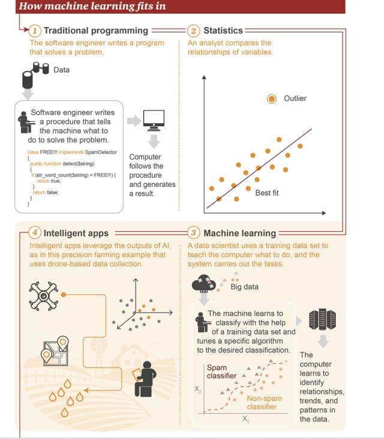
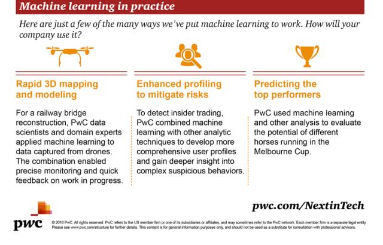

# 三张图读懂机器学习：基本概念、五大流派与九种常见算法

选自 PwC

**作者：Alan Morrison、Anand Rao**

**机器之心编译**

**参与：吴攀、晏奇**

> *机器学习正在进步，我们似乎正在不断接近我们心中的人工智能目标。语音识别、图像检测、机器翻译、风格迁移等技术已经在我们的实际生活中开始得到了应用，但机器学习的发展仍还在继续，甚至被认为有可能彻底改变人类文明的发展方向乃至人类自身。但你了解现在正在发生的这场变革吗？四大会计师事务所之一的普华永道（PwC）近日发布了多份解读机器学习基础的图表，其中介绍了机器学习的基本概念、原理、历史、未来趋势和一些常见的算法。为便于读者阅读，机器之心对这些图表进行了编译和拆分，分三大部分对这些内容进行了呈现，其中也加入了一些扩展链接，希望能帮助你进一步扩展阅读。*

**一、机器学习概览**

**1\. 什么是机器学习？**

机器通过分析大量数据来进行学习。比如说，不需要通过编程来识别猫或人脸，它们可以通过使用图片来进行训练，从而归纳和识别特定的目标。

**2\. 机器学习和人工智能的关系**

机器学习是一种重在寻找数据中的模式并使用这些模式来做出预测的研究和算法的门类。机器学习是人工智能领域的一部分，并且和知识发现与数据挖掘有所交集。更多解读可参阅《[一文读懂机器学习、数据科学、人工智能、深度学习和统计学之间的区别](http://mp.weixin.qq.com/s?__biz=MzA3MzI4MjgzMw==&mid=2650723678&idx=1&sn=5cb049e37427dd2b2a4e30e42bcc2fff&chksm=871b1120b06c983651bf92526cd8554225304200364d39cd18592fd8a6848d1f84cf80aeea22&scene=21#wechat_redirect)》。

**3\. 机器学习的工作方式**

①选择数据：将你的数据分成三组：训练数据、验证数据和测试数据

②模型数据：使用训练数据来构建使用相关特征的模型

③验证模型：使用你的验证数据接入你的模型

④测试模型：使用你的测试数据检查被验证的模型的表现

⑤使用模型：使用完全训练好的模型在新数据上做预测

⑥调优模型：使用更多数据、不同的特征或调整过的参数来提升算法的性能表现

**4\. 机器学习所处的位置**

①传统编程：软件工程师编写程序来解决问题。首先存在一些数据→为了解决一个问题，软件工程师编写一个流程来告诉机器应该怎样做→计算机遵照这一流程执行，然后得出结果

②统计学：分析师比较变量之间的关系

③机器学习：数据科学家使用训练数据集来教计算机应该怎么做，然后系统执行该任务。首先存在大数据→机器会学习使用训练数据集来进行分类，调节特定的算法来实现目标分类→该计算机可学习识别数据中的关系、趋势和模式

④智能应用：智能应用使用人工智能所得到的结果，如图是一个精准农业的应用案例示意，该应用基于无人机所收集到的数据

**5\. 机器学习的实际应用**

机器学习有很多应用场景，这里给出了一些示例，你会怎么使用它？

*   快速三维地图测绘和建模：要建造一架铁路桥，PwC 的数据科学家和领域专家将机器学习应用到了无人机收集到的数据上。这种组合实现了工作成功中的精准监控和快速反馈。

*   增强分析以降低风险：为了检测内部交易，PwC 将机器学习和其它分析技术结合了起来，从而开发了更为全面的用户概况，并且获得了对复杂可疑行为的更深度了解。

*   预测表现最佳的目标：PwC 使用机器学习和其它分析方法来评估 Melbourne Cup 赛场上不同赛马的潜力。

**二、机器学习的演化**

几十年来，人工智能研究者的各个「部落」一直以来都在彼此争夺主导权，参阅机器之心文章《[华盛顿大学教授 Pedro Domingos：机器学习领域五大流派（附演讲 ppt）](http://mp.weixin.qq.com/s?__biz=MzA3MzI4MjgzMw==&mid=400687937&idx=1&sn=d398dcf7472150557d076bc14e57aed5&scene=21#wechat_redirect)》。现在是这些部落联合起来的时候了吗？他们也可能不得不这样做，因为合作和算法融合是实现真正通用人工智能（AGI）的唯一方式。这里给出了机器学习方法的演化之路以及未来的可能模样。扩展阅读《[深度 | 深度学习与神经网络全局概览：核心技术的发展历程](http://mp.weixin.qq.com/s?__biz=MzA3MzI4MjgzMw==&mid=2650717969&idx=1&sn=712e4880e63db42bcb4db5ba06c9856d&scene=21#wechat_redirect)》。

**1\. 五大流派**

①符号主义：使用符号、规则和逻辑来表征知识和进行逻辑推理，最喜欢的算法是：规则和决策树

②贝叶斯派：获取发生的可能性来进行概率推理，最喜欢的算法是：朴素贝叶斯或马尔可夫

③联结主义：使用概率矩阵和加权神经元来动态地识别和归纳模式，最喜欢的算法是：神经网络

④进化主义：生成变化，然后为特定目标获取其中最优的，最喜欢的算法是：遗传算法

⑤Analogizer：根据约束条件来优化函数（尽可能走到更高，但同时不要离开道路），最喜欢的算法是：支持向量机

**2\. 演化的阶段**

1980 年代

*   主导流派：符号主义

*   架构：服务器或大型机

*   主导理论：知识工程

*   基本决策逻辑：决策支持系统，实用性有限

1990 年代到 2000 年

*   主导流派：贝叶斯

*   架构：小型服务器集群

*   主导理论：概率论

*   分类：可扩展的比较或对比，对许多任务都足够好了

2010 年代早期到中期

*   主导流派：联结主义

*   架构：大型服务器农场

*   主导理论：神经科学和概率

*   识别：更加精准的图像和声音识别、翻译、情绪分析等

**3\. 这些流派有望合作，并将各自的方法融合到一起**

2010 年代末期

*   主导流派：联结主义+符号主义

*   架构：许多云

*   主导理论：记忆神经网络、大规模集成、基于知识的推理

*   简单的问答：范围狭窄的、领域特定的知识共享

2020 年代+

*   主导流派：联结主义+符号主义+贝叶斯+……

*   架构：云计算和雾计算

*   主导理论：感知的时候有网络，推理和工作的时候有规则

*   简单感知、推理和行动：有限制的自动化或人机交互

2040 年代+

*   主导流派：算法融合

*   架构：无处不在的服务器

*   主导理论：最佳组合的元学习

*   感知和响应：基于通过多种学习方式获得的知识或经验采取行动或做出回答

**三、机器学习的算法**

你应该使用哪种机器学习算法？这在很大程度上依赖于可用数据的性质和数量以及每一个特定用例中你的训练目标。不要使用最复杂的算法，除非其结果值得付出昂贵的开销和资源。这里给出了一些最常见的算法，按使用简单程度排序。更多内容可参阅机器之心的文章《[机器学习算法集锦：从贝叶斯到深度学习及各自优缺点](http://mp.weixin.qq.com/s?__biz=MzA3MzI4MjgzMw==&mid=2650723438&idx=1&sn=a778051186c0e1fb3cdb4076868fd54a&chksm=871b1010b06c99063ec5599dcecbed5ce3065e7c2f0ab1cc11a8251f2472838302f89cf51d52&scene=21#wechat_redirect)》和《[经验之谈：如何为你的机器学习问题选择合适的算法？](http://mp.weixin.qq.com/s?__biz=MzA3MzI4MjgzMw==&mid=2650723704&idx=1&sn=5e791710b46502661e25ff6f7528003b&chksm=871b1106b06c98107174c81401c1f7017b35939ab20bc83b305ecae8b503690518fd32d75bbd&scene=21#wechat_redirect)》

1\. 决策树（Decision Tree）：在进行逐步应答过程中，典型的决策树分析会使用分层变量或决策节点，例如，可将一个给定用户分类成信用可靠或不可靠。

*   优点：擅长对人、地点、事物的一系列不同特征、品质、特性进行评估

*   场景举例：基于规则的信用评估、赛马结果预测

*   扩展阅读：《[教程 | 从头开始：用 Python 实现决策树算法](http://mp.weixin.qq.com/s?__biz=MzA3MzI4MjgzMw==&mid=2650723438&idx=4&sn=cf3902a9933afe08ac3c38452044cddd&chksm=871b1010b06c99062809133f3ad6279bccd64768a761a2aa6495367048069bc13788929b276a&scene=21#wechat_redirect)》、《[想了解概率图模型？你要先理解图论的基本定义与形式](http://mp.weixin.qq.com/s?__biz=MzA3MzI4MjgzMw==&mid=2650725041&idx=1&sn=0c57ba70e2613e6af80c4ab61c996d44&chksm=871b1ecfb06c97d9547e50705d3e74a2b8c41254f0efc2dd88d2e89eec3bfac5da089f28c398&scene=21#wechat_redirect)》

2\. 支持向量机（Support Vector Machine）：基于超平面（hyperplane），支持向量机可以对数据群进行分类。

*   优点：支持向量机擅长在变量 X 与其它变量之间进行二元分类操作，无论其关系是否是线性的

*   场景举例：新闻分类、手写识别。

*   扩展阅读：《[干货 | 详解支持向量机（附学习资源）](http://mp.weixin.qq.com/s?__biz=MzA3MzI4MjgzMw==&mid=2650722941&idx=2&sn=328ba8aa2657217c1d90304018ba3bc6&chksm=871b1603b06c9f155faf0f1e6d6a62f9d014bcaa85f57abc9f0f9ff0ab0ac608b1749f12c170&scene=21#wechat_redirect)》

3\. 回归（Regression）：回归可以勾画出因变量与一个或多个因变量之间的状态关系。在这个例子中，将垃圾邮件和非垃圾邮件进行了区分。

*   优点：回归可用于识别变量之间的连续关系，即便这个关系不是非常明显

*   场景举例：路面交通流量分析、邮件过滤

4\. 朴素贝叶斯分类（Naive Bayes Classification）：朴素贝叶斯分类器用于计算可能条件的分支概率。每个独立的特征都是「朴素」或条件独立的，因此它们不会影响别的对象。例如，在一个装有共 5 个黄色和红色小球的罐子里，连续拿到两个黄色小球的概率是多少？从图中最上方分支可见，前后抓取两个黄色小球的概率为 1/10。朴素贝叶斯分类器可以计算多个特征的联合条件概率。

*   优点：对于在小数据集上有显著特征的相关对象，朴素贝叶斯方法可对其进行快速分类

*   场景举例：情感分析、消费者分类

5\. 隐马尔可夫模型（Hidden Markov model）：显马尔可夫过程是完全确定性的——一个给定的状态经常会伴随另一个状态。交通信号灯就是一个例子。相反，隐马尔可夫模型通过分析可见数据来计算隐藏状态的发生。随后，借助隐藏状态分析，隐马尔可夫模型可以估计可能的未来观察模式。在本例中，高或低气压的概率（这是隐藏状态）可用于预测晴天、雨天、多云天的概率。

*   优点：容许数据的变化性，适用于识别（recognition）和预测操作

*   场景举例：面部表情分析、气象预测

6\. 随机森林（Random forest）：随机森林算法通过使用多个带有随机选取的数据子集的树（tree）改善了决策树的精确性。本例在基因表达层面上考察了大量与乳腺癌复发相关的基因，并计算出复发风险。

*   优点：随机森林方法被证明对大规模数据集和存在大量且有时不相关特征的项（item）来说很有用

*   场景举例：用户流失分析、风险评估

*   扩展阅读：《[教程 | 从头开始：用 Python 实现随机森林算法](http://mp.weixin.qq.com/s?__biz=MzA3MzI4MjgzMw==&mid=2650722795&idx=3&sn=53a95b9ecc269dc0ec8926253b2d5412&chksm=871b1595b06c9c83d205dcab550d14f2709bbae290219b2ce0ad913a0677dc617f138d1ebb6f&scene=21#wechat_redirect)》

7\. 循环神经网络（Recurrent neural network）：在任意神经网络中，每个神经元都通过 1 个或多个隐藏层来将很多输入转换成单个输出。循环神经网络（RNN）会将值进一步逐层传递，让逐层学习成为可能。换句话说，RNN 存在某种形式的记忆，允许先前的输出去影响后面的输入。

*   优点：循环神经网络在存在大量有序信息时具有预测能力

*   场景举例：图像分类与字幕添加、政治情感分析

8\. 长短期记忆（Long short-term memory，LSTM）与门控循环单元神经网络（gated recurrent unit nerual network）：早期的 RNN 形式是会存在损耗的。尽管这些早期循环神经网络只允许留存少量的早期信息，新近的长短期记忆（LSTM）与门控循环单元（GRU）神经网络都有长期与短期的记忆。换句话说，这些新近的 RNN 拥有更好的控制记忆的能力，允许保留早先的值或是当有必要处理很多系列步骤时重置这些值，这避免了「梯度衰减」或逐层传递的值的最终 degradation。LSTM 与 GRU 网络使得我们可以使用被称为「门（gate）」的记忆模块或结构来控制记忆，这种门可以在合适的时候传递或重置值。

*   优点：长短期记忆和门控循环单元神经网络具备与其它循环神经网络一样的优点，但因为它们有更好的记忆能力，所以更常被使用

*   场景举例：自然语言处理、翻译

*   扩展阅读：《[深度 | LSTM 和递归网络基础教程](http://mp.weixin.qq.com/s?__biz=MzA3MzI4MjgzMw==&mid=2650717709&idx=2&sn=2bff1e56bc75d65e178476ea9a93b2c5&scene=21#wechat_redirect)》和《[干货 | 图解 LSTM 神经网络架构及其 11 种变体（附论文）](http://mp.weixin.qq.com/s?__biz=MzA3MzI4MjgzMw==&mid=2650719562&idx=1&sn=ad6693cdeaa18034ed1c53271f642ef7&chksm=871b0134b06c8822bf89781a81081c161eb82b06d0c20b655bd7b991202d363b6c233ef137ff&scene=21#wechat_redirect)》

9\. 卷积神经网络（convolutional neural network）：卷积是指来自后续层的权重的融合，可用于标记输出层。

*   优点：当存在非常大型的数据集、大量特征和复杂的分类任务时，卷积神经网络是非常有用的

*   场景举例：图像识别、文本转语音、药物发现

*   扩展阅读：《[专栏 | 卷积神经网络简介](http://mp.weixin.qq.com/s?__biz=MzA3MzI4MjgzMw==&mid=2650723520&idx=4&sn=8ee14dd052766ca3e0afa60dcbb65b2d&chksm=871b10beb06c99a81ef547319637a177142d33a40da5a85024fc6a3b623d60d3a7ac22e3efc3&scene=21#wechat_redirect)》、《[从入门到精通：卷积神经网络初学者指南](http://mp.weixin.qq.com/s?__biz=MzA3MzI4MjgzMw==&mid=2650717691&idx=2&sn=3f0b66aa9706aae1a30b01309aa0214c&scene=21#wechat_redirect)》和《[解析深度卷积神经网络的 14 种设计模式](http://mp.weixin.qq.com/s?__biz=MzA3MzI4MjgzMw==&mid=2650720302&idx=1&sn=c88634da158f36db23b9dc7d0dc550ad&chksm=871b0c50b06c854694984e193f289deb51a5efe71f53223dc37feb70509fd957c8af5bb61ab3&scene=21#wechat_redirect)》**

原文链接：

*http://usblogs.pwc.com/emerging-technology/a-look-at-machine-learning-infographic/
http://usblogs.pwc.com/emerging-technology/machine-learning-methods-infographic/
http://usblogs.pwc.com/emerging-technology/machine-learning-evolution-infographic/*

******本文为机器之心编译，***转载请联系本公众号获得授权******。***

✄------------------------------------------------

**加入机器之心（全职记者/实习生）：hr@jiqizhixin.com**

**投稿或寻求报道：editor@jiqizhixin.com**

**广告&商务合作：bd@jiqizhixin.com**