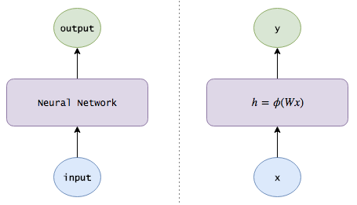
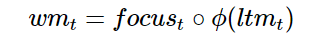
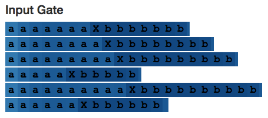

# LSTM 入门必读：从基础知识到工作方式详解

选自 echen

**机器之心编译**

**参与：机器之心编辑部**

 *> *长短期记忆（LSTM）是一种非常重要的神经网络技术，其在语音识别和自然语言处理等许多领域都得到了广泛的应用。在这篇文章中，Edwin Chen 对 LSTM 进行了系统的介绍。机器之心对本文进行了编译。*

我第一次学习 LSTM 的时候，它就吸引了我的眼球。事实证明 LSTM 是对神经网络的一个相当简单的扩展，而且在最近几年里深度学习所实现的惊人成就背后都有它们的身影。所以我会尽可能直观地来呈现它们——以便你们自己就可以弄明白。

首先，让我们来看一幅图：


LSTM 很漂亮吧？让我们开始吧！

（提示：如果你已经熟知神经网络和 LSTM，请直接跳到中间部分，本文的前半部分是入门级概述。）

### **神经网络**

想象一下，我们有一部电影的图像序列，我们想用一个活动来标记每一副图像（例如，这是一场战斗吗？图中的人物在交谈吗？图中的人物在吃东西吗......）

我们如何做到这一点呢？

一种方法就是忽略图像的顺序本质，构造将每幅图像单独考虑的图像分类器。例如，在提供足够多的图像和标签时：

*   我们的算法首先检测到较低水平的模式，例如形状和边缘。

*   在更多的数据下，它可能学会将这些模式组合成更加复杂的模式，例如人脸（两个圆形东西下面有一个三角形的东西，下面还有一个椭圆形的东西），或者猫。

*   甚至在更多的数据下，它可能学会把这些高水平的模式映射到活动本身（具有嘴巴、牛排和叉子的情景可能与吃有关）。

那么，这就是一个深度神经网络（deep neural network）：它使用一副图片作为输入返回一个活动作为输出，就像我们可以在不了解任何关于狗的知识就可以学会在狗的行为中检测到模式一样（在看了足够多的柯基犬之后，我们会发现一些诸如毛茸茸的屁股和鼓槌般的腿），深度神经网络可以通过隐藏层的表征来学会表示图片。

#### **数学描述**

我假定读者早已熟悉了基本的神经网络，下面让我们来快速地复习一下吧。

*   只有一个单独的隐藏层的神经网络将一个向量 x 作为输入，我们可以将它看做一组神经元。

*   每个输入神经元都被通过一组学习得到的权重连接到隐藏层。

*   第 j 个隐藏神经元的输出如下：（其中ϕ 是一个激活函数）

*   隐藏层是全连接到输出层的，第 j 个输出神经元的输出 yj 如下：如果我们需要输出概率，我们可以通过 softmax 函数对输出做一下变换。

写成矩阵形式如下：


其中

*   x 是输入向量

*   W 是连接输入和隐藏层的权重矩阵

*   V 是连接隐藏层和输出的权重矩阵

*   常用的激活函数ϕ分别是 sigmoid 函数σ(x)，它可以将数字压缩在（0,1）的范围；双曲正切函数（hyperbolic tangent）tanh(x)，它将数字压缩在（-1,1）的范围；以及修正线性单元函数（rectified linear unit）函数，ReLU(x)=max(0,x)。

下面用一幅图来描述神经网络：



（注意：为了使符号更加简洁，我假设 x 和 h 各包含一个代表学习偏差权重的固定为 1 的附加偏置神经元（bias neuron）。）

### **使用循环神经网络（RNN）记忆信息**

然而忽略电影图像的序列信息只是最简单的机器学习。如果我们看见了一副沙滩的景象，我们应该在之后的帧里强调沙滩的活动：某人在水中的图片应该被更多可能地标记为游泳，而不是洗澡；某人闭着眼睛躺着的图片应该被更多地标记为日光浴。如果我们记得 Bob 刚刚到了一家超市，那么即使没有任何特别的超市特征，Bob 拿着一块培根的照片应该更可能地被归类为购物而不是烹饪。

所以我们想要的就是让我们的模型去追踪这个世界的状态：

1.  在看完每一张图片之后，模型会输出一个标签，也会更新关于这个世界的知识。例如，模型可能学会自动地发现和追踪位置（目前的场景是在室内还是在沙滩？）、一天中的时间（如果场景中包含月亮，那么模型应该记住现在是晚上）以及电影中的进度（这是第一张图还是第 100 帧？）等信息。至关重要的是，就像神经网络能够在没有被馈送信息的情况下自动地发现隐藏的边缘、形状以及人脸等图像一样，我们的模型也应该依靠它们自己来发现一些有用的信息。

2.  在被给定一张新图片的时候，模型应该结合已经收集到的知识来做出更好的工作。

这就是一个循环神经网络（RNN）。除了简单地输入一幅图像并返回一个活动标签，RNN 也会维护内部关于这个世界的知识（就是分配给不同信息片段的权重），以帮助执行它的分类。

#### **数学描述**

所以，让我们把内部知识（internal knowledge）的概念加入到我们的方程中吧，我们可以将内部记忆看做网络会随着时间进行维护的信息片段的记忆。

但是这是容易的：我们知道神经网络的隐藏层早已将输入的有用信息做了编码，所以我们为何不把这些隐藏层作为记忆呢？这就有了我们的 RNN 方程：


注意在时间 t 计算得到的隐藏状态 ht（ht 就是我们这里的内部知识）会被反馈到下一个时间。（另外，我会使用例如隐藏状态、知识、记忆以及信念这样的词语来变换地描述 ht）


### **通过 LSTM 来实现更长时间的记忆**

让我们来思考一下模型是如何更新关于这个世界的知识的。到目前为止，我们还没有给这种更新施加任何限制，所以它的知识可能变得非常混乱：在一帧图像里面它会认为人物在美国，在下一帧它看到人在吃寿司，就会认为人是在日本，在其后的一帧它看到了北极熊，就会认为他们是在伊兹拉岛。或者也许它有大量的信息表明 Alice 是一名投资分析师，但是在它看到了她的厨艺之后它就会认定她是一名职业杀手。

这种混乱意味着信息在快速地转移和消失，模型难以保持长期的记忆。所以我们想要的是让网络学会如何让它以一种更加温和的方式来进化自己关于这个世界的知识，从而更新自己的信念（没有 Bob 的场景不应该改变关于 Bob 的信息包含 Alice 的场景应该聚焦于收集关于她的一些细节信息）。

下面是我们如何做这件事的 4 种方式：

1.  添加一个遗忘机制（forgetting mechanism）：如果一个场景结束了，模型应该忘记当前场景中的位置，一天的时间并且重置任何与场景相关的信息；然而，如果场景中的一个人死掉了，那么模型应该一直记住那个死去的人已经不再活着了。因此，我们想要模型学会一种有区分的遗忘/记忆机制：当新的输入到来时，它需要知道记住哪些信念，以及丢弃哪些信念。

2.  添加一个保存机制（saving mechanism）：当模型看到一副新的图片时，它需要学习关于这张图片的信息是否值得使用和保存。或许你妈妈给了你一片关于凯莉·詹娜的文章，但是谁会在乎呢？

3.  所以当新的输入来临时，模型首先要忘掉任何它认为不再需要的长期记忆信息。然后学习新输入的哪些部分是值得利用的，并将它们保存在自己的长期记忆中。

4.  将长期记忆聚焦在工作记忆中：最后，模型需要学习长期记忆中的哪些部分是即刻有用的。例如，Bob 的年龄可能是一条需要长期保持的信息（儿童很可能正在玩耍，而成年人很可能正在工作），但是如果他不在当前的场景中，那么这条信息很可能就不是特别相关。所以，模型学习去聚焦哪一部分，而不总是使用完全的长期记忆。

这就是一个长短期记忆网络（long short-term memory network）。LSTM 会以一种非常精确的方式来传递记忆——使用了一种特定的学习机制：哪些部分的信息需要被记住，哪些部分的信息需要被更新，哪些部分的信息需要被注意。与之相反，循环神经网络会以一种不可控制的方式在每一个时间步骤都重写记忆。这有助于在更长的时间内追踪信息。

#### 
**数学描述**

让我们来对 LSTM 做一下数学描述。

在时间 t，我们收到了新的输入 xt。我们也有自己的从之前的时间步中传递下来的长期记忆和工作记忆，ltm（t−1）以及 wm（t−1）（两者都是 n 维向量），这就是我们想要更新的东西。

我们将要开始我们的长期记忆。首先，我们需要知道哪些长期记忆需要保持，哪些需要丢弃，所以我们想要使用新的输入和我们的工作记忆来学习一个由 n 个介于 0 和 1 之间的数字组成的记忆门，每一个数字都决定一个长期记忆的元素被保持多少。（1 意味着完全保持，0 意味着完全丢弃。）

自然地我们可以使用一个小型神经网络来学习这个记忆门：


（注意与我们之前的神经网络方程的相似性；这只是一个浅层的神经网络。并且，我们使用了 sigmoid 激活函数，因为我们需要的数字是介于 0 和 1 之间的。）

接下来，我们需要计算我们能够从 xt 中学习到的信息，也就是我们长期记忆中的候选者：


其中ϕ是一个激活函数，通常选择双曲正切函数。

然而，在我们将这个候选者加进我们的记忆之前，我们想要学到哪些部分是实际上值得使用和保存的：


（思考一下当你在网页上读到某些内容的时候会发生什么。当一条新闻文章可能包含希拉里的信息时，如果消息来源是 Breitbart，那你就应该忽略它。）

现在让我们把所有这些步骤结合起来。在忘掉我们认为将来不会再次用到的信息以及保存有用的新来的信息之后，我们就有了更新的长期记忆：


接下来，来更新我们的工作记忆：我们想要学习如何将我们的长期记忆专注于那些将会即刻有用的信息上。（换句话说，我们想要学习将哪些信息从外部硬盘移动到正在工作的笔记本内存上。）所以我们会学习一个聚焦/注意向量（focus/attention vector）：


然后我们的工作记忆就成为了：



换言之，我们将全部注意集中在 focus 为 1 的元素上，并且忽略那些 focus 是 0 的元素。

然后我们对长期记忆的工作就完成了！也希望这能够称为你的长期记忆。

总结：一个普通的 RNN 用一个方程来更新隐藏状态/记忆：


而 LSTM 使用数个方程：


其中每一个记忆/注意子机制只是 LSTM 的一个迷你形式：


（注意：我在这里使用的术语和变量的名字和通常文献中是有所不同的。以下是一些标准名称，以后我将会交换使用：

*   长期记忆 ltm(t), 通常被称为**cell state**, 简写 c(t).

*   工作记忆 wm(t) 通常被称为**hidden state**, 简写 h(t)。这个和普通 RNN 中的隐藏状态是类似的。

*   记忆向量 remember(t)，通常被称为**forget gate** (尽管遗忘门中，1 仍旧意味着完全保持记忆 0 意味着完全忘记)，简称 f(t)。

*   保存向量 save(t)，通常被称为 input gate，（因为它决定输入中有多少被允许进入 cell state），简称 i(t)。

*   注意向量 focus(t)，通常被称为 output gate，简称 o(t)。


### **卡比兽**

写这篇博文的时间我本可以抓一百只 Pidgeys，请看下面的漫画。

#### **神经网络**


神经网络会以 0.6 的概率判定输入图片中的卡比兽正在淋浴，以 0.3 的概率判定卡比兽正在喝水，以 0.1 的概率判定卡比兽正在遭遇袭击。

#### **循环神经网络**


当循环神经网络被用来做这件事的时候，它具有对前一幅图的记忆。最终结果是卡比兽正在遭遇袭击的概率为 0.6，卡比兽正在淋浴的概率是 0.3，卡比兽正在喝水的概率是 0.1。结果要明显好于上一幅图中的神经网络。

#### **LSTM**


具备长期记忆的 LSTM，在记忆了多种相关信息的前提下，将对卡通图画中的场景描述准确的概率提高到了 0.9。

### **学会编程**

让我们来看一下一个 LSTM 可以做到的一些例子吧。遵循着 Andrej Karpathy 的精湛的博文（http://karpathy.github.io/2015/05/21/rnn-effectiveness/），我将使用字符级别的 LSTM 模型，这些模型接受字符序列的输入，被训练来预测序列中的下一个字符。

虽然这看起来有点玩笑，但是字符级别的模型确实是非常有用的，甚至比单词级别的模型更加有用。例如：

*   试想一个自动编程器足够智能，能够允许你在你的手机上编程。从理论上讲，一个 LSTM 模型能够追踪你当前所在函数的返回类型，可以更好地建议你返回那个变量；它也能够在不经过编译的情况下通过返回的错误类型就知道你是不是已经造成了一个 bug。

*   像机器翻译这样的自然语言处理应用在处理罕见词条的时候经常会出现问题。你如何翻译一个从未见过的单词呢，或者你如何将一个形容词转换成动词呢？即使你知道一条推文的意思，你如何生成一个新的标签来描述它呢？字符级别的模型可以空想出新的项，所以这是另外一个具有有趣应用的领域。

所以就开始了，我启动了一个 EC2 p2.xlarge spot 实例，并在 Apache Commons Lang 代码库（链接：https://github.com/apache/commons-lang）上训练了一个 3 层的 LSTM 模型。以下是几个小时后生成的程序：


尽管这段代码确实不是完美的，但是它比很多我认识的数据科学家要做的好一些。我们可以发现 LSTM 已经学会了很多有趣的（也是正确的！）编程行为。

*   它懂得如何构造类： 最顶部有 license 相关的信息，紧跟着是 package 和 import，再然后是注释和类的定义，再到后面是变量和函数。类似地，它知道如何创建函数：注释遵循正确的顺序（描述，然后是 @param，然后是 @return，等等），decorator 被正确放置，非空函数能够以合适的返回语句结束。关键是，这种行为跨越了大篇幅的代码——你看图中的代码块有多大！

*   它还能够追踪子程序和嵌套级别：缩进总是正确的，if 语句和 for 循环总能够被处理好。

*   它甚至还懂得如何构造测试。

那么模型是如何做到这一点的呢？让我们来看一下几个隐藏状态。

下面是一个貌似在追踪代码外层缩进的神经元（当读取字符作为输入的时候，也就是说，在尝试生成下一个字符的时候，每一个字符都被着上了神经元状态的颜色；红色的单元是负的，蓝色的单元是正的）：


下面是一个统计空格数量的神经元：


娱乐一下，下面是在 TensorFlow 代码库上训练得到的另一个不同的 3 层 LSTM 模型的输出：


网络上还有很多有趣的例子，如果你想了解更多，请查看：http://karpathy.github.io/2015/05/21/rnn-effectiveness/

### **研究 LSTM 的内部**

让我们再稍往深处挖掘一下。我们看一下上一部分隐藏状态的例子，但是我也想玩转 LSTM cell 状态以及其他的记忆机制。我们期待着，它们会迸发出火花呢，还是会有令人惊喜的画面？

### **计数**

为了研究，让我们从教一个 LSTM 计数开始。（你应该还记得 Java 和 Python 的 LSTM 模型是如何生成合适的缩进的！）所以我生成了如下形式的序列：

```py
  aaaaaXbbbbb

```

（N 个字母「a」，后面跟着一个字母分隔符 X，后面是 N 个字母「b」，其中 1 <= N <= 10），然后训练一个具有 10 个隐藏神经元的单层 LSTM。

不出所料，LSTM 模型在训练期间完美地学习--甚至能够将生成推广到几步之外。（即使在开始的时候当我们尝试让它记到 19 的时候它失败了。）

```py
  aaaaaaaaaaaaaaaXbbbbbbbbbbbbbbb aaaaaaaaaaaaaaaaXbbbbbbbbbbbbbbbb aaaaaaaaaaaaaaaaaXbbbbbbbbbbbbbbbbb aaaaaaaaaaaaaaaaaaXbbbbbbbbbbbbbbbbbb aaaaaaaaaaaaaaaaaaaXbbbbbbbbbbbbbbbbbb # Here it begins to fail: the model is given 19 "a"s, but outputs only 18 "b"s.

```

我们期望找到一个隐藏状态神经元，它能够在我们观察模型内部的时候计出每一个 a 的数目。正如我们做的：


我开发了一个可以让你玩转 LSTM 的小型的 web app，神经元 #2 貌似既能够记录已经看到的 a 的数目，也能记录已经看到的字符 b 的数目。（请记得，单元的颜色是根据激活程度着色的，从深红色的 [-1] 到深蓝色的 [+1]。）

那么 cell 的状态是怎么样的呢？它的行为类似于这样：


有趣的是，工作记忆就像是长期记忆的「锐化版」。但是这个在一般情况是否成立呢？

这确实是成立的。（我正是我们所期望的，因为长期记忆被双曲正切激活函数进行了压缩，而且输出门限制了通过它的内容。）例如，下图是所有的 10 个 cell 在某一时刻的状态。我们看到了大量的颜色很清淡的 cell，这代表它们的值接近 0。


相比之下，10 个工作记忆的神经元看起来更加聚焦。第 1、3、5、7 个神经元甚至在序列的前半部分全是 0。


让我们再回头看一下神经元 #2。这里有一些候选的记忆和输入门。它们在每个序列的前半部分或者后半部分都是相对不变的——就像神经元在每一步都在进行 a+=1 或者 a-=1 的计算。




最后，这里是神经元 2 的整体概览：


如果你想自己研究一下不同计数神经元，你可以在这个可视化 web app 中自己玩一下。


（注意：这远远不是一个 LSTM 模型可以学会计数的唯一方式，我在这里只描述了一个而已。但是我认为观察网络行为是有趣的，并且这有助于构建更好的模型；毕竟，神经网络中的很多思想都是来自于人脑。如果我们看到了意料之外的行为，我们也许会有能力设计出更加有效地学习机制。）

#### **来自计数的计数**

让我们来看一下一个稍微有点复杂的计数器。这次，我生成了如下的序列形式：

```py
  aaXaXaaYbbbbb

```

（N 个 a 中间随机地插入 X，后边跟一个分隔符 Y，再后边是 N 个 b。）LSTM 仍然必须数清楚 a 的数目，但是这一次需要忽略 X 的数目。

在这个链接中查看整个 LSTM（http://blog.echen.me/lstm-explorer/#/network?file=selective_counter）我们希望看到一个正在计数的神经元——一个正在计数的、每看到一个 X 输入门就变成 0 的神经元。在我们做到了！


上图是 neuron 20 的 cell 状态。它的值一直保持增大，直到遇到分割字符 Y，然后就一直减小，直到序列的末尾——就像在计算一个随着 a 增大，随着 b 减小的变量 num_bs_left_to_print 一样。

如果我们观察它的输入门，会看到它确实是将 X 的数量忽略了：


然而，有趣的是，候选的记忆会在有关联的 X 上被完全激活--这证明了为什么需要哪些输入门。（但是，如果输入门不是模型架构的一部分，至少在这个简单的例子中，网络也会以其他的方式忽略 X 的数量。）


我们再来看一下神经元 10。


这个神经元是有趣的，因为它仅仅在读取到 Y 的时候才会被激活—然而它还是能够对序列中遇到的 a 字符进行编码。（在图中可能很难区分出来，但是序列中 a 的数目一样的时候，Y 的颜色是相同的，即便不相同，差距也在 0.1% 以内。你可以看到，a 比较少的序列中 Y 的颜色要浅一些。）或许其他的神经元会看到神经元 10 比较松弛。


### **记忆状态**

下面我想研究一下 LSTM 是如何记忆状态的。同样的，我生成了以下形式的序列：

```py
  AxxxxxxYa BxxxxxxYb

```

（也就是说，一个「A」或者「B」，后面跟着 1-10 个 x，然后是一个分割字符「Y」，最终以一个起始字符的小写形式结尾。）这种情况下，网络需要记住到底是一个「状态 A」还是一个「B」状态。

我们希望找到一个神经元能够在记得序列是以「A」开头的，希望找到另一个神经元记得序列是以「B」开头的。我们做到了。

例如这里是一个「A」神经元，当读取到「A」的时候它会激活，持续记忆，直到需要生成最后一个字母的时候。要注意，输入门忽略了序列中所有的 x。


下面是对应的「B」神经元：


有趣的一点是，即使在读取到分隔符「Y」之前，关于 A 和 B 的知识是不需要的，但是隐藏状态在所有的中间输入中都是存在的。这看上去有一点「低效」，因为神经元在计数 x 的过程中做了一些双重任务。


#### **复制任务**

最后，让我们来看一下 LSTM 是如何学会复制信息的。（回想一下我们的 Java 版的 LSTM 曾经学会了记忆并且复制一个 Apache license。）

（注意：如果你思考 LSTM 是如何工作的，记住大量的单独的、细节的信息其实并不是它们所擅长的事情。例如，你可能已经注意到了 LSTM 生成的代码的一个主要缺陷就是它经常使用未定义的变量—LSTM 无法记住哪些变量已经在环境中了。这并不是令人惊奇的事情，因为很难使用单个 cell 就能有效地对想字符一样的多值信息进行编码，并且 LSTM 并没有一种自然的机制来连接相邻的记忆以形成单词。记忆网络（memory networks）和神经图灵机（neutral turing machine）就是两种能够有助于修正这个缺点的神经网络的扩展形式，通过增加外部记忆组件。所以尽管复制并不是 LSTM 可以很有效地完成的，但是无论如何，去看一下它是如何完成这个工作是有趣的。）

针对这个复制任务，我训练了一个很小的两层 LSTM 来生成如下形式的序列：

```py
  baaXbaa abcXabc

```

（也就是说，一个由 a、b、c3 种字符组成的子序列，后面跟着一个分隔符「X」，后面再跟着一个同样的子序列）。

我不确定「复制神经元」到底应该是长什么样子的，所以为了找到能够记住部分初始子序列的神经元，我观察了一下它们在读取分隔符 X 时的隐藏状态。由于神经网络需要编码初始子序列，它的状态应该依据它们学到的东西而看起来有所不同。

例如，下面的这一幅图画出了神经元 5 在读入分隔符「X」时候的隐藏状态。这个神经元明显将那些以「c」开头的序列从那些不是以「c」开头的序列中区分出来。


另一个例子，这是神经元 20 在读入分隔符「X」时的隐藏状态。看起来它选择了那些以「b」开头的子序列。


有趣的是，如果我们观察神经元 20 的 cell 状态，它貌似能够捕捉这三种子序列。


这里是神经元 20 关于整个序列的 cell 状态个隐藏状态。请注意在整个初始序列中它的隐藏状态是关闭的（也许这是期望之中的，因为它的记忆仅仅需要在某一点被动保持）。


然而，如果我们看得更加仔细一些，就会发现，只要下一个字符是「b」, 它就是正的。所以，与其说是以 b 字母开头的序列，还不如说是下一个字符是 b 的序列。

就我所知，这个模式在整个网络中都存在——所有的神经元貌似都在预测下一个字符，而不是在记住处在当前位置的字符。例如，神经元 5 貌似就是一个「下一个字符」预测器。


我不确定这是不是 LSTM 在学习复制信息时候的默认类型，或者复制机制还有哪些类型呢？


### **扩展**

让我们来回顾一下你如何自己来探索 LSTM。

首先，我们想要解决的大多数问题都是阶段性的，所以我们应该把一些过去的学习结合到我们的模型中。但是我们早已知道神经网络的隐藏层在编码自己的信息，所以为何不使用这些隐藏层，将它们作为我们向下一步传递的记忆呢？这样一来，我们就有了循环神经网络（RNN）。

但是从我们的行为就能知道，我们是不愿意去追踪知识的；当我们阅读一篇新的政论文章时，我们并不会立即相信它所谈论的内容并将其与我们自己对这个世界的信念所结合。我们选择性地保存哪些信息，丢弃哪些信息，以及哪些信息可以用来决定如何处理下一次读到的新闻。因此，我们想要学习收集、更新以及应用信息——为何不通过它们自己的小型神经网络来学习这些东西呢？如此，我们就有了 LSTM。

现在我们已经走通了这个过程，我们也可以想出我们的修正：

*   例如，或许你认为 LSTM 区分长期记忆和工作记忆是愚蠢的行为—为何不使用一种记忆呢？或者，或许你能够发现区分记忆门和保存门是多余的--任何我们忘记地东西都应该被新的信息代替，反之亦然。所以我们现在想出了一种流行的 LSTM 变种，门控循环神经网络（GRU）：https://arxiv.org/abs/1412.3555

*   或者你可能认为，当决定哪些信息需要被记住、保存、注意的时候，我们不应该仅仅依靠我们的工作记忆—为什么不同时使用长期记忆呢？如此，你发现了 Peephole LSTM。

让我们看一下最后的例子，使用一个两层多的 LSTM 来训练 Trump 的推特，尽管这是很大规模的数据集，但是这个 LSTM 已经足以学到很多模式。

例如，这是一个在标签、URL 以及 @mention 中跟踪位置的神经元：


这是一个合适的名词检测器（注意它并不是简单的注重大写单词）：


这是一个助动词+「to be」的检测器（例如 will be, I've always been,has never been）


这是一个引文属性：


这是一个 MAGA 和大小写神经元：


这里是一些用 LSTM 生成的公告（ok，其中有一个是一条真正的推特，你猜一下哪个是）：


不幸的是，LSTM 仅仅学会了像疯子一样疯狂书写。******************

*原文地址：http://blog.echen.me/2017/05/30/exploring-lstms/*

******本文为机器之心编译，***转载请联系本公众号获得授权******。***

✄------------------------------------------------

**加入机器之心（全职记者/实习生）：hr@jiqizhixin.com**

**投稿或寻求报道：editor@jiqizhixin.com**

**广告&商务合作：bd@jiqizhixin.com**

**点击阅读原文，查看机器之心官网↓↓↓***