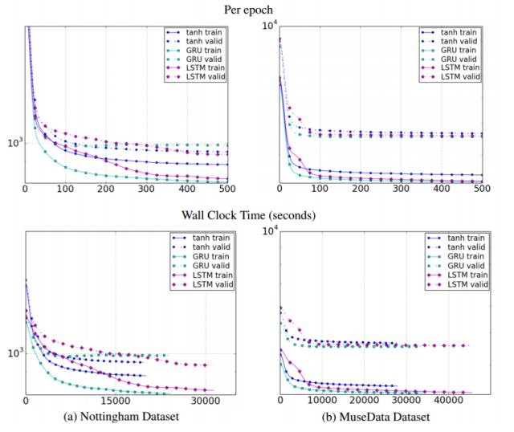

# 从语言学到深度学习 NLP，一文概述自然语言处理

选自 arXiv

**机器之心编译**

**参与：李亚洲、蒋思源**

> 本文从两篇论文出发先简要介绍了自然语言处理的基本分类和基本概念，再向读者展示了深度学习中的 NLP。这两篇论文都是很好的综述性入门论文，希望详细了解自然语言处理的读者可以进一步阅读这两篇论文。

本文第一部分介绍了自然语言处理的基本概念，作者将 NLP 分为自然语言理解和自然语言生成，并解释了 NLP 过程的各个层级和应用，这一篇论文很适合读者系统的了解 NLP 的基本概念。

### 第二部分描述的是基于深度学习的 NLP，该论文首先描述了深度学习中的词表征，即从 one-hot 编码、词袋模型到词嵌入和 word2vec 等，我们首先需要数字表征词汇才能进一步做自然语言处理。随后，本论文介绍了各种应用于 NLP 的模型，包括卷积神经网络、循环神经网络、长短期记忆和门控循环神经网络等，这一些模型加上其它如注意力机制那样的技巧就能实现十分强大的能力，如机器翻译、问答系统和情感分析等。

### **概念基础**

论文地址：https://arxiv.org/abs/1708.05148

自然语言处理（NLP）近来因为人类语言的计算表征和分析而获得越来越多的关注。它已经应用于许多如机器翻译、垃圾邮件检测、信息提取、自动摘要、医疗和问答系统等领域。本论文从历史和发展的角度讨论不同层次的 NLP 和自然语言生成（NLG）的不同部分，以呈现 NLP 应用的各种最新技术和当前的趋势与挑战。

**1 前言**

自然语言处理（NLP）是人工智能和语言学的一部分，它致力于使用计算机理解人类语言中的句子或词语。NLP 以降低用户工作量并满足使用自然语言进行人机交互的愿望为目的。因为用户可能不熟悉机器语言，所以 NLP 就能帮助这样的用户使用自然语言和机器交流。

语言可以被定义为一组规则或符号。我们会组合符号并用来传递信息或广播信息。NLP 基本上可以分为两个部分，即自然语言理解和自然语言生成，它们演化为理解和生成文本的任务（图 1）。

*图 1：NLP 的粗分类*

语言学是语言的科学，它包括代表声音的音系学（Phonology）、代表构词法的词态学（Morphology）、代表语句结构的句法学（Syntax）、代表理解的语义句法学（Semantics syntax）和语用学（Pragmatics）。

NLP 的研究任务如自动摘要、指代消解（Co-Reference Resolution）、语篇分析、机器翻译、语素切分（Morphological Segmentation）、命名实体识别、光学字符识别和词性标注等。自动摘要即对一组文本的详细信息以一种特定的格式生成一个摘要。指代消解指的是用句子或更大的一组文本确定哪些词指代的是相同对象。语篇分析指识别连接文本的语篇结构，而机器翻译则指两种或多种语言之间的自动翻译。词素切分表示将词汇分割为词素，并识别词素的类别。命名实体识别（NER）描述了一串文本，并确定哪一个名词指代专有名词。光学字符识别（OCR）给出了打印版文档（如 PDF）中间的文字信息。词性标注描述了一个句子及其每个单词的词性。虽然这些 NLP 任务看起来彼此不同，但实际上它们经常多个任务协同处理。

**2 NLP 的层级**

语言的层级是表达 NLP 的最具解释性的方法，能通过实现内容规划（Content Planning)、语句规划（Sentence Planning）与表层实现（Surface Realization）三个阶段，帮助 NLP 生成文本（图 2）。

*图 2：NLP 架构的阶段*

语言学是涉及到语言、语境和各种语言形式的学科。与 NLP 相关的重要术语包括：

*   音系学

*   形态学

*   词汇学

*   句法学

*   语义学

*   语篇分析

*   语用学

**3 自然语言生成**

NLG 是从内在表征生成有含义的短语、句子和段落的处理过程。它是 NLP 的一部分，包括四个阶段：确定目标、通过场景评估规划如何实现目标、可用的对话源、把规划实现为文本，如下图 3。生成与理解是相反的过程。

*图 3：NLG 的组件*

**6 NLP 的应用**

NLP 可被他应用于各种领域，例如机器翻译、垃圾邮件检测、信息提取等。在这一部分，该论文对以下 NLP 的应用进行了介绍：

*   机器翻译

*   文本分类

*   垃圾邮件过滤

*   信息提取

*   自动摘要

*   对话系统

*   医疗

### **深度学习中的 NLP**

以上内容对 NLP 进行了基础的介绍，但忽略了近年来深度学习在 NLP 领域的应用，因此我们补充了北京理工大学的一篇论文。该论文回顾了 NLP 之中的深度学习重要模型与方法，比如卷积神经网络、循环神经网络、递归神经网络；同时还讨论了记忆增强策略、注意力机制以及无监督模型、强化学习模型、深度生成模型在语言相关任务上的应用；最后还讨论了深度学习的各种框架，以期从深度学习的角度全面概述 NLP 发展近况。

如今，深度学习架构、算法在计算机视觉、模式识别领域已经取得惊人的进展。在这种趋势之下，近期基于深度学习新方法的 NLP 研究有了极大增长。

*图 4：2012 年-2017 年，在 ACL、EMNLP、EACL、NAACL 会议上呈现的深度学习论文数量增长趋势。*

十几年来，解决 NLP 问题的机器学习方法都是基于浅层模型，例如 SVM 和 logistic 回归，其训练是在非常高维、稀疏的特征上进行的。在过去几年，基于密集向量表征的神经网络在多种 NLP 任务上都产生了优秀成果。这一趋势由词嵌入与深度学习方法的成功所兴起。深度学习使得多层级的自动特征表征的学习成为了可能。传统的基于机器学习方法的 NLP 系统极度依赖手写特征，既耗费时间，又总是不完整。

在 2011 年，Collobert 等人的论文证明简单的深度学习框架能够在多种 NLP 任务上超越最顶尖的方法，比如在实体命名识别（NER）任务、语义角色标注 (SRL）任务、词性标注（POS tagging）任务上。从此，各种基于深度学习的复杂算法被提出，来解决 NLP 难题。

这篇论文回顾了与深度学习相关的重要模型与方法，比如卷积神经网络、循环神经网络、递归神经网络。此外，论文中还讨论了记忆增强策略、注意机制以及无监督模型、强化学习模型、深度生成模型在语言相关任务上的应用。

在 2016 年，Goldberg 也以教程方式介绍过 NLP 领域的深度学习，主要对分布式语义（word2vec、CNN）进行了技术概述，但没有讨论深度学习的各种架构。这篇论文能提供更综合的思考。

摘要：深度学习方法利用多个处理层来学习数据的层级表征，在许多领域获得了顶级结果。近期，在自然语言处理领域出现了大量的模型设计和方法。在此论文中，我们回顾了应用于 NLP 任务中，与深度学习相关的重要模型、方法，同时概览了这种进展。我们也总结、对比了各种模型，对 NLP 中深度学习的过去、现在与未来提供了详细理解。

论文地址：https://arxiv.org/abs/1708.02709

*图 2：一个 D 维向量的分布式向量表达，其中 D << V，V 是词汇的大小。*

*图 3：Bengio 等人 2003 年提出的神经语言模型，C(i) 是第 i 个词嵌入。*

*图 4：CBOW（continuous bag-of-words）的模型*

*表 1：框架提供嵌入工具和方法*

*图 5：Collobert 等人使用的 CNN 框架，来做词级别的类别预测*

*图 6：在文本上的 CNN 建模 (Zhang and Wallace, 2015）*

*图 7：4 个 7-gram 核的 Top7 -grams，每个核对一种特定类型的 7-gram 敏感 (Kim, 2014)*

*图 8：DCNN 子图。有了动态池化，一顶层只需要小宽度的过滤层能够关联输入语句中离得很远的短语 (Kalchbrenner et al., 2014)。*

*图 9：简单的 RNN 网络*

图 10：LSTM 和 GRU 的示图 (Chung et al., 2014)

*图 11：不同单元类型关于迭代数量（上幅图）和时钟时间（下幅图）的训练、验证集学习曲线。其中 y 轴为对数尺度描述的模型负对数似然度。*

*图 12：LSTM 解码器结合 CNN 图像嵌入器生成图像描述 (Vinyals et al., 2015a)*

*图 13：神经图像 QA (Malinowski et al., 2015)*

*图 14：词校准矩阵 (Bahdanau et al., 2014)*

*图 15：使用注意力进行区域分级 (Wang et al., 2016)*

*图 16：特定区域语句上的注意模块专注点 (Wang et al., 2016)*

*图 17：应用于含有「but」语句的递归神经网络 (Socher et al., 2013)*

*图 18：基于 RNN 的 AVE 进行语句生成（Bowman et al., 2015）*

******本文为机器之心编译，***转载请联系本公众号获得授权******。***

✄------------------------------------------------

**加入机器之心（全职记者/实习生）：hr@jiqizhixin.com**

**投稿或寻求报道：content@jiqizhixin.com**

**广告&商务合作：bd@jiqizhixin.com**