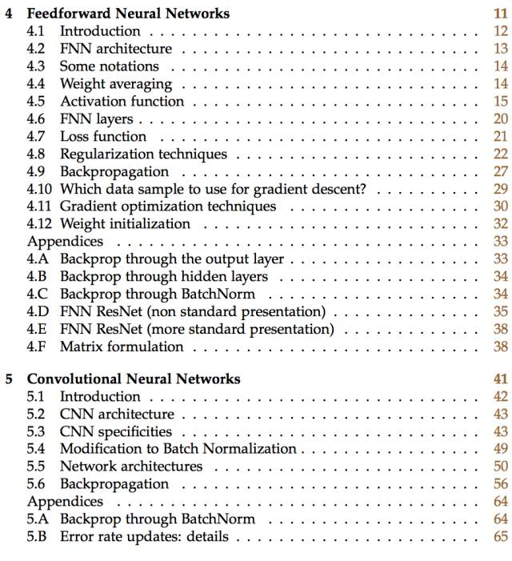
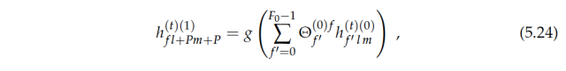
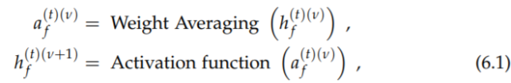

# 最全的 DNN 概述论文：详解前馈、卷积和循环神经网络技术

选自 arXiv

**机器之心编译**

> 本论文技术性地介绍了三种最常见的神经网络：前馈神经网络、卷积神经网络和循环神经网络。且该文详细介绍了每一种网络的基本构建块，其包括了基本架构、传播方式、连接方式、激活函数、反向传播的应用和各种优化算法的原理。本文不仅介绍了这三种神经网络的基本原理与概念，同时还用数学表达式正式地定义了这些概念。这是一份十分全面的神经网络综述论文，机器之心简要摘取了部分章节，更详细和完整的论述请查看原论文。

论文地址：https://arxiv.org/pdf/1709.01412.pdf

**目录**

**简介**

该论文旨在用一种技术性但是偏教学的方式介绍三种常见的神经网络架构形式，随着章节的深入，内容的复杂度逐渐增加。

第 4 章首先介绍引入的第一种网络类型：常规前馈神经网络，它本身是经典感知机 [8] 算法的进化版本。大家应该看到后者是非线性回归，前馈网络一层层堆叠感知器层。

我们还在第 4 章介绍了最简单的神经网络层的基本构建块：加权平均（weight averaging）和激活函数（activation function），整个训练的目的是最小化适应任务（分类或回归）的损失函数。反向传播算法的更多技术细节详见第 4 章附录，附录中还包含对先进前馈神经网络 ResNet 的介绍。你可以找到前馈网络的矩阵描述。

第 5 章中，我们介绍了第二种神经网络类型：卷积网络，尤其是适用于处理和标注图像的卷积网络。这意味着我们要介绍与之相关的数学工具：卷积、池化、步幅等等。我们之后会介绍多个卷积架构，附录中再次详细介绍本章主要内容较难的步骤。

最后，第 6 章介绍了适合时间序列数据的网络架构——循环神经网络。前面两章内容的新发现和修订将在本章的主要内容中进行介绍，附录介绍有助于理解该网络架构最复杂公式的知识。

### **第 4 章 前馈神经网络**

本章，我们看一下第一种神经网络：常规前馈神经网络（FNN）。该网络不考虑输入数据可能具备的任何特定结构。尽管如此，它仍是非常强大的机器学习工具，尤其是与先进的正则化技术一起使用时。这些技术（稍后将会介绍）帮助解决人们处理「深度」网络时遇到的训练问题：神经网络有大量隐藏层，隐藏层非常难以训练（梯度消失和过拟合问题）。

#### **4.2 前馈神经网络架构**

*图 4.1：有 N + 1 层（N − 1 个隐藏层）的神经网络。浅层网络架构仅使用一个隐藏层。深度学习需要使用多个隐藏层，通常包含同样数量的隐藏神经元。数量大约是输入和输出变量数量的平均值。*

FNN 由一个输入层、一个（浅层网络）或多个（深层网络，因此叫作深度学习）隐藏层，和一个输出层构成。每个层（除输出层以外）与下一层连接。这种连接是 FNN 架构的关键，具有两个主要特征：加权平均值和激活函数。接下来我们将深入讲解这些特征。

#### **4.4 加权平均**

FNN 很重要的一个概念就是加权平均过程，即将前一层给神经元的激励值和对应的权重矩阵相乘而得出后一个神经元的输入值，这一过程展示在下图 4.2 中，我们可以说前一层神经元的加权和就是后一层神经元的输入。

正式地，加权平均的过程可以使用如下方程式表达：

其中 v∈[0,N−1]、f∈[0,(F_v+1)−1]、t∈[0,(T_mb)− 1]。e 代表包括或排除一个偏置项，因为实践中我们经常使用批量归一化，所以 e 可以设为 0。

#### **4.5 激活函数**

每一层的隐藏神经元可以定义为：

其中其中 v∈[0,N−1]、f∈[0,(F_v+1)−1]、t∈[0,(T_mb)− 1]。在这里 g 为激活函数，FNN 另外一个十分重要的元素，因为激活函数的非线性属性，所以它允许预测任意的输出数据。在实践中，g 通常采取以下描述的非线性函数作为激活函数。

4.5.1 Sigmoid 函数

Sigmoid 函数的值域为 [0,1]，它的表达式为如下：

Sigmoid 函数的导数可以表达为：

该激活函数如今并不常用，因为它的梯度太容易饱和，不过 RNN-LSTM 网络如今还会需要用到它。

*图 4.3：Sigmoid 函数和它的导数*

4.5.2 tanh 函数

tanh 函数的值域为 [− 1, 1 ]，它的表达式如下：

tanh 函数的导数为：

tanh 激活函数因为 ReLU 函数的普及使用而不那么流行了。

*图 4.4：tanh 函数和它的导数*

然而 tanh 函数仍然用于许多标准的 RNN-LSTM 模型（6）。

4.5.3 ReLU 函数

线性修正单元（ReLU）的值域为 [0,+∞]，它的表达式为：

ReLU 的导数为：

*图 4.5：线性修正单元（ReLU）函数和它的导数*

ReLU 是如今应用最广泛的激活函数。该函数还有两个变体：渗漏线性修正单元（ReLU）和指数线性单元（ELU）。引进这些变体的原因是 ReLU 激活函数可能「kill」特定的隐藏神经元：一旦 ReLU 关闭（即处于零值），它将不会被再次激活。

4.5.4 The leaky-ReLU function（略）

*图 4.6：leaky-ReLU 函数和它的导数*

4.5.5 The ELU function（略）

*图 4.7 ：ELU 函数和它的导数*

#### **4.6 FNN 层级**

4.6.1 输入层

输入层是 FNN 的第一层神经元，它需要将输入数据传入 FNN 中。在全连接神经网络中，输入层的神经元数量但与特征向量的长度相等，比如说 MNIST 数据集的图像为 28×28，那么特征向量的长度就为 764。

4.6.2 全连接层

全连接操作即运算层级之间的加权平均值和激活函数，即前一层的神经元输出值加权和为后一层的输入值，并将该输入值投入激活函数中以产生该层级的输出值。

4.6.3 输出层

FNN 的输出层可以表示为：

其中 o 为输出函数。

#### **4.7 损失函数**

损失函数评估了 FNN 在估计数据并执行预测时的误差，通常是我们判断模型在一定权重下执行任务好坏的依据。损失函数一般是计算真实值和预测值之间的距离而判断误差。对于回归问题来说，简单地使用均方误差（MSE）就可以评估预测值与真实值之间的距离：

对于分类任务来说，损失函数一般可以使用交叉熵函数。针对预测分布最小化交叉熵函数就等价于 KL 散度，所以它评估了预测分布和真实分布之间的距离：

#### **4.8 正则化技术**

在处理深度学习技术时，一个重大难题是高效训练神经网络。为了解决该问题，已经提出了多种正则化技术。这部分对这些技术进行了回顾。

#### **4.9 反向传播**

反向传播是减少损失函数错误的标准技术，只要准确地预测需要哪一个就行。就像名字所示，在 FNN 网络中反向传播输出层的错误，以便于更新权重。在实际中，我们需要计算大量的梯度，这是一项冗长的计算任务。然而，如果表现准确，这也是 FN 中最有用、最重要的任务。

#### 
**4.10 梯度下降使用哪些数据样本**

刚开始，我们显示了用来训练模型的数据样本。该程序重复了很多次（每一次是一个 epoch)。但在文献资料中，共有三种从数据中进行采样的方法：Full-bath、随机梯度下降、小批量梯度下降。

#### **4.11 梯度优化技术**

一旦我们在反向传播过程中计算了梯度，那么我们接下来就需要考虑如何使用这些梯度更新权重了。可能最自然和直观的方法就是直接使用梯度下降更新权重，梯度下降的更新表达式为：

其中η为超参数学习率，确定η最好的方法是在下降点执行直线搜索而求得，不过这样的计算成本非常高，所以我们一般可以根据经验或交叉验证等方法确定该超参数。同时学习率还可以使用指数衰减更进一步加快收敛速度。当我们在使用小批量梯度下降时，根据损失函数而更新的权重很容易陷入局部极小值，因此有一些方法可以避免这种风险。我们会在下一部分介绍它们。

4.11.1 动量（Momentum）

Momentum[10] 引进了一个新向量 v_e，该向量对前面更新的 epoch 保留了一定的记忆。其中 e 代表 epoch 的数量，我们暂时不使用 f、f'和 v 的指代以简化标记方法。因此我们有：

权重在 epoch e 中更新的表达式为：

γ为模型的新参数，其经常可以设置为 0.9，但它可以根据交叉验证而得到更新与优化。

4.11.2 Nesterov accelerated gradient（略）

4.11.3 Adagrad（略）

4.11.4 RMSprop 

因为在 Adagrad，权重从第一个 epoch 开始添加梯度就会一直单调递减。这一问题可以通过 Adadelta 技术得到缓解，因此我们有：

其中γ为模型的新参数，其经常可以设置为 0.9。Adadelta 的更新规则可以表达为 Adagrad 那样：

其中η常常设置为固定值（10^-3）。

4.11.5 Adadelta（略）

4.11.6 Adam

Adam[14] 可以通过以下两个向量追踪梯度和二阶导：

其中β1 和 β2 参数通常可以分别设置为 0.9 和 0.999。但是 Adam 算法的稳健和强大可以保证整个学习过程极少依赖于它们的取值。为了避免第一次迭代陷入数值问题，该向量可以标准化为：

在进行权重更新前：

这一最优化技术在整个过程中隐含使用的学习率衰减为：

其中α_0 可由交叉验证决定，η_0 通常是初始化为 10^-3 到 10^-2。

#### **4.12 权重初始化**

在没有任何正则化的情况下，训练神经网络令人望而却步，因为要对权重初始化条件进行微调。这也是为什么神经网络经历过寒冬的一个原因。因为 dropout 与批规范化技术，该问题有所改进，但我们不能用对称的方式初始化权重（例如都是 0），也不能把它们初始化的太大。一个好的 heuristic 是

### **第五章 卷积神经网络**

#### **5.1 简介**

本章中我们将回顾神经网络的第二个类型，可能也是最流行的一个：卷积神经网络（CNN）。CNN 尤其擅长图像分类。我们将会回顾其相关创新并与 FNN 相对比。其中卷积和池化是 CNN 的构建基元。另外，在 FNN 部分所推导的正则化技巧方面，我们将会观察需要对 CNN 做出哪些修改？最后，从 LeNet 到 ResNet，我们将会介绍最常使用的 CNN 架构。

#### **5.2 CNN 架构**

CNN 由若干个卷积和池化操作组成，通常跟随着一个或多个全连接层（与传统的 FNN 层相似）。

*图 5.1：一个典型的 CNN 架构（受到 LeNet 启发）：卷积操作之后跟着池化操作，直到每一个特征图的大小降为 1。然后再引入全连接层。*

#### **5.4 改进批归一化（MBN）**

在 CNN 中，通过以下方式改进批归一化（这里，与常规 FNN 不同，并非所有隐藏层需要被批归一化。实际上这一操作并不在池化层的输出上执行。因此我们将针对正则化和批归一化的隐藏层使用不同的名字 v 和 n。）

和

由于两个额外的参数，恒等变换可被实现

对于交叉验证和测试集的评估（e 为迭代／epochs 的数量），我们可以计算

并且测试时将被使用的是和。

#### **5.5 网络架构**

我们现在来了解过去 20 年文献中使用的标准 CNN 架构，我们将按时间顺序介绍这些架构（到 2015 年底）。我们将采用以下图示进行介绍。

*图 5.8：不同层的图示*

5.5.1 现实架构（Realistic architecture）

在现实架构中，每一个全连接层（除了最后一个输出层）后是一个 ReLU（或者其他）激活和批归一化步骤（这两个数据处理步骤可以颠倒顺序）。

*图 5.9：现实的全连接操作*

对卷积层也是同样的操作

*图 5.10：现实的卷积操作*

我们使用上图右侧的表示方法以简化表达，记住真正的 CNN 结构要更丰富。[16] 中详细介绍了 CNN 近期进展，现在我们转向深度学习社区使用的第一个流行 CNN。

5.5.2 LeNet

LeNet[3]（90 年代末）网络中包含一个输入，后面是两个卷积池化层和全连接层，最后是输出层。如图 5.11 所示。

*图 5.11：LeNet CNN*

在处理大图像（224 × 224）时，使用较大的感受野和步幅。这有两个负面影响：一，给定权重矩阵中的参数与感受野大小成正比，因此感受野越大，参数越大。因此，该网络更容易过拟合。二，大步幅和大感受野意味着对图像微观结构的分析精细度降低。所有后续的 CNN 实现的目的都是解决这两个问题。

5.5.3 AlexNet

在 CNN 理论中，AlexNet[17] (2012) 并没有出现质的飞跃，模型性能的大幅度提升是因为更好的处理器能够处理更多的隐藏层。

*图 5.12：AlexNet CNN*

5.5.4 VGG

The VGG[4] 网络 (2014) 采用了一个简单的标准：只有步长为 2 的 2 x 2 padding 和步长为 1 的 3 x 3 卷积（带有一个大小为 1 的 padding），因此通过卷积操作保存了图像宽度与高度的大小。

*图 5.13： VGG CNN*

这一网络在处理 CNN 任务中是一个标准的深度学习架构。不过自出现以来其设计创新性已经降低了，因此不再是当前最优。

5.5.5 GoogleNet

GoogleNet [18] 引入新型层（现有层的联结）：inception 层（名字来自诺兰的电影《盗梦空间》）。GoogleNet 不通过简单的池化、卷积或全连接操作从 CNN 的一个层到达下一个层，而是平均下列架构的结果。

*图 5.14：Inception 模块*

我们不会详细讲解 concat 层，因为上图所示 Google Net 不再是最先进的了。

*图 5.15 GoogleNet CNN*

确实，平均多个卷积池化操作的结果来获取 CNN 下一个隐藏层被先进的 CNN——ResNet 大大简化。

5.5.6 ResNet

*图 5.16：Bottleneck 残差架构。左图比较简略，右图较为具体。共有步幅 1、padding 为 0 的 1 x 1 卷积，一个标准的 VGG 卷积和 1 x 1 卷积。图示对 ResNet 做出的两个重要更新是：BN 操作放在 ReLU 之后，最后的 ReLU 在额外操作之前。*

ResNet[5] 不使用 VGG 网络用同样的规模进行卷积操作（除了第一个）的做法。它该考虑一个实验事实：全连接层（通常在同等规模内包含最多参数）对良好的网络性能并不必要。移除全连接层导致 CNN 参数数量大幅下降。此外，池化操作也越来越不常用，可能会被卷积操作取代。这为 ResNet 基本构建块，图 5.16 中的残差模块提供了基础部分。

残差模块有两个重点必须要提。一，通常的卷积-卷积-卷积（conv-conv-conv）结构将导致下一个输出（不考虑出于简化目的和当前时间的批归一化，表示无需在 1 x 1 卷积操作中进行 padding），

残差模块将前面的方程修改为（隐含条件为输入特征的宽、大小和数量与输出是一样的）：

尝试拟合输入的一个微小改善而不是输入，因此称之为残差。相比于传统架构，这允许网络在必要时最小化改善输入。第二，如果特征图的数量很重要，步长为 1 的 3 x 3 卷积就执行时间和倾向于过拟合（大量的参数）而言可以非常昂贵。这就是 1 x 1 卷积存在的原因，其目标仅是准备 3 x 3 卷积的输入，以减少特征图的数量，数量接着将通过残差模块的最后的 1x1 卷积恢复。第一个 1 x 1 卷积读作加权平均操作

但是被设计成,第二个 1 x 1 卷积读取

和,恢复最初的特征图大小。ResNet 架构接着堆栈大量残差模块（通常是 50 个），从卷积池层开始，以池化操作结束，从而获得一个输出函数可以直接应用的全连接层。下面是一张图示。

*图 5.17 ResNet CNN*

ResNet 在一些常见的训练集中都达到了业内最佳的结果（如 CIFAR、MNIST 等）。以下我们将介绍 CNN 中标准架构（如 VGG）的反向传播算法。

#### **5.6 反向传播(略）**

在 FNN 中，我们只需要计算两种反向传播：从输出到全连接层，以及从全连接到全连接。在传统 CNN 中，需要计算 4 种新的传播方式：全连接到池化、池化到卷积、卷积到卷积，以及卷积到池化。

### **第六章 循环神经网络**

本章中，我们将介绍第三种神经网络架构：循环神经网络。与卷积神经网络（CNN）相比，这种网络引入了真正的新架构——而不仅仅是在空间方向上进行传播，数据也以新的时间依赖方向传递。在这里，我们将介绍第一个循环神经网络（RNN）架构，同时还有目前最流行的一种：长短期记忆（LSTM）神经网络。

*图 6.1 RNN 架构，数据在「空间」和「时间」域同时传播。在我们的例子中，时间尺寸为 8，而空间尺寸为 4。*

这种类型的神经网络真正的新颖之处在于，我们正试图预测时间序列会被编码进整个网络架构中。RNN 最开始被用于预测句子中的下一个单词（分类任务），即时间序列上的预测。但这种网络架构也可以被应用在回归问题中。可以首先想到的问题就是股价走势与温度预测。与之前介绍的神经网络（定义 v 表示之前层空间方向的索引）相反，

现在，隐藏层同时被「空间」和「时间」索引（T 是这个新方向的网络维度）。而且，RNN 的哲学也与其他方法不同：现在 a 通常以 c 的单元状态、符号表示，一些琐碎的基本 RNN 架构在 LSTM 网络中会更加重要。

6.2.2 RNN-LSTM 中的反向传递

RNN-LSTM 中的反向传递必须遵守一定的时间规律，如下图所示

*图 6.2 架构与反向传播。在这里我们不能在没有计算流入的情况下计算层梯度。*

在这种思想下，我们来看看 RNN 和它那重要的变体：长短期记忆网络（LSTM）-RNN

#### **6.4 RNN 特征**

RNN 是最基本的架构，由于它的内建结构是考虑到需要预测数据的时间结构。放大图 6.1 的隐藏层，这就是我们看到的最简单的循环神经网络结构。

*图 6.3 RNN 隐藏层细节*

而下图显示了图 6.3 代表的隐藏层的输出如何进入后续的隐藏单元。

*图 6.4 RNN 隐藏层互相影响的方式*

#### **6.5 LSTM 特征**

6.5.1 LSTM 架构

在长短期记忆网络 [7], 中，给定单元的状态并不由其左侧或底部近邻直接决定，而是由相应的隐藏单元决定，而该单元输出是单元状态的探测。首先，这个表达式看来令人困惑，但与第四章附录中我们接触到的 ResNet 方法类似：与尝试让输入内容与复杂的函数适应相反，我们试图让这些输入的变量产生微小的变化，从而允许梯度在网络中以更平滑的方式流动。在 LSTM 网络中，我们需要引入几个门：输入门判定是否让新的信息进入单元；输出门判定是否将输出值设置为 0，或反映目前的单元状态；最后，遗忘门决定是否遗忘过去的单元状态。所有这些都在图 6.5 中展示，其中 LSTM 与 6.4.1 中 RNN 结构相对应。

*图 6.5 LSTM 隐藏单元细节*

在 LSTM 中，不同的隐藏单元以下面的方式交互。

*图 6.6 LSTM 隐藏单元的交互方式*

### **第七章 结论**

希望本文能让读者更好地了解神经网络的设计原理，以及它的工作机制。以上，我们已经讨论了三种最为常见的神经网络架构，以及它们训练公式的详细数学推导。深度学习是一个快速发展的领域，或许本文所述内容将在不久的将来成为过时信息，但其阐述的方法仍然可以为读者构建新架构提供启发。那时，我们已经获得足够的知识，可以构建自己的 FNN、CNN 与 RNN-LSTM 模型了。**********************

**受够了碎片信息和大众搜索？来试试机器之心新上线的「AI 商用垂直搜索」。点击「阅读原文」，立即试用。**

