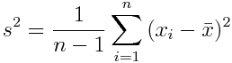
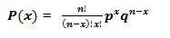
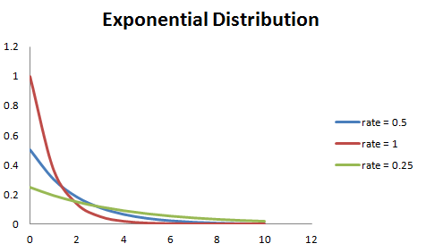

# 从贝叶斯定理到概率分布：综述概率论基本定义

选自 Medium & analyticsvidhya

**机器之心编译**

**机器之心编辑部**

> 本文从最基础的概率论到各种概率分布全面梳理了基本的概率知识与概念，这些概念可能会帮助我们了解机器学习或开拓视野。这些概念是数据科学的核心，并经常出现在各种各样的话题上。重温基础知识总是有益的，这样我们就能发现以前并未理解的新知识。

**简介**

在本系列文章中，我想探讨一些统计学上的入门概念，这些概念可能会帮助我们了解机器学习或开拓视野。这些概念是数据科学的核心，并经常出现在各种各样的话题上。重温基础知识总是有益的，这样我们就能发现以前并未理解的新知识，所以我们开始吧。

第一部分将会介绍概率论基础知识。

**概率**

我们已经拥有十分强大的数学工具了，为什么我们还需要学习概率论？我们用微积分来处理变化无限小的函数，并计算它们的变化。我们使用代数来解方程，我们还有其他几十个数学领域来帮助我们解决几乎任何一种可以想到的难题。

难点在于我们都生活在一个混乱的世界中，多数情况下无法准确地测量事物。当我们研究真实世界的过程时，我们想了解许多影响实验结果的随机事件。不确定性无处不在，我们必须驯服它以满足我们的需要。只有如此，概率论和统计学才会发挥作用。

如今，这些学科处于人工智能，粒子物理学，社会科学，生物信息学以及日常生活中的中心。

如果我们要谈论统计学，最好先确定什么是概率。其实，这个问题没有绝对的答案。我们接下来将阐述概率论的各种观点。

**频率**

想象一下，我们有一枚硬币，想验证投掷后正反面朝上频率是否相同。我们如何解决这一问题？我们试着进行一些实验，如果硬币正面向上记录 1，如果反面向上记录 0。重复投掷 1000 次并记录 0 和 1 的次数。在我们进行了一些繁琐的时间实验后，我们得到了这些结果：600 个正面（1）和 400 反面（0）。如果我们计算过去正面和反面的频率，我们将分别得到 60％和 40％。这些频率可以被解释为硬币出现正面或者反面的概率。这被称为频率化的概率。

**条件概率**

通常，我们想知道某些事件发生时其它事件也发生的概率。我们将事件 B 发生时事件 A 也发生的条件概率写为 P（A | B）。以下雨为例：

*   打雷时下雨的概率有多大？

*   晴天时下雨的概率有多大？

从这个欧拉图，我们可以看到 P（Rain | Thunder）= 1 ：当我们看到雷声时，总会下雨（当然，这不完全正确，但是我们在这个例子中保证它成立）。

P（Rain | Sunny）是多少呢？直觉上这个概率很小，但是我们怎样才能在数学上做出这个准确的计算呢？条件概率定义为：

换句话说，我们用 Rain 且 Sunny 的概率除以 Sunny 的概率。

**相依事件与独立事件**

如果一个事件的概率不以任何方式影响另一个事件，则该事件被称为独立事件。以掷骰子且连续两次掷得 2 的概率为例。这些事件是独立的。我们可以这样表述

但是为什么这个公式可行？首先，我们将第一次投掷和第二次投掷的事件重命名为 A 和 B，以消除语义影响，然后将我们看到的两次投掷的的联合概率明确地重写为两次投掷的单独概率乘积：

现在用 P（A）乘以 P（B）（没有变化，可以取消）并重新回顾条件概率的定义：

如果我们从右到左阅读上式，我们会发现 P(A | B) = P(A)。这就意味着事件 A 独立于事件 B！P（B）也是一样，独立事件的解释就是这样。

**贝叶斯概率论**

贝叶斯可以作为一种理解概率的替代方法。频率统计方法假设存在我们正在寻找的模型参数的一个最佳的具体组合。另一方面，贝叶斯以概率方式处理参数，并将其视为随机变量。在贝叶斯统计中，每个参数都有自己的概率分布，它告诉我们给已有数据的参数有多种可能。数学上可以写成

这一切都从一个允许我们基于先验知识来计算条件概率的简单的定理开始：

尽管贝叶斯定理很简单，但它具有巨大的价值，广泛的应用领域，甚至是贝叶斯统计学的特殊分支。有一个关于贝叶斯定理的非常棒的博客文章，如果你对贝叶斯的推导感兴趣---这并不难。

**抽样与统计**

假设我们正在研究人类的身高分布，并渴望发表一篇令人兴奋的科学论文。我们测量了街上一些陌生人的身高，因此我们的测量数据是独立的。我们从真实人群中随机选择数据子集的过程称为抽样。统计是用来总结采样值数据规律的函数。你可能见过的统计量是样本均值：

另一个例子是样本方差：

这个公式可以得出所有数据点偏离平均值的程度。

**分布**

什么是概率分布？这是一个定律，它以数学函数的形式告诉我们在一些实验中不同可能结果的概率。对于每个函数，分布可能有一些参数来调整其行为。

当我们计算硬币投掷事件的相对频率时，我们实际上计算了一个所谓经验概率分布。事实证明，世界上许多不确定的过程可以用概率分布来表述。例如，我们的硬币结果是一个伯努利分布，如果我们想计算一个 n 次试验后硬币正面向上的概率，我们可以使用二项式分布。

引入一个类似于概率环境中的变量的概念会方便很多--随机变量。每个随机变量都具有一定的分布。随机变量默认用大写字母表示，我们可以使用 ~ 符号指定一个分布赋给一个变量。

上式表示随机变量 X 服从成功率（正面向上）为 0.6 的伯努利分布。

**连续和离散概率分布**

概率分布可分为两种：离散分布用于处理具有有限值的随机变量，如投掷硬币和伯努利分布的情形。离散分布是由所谓的概率质量函数（PMF）定义的，连续分布用于处理连续的（理论上）有无限数量的值的随机变量。想想用声音传感器测量的速度和加速度。连续分布是由概率密度函数（PDF）定义的。

这两种分布类型在数学处理上有所不同：通常连续分布使用积分 ∫ 而离散分布使用求和Σ。以期望值为例：

下面我们将详细介绍各种常见的概率分布类型，正如上所说，概率分布可以分为离散型随机变量分布和连续性随机变量分布。离散型随机变量分布常见的有伯努利分布（Bernoulli Distribution）、二项分布（Binomial Distribution）、泊松分布（Poisson Distribution）等，而常见的连续型随机变量分布包括均匀分布（Uniform Distribution）、指数分布（Exponential Distribution）、正态分布等。

**常见的数据类型**

在解释各种分布之前，我们先看看常见的数据类型有哪些，数据类型可分为离散型和连续型。

离散型数据：数据只能取特定的值，比如，当你掷一个骰子的时候，可能的结果只有 1，2，3，4，5，6 而不会是 1.5 或者 2.45。

连续型数据：数据可以在给定的范围内取任何值，给定的范围可以是有限的或无限的，比如一个女孩的体重或者身高，或者道路的长度。一个女孩的体重可以是 54 kgs，54.5 kgs，或 54.5436kgs。

**分布的类型**

**伯努利分布**

最简单的离散型随机变量分布是伯努利分布，我们从这里开始讨论。

一个伯努利分布只有两个可能的结果，记作 1（成功）和 0（失败），只有单次伯努利试验。设定一个具有伯努利分布的随机变量 X，取值为 1 即成功的概率为 p，取值为 0 即失败的概率为 q 或者 1-p。

若随机变量 X 服从伯努利分布，则概率函数为：

成功和失败的概率不一定要相等。比如当我和一个运动员打架的时候，他的胜算应该更大，在这时候，我的成功概率是 0.15，而失败概率是 0.85。

下图展示了我们的战斗的伯努利分布。

如上图所示，我的成功概率=0.15，失败概率=0.85。期望值是指一个概率分布的平均值，对于随机变量 X，对应的期望值为：E(X) = 1*p + 0*(1-p) = p，而方差为 V(X) = E(X²) – [E(X)]² = p – p² = p(1-p)

实际上还有很多关于伯努利分布的例子，比如明天是晴天还是雨天，这场比赛中某一队输还是赢，等等。

**二项分布**

现在回到掷硬币的案例中，当掷完第一次，我们可以再掷一次，也就是存在多个伯努利试验。第一次为正不代表以后也会为正。那么设一个随机变量 X，它表示我们投掷为正面的次数。X 可能会取什么值呢？在投掷硬币的总次数范围内可以是任何非负整数。

如果存在一组相同的随机事件，即一组伯努利试验，在上例中为连续掷硬币多次。那么某随机事件出现的次数即概率服从于二项分布，也称为多重伯努利分布。

任何一次试验都是互相独立的，前一次试验不会影响当前试验的结果。两个结果概率相同的试验重复 n 次的试验称为多次伯努利试验。二项分布的参数为 n 和 p，n 是试验的总次数，p 是每一次试验的成功概率。

根据以上所述，一个二项分布的性质为：

1\. 每一次试验都是独立的；

2\. 只有两个可能的结果；

3\. 进行 n 次相同的试验；

4\. 所有试验中成功率都是相同的，失败的概率也是相同的。

二项分布的数学表达式为：

成功概率和失败概率不相等的二项分布看起来如下图所示：

而成功概率和失败概率相等的二项分布看起来如下图所示：

二项分布的平均值表示为 µ = n*p，而方差可以表示为 Var(X) = n*p*q。

**泊松分布**

如果你在一个呼叫中心工作，一天内会接到多少次呼叫呢？多少次都可能！在呼叫中心一天能接到多少次呼叫可以用泊松分布建模。这里有几个例子：

1\. 一天内医院接到的紧急呼叫次数；

2\. 一天内地方接到的偷窃事件报告次数；

3\. 一小时内光顾沙龙的人数；

4\. 一个特定城市里报告的自杀人数；

5\. 书的每一页的印刷错误次数。

现在你可以按相同的方式构造很多其它的例子。泊松分布适用于事件发生的时间和地点随机分布的情况，其中我们只对事件的发生次数感兴趣。泊松分布的主要特点为如下：

1\. 任何一个成功事件不能影响其它的成功事件；

2\. 经过短时间间隔的成功概率必须等于经过长时间间隔的成功概率；

3\. 时间间隔趋向于无穷小的时候，一个时间间隔内的成功概率趋近零。

在泊松分布中定义的符号有：

*   λ是事件的发生率；

*   t 是事件间隔的长度；

*   X 是在一个时间间隔内的事件发生次数。

设 X 是一个泊松随机变量，那么 X 的概率分布称为泊松分布。以µ表示一个时间间隔 t 内平均事件发生的次数，则 µ=λ*t；

X 的概率分布函数为：

泊松分布的概率分布图示如下，其中µ为泊松分布的参数：

下图展示了均值增加时的分布曲线的变化情况：

如上所示，当均值增加时，曲线向右移动。泊松分布的均值和方差为：

均值：E(X) = µ

方差： Var(X) = µ

**均匀分布**

假设我们在从 a 到 b 的一段线段上等距地选择一个区间的概率是相等的，那么概率在整个区间 [a,b] 上是均匀分布的，概率密度函数也不会随着变量的更改而更改。均匀分布和伯努利分布不同，随机变量的取值都是等概率的，因此概率密度就可以表达为区间长度分之一，如果我们取随机变量一半的可能值，那么其出现的概率就为 1/2。

假定随机变量 X 服从均匀分布，那么概率密度函数为：

均匀分布曲线图如下所示，其中概率密度曲线下面积为随机变量发生的概率：

我们可以看到均匀分布的概率分布图呈现为一个矩形，这也就是均匀分布又称为矩形分布的原因。在均匀分布中，a 和 b 都为参数，也即随机变量的取值范围。

服从均匀分布的随机变量 X 也有均值和方差，它的均值为 E(X) = (a+b)/2，方差为 V(X) = (b-a)²/12

标准均匀分布的密度函数参数 a 取值为 0，b 取值为 1，因此标准均匀分布的概率密度可以表示为：

**指数分布**

现在我们再次考虑电话中心案例，那么电话间隔的分布是怎么样的呢？这个分布可能就是指数分布，因为指数分布可以对电话的时间间隔进行建模。其它案例可能还有地铁到达时间的建模和空调设备周期等。

在深度学习中，我们经常会需要一个在 x=0 处取得边界点 (sharp point) 的分布。为了实现这一目的，我们可以使用指数分布（exponential distribution）：

指数分布使用指示函数 (indicator function)1x≥0，以使当 x 取负值时的概率为零。

其中 λ >0 为概率密度函数的参数。随机变量 X 服从于指数分布，则该变量的均值可表示为 E(X) = 1/λ、方差可以表示为 Var(X) = (1/λ)²。如下图所示，若λ较大，则指数分布的曲线下降地更大，若λ较小，则曲线越平坦。如下图所示：

以下是由指数分布函数推导而出的简单表达式：

P{X≤x} = 1 – exp(-λx)，对应小于 x 的密度函数曲线下面积。

P{X>x} = exp(-λx)，代表大于 x 的概率密度函数曲线下面积。

P{x1<X≤ x2} =exp(-λx1)-exp(-λx2)，代表 x1 点和 x2 点之间的概率密度函数曲线下面积。

**正态分布（高斯分布）**

实数上最常用的分布就是正态分布（normal distribution），也称为高斯分布（Gaussian distribution）。因为该分布的普遍性，尤其是中心极限定理的推广，一般叠加很多较小的随机变量都可以拟合为正态分布。正态分布主要有以下几个特点：

1\. 所有的变量服从同一均值、方差和分布模式。

2\. 分布曲线为钟型，并且沿 x=μ对称。

3\. 曲线下面积的和为 1。

4\. 该分布左半边的精确值等于右半边。

正态分布和伯努利分布有很大的不同，然而当伯努利试验的次数接近于无穷大时，他们的分布函数基本上是相等的。

若随机变量 X 服从于正态分布，那么 X 的概率密度可以表示为：

随机变量 X 的均值可表示为 E(X) = µ、方差可以表示为 Var(X) = σ²。其中均值µ和标准差σ为高斯分布的参数。

随机变量 X 服从于正态分布 N (µ, σ)，可以表示为：

标准正态分布可以定义为均值为 0、方差为 1 的分布函数，以下展示了标准正态分布的概率密度函数和分布图：

**分布之间的关系**

**伯努利分布和二项分布的关系**

1\. 二项分布是伯努利分布的单次试验的特例，即单词伯努利试验；

2\. 二项分布和伯努利分布的每次试验都只有两个可能的结果；

3\. 二项分布每次试验都是互相独立的，每一次试验都可以看作一个伯努利分布。

**泊松分布和二项分布的关系**

以下条件下，泊松分布是二项分布的极限形式：

1\. 试验次数非常大或者趋近无穷，即 n → ∞；

2\. 每次试验的成功概率相同且趋近零，即 p →0；

3.np =λ 是有限值。

**正态分布和二项分布的关系 & 正态分布和泊松分布的关系**

以下条件下，正态分布是二项分布的一种极限形式：

1\. 试验次数非常大或者趋近无穷，即 n → ∞；

2.p 和 q 都不是无穷小。

参数 λ →∞的时候，正态分布是泊松分布的极限形式。

**指数分布和泊松分布的关系**

如果随机事件的时间间隔服从参数为 λ的指数分布，那么在时间周期 t 内事件发生的总次数服从泊松分布，相应的参数为 λt。

**测试**

读者可以完成以下简单的测试，检查自己对上述概率分布的理解程度：

1\. 服从标准正态分布的随机变量计算公式为：

a. (x+µ) / σ

b. (x-µ) / σ

c. (x-σ) / µ

2\. 在伯努利分布中，计算标准差的公式为：

a. p (1 – p)

b. SQRT(p(p – 1))

c. SQRT(p(1 – p))

3\. 对于正态分布，均值增大意味着：

a. 曲线向左移

b. 曲线向右移

c. 曲线变平坦

4\. 假定电池的生命周期服从 λ = 0.05 指数分布，那么电池的最终使用寿命在 10 小时到 15 小时之间的概率为：

a.0.1341

b.0.1540

c.0.0079

**结语**

在本文中，我们从最基本的随机事件及其概念出发讨论对概率的理解。随后我们讨论了最基本的概率计算方法与概念，比如条件概率和贝叶斯概率等等。文中还讨论了随机变量的独立性和条件独立性。此外，本文更是详细介绍了概率分布，包括离散型随机变量分布和连续型随机变量分布。本文主要讨论了基本的概率定理与概念，其实这些内容在我们大学的概率论与数理统计课程中基本上都有详细的解释。而对于机器学习来说，理解概率和统计学知识对理解机器学习模型十分重要，以它为基础我们也能进一步理解结构化概率等新概念。

*原文链接：*

*   *https://medium.com/towards-data-science/probabiliy-theory-basics-4ef523ae0820*

*   *https://www.analyticsvidhya.com/blog/2017/09/6-probability-distributions-data-science/*

******本文为机器之心编译，***转载请联系本公众号获得授权******。***

✄------------------------------------------------

**加入机器之心（全职记者/实习生）：hr@jiqizhixin.com**

**投稿或寻求报道：content@jiqizhixin.com**

**广告&商务合作：bd@jiqizhixin.com**