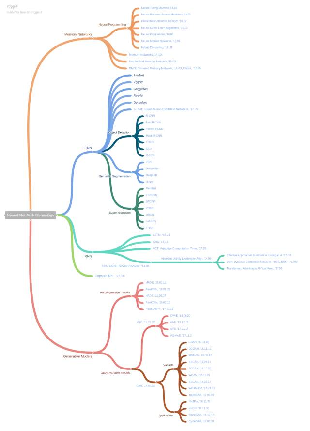
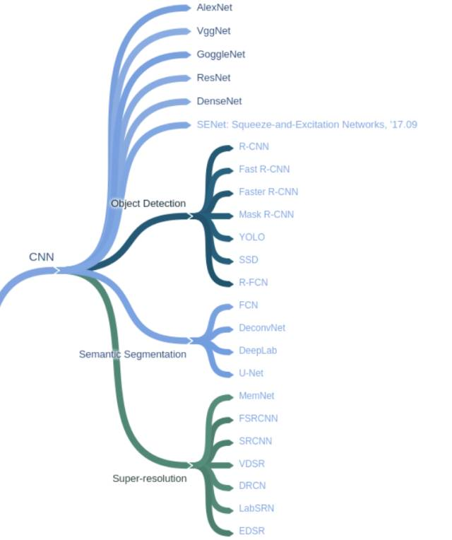
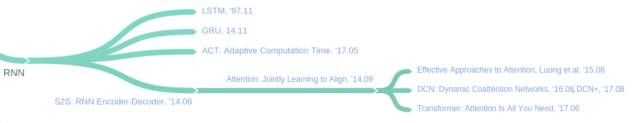
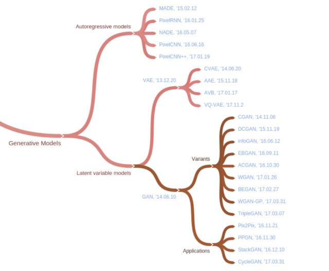
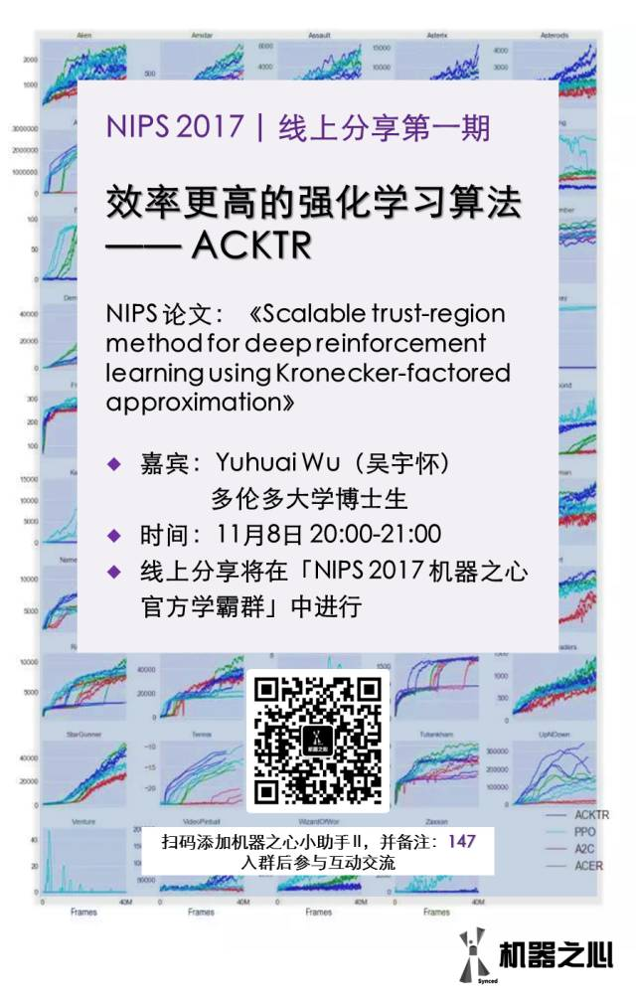

# 追根溯源！一图看尽深度学习架构谱系

机器之心整理

**参与：蒋思源、李泽南、李亚洲**

> 近几年，深度学习高速发展，出现了大量的新模型与架构，以至于我们无法理清网络类型之间的关系。在这篇文章中，香港科技大学（HKUST）助理教授金成勳总结了深度网络类型之间的谱系图，以便于我们索引不同类型网络的杰出研究成果。

金成勳在 GitHub 上梳理出的谱系图如下（点击图片放大查看），最后的蓝色字体部分是各分支内的杰出研究成果（附所有论文链接）。机器之心在此基础上对各个分支网络做了介绍、补充，希望对读者了解网络体系间的关联有所帮助。如有缺陷，欢迎大家留言补充。

Github 项目地址：https://github.com//hunkim/deep_architecture_genealogy

**完整图**

 **

 ****记忆网络**

在记忆网络分支中，hunkim 标注了三篇重要论文：《记忆网络》、《端到端记忆网络》、《DMN：动态记忆网络》。神经编程是记忆网络的下一级分支，包含神经图灵机、混合计算等论文。

参考阅读：

*   [深度 | Yann LeCun 最新演讲再谈预测学习：记忆网络和对抗训练是很有前景的方向](http://mp.weixin.qq.com/s?__biz=MzA3MzI4MjgzMw==&mid=2650722365&idx=2&sn=0016ee27bdf0ca380d0dc4d6328f86fb&chksm=871b1443b06c9d55a7ee99de456defb8990e41b61120112655bfe18169dbaccc14eb145039e6&scene=21#wechat_redirect)

*   [一周论文 | 记忆网络及其变体模型](http://mp.weixin.qq.com/s?__biz=MzA3MzI4MjgzMw==&mid=2650720152&idx=4&sn=f4f444c9466e246f285824b9a2aa2878&chksm=871b03e6b06c8af0fde93e7a8884d4f70b42438c63fcf0b722baad9d1a1db3a4fa51118673b3&scene=21#wechat_redirect)

*   [业界 | MetaMind 发布论文：借助动态记忆网络 DMN 让机器更好地像人类般推理（附论文下载）](http://mp.weixin.qq.com/s?__biz=MzA3MzI4MjgzMw==&mid=402655050&idx=2&sn=5edd8f1909f66c4d82334b6a47648e33&scene=21#wechat_redirect)

*   [神经图灵机深度讲解：从图灵机基本概念到可微分神经计算机](http://mp.weixin.qq.com/s?__biz=MzA3MzI4MjgzMw==&mid=2650725360&idx=1&sn=32cee97e159715d54339d9d6a61b6e4d&chksm=871b1f8eb06c96981a840210cb99d2a21b2b2a1e7be491157972d1e08ba6727de25061e5c7d1&scene=21#wechat_redirect)

**卷积神经网络（CNN）**

如下所示，CNN 除了包含执行目标识别任务的 AlexNet 等深度卷积网络，还包括很多优秀的模型用于处理目标检测、语义分割和超分辨率等任务。它们以不同的方式应用卷积过程处理不同的任务，并在这些任务上产生了非常好的效果。从基本上来说，卷积相对于最初的全连接网络有很多优秀的属性，例如它只和上一层神经元产生部分的连接，同一个卷积核可以在输入张量上重复使用，也就是说特征检测器可以在输入图像上重复检测是否有该局部特征。这是卷积网络十分优秀的属性，它大大减少了两层间参数的数量。

基于这些基础的卷积特性，我们可以构建不同的卷积模型处理不同的任务。以下是卷积网络的主要模型与领域：

参考阅读：

*   [从入门到精通：卷积神经网络初学者指南](http://mp.weixin.qq.com/s?__biz=MzA3MzI4MjgzMw==&mid=2650717691&idx=2&sn=3f0b66aa9706aae1a30b01309aa0214c&scene=21#wechat_redirect)

*   [一文概览卷积神经网络中的类别不均衡问题](http://mp.weixin.qq.com/s?__biz=MzA3MzI4MjgzMw==&mid=2650732561&idx=5&sn=055de7889a256c86815baefefd16a213&chksm=871b3c6fb06cb5791ed5bbc7c1d62ddc3079050360c6cf337da095ce2e71ff7446a51d625188&scene=21#wechat_redirect)

*   [理解深度学习中的卷积](http://mp.weixin.qq.com/s?__biz=MzA3MzI4MjgzMw==&mid=2650724906&idx=3&sn=b6e1e70fb625222d0d0f1b30741e4e29&chksm=871b1e54b06c974297180145f79525a0fbdb25b171aefd659ad1fac23356be3ad024c1e1a211&scene=21#wechat_redirect)

*   [如何从信号分析角度理解卷积神经网络的复杂机制？](http://mp.weixin.qq.com/s?__biz=MzA3MzI4MjgzMw==&mid=2650726125&idx=3&sn=b094179cb4edf18168e01272ceccefe1&chksm=871b1a93b06c9385ff46c210c4619c2b0005e9198d74a9d362ebb8b4b6d321e9bc7132bd24cb&scene=21#wechat_redirect)

*   [机器之心 GitHub 项目：从零开始用 TensorFlow 搭建卷积神经网络](http://mp.weixin.qq.com/s?__biz=MzA3MzI4MjgzMw==&mid=2650730287&idx=1&sn=5697b072a5671ac201e15b43339efab9&chksm=871b2b51b06ca247ac1fdc939e39cfc44cbc2ee25e1b105cf9a582395ddbcdd43cfe18fecd40&scene=21#wechat_redirect)

**循环神经网络（RNN）**

循环神经网络（recurrent neural network）是深度学习的重要组成部分，它可以让神经网络处理诸如文本、音频和视频等序列数据。它们可用来做序列的高层语义理解、序列标记，甚至可以从一个片段生产新的序列。目前有很多人工智能应用都依赖于循环深度神经网络，在谷歌（语音搜索）、百度（DeepSpeech）和亚马逊的产品中都能看到 RNN 的身影。

基本的 RNN 结构难以处理长序列，然而一种特殊的 RNN 变种即「长短时记忆（LSTM）」网络可以很好地处理长序列问题。这种模型能力强大，在翻译、语音识别和图像描述等众多任务中均取得里程碑式的效果。因而，循环神经网络在最近几年得到了广泛使用。

参考阅读：

*   [LSTM、GRU 与神经图灵机：详解深度学习最热门的循环神经网络](http://mp.weixin.qq.com/s?__biz=MzA3MzI4MjgzMw==&mid=2650728794&idx=1&sn=1506afe7ea589f9b6901ea9ba8245f06&chksm=871b2d24b06ca4326560e3e9b8363a76fe433cf79211e1a23f6d0a892b4928817a3ffadba063&scene=21#wechat_redirect)

*   [Google Brain 讲解注意力模型和增强 RNN](http://mp.weixin.qq.com/s?__biz=MzA3MzI4MjgzMw==&mid=2650719228&idx=2&sn=b3ccd8c77c2ef81369c02b85de013038&chksm=871b0782b06c8e94e88ce927f8357a6637b051c9f2ace9dbadea84c77b1b8ca0fec7efdb7448&scene=21#wechat_redirect)

*   [如何使用 TensorFlow 构建、训练和改进循环神经网络](http://mp.weixin.qq.com/s?__biz=MzA3MzI4MjgzMw==&mid=2650724740&idx=5&sn=c9caf66b1a31396d101a03b4b5012dec&chksm=871b1dfab06c94eca730ea122c7e90f5438ae0ff0b71b3c97df1349fa1c6782da66bbcf13395&scene=21#wechat_redirect)

*   [如何用 PyTorch 实现递归神经网络？](http://mp.weixin.qq.com/s?__biz=MzA3MzI4MjgzMw==&mid=2650725842&idx=4&sn=a2e725f09cc7062b66c20e9e48fa12b0&chksm=871b19acb06c90ba638f788589cd3ef2a0cb32db8469dcac0ad454297059f3bd6f0bacd2eaed&scene=21#wechat_redirect)

**Capsule Net**

Capsule 是由深度学习先驱 Geoffrey Hinton 等人提出的新一代神经网络形式，旨在修正反向传播机制。在 Dynamic Routing Between Capsules 论文中，Geoffrey Hinton 这样介绍 Capsule：「Capsule 是一组神经元，其输入输出向量表示特定实体类型的实例化参数（即特定物体、概念实体等出现的概率与某些属性）。我们使用输入输出向量的长度表征实体存在的概率，向量的方向表示实例化参数（即实体的某些图形属性）。同一层级的 capsule 通过变换矩阵对更高级别的 capsule 的实例化参数进行预测。当多个预测一致时（本论文使用动态路由使预测一致），更高级别的 capsule 将变得活跃。」

Capsule 中神经元的激活情况表示了图像中存在的特定实体的各种性质。这些性质可以包含多种不同的参数，例如姿势（位置、大小、方向）、变形、速度、反射率、色彩、纹理等。而输入输出向量的长度表示了某个实体出现的概率，所以它的值必须在 0 到 1 之间。

机器之心也详细解读了上周 Hinton 公开的论文，这篇论文的亮点在于 Capsule 层的输入与输出都是向量，构建向量的过程可以认为是 PrimaryCaps 层利用 8 个标准的 Conv2D 操作产生一个长度为 8 个元素的向量，因此每一个 Capsule 单元就相当于 8 个卷积单元的组合。此外，在 Capsule 层中，Hinton 等人还使用了动态路由机制，这种更新耦合系数（coupling coefficients）的方法并不需要使用反向传播机制。

除了 Hinton 等人公布的 Capsule 论文以外，近日还有一篇 MATRIX CAPSULES WITH EM ROUTING 论文，该论文采用 EM Routing 修正原论文的 dynamic routing 从而实现更好的效果。

参考阅读：

*   [终于，Geoffrey Hinton 那篇备受关注的 Capsule 论文公开了](http://mp.weixin.qq.com/s?__biz=MzA3MzI4MjgzMw==&mid=2650732472&idx=1&sn=259e5aa77b62078ffa40be9655da0802&chksm=871b33c6b06cbad0748571c9cb30d15e9658c7509c3a6e795930eb86a082c270d0a7af1e3aa2&scene=21#wechat_redirect)

*   [先读懂 CapsNet 架构然后用 TensorFlow 实现，这应该是最详细的教程了](https://mp.weixin.qq.com/s?__biz=MzA3MzI4MjgzMw==&mid=2650732855&idx=1&sn=87319e9390200f24dfd2faff4d7d364a&chksm=871b3d49b06cb45fd8a68d003310b05562d9f8ff094ed08345f112e4450f7e66e6cf71c5b571&scene=21#wechat_redirect) 

*   [一篇新的 Capsule 论文：优于基准 CNN（ICLR 2018 盲审中）](http://mp.weixin.qq.com/s?__biz=MzA3MzI4MjgzMw==&mid=2650732524&idx=4&sn=7e090a7ff933c969d3fd45bd4ea35ac4&chksm=871b3392b06cba84e974fecc75d63e9e5966b12afd5f1372b92b615580014670ea4186015ac1&scene=21#wechat_redirect)

**生成模型**

人工智能研究的最大难题之一是无监督学习（unsupervised learning），而面向无监督学习的深度学习方法以学习表征（learning representation）问题为核心，不同的算法都会定义一个目标函数，该目标函数可以让该学习器获取到其数据表征的关键方面以及一个可以表征数据的新空间。深度生成模型可以通过生成全新的样本来演示其对于数据的理解，尽管这些生成的样本非常类似于那些训练样本。许多这样的模型和之前的自编码器的思想有关，其有一个编码器函数将数据映射到表征，还有一个解码器函数（或生成器）将该抽象的表征映射到原始数据空间。此外，生成模型很多也应用到了 GAN 的思想，即通过判别器与生成器之间的对抗促使生成器生成非常真实的图像。

在变分自编码器中，我们需要通过样本训练一个编码器和解码器，在这过程中我们能得到中间的隐藏变量。若我们需要生成新的图像，那么只需要在隐藏变量采样并投入解码器就能完成生成。而在生成对抗网络中，我们会定义一个判别模型与生成模型。首先我们会将生成的样本混合真实样本投递给判别模型以训练其鉴别真假的能力，随后再固定判别模型并训练生成模型，以生成更真实的图像。

参考阅读：

*   [Yoshua Bengio AIWTB 大会解读深度生成模型：让机器具备无监督学习能力](http://mp.weixin.qq.com/s?__biz=MzA3MzI4MjgzMw==&mid=2650726258&idx=2&sn=a050508edf9963204c67333ffc01c6a1&chksm=871b1b0cb06c921a1db6e6511787133c3554f2bc19d7eb9fa7725f29f6ed729fb8e0866c31b2&scene=21#wechat_redirect)

*   [在 TensorFlow 中对比两大生成模型：VAE 与 GAN](http://mp.weixin.qq.com/s?__biz=MzA3MzI4MjgzMw==&mid=2650732235&idx=1&sn=175f32560f961ad0221bc05b867a0275&chksm=871b32b5b06cbba30250a38b6d66a6479b97abe276c1a36b9b1f4baf7540b3c96b9eeee3d4f4&scene=21#wechat_redirect)

*   [生成对抗网络初学入门：一文读懂 GAN 的基本原理（附资源）](http://mp.weixin.qq.com/s?__biz=MzA3MzI4MjgzMw==&mid=2650730721&idx=2&sn=95b97b80188f507c409f4c72bd0a2767&chksm=871b349fb06cbd891771f72d77563f77986afc9b144f42c8232db44c7c56c1d2bc019458c4e4&scene=21#wechat_redirect)

*   [机器之心 GitHub 项目：GAN 完整理论推导与实现，Perfect！](http://mp.weixin.qq.com/s?__biz=MzA3MzI4MjgzMw==&mid=2650731540&idx=1&sn=193457603fe11b89f3d298ac1799b9fd&chksm=871b306ab06cb97c502af9552657b8e73f1f5286bc4cc71b021f64604fd53dae3f026bc9ac69&scene=21#wechat_redirect)

*   [深入浅出：GAN 原理与应用入门介绍](http://mp.weixin.qq.com/s?__biz=MzA3MzI4MjgzMw==&mid=2650730028&idx=1&sn=21d57cf54f257aeab15ebd4058671a2b&chksm=871b2a52b06ca3449f255549a914e8ab8d85bb4d43e0487a95fd9ffd97e708d9eac7a1f9943b&scene=21#wechat_redirect)

*   [综述 | 一文帮你发现各种出色的 GAN 变体](http://mp.weixin.qq.com/s?__biz=MzA3MzI4MjgzMw==&mid=2650724769&idx=2&sn=6fa540106cf6a5fd55fc39d057092888&chksm=871b1ddfb06c94c9e11d3a8281f60c0fce06a4e021fcd8eaab858c7f08ab9c939c4ad130e4b2&scene=21#wechat_redirect)

*   [独家 | GAN 之父 NIPS 2016 演讲现场直击：全方位解读生成对抗网络的原理及未来（附 PPT）](http://mp.weixin.qq.com/s?__biz=MzA3MzI4MjgzMw==&mid=2650721284&idx=1&sn=427e7f45c8253ab22a3960978409f5d1&chksm=871b087ab06c816c424ad03810be3e1b3aa9d6e99a5f325047796f110d178a07736f667d1a10&scene=21#wechat_redirect)

****