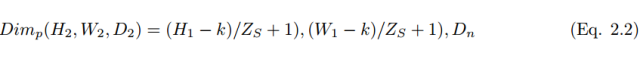
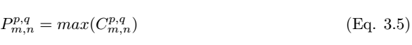

# 徒手实现 CNN：综述论文详解卷积网络的数学本质

选自 arXiv

**机器之心编译**

**参与：黄小天、路雪、蒋思源**

> 近日南洋理工大学研究者发布了一篇描述卷积网络数学原理的论文，该论文从数学的角度阐述整个卷积网络的运算与传播过程。该论文对理解卷积网络的数学本质非常有帮助，有助于读者「徒手」（不使用卷积 API）实现卷积网络。

论文地址：https://arxiv.org/pdf/1711.03278.pdf

在该论文中，我们将从卷积架构、组成模块和传播过程等方面了解卷积网络的数学本质。读者可能对卷积网络具体的运算过程比较了解，入门读者也可先查看 [Capsule 论文解读](http://mp.weixin.qq.com/s?__biz=MzA3MzI4MjgzMw==&mid=2650732855&idx=1&sn=87319e9390200f24dfd2faff4d7d364a&chksm=871b3d49b06cb45fd8a68d003310b05562d9f8ff094ed08345f112e4450f7e66e6cf71c5b571&scene=21#wechat_redirect)的第一部分了解详细的卷积过程，但其实我们一般并不会关注于卷积网络到底在数学上是如何实现的。因为各大深度学习框架都提供了简洁的卷积层 API，所以我们不需要数学表达式也能构建各种各样的卷积层，我们最多只需要关注卷积运算输入与输出的张量维度是多少就行。这样虽然能完美地实现网络，但我们对卷积网络的数学本质和过程仍然不是太清楚，这也就是本论文的目的。

下面我们将简要介绍该论文的主体内容，并尝试理解卷积网络的数学过程。有基础的读者可以查阅原论文以实现更深的理解，此外我们也许能借助该论文的计算式在不使用层级 API 的情况下实现简单的卷积网络。

卷积神经网络（CNN）或称为 ConvNet 广泛应用于许多视觉图像和语音识别等任务。在 2012 ImageNet 挑战赛 krizhevsky 等人首次应用深度卷积网络后，深度卷积神经网络的架构设计已经吸引了许多研究者做出贡献。这也对深度学习架构的搭建产生了很重要的影响，如 TensorFlow、Caffe、Keras、MXNet 等。尽管深度学习的实现可以通过框架轻易地完成，但对于入门者和从业者来说，数学理论和概念是非常难理解的部分。本论文将尝试概述卷积网络的架构，并解释包含激活函数、损失函数、前向传播和反向传播的数学推导。在本文中，我们使用灰度图作为输入信息图像，ReLU 和 Sigmoid 激活函数构建卷积网络的非线性属性，交叉熵损失函数用于计算预测值与真实值之间的距离。该卷积网络架构包含一个卷积层、池化层和多个全连接层。

**2 架构**

*图 2.1：卷积神经网络架构*

**2.1 卷积层**

卷积层是一组平行的特征图（feature map），它通过在输入图像上滑动不同的卷积核并执行一定的运算而组成。此外，在每一个滑动的位置上，卷积核与输入图像之间会执行一个元素对应乘积并求和的运算以将感受野内的信息投影到特征图中的一个元素。这一滑动的过程可称为步幅 Z_s，步幅 Z_s 是控制输出特征图尺寸的一个因素。卷积核的尺寸要比输入图像小得多，且重叠或平行地作用于输入图像中，一张特征图中的所有元素都是通过一个卷积核计算得出的，也即一张特征图共享了相同的权重和偏置项。

然而，使用较小尺寸的卷积核将导致不完美的覆盖，并限制住学习算法的能力。因此我们一般使用 0 填充图像的四周或 Z_p 过程来控制输入图像的大小。使用 0 填充图像的四周 [10] 也将控制特征图的尺寸。在算法的训练过程中，一组卷积核的维度一般是（k_1, k_2, c），这些卷积核将滑过固定尺寸的输入图像（H, W, C）。步长和 Padding 是控制卷积层维度的重要手段，因此产生了叠加在一起形成卷积层的特征图。卷积层（特征图）的尺寸可以通过以下公式 2.1 计算。

其中 H_1、W_1 和 D_1 分别为一张特征图的高度、宽度和深度，Z_p 为 Padding 、Z_s 为步幅大小。

**2.2 激活函数**

激活函数定义了给定一组输入后神经元的输出。我们将线性网络输入值的加权和传递至激活函数以用于非线性转换。典型的激活函数基于条件概率，它将返回 1 或 0 作为输出值，即 op {P(op = 1|ip) or P(op = 0|ip)}。当网络输入信息 ip 超过阈值，激活函数返回到值 1，并传递信息至下一层；如果网络输入 ip 值低于阈值，它返回到值 0，且不传递信息。基于相关信息和不相关信息的分离，激活函数决定是否应该激活神经元。网络输入值越高，激活越大。不同类型的激活函数应用各异，一些常用的激活函数如表 1 所示。

*表 1：非线性激活函数*

**2.3 池化层**

池化层是指下采样层，它把前层神经元的一个集群的输出与下层单个神经元相结合。池化运算在非线性激活之后执行，其中池化层有助于减少参数的数量并避免过拟合，它同样可作为一种平滑手段消除不想要的噪音。目前最常见的池化方法就是简单的最大池化，在一些情况下我们也使用平均池化和 L2 范数池化运算。

当采用卷积核的数量 D_n 和步幅大小 Z_s 用来执行池化运算，其维度可通过下式被计算：

**2.4 全连接层**

池化层之后，三维像素张量需要转换为单个向量。这些向量化和级联化的数据点随后会被馈送进用于分类的全连接层。全连接层的函数即特征的加权和再加上偏置项并馈送到激活函数的结果。卷积网络的架构如图 2 所示。这种局部连接类的架构在图像分类问题上 [11] [12] 超越传统的机器学习算法。

**2.5 损失或成本函数**

损失函数将一个或多个变量的事件映射到与某个成本相关的实数上。损失函数用于测量模型性能以及实际值 y_i 和预测值 y hat 之间的不一致性。模型性能随着损失函数值的降低而增加。

如果所有可能输出的输出向量是 y_i = {0, 1} 和带有一组输入变量 x = (xi , x2 . . . xt) 的事件 x，那么 x 到 y_i 的映射如下：

其中 L(y_i hat , y_i) 是损失函数。很多类型的损失函数应用各不相同，下面给出了其中一些。

2.5.1 均方误差

均方误差或称平方损失函数多在线性回归模型中用于评估性能。如果 y_i hat 是 t 个训练样本的输出值，y_i 是对应的标签值，那么均方误差（MSE）为：

MSE 不好的地方在于，当它和 Sigmoid 激活函数一起出现时，可能会出现学习速度缓慢（收敛变慢）的情况。

这一部分描述的其它损失函数还有均方对数误差（Mean Squared Logarithmic Error）、L_2 损失函数、L_1 损失函数、平均绝对误差（Mean Absolute Error）、平均绝对百分比误差（Mean Absolute Percentage Error）等。

**2.5.7 交叉熵**

最常用的损失函数是交叉熵损失函数，如下所示。如果输出 y_i 在训练集标签  中的概率为 ，输出 y_i 不在训练集标签  的概率为 。期望标签为 y，因此：

为了最小化代价函数，

在 i 个训练样本的情况下，代价函数为：

**3 卷积网络的学习**

**3.1 前馈推断过程**

卷积网络的前馈传播过程可以从数学上解释为将输入值与随机初始化的权重相乘，然后每个神经元再加上一个初始偏置项，最后对所有神经元的所有乘积求和以馈送到激活函数中，激活函数对输入值进行非线性变换并输出激活结果。

在离散的色彩空间中，图像和卷积核可以分别表征为 (H, W, C) 和 (k_1, k_2, c) 的三维张量，其中 m、n、c 分别表示第 c 个图像通道上第 m 行和第 n 列的像素。前两个参数表示空间坐标，而第三个参数表示色彩的通道。

如果一个卷积核在彩色图像上滑动运算，那么多维张量的卷积运算可以表示为：

卷积过程可以用符号 ⓧ 表示。对于灰度标量图来说，卷积过程可以表示为，

一个卷积核  （下文用 k_p,q|u,v 表示）滑动到图像 I_m,n 的位置，其步幅为 1 且带有 Padding。那么卷积层  （下文用 C_p,q|m,n 表示）的特征图可以计算为

*图 3.1：卷积神经网络*

我们在执行卷积后需要使用非线性激活函数而得到特征图：

其中σ为 ReLU 激活函数。池化层 P_p,q|m,n 可以通过选取卷积层中最大值的 m,n 来完成构建，池化层的构建可以写为，

池化层 P^p,q 的输出可以级联转化为一个长度为 p*q 的向量，然后我们可以将该向量馈送到全连接网络以进行分类，随后 l-1 层向量化的数据点

可以通过以下方程计算：

长向量从 l 层馈送到 L+1 层的全连接网络。如果全连接层有 L 个、神经元有 n 个，那么 l 可以表示第一个全连接层，L 表示最后一个全连接层，L+1 为图 3.2 展示的分类层，全连接层中的前向传播过程可以表示为：

*图 3.2：全连接层中的前向传播过程*

如图 3.3 所示，我们考虑全连接层 l 中的单个神经元 (j)。输入值 a_l-1,i 分别与权重 w_ij 求加权和并加上偏置项 b_l,j。然后我们将最后层的输入值 z_l,i 馈送到非线性激活函数σ。最后层的输入值可通过以下方程计算，

其中 z_l,i 为 l 层中神经元 j 的激活函数的输入值。

因此，第 l 层的输出为

*图 3.3：第 l 层中神经元 j 的前向传播过程*

其中 a^l 是

W^l 是

同样地，最后一层 L 的输出值是

其中

将这些扩展到分类层，则神经元单元 (i) 在 L + 1 层的最终输出预测值 y_i hat 可以表示为：

如果预测值是 y_i hat，实际标注值为 y_i，那么该模型的性能可以通过以下损失函数方程来计算。根据 Eqn.2.14，交叉熵损失函数为：

以上就是正向传播的简要数学过程，本论文还着重介绍了反向传播的数学过程，不过限于篇幅我们并不在本文中展示，感兴趣的读者可以查阅原论文。

**4 结语**

本文通过概述对卷积神经网络架构作出了解释，其中包括不同的激活函数和损失函数，同时详细解释了前馈与反向传播的各个步骤。出于数学简明性的考虑，我们以灰度图像作为输入信息。卷积核步长值取 1，使用 Padding。中间层和最后层的非线性转换通过 ReLU 和 sigmoid 激活函数完成。交叉熵损失函数用来测量模型的性能。但是，需要大量的优化和正则化步骤以最小化损失函数，增加学习率，避免模型的过拟合。本文试图只考虑带有梯度下降优化的典型卷积神经网络架构的制定。

 **

点击【阅读原文】报名参赛，美国赛区报名请点击大赛首页 US 进入美国赛区报名通道**