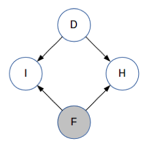
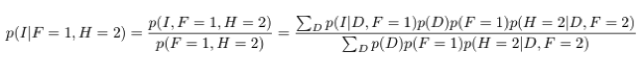
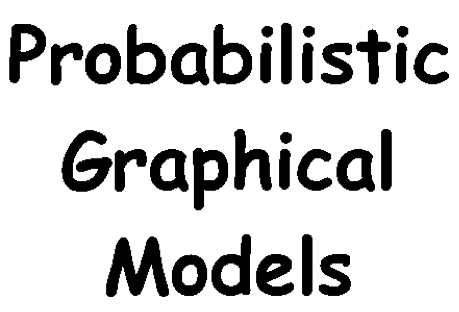

# 读懂概率图模型：你需要从基本概念和参数估计开始

选自 statsbot

**作者：Prasoon Goyal**

**机器之心编译**

**参与：**Panda****

> > 概率图模型是人工智能领域内一大主要研究方向。近日，Statsbot 团队邀请数据科学家 Prasoon Goyal 在其博客上分两部分发表了一篇有关概率图模型的基础性介绍文章。文章从基础的概念开始谈起，并加入了基础的应用示例来帮助初学者理解概率图模型的实用价值。机器之心对该文章进行了编译介绍。
> 
> **第一部分：基本术语和问题设定**
> 
> 机器学习领域内很多常见问题都涉及到对彼此相互独立的孤立数据点进行分类。比如：预测给定图像中是否包含汽车或狗，或预测图像中的手写字符是 0 到 9 中的哪一个。
> 
> 事实证明，很多问题都不在上述范围内。比如说，给定一个句子「I like machine learning」，然后标注每个词的词性（名词、代词、动词、形容词等）。正如这个简单例子所表现出的那样：我们不能通过单独处理每个词来解决这个任务——「learning」根据上下文的情况既可以是名词，也可以是动词。这个任务对很多关于文本的更为复杂的任务非常重要，比如从一种语言到另一种语言的翻译、文本转语音等。
> 
> 使用标准的分类模型来处理这些问题并没有什么显而易见的方法。概率图模型（PGM/probabilistic graphical model）是一种用于学习这些带有依赖（dependency）的模型的强大框架。这篇文章是 Statsbot 团队邀请数据科学家 Prasoon Goyal 为这一框架编写的一份教程。
> 
> 在探讨如何将概率图模型用于机器学习问题之前，我们需要先理解 PGM 框架。概率图模型（或简称图模型）在形式上是由图结构组成的。图的每个节点（node）都关联了一个随机变量，而图的边（edge）则被用于编码这些随机变量之间的关系。
> 
> 根据图是有向的还是无向的，我们可以将图的模式分为两大类——贝叶斯网络（ Bayesian network）和马尔可夫网络（Markov networks）。
> 
> **贝叶斯网络：有向图模型**
> 
> 贝叶斯网络的一个典型案例是所谓的「学生网络（student network）」，它看起来像是这样：
> 
>  
> 
> 这个图描述了某个学生注册某个大学课程的设定。该图中有 5 个随机变量：
> 
> *   学生的智力水平（Intelligence）：可取两个值，0 表示不聪明，1 表示聪明
>     
>     
>     
> *   学生的评级（Grade）：可取三个值，1 表示差，2 表示中，3 表示优
>     
>     
>     
> *   学生的 SAT 成绩（SAT）：可取两个值，0 表示低分，1 表示高分
>     
>     
>     
> *   在完成该课程后学生从教授那里所得到的推荐信的质量（Letter）：可取两个值，0 表示推荐信不好，1 表示推荐信很好
>     
>     
>     
> 
> 该图中的边编码了这些变量之间的依赖关系。
> 
> *   而 Grade 又反过来决定了学生能否从教授那里得到一份好的 Letter；
>     
>     
>     
> *   另外，学生的 Intelligence 除了会影响他们的 Grade，还会影响他们的 SAT 分数。
>     
>     
>     
> 
> 注意其中箭头的方向表示了因果关系——Intelligence 会影响 SAT 分数，但 SAT 不会影响 Intelligence。
> 
> 最后，让我们看看与每个节点关联的表格，它们的正式名称是条件概率分布（CPD/conditional probability distribution）。
> 
> 1\. 条件概率分布
> 
> Difficulty 和 Intelligence 的 CPD 非常简单，因为这些变量并不依赖于其它任何变量。基本而言，这两个表格编码了这两个变量取值为 0 和 1 的概率。你可能已经注意到，每个表格中的值的总和都必须为 1。
> 
> 接下来看看 SAT 的 CPD。其每一行都对应于其父节点（Intelligence）可以取的值，每一列对应于 SAT 可以取的值。每个单元格都有条件概率 p(SAT=s|Intelligence=i)，也就是说：给定 Intelligence 的值为 i，则其为 SAT 的值为 s 的概率。
> 
> 比如，我们可以看到 p(SAT=s¹|Intelligence=i¹) 是 0.8。也就是说，如果该学生的智力水平高，那么他的 SAT 分数也很高的概率是 0.8。而 p(SAT=s⁰|Intelligence=i¹) 则表示如果该学生的智力水平高，那么 SAT 分数很低的概率是 0.2。
> 
> 注意，每一行中的值的总和为 1。这是当然而然的，因为当 Intelligence=i¹ 时，SAT 只能是 s⁰ 和 s¹ 中的一个，所以两个概率之和必定为 1。类似地，Letter 的 CPD 编码了条件概率 p(Letter=l|Grade=g)。因为 Grade 可以取 3 个值，所以这个表格有 3 行。
> 
> 有了上面的知识，Grade 的 CPD 就很容易理解了。因为它有两个父节点，所以它的条件概率是这种形式：p(Grade=g|Difficulty=d,SAT=s)，即当 Difficulty 为 d 且 SAT 为 s 时 Grade 为 g 的概率。这个表格的每一行都对应于一对 Difficulty 和 Intelligence 值。同样，每一行的值的总和为 1。
> 
> 贝叶斯网络的一个基本要求是图必须是有向无环图（DAG/directed acyclic graph）。
> 
> **马尔可夫网络：无向图模型**
> 
> 一个马尔可夫网络的简单例子：
> 
>  
> 
> 为了简洁地说明，我们只探讨这个抽象的图，其中的节点 ABCDE 不像上面的例子有直接的真实案例对应。同样，这些边表示变量之间的相互作用。我们可以看到 A 和 B 彼此之间有直接的影响关系，而 A 和 C 之间则没有。注意马尔可夫网络不需要是无环的，这一点和贝叶斯网络不一样。
> 
> 1\. 可能的用途
> 
> 正如贝叶斯网络有 CPD 一样，马尔可夫网络也有用来整合节点之间的关系的表格。但是，这些表格和 CPD 之间有两个关键差异。
> 
> 首先，这些值不需要总和为 1，也就是说这个表格并没有定义一个概率分布。它只是告诉我们值更高的配置有更高的可能性。其次，其中没有条件关系。它与所涉及到的所有变量的联合分布成正比，这与 CPD 中的条件分布不同。
> 
> 这样得到的表格被称为「因子（factor）」或「势函数（potential function）」，使用希腊字母φ 表示。比如，我们可以使用下面的势函数来描述变量 A、B 和 C 之间的关系，其中 C 是 A 和 B 的「软」异或（XOR），也就是说：如果 A 和 B 不一样，那么 C 很可能为 1；如果 A 和 B 一样，那么 C 很可能为 0：
> 
>  
> 
> 一般而言，你要为图中的每个极大团（maximal clique）定义一个势函数。
> 
> 图结构和表格就可以简洁地表示在这些随机变量上的联合概率分布。
> 
> 现在你可能会有一个问题：为什么我们需要有向图，也需要无向图？原因是有些问题使用有向图表示会更加自然，比如上面提到的学生网络，有向图可以轻松描述变量之间的因果关系——学生的智力水平会影响 SAT 分数，但 SAT 分数不会影响智力水平（尽管它也许能反映学生的智力水平）。
> 
> 而对于其它一些问题，比如图像，你可能需要将每个像素都表示成一个节点。我们知道相邻的像素互有影响，但像素之间并不存在因果关系；它们之间的相互作用是对称的。所以我们在这样的案例中使用无向图模型。
> 
> **问题设置**
> 
> 我们已经讨论了图、随机变量和表格，你可能会想所有这些有什么意义？我们到底想做什么？这里面存在机器学习吗？数据、训练、预测都在哪里？这一节将给你答案。
> 
> 让我们再回到学生网络那个例子。假设我们已经有图结构了——我们可以根据我们对世界的知识进行创建（在机器学习中，这被称为领域知识（domain knowledge））。但我们没有 CPD 表，只有它们的规模。我们确实有一些数据——来自某所大学的十个不同课程，我们有这些课程的难度的测量方法。
> 
> 另外，我们还有每个课程的每个学生的数据——他们的智力水平、他们的 SAT 分数、他们得到的评级以及他们是否从教授那里得到了好的推荐信。根据这些数据，我们可以估计 CPD 的参数。比如说，数据可能表明有高智力水平的学生往往有很好的 SAT 分数，然后我们可能会学习到：p(SAT=s¹|Intelligence=i¹) 很高。这是学习阶段。我们后面会介绍我们可以如何在贝叶斯网络和马尔可夫网络中执行这种参数估计。
> 
> 现在，对于一个新数据点，你可以看到其中一些变量，但不是全部变量。比如，在下面给出的图中，你可以知道一个课程的难度和学生的 SAT 分数，你想估计学生得到好的评级的概率。（现在你已经从学习阶段得到了表格中的值。）
> 
> 
> 
> 尽管我们没有可以给我们直接提供信息的 CPD，但我们可以看到有高 SAT 分数的学生说明该学生智力水平也很可能较高；由此，如果该课程的难度很低，那么该学生得到好评级的概率也会较高，如上图中的红色箭头所示。我们可能也想同时估计多个变量的概率，比如学生同时得到好评级和好推荐信的概率？
> 
> 这种有已知值的变量被称为显变量（observed variable），而值未被观察到的变量被称为隐变量（hidden variable 或 latent variable）。一般来说，显变量用灰色节点表示，而隐变量则用白色节点表示，如上图所示。我们可能想要找到一些或全部显变量的值。
> 
> 这些问题的解答类似于机器学习的其它领域——在图模型中，这个过程被称为「推理（inference）」。
> 
> 尽管我们使用了贝叶斯网络来描述上述术语，但这也适用于马尔可夫网络。在我们深入用于学习和推理的算法之前，让我们先形式化我们刚刚看过的思想——给定某些节点的值，我们可以得到有关其它哪些节点的信息？
> 
> **条件独立**
> 
> 我们刚才探讨过的图结构实际上带有关于这些变量的重要信息。具体来说，它们定义了这些变量之间的一组条件独立（conditional independence），也就是这种形式的陈述——「如果观察到 A，那么 B 独立于 C。」让我们看一些例子。
> 
> 在学生网络中，让我们假设你看到了一个有很高 SAT 分数的学生，你对她的评级怎么看呢？正如我们之前见过的那样，高 SAT 分数说明学生的智力水平很高，因此你可以预计评级为优。如果该学生的 SAT 分数很低呢？在这个案例中，你可以预计评级不会很好。
> 
> 现在，让我们假设你不仅知道这个学生 SAT 分数较高，也知道她的智力水平也较高。如果 SAT 分数较高，那么你可以预测她的评级为优。但如果 SAT 分数较低呢？你仍然可以预计评级为优，因为这个学生的智能水平高，而且你可以假设她在 SAT 上表现得不够好。因此，知道这个 SAT 分数并不能让我们了解有关这个学生的智力水平的任何信息。要将其用条件独立的方式陈述，可以说——「如果已观察到 Intelligence，那么 SAT 和 Grade 是独立的。」
> 
> 我们是根据这些节点在图中的连接方式得到这个条件独立信息的。如果这些节点的连接方式不同，那么我们也会得到不同的条件独立信息。
> 
> 让我们看看另一个例子。
> 
> 假设你知道这个学生的智力水平高。你能对这门课程的难度有什么了解呢？一无所知，对吧？现在，如果我告诉你这个学生在这门课程上得到了一个差的评级，又会怎样呢？这说明这门课程很难，因为我们知道一个聪明的学生得了一个差。因此我们可以这样写我们的条件独立陈述——「如果未观察到 Grade，那么 Intelligence 和 Difficulty 是相互独立的。」
> 
> 因为这些陈述都表达了在一定条件下两个节点之间的独立性，所以被称为条件独立。注意这两个例子有相反的语义——在第一个例子中，如果观察到相连的节点则独立性成立；第二个例子则是未观察到相连的节点则独立性成立。这种差异是由节点连接的方式（即箭头的方向）造成的。
> 
> 为了行文简洁，我们不会在这里覆盖所有可能的情况，但这些情况都很简单，凭直觉就能看出来。
> 
> 在马尔可夫网络中，我们可以使用类似的直觉，但因为其中没有有方向的边（箭头），所以其条件独立陈述相对简单——如果节点 A 和 B 之间没有路径能使得该路径上的所有节点都被观察到，那么 A 和 B 就是相互独立的。换种说法：如果在 A 和 B 之间至少有一条路径上的所有中间节点都未被观察到，那么 A 和 B 就不是相互独立的。
> 
> 我们会在本博客的第二部分查看完成参数估计和推理的细节。现在让我们看看贝叶斯网络的应用，我们可以在其中用到我们刚学习到的条件独立思想。
> 
> **应用：三门问题**
> 
> 你肯定在某个电视游戏节目中看到过这个问题的某个版本：
> 
> 
> 
> 主持人会向你展示三扇关着的门，其中一扇门之后有一辆车，其它门后则有一些无价值的东西。你可以选择一扇门。然后，主持人会打开剩下的两扇门中没有车的一扇。现在，你可以选择是否更换选择的门：坚持你之前选择的那扇门，还是选择主持人剩下的那扇关闭的门。你会更换吗？
> 
> 直觉上看，主持人似乎并没有透露任何信息。事实证明这种直觉并不完全正确。让我们使用我们的新工具「图模型」来理解这个问题。
> 
> 我们首先先定义一些变量：
> 
> *   F：你的第一个选择
>     
>     
>     
> *   H：主持人打开的门
>     
>     
>     
> *   I：F 是否是 D？
>     
>     
>     
> 
> D、F 和 H 可取值为 1、2 或 3；I 可取值 0 或 1。D 和 I 是未被观察到的，而 F 是已观察到的。在主持人打开其中一扇门之前，H 都是未被观察到的。因此，我们使用贝叶斯网络来解决我们的问题：
> 
>  
> 
> 注意箭头的方向——D 和 F 是相互独立的，I 显然依赖于 D 和 F，主持人选择的门也取决于 D 和 F。目前你对 D 还一无所知。（这与学生网络的结构类似，即知道学生的智力水平不能让你获得有关课程难度的任何信息。）
> 
> 现在，主持人选择了门 H 并打开了它。所以现在 H 已被观察到。
> 
>  
> 
> 观察 H 不能为我们提供任何有关 I 的信息，也就是说不能表明我们是否选择了正确的门。我们的直觉是这样认为的。但是它却向我们提供了一些有关 D 的信息！（同样，类比一下学生网络，如果你知道学生的智力水平高而评级差，你就能了解一些有关课程难度的信息。）
> 
> 让我们使用数字来看看。这些变量的 CPD 表格如下所示（这是没观察到任何变量的时候）：
> 
>  
> 
> D 和 F 的表格很简单——背后有车的门可能是这些门中的任何一扇且概率相等，我们选择其中一扇的概率是一样的。I 的表格是说当 D 和 F 一样时 I=1，当 D 和 F 不一样时 I=0。H 的表格是说如果 D 和 F 一样，那么主持人从另外两扇门选择一扇门的概率一样；如果 D 和 F 不一样，那么主持人就选择第三扇门。
> 
> 现在，让我们假设我们已经选择了一扇门。也就是说现在已经观察到 F，假设 F=1。那么给定 F 时，I 和 D 的条件概率是多少？
> 
> 
> 
>  
> 
> 使用这些等式，我们可以得到以下概率：
> 
> 
> 
> 这些数字是有道理的——到目前为止，我们选对了门的概率都是三分之一，汽车仍然有可能在任何一扇门之后且概率相等。
> 
> 现在，主持人打开了 F 之外的另一扇门，所以我们观察到了 H。假设 H=2。让我们再计算给定了 F 和 H 时 I 和 D 的条件概率。
> 
>  
> 
> 
> 
> 使用这些等式，我们可以得到以下概率：
> 
>  
> 
> 因此，我们对 I 没有任何额外的信息——我们第一个选择正确的概率仍然是三分之一，我们的直觉也是如此。但是，现在车在第 3 扇门后的概率不再是三分之一，而是三分之二了。
> 
> 所以如果我们更换选择，那么我们得到车的概率是三分之二；如果我们不换，我们得到车的概率是三分之一。
> 
> 我们不使用图模型也能得到同样的答案，但图模型给我们提供了一个框架，让我们可以扩展到更大型问题。
> 
> **结论**
> 
> 在这个概率图模型教程中，我们了解了图模型领域的一些基本术语，包括贝叶斯网络、马尔可夫网络、条件概率分布、势函数和条件独立。我们也探讨了图模型在三门问题上的应用。
> 
> 在本博客的第二部分，我们将介绍一些用于参数估计和推理的算法以及另一个应用。
> 
> **第二部分：参数估计和推理算法**
> 
> 在本概率图模型教程的第一部分，Statsbot 团队介绍了两种类型的图模型，即贝叶斯网络和马尔可夫网络。另外还探讨了图模型的问题设定、条件独立以及在三门问题上的应用。这一部分将介绍参数估计和推理，并还将探讨另一个应用。
> 
> **参数估计**
> 
> 1\. 贝叶斯网络
> 
> 估计贝叶斯网络的 CPD 表格中的数值很简单，就是计算训练数据中事件发生的次数。也就是说，如果要估计 p(SAT=s1|Intelligence=i1)，我们只需要计算 SAT=s1 且 Intelligence = i1 的数据点在 Intelligence = i1 的数据点总量中所占的比例。尽管这种方法看起来似乎是特定于这个问题的，但事实证明这样获得的参数能够最大化被观察到的数据的可能性。
> 
> 2\. 马尔可夫网络
> 
> 上述计数方法对马尔可夫网络没有统计学上的支持（因此会得到次优的参数）。所以我们需要使用更加复杂的技术。这些技术背后的基本思想是梯度下降——我们定义一些描述其概率分布的参数，然后使用梯度下降来寻找能最大化被观察数据的可能性的参数值。
> 
> 最后，我们有了我们模型的参数，我们想在新数据上使用它们，也就是执行推理！
> 
> **推理**
> 
> 围绕推理的概率图模型的文献可谓汗牛充栋，原因有两方面：
> 
> 1. 推理就是我们打造这整个框架的原因——要根据我们已知的信息做出预测。
> 
> 2. 推理在计算上很困难！在某些特定类型的图中我们可以相当高效地执行推理，但一般而言图的计算都很难。所以我们需要使用近似算法来在准确度和效率之间进行权衡。
> 
> 我们可以使用推理来解答一些问题：
> 
> *   后验推理（posterior inference）：给定某些显变量 v_E（E 表示证据（evidence）），其取值为 e，求某些隐藏变量 v_H 的后验分布 p(v_H|v_E=e)。
>     
>     
>     
> *   最大后验（MAP）推理（maximum-a-posteriori inference）：给定某些显变量 v_E，其取值为 e，求使其它变量 v_H 有最高概率的配置。
>     
>     
>     
> 
> 解答这些问题本身可能就很有用，也可能被用作更大规模的任务的一部分。
> 
> 接下来，我们将介绍一些用于解答这些问题的流行的算法，其中既有精准的算法，也有近似的算法。所有这些算法都既可用于贝叶斯网络，也可用于马尔可夫网络。
> 
> **变量消除（variable elimination）**
> 
> 使用条件概率的定义，我们可以将后验分布写作：
> 
>  
> 
> 我们可以怎样计算上式中的分子和分母呢？让我们用一个简单的例子进行说明。考虑一个有三个变量的网络，其联合分布定义如下：
> 
>  
> 
> 假设我们想计算 p(A|B=1)。注意这意味着我们想计算 p(A=0|B=1) 和 p(A=1|B=1)，这两个值的和应该为 1。使用上面的等式，我们可以写：
> 
>  
> 
> 分子是 A=0 且 B=1 的概率。我们不关心 C 的值。所以我们会把 C 的所有值都加起来。（这是由于基本概率 p(A=0, B=1, C=0) 和 p(A=0, B=1, C=1) 是互斥事件，所以它们的联合概率 p(A=0, B=1) 就是各个概率的总和。）
> 
> 所以我们将第 3 和 4 行加起来得到 p(A=0, B=1)=0.15。类似地，将第 7 和 8 行加起来得到 p(A=1, B=1)=0.40。另外，我们可以求所有包含 B=1 的行的总和来计算分母，即第 3、4、7、8 行，从而得到 p(B=1)=0.55。从而我们可以得到：
> 
> p(A=0|B=1) = 0.15 / 0.55 = 0.27
> 
> p(A=1|B=1) = 0.40 / 0.55 = 0.73
> 
> 如果你仔细看看上面的计算，你可以发现我们做了一些重复的计算——将 3 和 4 行以及 7 和 8 行加了两次。计算 p(B=1) 的更高效方法是直接将 p(A=0, B=1) 和 p(A=1, B=1) 的值加起来。这是变量消除的基本思想。
> 
> 一般来说，当有很多变量时，你不仅可以使用分子的值来计算分母，而且分子本身也可能会包含重复的计算。你可以使用动态编程来高效地使用之前已计算出的值。
> 
> 因为我们一次对一个变量进行求和，从而可以消除这个变量，所以对多个变量进行求和的过程相当于逐个消除这些变量。所以我们将这个过程称为「变量消除」。
> 
> 我们也可以相当简单直接地将上述过程用于求解边际推理或 MAP 推理问题。类似地，也可以容易地将上述思想推广应用于马尔可夫网络。
> 
> 变量消除的时间复杂度取决于图结构以及你消除这些变量的顺序。在最糟糕的情况下，时间复杂度会指数式增长。
> 
> **置信度传播（Belief Propagation）**
> 
> 我们刚才看到的变量消除算法只会得到一个最终分布。假设我们想找到所有变量的边际分布。除了多次运行变量消除之外，我们还有更聪明的方法。
> 
> 假设你有一个图结构了。为了计算某个边际，你需要对其在其它所有变量上的联合分布进行求和，这相当于将整个图的信息聚合到一起。还有另一种聚合整个图的信息的方法——每个节点都检查其邻近节点，然后以局部的方式近似变量的分布。
> 
> 然后，每一对相邻节点都互相发送「消息」，这些消息中包含了其局部分布。现在，每个节点都检查其收到的消息，然后将它们聚合起来以更新变量的概率分布。
> 
>  
> 
> 在上图中，C 聚合了来自邻近节点 A 和 B 的信息，然后再发送一个消息给 D。然后 D 将这个消息与来自 E 和 F 的信息聚合起来。
> 
> 这种方法的优点是如果你保存了你在每个节点处发送的消息，那么将这些消息进行一次前向通过，然后再进行一次反向通过，就能让所有节点都得到所有其它节点的信息。然后这个信息可以被用于计算所有的边际，这是无法使用变量消除实现的。
> 
> **近似推理**
> 
> 对于大型的图模型来说，进行精准的推理可能极其耗时，为此很多用于图模型的近似推理算法被开发了出来，其中大多数都属于下面两类：
> 
> 1\. 基于采样的近似推理
> 
> 这些算法使用采样来估计希望得到的概率。举个简单的例子。考虑这个场景：给定一个硬币，你如何确定它被抛出后正面朝上的概率？最简单的做法就是抛这个硬币，比如抛 100 次，然后看其中正面朝上多少次。
> 
> 这是一种用于估计正面朝上的概率的基于采样的算法。对于概率图模型领域内的更复杂的算法，你也可以使用类似的流程。基于采样的算法还可以进一步分为两类。一类中的样本是相互独立的，比如上面抛硬币的例子。这些算法被称为蒙特卡洛方法。
> 
> 对于有很多变量的问题，生成高质量的独立样本是很困难的，因此我们就生成带有依赖关系的样本，也就是说每个新样本都是随机的，但邻近上一个样本。这种算法被称为马尔可夫链蒙特卡洛（MCMC）方法，因为这些样本会形成一个马尔可夫链（Markov chain）。一旦我们得到了样本，我们就可以将其用于解答各种推理问题。
> 
> 2\. 变分法近似推理
> 
> 变分法近似推理不是使用采样，而是试图通过分析的方式来近似所需的分布。假设你写出了计算相关分布的表达式——不管这个分布是边际概率分布还是后验概率分布。
> 
> 通常这些表达式里面有求和或积分，要精确评估是极其消耗计算资源的。要近似这些表达式，一种好方法是求解一个替代表达式，并且通过某种方法使该替代表达式接近原来的表达式。这就是变分法背后的基本思想。
> 
> 当我们试图估计一个复杂的概率分布 p_complex 时，我们定义另一组更易于操作的概率分布 P_simple，然后基于 P_simple 得到最接近于 p_complex 的概率分布 p_approx。
> 
> **应用：图像去噪**
> 
> 现在让我们将刚才探讨的一些思想用在真正的问题上。假设你有以下图像：
> 
>  
> 
> 现在假设这张图像受到了随机噪声的污染，变成了有噪声的图像：
> 
>  
> 
> 现在你的目标是恢复原始图像。让我们看看如何使用概率图模型来实现。
> 
> 首先第一步是思考哪些变量是观察得到的，哪些变量不能观察到，以及我们可以如何将它们连接起来构成一个图。让我们将有噪声图像中的每个像素都定义为一个观察到的随机变量，并将基准图像中的每个像素都定义为一个未被观察到的变量。由此，如果该图像的大小为 MxN，那么观察到的变量和未被观察到的变量都各有 MN 个。让我们将观察到的变量表示为 X_ij，未被观察到的变量定义为 Y_ij。每个变量都可取值 +1 或 -1（分别对应于黑色像素和白色像素）。给定观察到的变量，我们希望找到未观察到的变量的最有可能的值。这对应于 MAP 推理。
> 
> 现在让我们使用一些领域知识来构建图结构。很显然，在有噪声图像中的 (i,j) 位置观察到的变量取决于在基准图像中的 (i,j) 位置未观察到的变量。原因是大多数时候它们是相等的。
> 
> 我们还能得到什么信息？对于基准图像，邻近的像素通常有一样的值——在颜色变化的边界不是这样，但在每个单一颜色的区域内有这个性质。因此，如果 Y_ij 和 Y_kl 是邻近像素，那么我们将它们连接起来。
> 
> 由此，我们得到图结构：
> 
>  
> 
> 其中，白色节点表示未被观察到的变量 Y_ij，灰色节点表示观察到的变量 X_ij。每个 X_ij 都连接到对应的 Y_ij，每个 Y_ij 都连接到它的相邻节点。
> 
> 注意这是一个马尔可夫网络，因为图像的像素之间不存在因果关系，因此这里不适合使用贝叶斯网络中有方向的箭头。
> 
> 我们的 MAP 推理问题可以用数学的方式写出，如下：
> 
>  
> 
> 这里我们使用了最大对数似然（maximum log likelihood）计算中的一些常用的标准简化技术。我们将使用 X 和 Y（没有下标）来分别表示所有 X_ij 值和所有 Y_ij 值的集合。
> 
> 现在，我们需要根据我们的图结构来定义我们的联合分布 P(X,Y)。让我们假设 P(X,Y) 由两类因子组成——ϕ(X_ij, Y_ij) 和 ϕ(Y_ij,Y_kl)，对应于图中的两类边。接下来，我们按如下方式定义这些因子：
> 
> *   ϕ(Y_ij, Y_kl) = exp(w_s Y_ij Y_kl)，其中 w_s 也是一个大于 0 的参数。当 Y_ij 和 Y_kl 取值相等时，这个因子较大。
>     
>     
>     
> 
> 因此，我们的联合分布可由下式给出：
> 
>  
> 
> 其中第二个求积中的 (i, j) 和 (k, l) 是相邻的像素，Z 是一个归一化常数。
> 
> 将其插入到我们的 MAP 推理式中，可得：
> 
>  
> 
> 注意我们已经丢弃了包含 Z 的项，因为它不影响得到的解。
> 
> w_e 和 w_s 的值是基于基准图像和噪声图像对，使用参数估计技术得到的。这个过程涉及到相当多的数学内容（尽管其最终只是在复杂函数上执行梯度下降），因此我们在此不再继续深入了。我们假设我们已经得到了这两个参数的值，即 w_e=8 且 w_s=10。
> 
> 这个例子重点关注的是推理。有了这些参数后，我们需要求解上述 MAP 推理问题。我们可以使用置信度传播的一种变体来实现，但事实上针对这种特定结构的图还有一种简单得多的算法，即迭代条件模式（ICM/iterated conditional mode）。
> 
> 其基本思想是：在每个步骤选择一个节点 Y_ij，然后检查 Y_ij=-1 和 Y_ij=1 时 MAP 推理表达式的值，然后选择值更高的那个。重复这个过程一定的迭代次数或直到收敛，通常就能得到相当好的结果。
> 
> 你可以使用这里的 Python 代码来实现：https://github.com/prasoongoyal/image-denoising-mrf。
> 
> 该算法返回的去噪后的图像如下：
> 
>  
> 
> 是不是相当好？当然，你也可以使用更加精巧的技术——既可以在图模型内，也可以在图模型外，从而可以得到更好的结果。但对这个例子来说，简单的马尔可夫网络加上简单的推理算法就足以得到相当好的结果了。
> 
> 从定量的角度看，有噪声图像中有 10% 的像素与原图像不同，而由我们的算法去噪后的图像与原图像仅有 0.6% 的像素差异。
> 
> 需要注意，我们使用的图是相当大的——这张图像的尺寸是 440x300，所以节点总数接近 264 000。因此，在这样的模型中进行精准的推理基本上是不可行的，我们用大多数算法（包括 ICM）所得到的结果都是局部最优的。
> 
> **回顾**
> 
> 这里我们简要回顾一下我们在这篇分成两部分的文章中所谈到的核心概念：
> 
> *   贝叶斯网络：是有向图模型，每个节点都有一个相关的条件概率分布。
>     
>     
>     
> *   马尔可夫网络：是无向图模型，每个团都有一个相关的势函数。
>     
>     
>     
> *   条件独立：根据图中节点的连接方式，我们可以写出这种形式的条件独立陈述：「给定 Z，则 X 与 Y 相互独立」。
>     
>     
>     
> *   参数估计：根据给定的一些数据和图结构来填充 CPD 表或计算势函数。
>     
>     
>     
> *   推理：给定一个图模型，我们希望解答有关未被观察的变量的问题，这些问题通常属于以下问题范围：边际推理、后验推理和 MAP 推理。
>     
>     
>     
> *   在一般图模型上的推理的计算非常困难。我们可以将推理算法分成两大类——精准推理和近似推理。无环图中的变量消除和置信度传播是精准推理算法的例子。近似推理算法对大规模图而言是必需的，而且通常属于基于采样的方法或变分法。
>     
>     
>     
> 
> **总结**
> 
> 在这两部分教程中，我们解读了概率图模型的一些核心思想。现在你应该能够理解：图模型为很多存在依赖关系的真实世界任务提供了可以解释的建模方式。图模型为我们提供了一种用有原则的方式解决这些任务的方法。
> 
> 在结束之前，需要指出这个教程并不完整——为了保证内容简洁直观，很多细节都跳过了。要知道，关于概率图模型的标准教科书可超过了一千页！这个教程旨在提供一个起点，帮助初学者对这一领域产生兴趣并在此基础上使用更深度的资源进行进一步的深入学习。这里列出了一些可以帮你更深入学习这一领域的资源：
> 
> *   图模型教科书：《Probabilistic Graphical Models: Principles and Techniques》
>     
>     
>     
> *   机器之心文章：[想了解概率图模型？你要先理解图论的基本定义与形式](http://mp.weixin.qq.com/s?__biz=MzA3MzI4MjgzMw==&mid=2650725041&idx=1&sn=0c57ba70e2613e6af80c4ab61c996d44&chksm=871b1ecfb06c97d9547e50705d3e74a2b8c41254f0efc2dd88d2e89eec3bfac5da089f28c398&scene=21#wechat_redirect)
>     
>     
>     
> 
> 另外，在标准的机器学习教科书中应该也都会有几章有关图模型的内容。
> 
> *原文链接：*
> 
> ## *Part 1：**https://blog.statsbot.co/probabilistic-graphical-models-tutorial-and-solutions-e4f1d72af189*
> 
> *Part 2：**https://blog.statsbot.co/probabilistic-graphical-models-tutorial-d855ba0107d1*
> 
>  **
> 
> 百度 AI 开发者实战营·广州站报名正在进行中，点击阅读原文，立即报名**