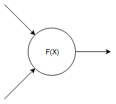
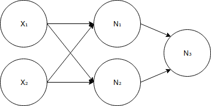
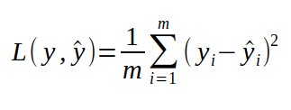
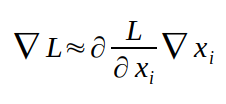
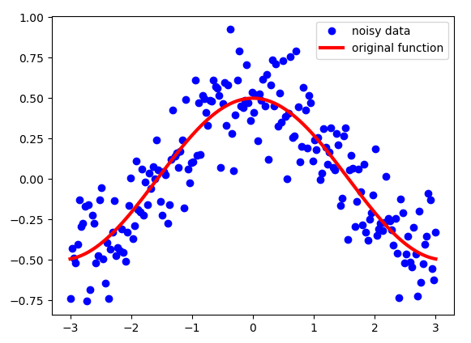
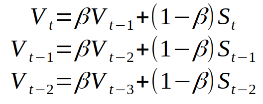
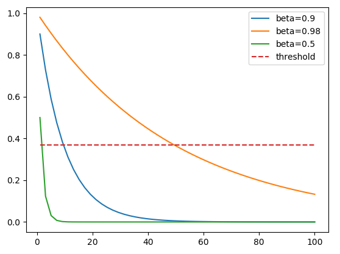
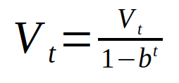

# 从零开始：教你如何训练神经网络

选自 TowardsDataScience

**作者：****Vitaly Bushaev**

**机器之心编译**

> 作者从神经网络简单的数学定义开始，沿着损失函数、激活函数和反向传播等方法进一步描述基本的优化算法。在理解这些基础后，本文详细描述了动量法等当前十分流行的学习算法。此外，本系列将在后面介绍 Adam 和遗传算法等其它重要的神经网络训练方法。

**I. 简介**

本文是作者关于如何「训练」神经网络的一部分经验与见解，处理神经网络的基础概念外，这篇文章还描述了梯度下降（GD）及其部分变体。此外，该系列文章将在在后面一部分介绍了当前比较流行的学习算法，例如：

*   动量随机梯度下降法（SGD）

*   RMSprop 算法

*   Adam 算法（自适应矩估计）

*   遗传算法

作者在第一部分以非常简单的神经网络介绍开始，简单到仅仅足够让人理解我们所谈论的概念。作者会解释什么是损失函数，以及「训练」神经网络或者任何其他的机器学习模型到底意味着什么。作者的解释并不是一个关于神经网络全面而深度的介绍，事实上，作者希望我们读者已经对这些相关的概念早已了然于心。如果读者想更好地理解神经网络具体是如何运行的，读者可以阅读《深度学习》等相关书籍，或参阅文末提供的相关学习资源列表。

本文作者以几年前在 kaggle 上进行的猫狗鉴别竞赛（https://www.kaggle.com/c/dogs-vs-cats）为例来解释所有的东西。在这个比赛中我们面临的任务是，给定一张图片，判断图中的动物是猫还是狗。

**II. 定义神经网络**

人工神经网络（ANN）的产生受到了人脑工作机制的启发。尽管这种模拟是很不严格的，但是 ANN 确实和它们生物意义上的创造者有几个相似之处。它们由一定数量的神经元组成。所那么，我们来看一下一个单独的神经元吧。

*单个神经元*

我们接下来要谈论的神经元是一个与 Frank Rosenblatt 在 1957 年提出的最简单的被称作「感知机，perception」的神经元稍微有所不同的版本。我所做的所有修改都是为了简化，因为我在这篇文章中不会涉及神经网络的深入解释。我仅仅试着给读者给出一个关于神经网络如何工作的直觉认识。

什么是神经元呢？它是一个数学函数，并以一定量的数值作为输入（随便你想要多少作为输入），我在上图画出的神经元有两个输入。我们将每个输入记为 x_k，这里 k 是输入的索引。对于每一个输入 x_k，神经元会给它分配另一个数 w_k，由这些参数 w_k 组成的向量叫做权重向量。正是这些权值才使得每个神经元都是独一无二的。在测试的过程中，权值是不会变化的，但是在训练的过程中，我们要去改变这些权值以「调节」我们的网络。我会在后面的文章中讨论这个内容。正如前面提到的，一个神经元就是一个数学函数。但是它是哪种函数呢？它是权值和输入的一种线性组合，还有基于这种组合的某种非线性函数。我会继续做进一步解释。让我们来看一下首先的线性组合部分。

*输入和权值的线性组合。*

上面的公式就是我提到的线性组合。我们要将输入和对应的权值相乘，然后对所有的结果求和。结果就会一个数字。最后一部分—就是给这个数字应用某种非线性函数。今天最常用的非线性函数即一种被称作 ReLU(rectified linear unit) 的分段线性函数，其公式如下：

*线性整流单元的表达式。*

如果我们的数字大于 0，我们就会使用这个数字，如果它小于 0，我们就会用 0 去代替它。这个被用在线性神经元上的非线性函数被称作激活函数。我们必须使用某种非线性函数的原因在后面会变得很明显。总结一下，神经元使用固定数目的输入和（标量），并输出一个标量的激活值。前面画出的神经元可以概括成一个公式，如下所示：

将我要写的内容稍微提前一下，如果我们以猫狗鉴别的任务为例，我们会把图片作为神经元的输入。也许你会疑问：当神经元被定义为函数的时候，如何向它传递图片。你应该记住，我们将图片存储在计算机中的方式是将它拿一个数组代表的，数组中的每一个数字代表一个像素的亮度。所以，将图片传递到神经元的方式就是将 2 维（或者 3 维的彩色图片）数组展开，得到一个一维数组，然后将这些数字传递到神经元。不幸的是，这会导致我们的神经网络会依赖于输入图片的大小，我们只能处理由神经网络定义的某个固定大小的图片。现代神经网络已经发现了解决这个问题的方法，但是我们在这里还是在这个限制下设计神经网络。

现在我们定义一下神经网络。神经网络也是一个数学函数，它就是很多相互连接的神经元，这里的连接指的是一个神经元的输出被用为另一个神经元的输入。下图是一个简单的神经网络，希望用这张图能够将这个定义解释得更加清楚。

*一个简单的神经网络。*

上图定义的神经网络具有 5 个神经元。正如你所看到的，这个神经网络由 3 个全连接层堆叠而成，即每一层的每个神经元都连接到了下一层的每一个神经元。你的神经网络有多少层、每一层有多少个神经元、神经元之间是怎么链接的，这这些因素共同定义了一个神经网络的架构。第一层叫做输入层，包含两个神经元。这一层的神经元并不是我之前所说的神经元，从某种意义而言，它并不执行任何计算。它们在这里仅仅代表神经网络的输入。而神经网络对非线性的需求源于以下两个事实：1）我们的神经元是连在一起的；2）基于线性函数的函数还是线性的。所以，如果不对每个神经元应用一个非线性函数，神经网络也会是一个线性函数而已，那么它并不比单个神经元强大。最后一点需要强调的是：我们通常是想让一个神经网络的输出大小在 0 到 1 之间，所以我们会将它按照概率对待。例如，在猫狗鉴别的例子中，我们可以把接近于 0 的输出视为猫，将接近于 1 的输出视为狗。为了完成这个目标，我们会在最后一个神经元上应用一个不同的激活函数。我们会使用 sigmoid 激活函数。关于这个激活函数，你目前只需要知道它地返回值是一个介于 0 到 1 的数字，这正好是我们想要的。解释完这些之后，我们可以定义一个和上图对应的神经网络了。

*定义一个神经网络的函数。w 的上标代表神经元的索引，下标代表输入的索引。*

最后，我们得到了某种函数，它以几个数作为输入，输出另一个介于 0 到 1 之间的数。实际上，这个函数怎样表达并不重要，重要的是我们通过一些权重将一个非线性函数参数化了，我们可以通过改变这些权重来改变这个非线性函数。

**III. 损失函数**

在开始讨论神经网络的训练之前，最后一个需要定义的就是损失函数了。损失函数是一个可以告诉我们，神经网络在某个特定的任务上表现有多好的函数。做这件事的最直觉的办法就是，对每一个训练样本，都沿着神经网络传递得到一个数字，然后将这个数字与我们想要得到的实际数字做差再求平方，这样计算出来的就是预测值与真实值之间的距离，而训练神经网络就是希望将这个距离或损失函数减小。

上式中的 y 代表我们想要从神经网络得到的数字，y hat 指的一个样本通过神经网络得到的实际结果，i 是我们的训练样本的索引。我们还是以猫狗鉴别为例。我们有一个数据集，由猫和狗的图片组成，如果图片是狗，对应的标签是 1，如果图片是猫，对应的标签是 0。这个标签就是对应的 y，在向神经网络传递一张图片的时候我们想通过神经网络的得到的结果。为了计算损失函数，我们必须遍历数据集中的每一张图片，为每一个样本计算 y，然后按照上面的定义计算损失函数。如果损失函数比较大，那么说明我们的神经网络性能并不是很好，我们想要损失函数尽可能的小。为了更深入地了解损失函数和神经网络之间的联系，我们可以重写这个公式，将 y 换成网络的实际函数。

**IV. 训练**

在开始训练神经网络的时候，要对权值进行随机初始化。显然，初始化的参数并不会得到很好的结果。在训练的过程中，我们想以一个很糟糕的神经网络开始，得到一个具有高准确率的网络。此外，我们还希望在训练结束的时候，损失函数的函数值变得特别小。提升网络是有可能的，因为我们可以通过调节权值去改变函数。我们希望找到一个比初始化的模型性能好很多的函数。

问题在于，训练的过程相当于最小化损失函数。为什么是最小化损失而不是最大化呢？结果证明损失是比较容易优化的函数。

有很多用于函数优化的算法。这些算法可以是基于梯度的，也可以不是基于梯度的，因为它们既可以使用函数提供的信息，还可以使用函数梯度提供的信息。最简单的基于梯度的算法之一叫做随机梯度下降（SGD），这也是我在这篇文章中要介绍的算法。让我们来看一下它是如何运行的吧。

首先，我们要记住关于某个变量的导数是什么。我们拿比较简单的函数 f(x) = x 为例。如果还记得高中时候学过的微积分法则，我们就会知道，这个函数在每个 x 处的导数都是 1。那么导数能够告诉我们哪些信息呢？导数描述的是：当我么让自变量朝正方向变化无限小的步长时，函数值变化有多快的速率。它可以写成下面的数学形式：

它的意思是：函数值的变化量（方程的左边）近似等于函数在对应的某个变量 x 处的导数与 x 的增量的乘积。回到我们刚才所举的最简单的例子 f(x) = x，导数处处是 1，这意味着如果我们将 x 朝正方向变化一小步ε，函数输出的变化等于 1 和ε的乘积，刚好是ε本身。检查这个规则是比较容易的。实际上这个并不是近似值，它是精确的。为什么呢？因为我们的导数对于每一个 x 都是相同的。但是这并不适用于绝大多数函数。让我们来看一个稍微复杂一点的函数 f(x) = x²。

通过微积分知识我们可以知道，这个函数的导数是 2*x。现在如果我们从某个 x 开始移动某个步长的ε，很容易能够发现对应的函数增量并不精确地等于上面的公式中的计算结果。

现在，梯度是由偏导数组成的向量，这个向量的元素是这个函数所依赖的某些变量对应的导数。对于我们目前所考虑的简单函数来说，这个向量只有一个元素，因为我们所用的函数只有一个输入。对于更加复杂的函数（例如我们的损失函数）而言，梯度会包含函数对应的每个变量的导数。

为了最小化某个损失函数，我们可以怎么使用这个由导数提供的信息呢？还是回到函数 f(x) = x²。显然，这个函数在 x=0 的点取得最小值，但是计算机如何知道呢？假设我们开始的时候得到的 x 的随机初始值为 2，此时函数的导数等于 4。这意味着如果 x 朝着正方向改变，函数的增量会是 x 增量的 4 倍，因此函数值反而会增加。相反，我们希望最小化我们的函数，所以我们可以朝着相反的方向改变 x，也就是负方向，为了确保函数值降低，我们只改变一小步。但是我们一步可以改变多大呢? 我们的导数只保证当 x 朝负方向改变无限小的时候函数值才会减小。因此，我们希望用一些超参数来控制一次能够改变多大。这些超参数叫做学习率，我们后面会谈到。我们现在看一下，如果我们从-2 这个点开始，会发生什么。这里的导数是-4，这意味着如果朝着正方向改变 x，函数值会变小，这正是我们想要的结果。

注意到这里的规律了吗？当 x>0 的时候，我们导数值也大于 0，我们需要朝着负方向改变，当 x<0 的时候，我们导数值小于 0，我们需要朝着正方向改变，我们总需要朝着导数的反方向改变 x。让我们对梯度也引用同样的思路。梯度是指向空间某个方向的向量，实际上它指向的是函数值增加最剧烈的方向。由于我们要最小化我们的函数，所以我们会朝着与梯度相反的方向改变自变量。现在在我们应用这个思想。在神经网络中，我们将输入 x 和输出 y 视为固定的数。我们要对其求导数的变量是权值 w，因为我们可以通过改变这些权值类提升神经网络。如果我们对损失函数计算权值对应的梯度，然后朝着与梯度相反的方向改变权值，我们的损失函数也会随之减小，直至收敛到某一个局部极小值。这个算法就叫做梯度下降。在每一次迭代中更新权重的算法如下所示：

每一个权重值都要减去它对应的导数和学习率的乘积。

上式中的 Lr 代表的是学习率，它就是控制每次迭代中步长大小的变量。这是我们在训练神经网络的时候要调节的重要超参数。如果我么选择的学习率太大，会导致步进太大，以至于跳过最小值，这意味着你的算法会发散。如果你选择的学习率太小，收敛到一个局部极小值可能会花费太多时间。人们开发出了一些很好的技术来寻找一个最佳的学习率，然而这个内容超出本文所涉及的范围了。

不幸的是，我们不能应用这个算法来训练神经网络，原因在于损失函数的公式。

正如你可以在我之前的定义中看到的一样，我们损失函数的公式是和的平均值。从微积分原理中我们可以知道，微分的和就是和的微分。所以，为了计算损失函数的梯度，我们需要遍历我们的数据集中的每一个样本。在每一次迭代中进行梯度下降是非常低效的，因为算法的每次迭代仅仅以很小的步进提升了损失函数。为了解决这个问题，还有另外一个小批量梯度下降算法。该算法更新权值的方法是不变的，但是我们不会去计算精确的梯度。相反，我们会在数据集的一个小批量上近似计算梯度，然后使用这个梯度去更新权值。Mini-batch 并不能保证朝着最佳的方向改变权值。事实上，它通常都不会。在使用梯度下降算法的时候，如果所选择的学习率足够小的话，能够保证你的损失函数在每一次迭代中都会减小。但是使用 Mini-batch 的时候并不是这样。你的损失函数会随着时间减小，但是它会有波动，也会具有更多的「噪声」。

用来估计梯度的 batch 大小是你必须选择的另一个超参数。通常，我们希望尽可能地选择能处理的较大 batch。但是我很少见到别人使用比 100 还大的 batch size。

mini-batch 梯度下降的极端情况就是 batch size 等于 1，这种形式的梯度下降叫做随机梯度下降（SGD）。通常在很多文献中，当人们说随机梯度下降的时候，实际上他们指的就是 mini-batch 随机梯度下降。大多数深度学习框架都会让你选择随机梯度下降的 batch size。

以上是梯度下降和它变体的基本概念。但近来越来越多的人在使用更高级的算法，其中大多数都是基于梯度的，作者下一部分就主要介绍这些最优化方法。

**VII. 反向传播（BP）**

关于基于梯度的算法，剩下的唯一一件事就是如何计算梯度了。最快速的方法就是解析地给出每一个神经元架构的导数。我想，当梯度遇到神经网络的时候，我不应该说这是一个疯狂的想法。我们在前面定义的一个很简单的神经网络就已经相当艰难了，而它只有区区 6 个参数。而现代神经网络的参数动辄就是数百万。

第二种方法就是使用我们从微积分中学到的下面的这个公式去近似计算梯度，事实上这也是最简单的方法。

尽管这个方法是非常容易实现的，但是它却是非常耗计算资源的。

最后一种计算梯度的方法，是对解析难度和计算成本的折中，这个方法被称作反向传小节。反向传播不在本文的讨论范围，如果你想了解更多的话，可以查看 Goodfellow《深度学习》第六章第五小节，该章节对反向传播算法有非常详尽的介绍。

**VI. 它为什么会起作用？**

当我初次了解神经网络以及它是如何工作的时候，我理解所有的方程，但是我不是十分确定它们为啥会起作用。这个想法对我而言有些怪诞：用几个函数，求一些导数，最终会得到一个能够认出图片中是猫还是狗。为什么我不能给你们一个很好的关于为啥神经网络会如此好的奏效的直觉知识呢？请注意以下两个方面。

1\. 我们想要用神经网络解决的问题必须被以数学的形式表达出来。例如，对于对于猫狗鉴别：我们需要找到一个函数，它能够把一副图片中的所有像素作为输入，然后输出图片中的内容是狗的概率。你可以用这种方法去定义任何一个分类问题。

2\. 或许并不是很清楚，为什么会有一个能够从一副图片中把猫和狗区分开来的函数。这里的思想是：只要你有一些具有输入和标签的数据集，总会存在一个能够在一个给定数据集上性能良好的函数。问题在于这个函数会相当复杂。这时候神经网络就能够有所帮助了。有一个「泛逼近性原理，universal approximation theorem」，指的是具有一个隐藏层的神经网络可以近似任何一个你想要的的函数，你想要它近似得多好，就能有多好。

**动量随机梯度下降算法**

-这是关于训练神经网络和机器学习模型优化算法系列的第二部分，第一部分是关于随机梯度下降的。在这一部分，假定读者对神经网络和梯度下降算法已有基本了解。如果读者对神经网络一无所知，或者不知道神经网络是如何训练的，可以在阅读这部分之前阅读第一部分。

在本节中，除了经典的 SGD 算法外，我们还会对动量法进行讨论，这种算法一般比随机梯度下降算法更好更快。动量法 [1] 或具有动量的 SGD 是一种方法，这种方法有助于加速向量向着正确的方向梯度下降，从而使其收敛速度更快。这是最流行的优化算法之一，许多各方向上最先进的模型都是用这种方法进行训练的。在讲高级的算法相关方程之前，我们先来看一些有关动量的基础数学知识。

**指数加权平均**

指数加权平均用于处理数字序列。假设我们有一些嘈杂的序列 S。在这个例子中，我绘制了余弦函数并添加了一些高斯噪声。如下图所示：

注意，尽管这些点看起来非常接近，但它们的 x 坐标是不同的。也就是说，对每个点而言，其 x 坐标是唯一的标识，因此这也是定义序列 S 中每个点的索引。

我们需要处理这些数据，而非直接使用它们。我们需要某种「移动」的平均值，这个平均值会使数据「去噪」从而使其更接近原始函数。指数加权平均值可以产生如下所示的图片：

*动量——来自指数加权平均的数据*

如我们所见，这是一个相当不错的结果。与噪声很大的数据相比，我们得到了更平滑的曲线，这意味着与初始数据相比，我们得到了与原始函数更接近的结果。指数加权平均值用下面的公式定义了新的序列 V：

序列 V 是上面的散点图中的黄色部分。Beta 是取值为 0 到 1 的另一个超参数。在上述例子中，取 Beta = 0.9。0.9 是一个很好的值，经常用于具有动量的 SGD 方法。我们可以这样对 Beta 进行直观理解：我们对序列后面的 1 /（1- beta）的点进行近似平均。让我们看看 beta 的选择会对新序列 V 产生怎样的影响。

*Beta 取值不同时的指数加权平均结果。*

如我们所见，Beta 取值越小，序列 V 波动越大。因为我们平均的例子更少，因此结果与噪声数据更「接近」。随着 Beta 值越大，比如当 Beta = 0.98 时，我们得到的曲线会更加圆滑，但是该曲线有点向右偏移，因为我们取平均值的范围变得更大（beta = 0.98 时取值约为 50）。Beta = 0.9 时，在这两个极端间取得了很好的平衡。

**数学部分**

这个部分对你在项目中使用动量而言不是必要的，所以可以跳过。但这部分更直观地解释了动量是如何工作的。

让我们对指数加权平均新序列 V 的三个连续元素的定义进行扩展。

*V——新序列。S——原始序列。*

将其进行合并，我们可以得到：

再对其进行简化，可得：

从这个等式中可以看出，新序列的第 T 个值取决于原始序列 S 的所有先前的数值 1…t。来自 S 的所有数值被赋了一定的权重。这个权重是序列 S 的第（t-i）个值乘以（1- beta）得到的权重。因为 Beta 小于 1，所以当我们对某个正数的幂取 beta 时，值会变得更小。所以序列 S 的原始值的权重会小得多，也因此序列 S 对序列 V 产生的点积影响较小。从某些角度来说，该权重小到我们几乎可以说我们「忘记」了这个值，因为其影响小到几乎无法注意到。使用这个近似值的好处在于当权重小于 1 / e 时，更大的 beta 值会要求更多小于 1 / e 的权值。这就是为什么 beta 值越大，我们就要对更多的点积进行平均。下面的图表显示的是与 threshold = 1 / e 相比，随着序列 S 初始值变化，权重变小的速度，在此我们「忘记」了初始值。

最后要注意的是，第一次迭代得到的平均值会很差，因为我们没有足够的值进行平均。我们可以通过使用序列 V 的偏差修正版而不是直接使用序列 V 来解决这一问题。

式中 b = beta。当 t 值变大时，b 的 t 次幂与零无法进行区分，因此不会改变 V 值。但是当 t 取值较小时，这个方程会产生较好的结果。但是因为动量的存在使得机器学习过程稳定得很快，因此人们通常会懒得应用这一部分。

**动量 SGD 法**

我们已经定义了一种方法来获得一些序列的「移动」平均值，该值会与数据一起变化。我们该如何将其应用于神经网络的训练中呢？它可以平均我们的梯度。我将在下文中解释它是如何在动量中完成的这一工作，并将继续解释为什么它可能会得到更好的效果。

我将提供两个定义来定义具有动量的 SGD 方法，这几乎就是用两种不同的方式表达同一个方程。首先，是吴恩达在 Coursera 深度学习专业化（https://www.deeplearning.ai/）的课程中提出的定义。他解释的方式是，我们定义一个动量，这是我们梯度的移动平均值。然后我们用它来更新网络的权重。如下所示：

式中 L 是损失函数，三角形符号是梯度 w.r.t 权重,α 是学习率。另一种最流行的表达动量更新规则的方式不那么直观，只是省略了（1 - beta）项。

这与第一组方程式非常相似，唯一的区别是需要通过（1 - β）项来调整学习率。

**Nesterov 加速渐变**

Nesterov 动量是一个版本略有不同的动量更新，最近越来越受欢迎。在这个版本中，首先会得到一个当前动量指向的点，然后从这个点计算梯度。如下图所示：

Nesterov 动量可用下式定义：

**动量工作原理**

在这里我会解释为什么在绝大多数情况下动量法会比经典 SGD 法更好用。

使用随机梯度下降的方法，我们不会计算损失函数的确切导数。相反，我们是对一小批数据进行估算的。这意味着我们并不总是朝着最佳的方向前进，因为我们得到的结果是「嘈杂的」。正如我在上文中列出的图表。所以，指数的加权平均可以提供一个更好的估计值，该估计值比通过嘈杂计算得到的结果更接近实际值的导数。这就是动量法可能比传统 SGD 更好的原因之一。

另一个原因在于沟谷（ravine）。沟谷是一个区域，在其中，曲线在一个维度比另一个维度陡得多。在深度学习中，沟谷区可近似视为局部最低点，而这一特性无法用 SGD 方法得到。SGD 倾向于在狭窄的沟谷上摆动，因为负梯度将沿着陡峭的一侧下降，而非沿着沟谷向最优点前进。动量有助于加速梯度向正确的方向前进。如下图所示：

*左图——没有动量的 SGD，右图——有动量的 SGD（来源：https://www.willamette.edu/~gorr/classes/cs449/momrate.html）*

**结论**

希望本节会提供一些关于具有动量的 SGD 方法是如何起作用以及为什么会有用的想法。实际上它是深度学习中最流行的优化算法之一，与更高级的算法相比，这种方法通常被人们更频繁地使用。

**参考资源**

*   neuralnetworksanddeeplearning.com（http://neuralnetworksanddeeplearning.com/chap1.html）：一本关于基本知识的很好的在线书籍。关于神经网络背后的理论。作者以一种很好的方式解释了你需要知道的数学知识。它也提供并解释了一些不使用任何深度学习框架从零开始编写神经网络架构的代码。

*   Andrew Ng 的深度学习课程（https://www.coursera.org/specializations/deep-learning）：coursera 上的课程，也是有关学习神经网络的。以非常简单的神经网络例子开始，逐步到卷积神经网络以及更多。

*   3Blue1Brown（https://www.youtube.com/channel/UCYO_jab_esuFRV4b17AJtAw）：YouTube 上也有一些能够帮助你理解神经网络和线性代数的很好的视频。它们展示了很棒的可视化形式，以及以非常直觉的方式去理解数学和神经网络。

*   Stanford CS231 课程（http://cs231n.stanford.edu/）：这是关于用于视觉识别的卷积神经网络的课堂，可以学到很多关于深度学习和卷积神经网络的具体内容。

**参考文献**

[1] Ning Qian. On the momentum term in gradient descent learning algorithms . Neural networks : the official journal of the International Neural Network Society, 12(1):145–151, 1999

[2] Distill, Why Momentum really works（https://distill.pub/2017/momentum/）

[3] deeplearning.ai

[4] Ruder(2016). An overview of gradient descent optimization algorithms. arXiv preprint arXiv:1609.04747

[5] Ruder (2017) Optimization for Deep Learning Highlights in 2017.（http://ruder.io/deep-learning-optimization-2017/index.html）

[6] Stanford CS231n lecture notes.（http://cs231n.github.io/neural-networks-3/）(http://cs231n.github.io/neural-networks-3/%EF%BC%89)

[7] fast.ai（http://www.fast.ai/）

*原文链接：*

*第一部分**：**https://towardsdatascience.com/how-do-we-train-neural-networks-edd985562b73*

*第二部分 ：Stochastic Gradient Descent with momentum (https://quip.com/tJ7sAxbyrwZg)*

*https://towardsdatascience.com/stochastic-gradient-descent-with-momentum-a84097641a5d*

****本文为机器之心编译，**转载请联系本公众号获得授权****。**

✄------------------------------------------------

**加入机器之心（全职记者/实习生）：hr@jiqizhixin.com**

**投稿或寻求报道：content@jiqizhixin.com**

**广告&商务合作：bd@jiqizhixin.com**