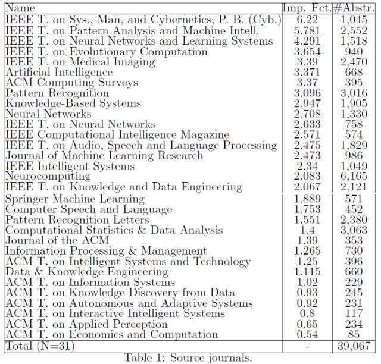
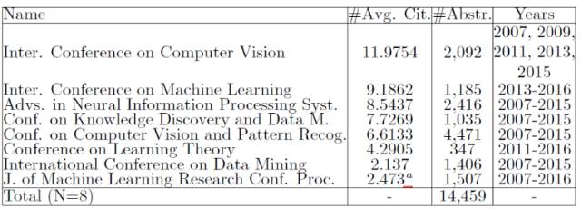
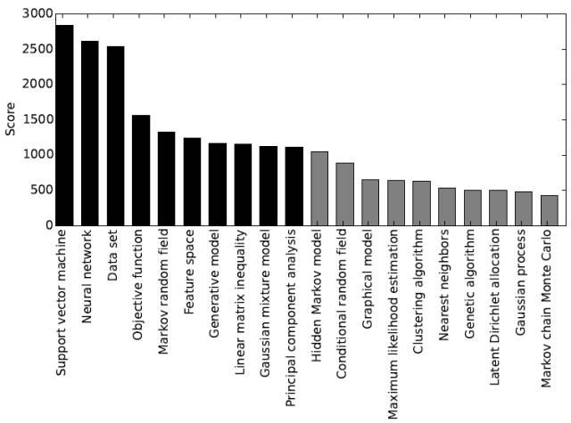

# 学界 | 定量研究：当前机器学习领域十大研究主题

选自 arXiv

**作者：Patrick Glauner 等**

**机器之心编译**

**参与：韩小西、李泽南**

> *机器学习的发展日新月异，目前最热门的研究方向是什么？近日，来自卢森堡大学等地的研究者们对近十年来各大热门期刊和会议上发表的论文进行了定量分析，通过机器学习找出了目前业内排名前十的研究主题。在这份新榜单中，支持向量机、神经网络和数据集排名前三，大幅领先于其他主题。读者可以点击*「*阅读原文」下载此论文。*

论文地址：https://arxiv.org/abs/1703.10121

机器学习研究中常探索哪些话题？这个问题曾于 2007 年通过在杰出的研究者中做定性调查第一次得出过答案。在本文的研究中，我们从定量的角度回答这个问题。具体来说，我们收集了 54,000 篇论文的摘要，它们都是在 2007 至 2016 年间于重要的机器学习期刊和会议上发表的文章。随后，我们用机器学习算法确定了机器学习领域中排名前十的研究主题。不局限于模型，我们提供了涵盖优化、数据、特征等方面的整体视角。这种定量方法减少了调查偏差。关于什么是机器学习领域最流行的前十个主题，该方法提供了全新的以及与时俱进的观察视角。我们的方法可以找到这一领域最流行的话题，为研究者们选定方向提供帮助。

**前言**

2007 年，一篇名为《数据挖掘排名前十的算法（Top 10 algorithms in data mining）》的论文指出并介绍了在数据科学领域中排名前十的最有影响力的数据挖掘算法。它通过整合获奖研究者的提名、研究社区的观点以及谷歌学术的被引量来计算权重。在这项工作中，排名前十的算法为：C4.5, K-均值（k-means），支持向量机（SVM），Apriori，EM，PageRank，AdaBoost，KNN，朴素贝叶斯（naive Bayes）以及 CART。

在接下来的十年中，与计算机硬件能力的发展以及商业应用问题的大量增长同步，机器学习技术得到发展。源于对主要期刊及会议的定量分析，本文研究回顾了机器学习研究领域内排名前十的流行研究方向。本研究涵盖了一些更广泛范围内的研究主题，不仅包括模型，还包括像数据集，特征，优化技术以及评价矩阵这样的概念。由于文献多关注模型，这种在整个机器学习领域内更广阔的视野在文献中大部分都被忽略了。在这项研究中，我们主要的贡献在于通过定量方法提供了一种关于机器学习活跃的研究领域的清晰观点，其中并不掺杂个人观点。这种尝试旨在减少偏差并寻找研究社区真正的关注焦点。这项研究的结果让我们可以把自己的研究放在机器学习的全局范围内重新审视。这为研究者提供了研究流行课题以及辨识那些在最近的研究中没有获得充分关注的课题的机会。

*表 1：参考期刊*

*表 2：参考会议*

**结果**

采用以二元语法和三元语法作为提取策略的方法 1，我们仅得到了很普遍的研究主题。具体来说，排名前五的研究主题为「网络预处理」，「监督分类部分」，「学习二值表达」，「非监督和监督学习」以及「从输入中预测标签」。作为对比，施行采用 RAKE 进行基于机器学习的关键词提取的方法 2，我们得到了如图 1 所描绘的排名前 10 的研究主题。我们注意到在排名前三的研究主题，即「支持向量机」，「神经网络」，以及「数据集」之后，研究主题的流行度发生了急剧下跌。我们注意到在「目标函数」之后有另一次下跌。接下来的 7 个话题在流行度方面非常接近。「隐马尔科夫模型」在流行度上仅略低于「主成分分析法」。

*图 1：黑色标记的为排名前 10 的研究主题，灰色标记出的为排名 11-20 的研究主题*

**结论**

在此文的研究中，我们使用机器学习方法从将近 54,000 篇于 2007 至 2016 年间发表在主要机器学习期刊和会议的文章摘要中找到了机器学习研究领域中排名前 10 的研究主题。具体说来，我们发现支持向量机，神经网络，数据集，目标函数，马尔科夫随机场，特征空间，生成模型，线性矩阵不等式，高斯混合模型以及主成分分析为排名前十的主题。对比于 2007 年完成的类似的工作，支持向量机是整个排名前十的列表中唯一相同的主题。这一现象可以归为如下原因：首先，我们不只考虑模型，而将考察范围扩展到包含特征，数据以及优化的整个机器学习领域。其次，不同于对领域内专家的看法进行调查，我们采用定量研究以减小偏差。第三，在过去十年中，学界对模型的兴趣发生了巨大变化，最显著的标志是在深度学习术语下神经网络的回归。总体上，本次定量研究为目前的机器学习研究兴趣提供了广泛的视野，对未来的研究活动具有指导意义。  

******本文为机器之心编译，***转载请联系本公众号获得授权******。***

✄------------------------------------------------

**加入机器之心（全职记者/实习生）：hr@jiqizhixin.com**

**投稿或寻求报道：editor@jiqizhixin.com**

**广告&商务合作：bd@jiqizhixin.com**