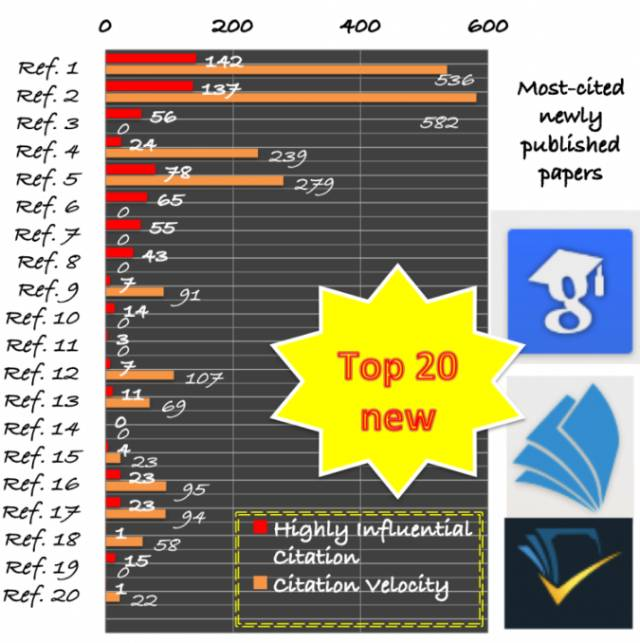

# 机器学习和深度学习引用量最高的 20 篇论文（2014-2017）

选自 Kdnuggets

**作者：Thuy T. Pham**

**机器之心编译**

**参与：邵明、黄小天**

 *> *机器学习和深度学习的研究进展正深刻变革着人类的技术，本文列出了自 2014 年以来这两个领域发表的最重要（被引用次数最多）的 20 篇科学论文，以飨读者。*

机器学习，尤其是其子领域深度学习，在近些年来取得了许多惊人的进展。重要的研究论文可能带来使全球数十亿人受益的技术突破。这一领域的研究目前发展非常快，为了帮助你了解进展状况，我们列出了自 2014 年以来最重要的 20 篇科学论文。

我们筛选论文的标准是来自三大学术搜索引擎谷歌学术（scholar.google.com）、微软学术（academic.microsoft.com）和 semanticscholar.org 的引用量。由于不同搜索引擎的引用量数据各不相同，所以我们在这里仅列出了微软学术的数据，其数据比其它两家稍低一点。

我们还给出了每篇论文的发表时间、高度有影响力的引用数量（HIC）和引用速度（CV），以上数据由 semanticscholar.org 提供。HIC 表示了以此为基础的论文情况和与其它论文的关系，代表了有意义的引用。CV 是最近 3 年每年引用数量的加权平均。有些引用的 CV 是 0，那是因为 semanticscholar.org 上没有给出数据。这 20 篇论文中大多数（包括前 8 篇）都是关于深度学习的，但同时也很多样性，仅有一位作者（Yoshua Bengio）有 2 篇论文，而且这些论文发表在很多不同的地方：CoRR (3)、ECCV (3)、IEEE CVPR (3)、NIPS (2)、ACM Comp Surveys、ICML、IEEE PAMI、IEEE TKDE、Information Fusion、Int. J. on Computers & EE、JMLR、KDD 和 Neural Networks。前 2 篇论文的引用量目前远远高于其它论文。注意第 2 篇论文去年才发表！要了解机器学习和深度学习的最新进展，这些论文一定不能错过。

**1\. 论文：Dropout：一种防止神经网络过拟合的简单方法（Dropout: a simple way to prevent neural networks from overfitting）**

*   链接：http://suo.im/3o6l4B

*   作者：Hinton, G.E., Krizhevsky, A., Srivastava, N., Sutskever, I., & Salakhutdinov, R. (2014). Journal of Machine Learning Research, 15, 1929-1958.

*   数据：引用：2084、HIC：142、CV：536

*   摘要：其关键思想是在神经网络的训练过程中随机丢弃单元（连同它们的连接点）。这能防止单元适应过度，显著减少过拟合，并相对于其它正则化方法有重大改进。

**2\. 论文：用于图像识别的深度残差学习（Deep Residual Learning for Image Recognition）**

*   链接：http://suo.im/1JrYXX

*   作者：He, K., Ren, S., Sun, J., & Zhang, X. (2016). CoRR

*   数据：引用：1436、HIC：137、CV：582

*   摘要：目前的深度学习网络层数越来越多，越来越难以训练，因此我们提出了一种减缓训练压力的残差学习框架。我们明确地将这些层重新定义为与输入层有关的学习残差函数，而不是学习未被引用的函数。与此同时，我们提供了全面的经验证据以表明残差网络更容易优化，并可通过增加其层数来提升精确度。

**3\. 论文：批标准化：通过减少内部协移加速深度神经网络训练（Batch Normalization: Accelerating Deep Network Training by Reducing Internal Covariate Shift）**

*   链接：http://suo.im/3sJtk1

*   作者：Sergey Ioffe, Christian Szegedy (2015) ICML.

*   数据：引用：946、HIC：56、CV：0

*   摘要：训练深度神经网络的过程很复杂，原因在于每层的输入分布随着训练过程中引起的前面层的参数变化而变化。我们把这种现象称为内部协变量转移（internal covariate shift），并可利用归一化层输入来解决此问题。通过将此方法应用到最先进的图像分类模型，批标准化在训练次数减少了 14 倍的条件下达到了与原始模型相同的精度，这表明批标准化具有明显的优势。

**4\. 论文：利用卷积神经网络进行大规模视频分类（Large-Scale Video Classification with Convolutional Neural Networks）**

*   链接：http://suo.im/25lfXF

*   作者：Fei-Fei, L., Karpathy, A., Leung, T., Shetty, S., Sukthankar, R., & Toderici, G. (2014). IEEE Conference on Computer Vision and Pattern Recognition

*   数据：引用：865、HIC：24、CV：239

*   摘要：针对图像识别问题，卷积神经网络（CNN）被认为是一类强大的模型。受到这些结果的激励，我们使用了一个包含 487 个类别、100 万 YouTube 视频的大型数据集，对利用 CNN 进行大规模视频分类作了一次广泛的实证评估。

**5\. 论文：Microsoft COCO：语境中的通用对象（Microsoft COCO: Common Objects in Context）**

*   链接：http://suo.im/DAXwA

*   作者：Belongie, S.J., Dollár, P., Hays, J., Lin, T., Maire, M., Perona, P., Ramanan, D., & Zitnick, C.L. (2014). ECCV.

*   数据：引用：830、HIC：78、CV：279

*   摘要：我们展示了一个新的数据集，通过将对象识别问题放入更广泛的场景理解问题的语境中，以推进当前对象识别领域中最先进的技术。我们的数据集包含了 91 种对象类型的照片，这些图片对于一个 4 岁大的孩子而言，很容易识别。最后，我们利用可变形部件模型（DPM）为边界框和分割检测结果提供了一个基线性能分析。

**6\. 论文：使用场景数据库学习场景识别中的深层特征（Learning deep features for scene recognition using places database）**

*   链接：http://suo.im/2EOBTa

*   作者：Lapedriza, À., Oliva, A., Torralba, A., Xiao, J., & Zhou, B. (2014). NIPS.

*   数据：引用：644、HIC：65、CV：0

*   摘要：我们引入了一个以场景为中心的新数据库，这个数据库称为「Places」，里面包含了超过 700 万个标注好了的场景。我们提议使用新方法去比较图像数据集的密度和多样性，以表明 Places 与其它场景数据库一样密集并更具多样性。

**7\. 论文：生成对抗网络（Generative adversarial nets）**

*   链接：http://suo.im/3YS5F6

*   作者：Bengio, Y., Courville, A.C., Goodfellow, I.J., Mirza, M., Ozair, S., Pouget-Abadie, J., Warde-Farley, D., & Xu, B. (2014) NIPS.

*   数据：引用：463、HIC：55、CV：0

*   摘要：通过对抗过程，我们提出了一个评估生成模型的新框架。在此框架中，我们同时训练两个模型：生成模型 G 捕获数据分布；判别模型 D 评估样本示来自训练数据集（而不是来自 G 中）的概率。

**8\. 论文：通过内核相关滤波器实现高速跟踪（High-Speed Tracking with Kernelized Correlation Filters）**

*   链接：http://suo.im/2BBOea

*   作者：Batista, J., Caseiro, R., Henriques, J.F., & Martins, P. (2015). CoRR

*   数据：引用：439、HIC：43、CV：0

*   摘要：大多数的现代追踪器，为应对自然图像中的变化，典型的方法是采用翻译和缩放样本补丁训练分类器。我们针对包含成千上万个翻译补丁数据集提出了一个分析模型。结果表明结果数据矩阵是循环的，我们可以利用离散傅立叶变换对角化已有的循环矩阵，将存储和计算量降低了几个数量级。

**9\. 论文：多标签学习算法综述（A Review on Multi-Label Learning Algorithms）**

*   链接：http://suo.im/3LgpGf

*   作者：Zhang, M., & Zhou, Z. (2014). IEEE TKDE

*   数据：引用：436、HIC：7、CV：91

*   摘要：本论文的主要目的是对多标签学习问题进行及时回顾。在多标签学习问题中，一个实例代表一个样本，同时，一个样本与一组标签相关联。

**10\. 论文：深层神经网络特征的可传递性（How transferable are features in deep neural networks）**

*   链接：http://suo.im/aDLgu

*   作者：Bengio, Y., Clune, J., Lipson, H., & Yosinski, J. (2014) CoRR

*   数据：引用：402、HIC：14、CV：0

*   摘要：我们用实验量化了深层卷积神经网络中每层神经元的一般性与特异性，并报告了一些令人惊讶的结果。可传递性受到两个不同问题的不利影响：（1）以牺牲目标任务的性能为代价，实现更高层神经元对原始人物的专业化，这是预料之中的；（2）与分裂共同适应神经元（co-adapted neuron）之间的网络有关的优化困难，这是预料之外的。

**11\. 论文：我们需要数百种分类器来解决真实世界的分类问题吗？（Do we need hundreds of classifiers to solve real world classification problems）**

*   链接：http://suo.im/2w14RK

*   作者：Amorim, D.G., Barro, S., Cernadas, E., & Delgado, M.F. (2014). Journal of Machine Learning Research

*   数据：引用：387、HIC：3、CV：0

*   摘要：我们评估了来自 17 个「家族」（判别分析、贝叶斯、神经网络、支持向量机、决策树、基于规则的分类器、提升、装袋、堆叠、随机森林、集成方法、广义线性模型、最近邻、部分最小二乘和主成分回归、逻辑和多项回归、多元自适应回归样条法等）的 179 个分类器。我们使用了来自 UCI 数据库中的 121 个数据集来研究分类器行为，这些行为不依赖于所选取的数据集。最终胜出的是使用 R 语言实现的随机森林方法和 C 中使用 LibSVM 实现的带有高斯内核的 SVM。

**12\. 论文：知识库：一种概率知识融合的网络规模方法（Knowledge vault: a web-scale approach to probabilistic knowledge fusion）**

*   链接：http://suo.im/3qCSs6

*   作者：Dong, X., Gabrilovich, E., Heitz, G., Horn, W., Lao, N., Murphy, K., ... & Zhang, W.(2014, August). In Proceedings of the 20th ACM SIGKDD international conference on Knowledge discovery and data mining ACM

*   数据：引用：334、HIC：7、CV：107

*   摘要：我们引入了一个网络规模的概率知识库，它将网页内容提取（通过文本分析、表格数据、页面结构和人工注释获得）与来自现存知识库中的先验知识相结合，以构建新知识库。我们部署监督学习方法去融合不同的信息源。该知识库比先前发布的任何结构化知识库大得多，并且具有概率推理系统，该概率推理系统能计算事实准确性的校准概率。

**13\. 论文：用于高维数据的可扩展最近邻算法（Scalable Nearest Neighbor Algorithms for High Dimensional Data）**

*   链接：http://suo.im/hjTa4

*   作者：Lowe, D.G., & Muja, M. (2014). IEEE Trans. Pattern Anal. Mach. Intell.

*   数据：引用：324、HIC：11、CV：69

*   摘要：我们提出了用于近似最近邻匹配的新算法，并将其与以前的算法进行比较。为了将其扩展到大型数据集（不适合单机的存储处理）上，我们提出了一种分布式最近邻匹配框架，该框架可以与论文中描述的任何算法一起使用。

**14\. 论文：回顾超限学习机的发展趋势（Trends in extreme learning machines: a review）**

*   链接：http://suo.im/3WSEQi

*   作者：Huang, G., Huang, G., Song, S., & You, K. (2015). Neural Networks

*   数据：引用：323、HIC：0、CV：0

*   摘要：我们的目标是报告超限学习机（ELM）的理论研究和实践进展所处的现状。除了分类和回归，ELM 最近已经被扩展到集群、特征选择、代表性学习和许多其他学习任务。由于其惊人的高效性、简单性和令人印象深刻的泛化能力，ELM 已经被广泛用于各种领域，如生物医学工程、计算机视觉、系统识别、控制和机器人。

**15\. 论文：一份关于概念漂移适应的调查（A survey on concept drift adaptation）**

*   链接：http://suo.im/3bQkiz

*   作者：Bifet, A., Bouchachia, A., Gama, J., Pechenizkiy, M., & Zliobaite, I. ACM Comput. Surv., 2014

*   数据：引用：314、HIC：4、CV：23

*   摘要：该文全面介绍了概念漂移适应。它指的是当输入数据与目标变量之间的关系随时间变化之时的在线监督学习场景。

**16\. 论文：深度卷积激活特征的多尺度无序池化（Multi-scale Orderless Pooling of Deep Convolutional Activation Features）**

*   链接：http://suo.im/3gNw8e

*   作者：Gong, Y., Guo, R., Lazebnik, S., & Wang, L. (2014). ECCV

*   数据：引用：293、HIC：23、CV：95

*   摘要：为了在不降低其辨别力的同时改善卷积神经网络激活特征的不变性，本文提出了一种简单但有效的方案：多尺度无序池化（MOP-CNN）。

**17\. 论文：同时检测和分割（Simultaneous Detection and Segmentation）**

*   链接：http://suo.im/4b0ye0

*   作者：Arbeláez, P.A., Girshick, R.B., Hariharan, B., & Malik, J. (2014) ECCV

*   数据：引用：286、HIC：23、CV：94

*   摘要：本文的目标是检测图像中一个类别的所有实例，并为每个实例标记属于它的像素。我们称将此任务称为同时检测和分割（SDS）。

**18\. 论文：一份关于特征选择方法的调查（A survey on feature selection methods）**

*   链接：http://suo.im/4BDdKA

*   作者：Chandrashekar, G., & Sahin, F. Int. J. on Computers & Electrical Engineering

*   数据：引用：279、HIC：1、CV：58

*   摘要：在文献中，有许多特征选择方法可用，由于某些数据集具有数百个可用的特征，这会导致数据具有非常高的维度。

**19\. 论文：用回归树集成方法在一毫秒内实现人脸校准（One Millisecond Face Alignment with an Ensemble of Regression Trees）**

*   链接：http://suo.im/1iFyub

*   作者：Kazemi, Vahid, and Josephine Sullivan, Proceedings of the IEEE Conference on Computer Vision and Pattern Recognition 2014

*   数据：引用：277、HIC：15、CV：0

*   摘要：本文解决了单个图像的人脸校准问题。我们展示了怎样使用回归树集成来直接从像素强度的稀疏子集估计面部的地标位置，并通过高质量的预测实现了超实时性能。

**20\. 论文：关于作为混合系统的多分类器系统的调查（A survey of multiple classifier systems as hybrid systems）**

*   链接：http://suo.im/3c9EFD

*   作者：Corchado, E., Graña, M., & Wozniak, M. (2014). Information Fusion, 16, 3-17.

*   数据：引用：269、HIC：1、CV：22

*   摘要：模式分类领域目前关注的焦点是几种分类器系统的组合，构建这些分类器系统可以使用相同或者不同的模型和／或数据集构建。**

*原文地址：http://www.kdnuggets.com/2017/04/top-20-papers-machine-learning.html*

******本文为机器之心编译，***转载请联系本公众号获得授权******。***

✄------------------------------------------------

**加入机器之心（全职记者/实习生）：hr@jiqizhixin.com**

**投稿或寻求报道：editor@jiqizhixin.com**

**广告&商务合作：bd@jiqizhixin.com***