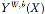
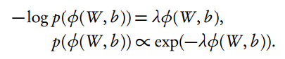
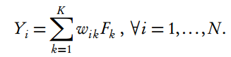
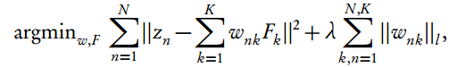

# 从贝叶斯角度，看深度学习的属性和改进方法

选自 arXiv.org

**机器之心编译**

**参与：蒋思源、吴攀**

> *深度学习是一种高效的非线性高维数据处理方法，它可以更自然地解释为一种工程或算法，而本论文希望从贝叶斯的角度将深度学习看作是一种广义线性模型的堆叠而提供一些新的研究视角和应用方向。论文首先论文首先从将单变量半仿射函数叠加构建高维映射的方法解释深度学习，然后从深度概率模型、贝叶斯预测器到算法问题进一步探讨其特性。机器之心对本论文的部分内容进行了编译介绍，更多详情请参阅原论文。*

论文地址：https://arxiv.org/abs/1706.00473

深度学习是一种为非线性高维数据进行降维和预测的机器学习方法。而从贝叶斯概率视角描述深度学习会产生很多优势，即具体从统计的解释和属性，从对优化和超参数调整更有效的算法，以及预测性能的解释这几个方面进一步阐述。同时，传统的高维统计技术：主成分分析法（PCA）、偏最小二乘法（PLS）、降秩回归（RRR）、投影寻踪回归（PPR）等方法将在浅层学习器（shallow learner）那一部分展示。这些传统降维方法的深度学习形式可以利用多层数据降维而令性能达到一个较大提升。随机梯度下降（SGD）通过训练、优化和 Dropout（DO）能选择模型和变量。贝叶斯正则化（Bayesian regularization）是寻找最优网络和提供最优偏差-方差权衡框架以实现良好样本性能的核心。我们还讨论了高维中构建良好的贝叶斯预测因子。为了证明我们的方法，我们对 Airbnb 首次国际预订的样本进行了分析。最后，我们讨论了该研究未来的方向。

**1 引言**

深度学习（DL）是一种使用分层隐含变量的机器学习方法。深度学习可以看作为一个概率模型，其中条件均值指定为广义线性模型的堆叠（sGLM）。

深度学习是一个非线性高维数据降维的方案，其理论基础来源于 Kolmogorov 将多元反应曲面（multivariate response surfaces）表征为单变量半仿射函数的叠加。深度学习自然上更是一种算法而不是概率模型，因此我们希望通过提供一个深度学习范式的贝叶斯视角来促进一些方面的理解与研究，如更快的随机算法、优化的调参方法和可解释性模型等方面。

从经验上来说，深度学习的改进主要来自三个部分：

*   新的激活函数，比如使用 ReLU 替代历来使用的 Sigmoid 函数

*   架构的深度和采用 dropout 作为变量选择技术

*   常规训练和评价模型的计算效率由于图形处理单元（GPU）和张量处理单元（TPU）的使用而大大加速

**1.1 深度学习**

机器学习在给定一个高维输入 X 的情况下训练一个得到输出 Y 的预测器。因此，一个学习器就是一种输入和输出之间的映射。其中输出 Y = F (X)，而输入空间 X 是一种高维空间，即我们可以表示为：

输出 Y 可以为回归问题中的连续值或分类问题中的离散值，当然也可以是两者混合。例如在分类问题中，我们需要学习一个映射 F : X → Y，其中 Y ∈ {1,...,K} 指向不同的类别。因此预测器就可以定义为：

为了构建一个多元函数 F (X)，我们需要一步步构建模块。首先我们令 f1 到 fl 为单变量激活函数，所以一个半仿射（semi-affine）激活规则就由下方程给出：

给定 L 层，叠加（复合）预测就可以定义为：

因此，给定一定层级数量 L，我们的深度预测器就成为了复合映射：

简而言之，一个高维映射 F 可以通过单变量半仿射函数的叠加来建模。类似于经典的基础分解（basis decomposition），该深度方法使用单变量激活函数分解高维输入矩阵 X。为了选择隐藏单元（也称神经元）的数量 Nl，在每一层我们都会使用 dropout。偏置向量是必不可少的，例如我们使用不带常数项的 b 的函数 f (x) = sin(x) 甚至都不能逼近拟合像 cos(x) 那样的函数，而一个偏置项（即 sin(x + π/2) = cos(x)）就很容易解决这样的问题。

现在定义 Z (l) 指代第 l 层神经网络，所以输入向量 X 就可以表示为 Z(0)。最终的输出是 Y，其可以是数值型（numeric）或分类型（categorical）。因此，深度预测规则就可以表达为：

其中，图 1 展示了深度神经网络常用的架构，即前馈网络、自编码器、卷积网络、循环网络、长短期记忆和神经图灵机。一旦系统训练得出了一个高阶非零权重矩阵，其中就暗含了一个神经网络结构。

*图 1：深度学习最常见的建模架构*

**2 深度概率学习**

从概率上来说，输出 Y 能看作是概率模型  生成的随机变量，预测器  中参数分别为权重 w 和参数 b。

现在定义负对数似然 L 为：

L2 范数  是传统的最小二乘法，而交叉熵函数

  提供了多类 logistic 分类的等价形式。

正则项 λφ(W, b) 可以从概率上解释为参数的负对数先验分布：

深度预测器是经正则化的最大后验估计（MAP）量，其中

训练需要找到高度非线性函数的最优解：

其中对数后验函数通过训练数据   进行优化，即：

深度学习的主要梯度特性  在为复杂架构和大型数据集上使用张量方法计算是十分节约计算资源的。TensorFlow 和 TPU 为多种神经网络架构提供了最优秀的框架。从统计学的角度来看，我们要注意后验概率是高度多模态的，而提供良好的超参数调节（hyper-parameter tuning）可能成本非常大。显然，应用最优秀的随机贝叶斯 MCMC 算法以提供更高效的方法是一个成果丰富的领域。对于浅层架构，我们提出了可变向方法的乘数器（ADMM）作为优化问题非常有效的解决方案。

**2.1 对于模型和变量选择的 Dropout **

Dropout 是一种模型选择技术，其旨在避免在训练过程中出现过拟合现象，Dropout 的基本做法是在给定概率 p 的情况下随机移除输入数据 X 的维度。因此，探讨一下其如何影响潜在损失函数和最优化问题是有启发性的。

**2.2 浅层学习器**

几乎所有的浅层数据降维技术都可以视为由低维辅助变量 Z 和合成函数指定的预测规则所组成：

因此该高维数据降维问题就是寻找 Z 变量并正确地估计层级函数 (f1 , f 2 )。在这些层级中，我们希望不忽视预测输出 Y 的信息情况下发现低维 Z-结构。

**2.3 堆叠的自编码器**

自编码器是一种非常重要的数据降维方法。而自编码器是一个深度学习架构，其旨在复制 X、令 X=Y，再通过 bottleneck 结构达到降维效果。这意味着我们选择一个模型 。该模型旨在浓缩必要的信息以重新创造 X。

**3 寻找好的贝叶斯预测器**

贝叶斯方法通过很多方式解决优良预测性能这一问题。其目标是找到一个良好的均方误差（MSE）预测：。

*图 2：树型核函数和随机森林核函数*

*图 3：50 维度的球体（50-dimensional ball）和蒙特卡罗抽样结果的二维图像*

*图 4：Y ∼ U(Bp) 的边缘分布直方图，其中 p 为不同的维度数量。*

*图 5：由带有 ReLU 激活函数的三个神经元所定义的超平面。*

*图 6：由树型架构（顶行）和深度学习架构（底行）对三个不同数据集做所得的空间划分结果*

**4 算法问题**

**4.1 随机梯度下降**

随机梯度下降（SGD）是用于极小化损失函数 f(W,b)（即最大化似然函数）的默认标准方法，可用于找到深度学习的权重和偏置。SGD 在第 k 次迭代更新时只是简单地通过减去梯度∇f (W k, b k ) 的估计值来极小化损失函数。该梯度可以通过被应用于半仿射函数的叠加上的链式规则来获取。其近似梯度可以通过下面的计算来估计：

其中 Ek ⊂ {1,...,T } 且 |Ek | 是 Ek 中元素的数量。

当 |Ek | > 1 时，该算法被称为 batch SGD 或就是 SGD。一般而言，子集 E 是通过在 {1,...,T } 中循环选取的连续元素，Ek+1 = [Ek mod T ]+1。方向 gk 是使用一个链式规则（即反向传播）计算的，提供了 ∇f (W k· , b k ) 的一个无偏置的估计量。具体来说，我们有：

在每次迭代，SGD 会更新解

**4.2 学习浅层预测器**

传统的因子模型（factor model）才用 K 个隐藏因子 {F1 , F2 ,..., Fk } 的线性组合：

其中因子 Fk 和权重 Bik 能通过及解以下方程而得出：

其中 l 等于 1 或 2，即可用 L1 范数或 L2 范数。现在我们最小化重构误差（即精度）并加上正则化罚项以控制其他样本预测的方差-偏差均衡。现有很多算法可以高效地解决这类问题，比如说如果采用 L2 范数和高效的激活函数就能将模型表征为神经网络模型。

**5 应用：预测 Airbnb 预订**

为了阐释这种深度学习范式，我们使用了一个由 Airbnb 提供给 Kaggle 比赛的数据集来进行我们的实验分析。实验目标是构建一个预测模型，使之能够预测一个新用户将会在哪个国家进行他或她的首次预订。

*图 11：深度学习模型的预测准确度。(a) 给出了当仅使用预测的目的地时的预测准确度；(b) 给出了当预测国家是被预测列表中的前两位时，正确预测所占的正确比例；(c) 给出了当预测国家是被预测列表中的前三位时，正确预测所占的正确比例*

*图 12：由 XGBoost 模型识别出的 15 个最重要的特征*

**6 讨论**

深度学习可被视为高维非线性数据降维方案。而基于深度学习的贝叶斯概率模型是一种叠加的广义线性模型（GLM）。因此，其成功地阐明了使用 SGD 训练深度架构，但同时 SGD 又是一种一阶梯度方法，所以寻找到的后验模式仍然是很高维度的空间。通过采用预测性的方法（其中正则化起到了很大的作用），深度学习取得了成功。

下面展示了许多贝叶斯深度学习以后可能会应用的领域：

*   通过将深度学习概率性地看作有 GLM 叠加的模型，我们打开了许多统计模型的思路，包括指数簇模型（exponential family model）和异方差误差（heteroscedastic errors）等。

*   贝叶斯层级模型和深度学习有很多相似的优势。贝叶斯层级模型包括额外的随机层，因此也提供额外的可解释性和灵活性。

*   另一个途径是组合近端算法（combining proximal algorithms）和 MCMC。

*   通过链式法则（即反向传播算法）可以很容易获得梯度信息，如今有很好的随机方法拟合现存的神经网络，如 MCMC、HMC、近端方法和 ADMM，它们都能大大减少深度学习的训练时间。

*   超参数调节

*   相比于传统贝叶斯非参数方法，在贝叶斯非参数方法中使用超平面应该产生良好的预测器。

*   深度学习在计算机软件有很好的应用，其可以用于贝叶斯计算（纯 MCMC 模型计算太慢）。

*   用于调整超参数和最优化有更好的贝叶斯算法。Langevin diffusion MCMC 、proximal MCMC 和哈密顿蒙特卡罗方法（HMC）可像 Hessian 信息那样用导数表示。

我们不会搜索整个价值矩阵而希望得到均方误差，但我们可以对这些参数进一步添加正则项罚项，并将其整合到算法中。MCMC 方法在过去 30 年中有很大的发展，在给定高性能计算下，我们现在可以在大数据集上实现高维后验推断，贝叶斯推断现在也有同样的优势。此外，我们认为深度学习模型在很多应用场景下有很大的潜力。例如在金融中，深度学习是一种非线性因子模型，每一层捕捉不同的时间尺度效应（time scale effects），时空数据（spatio-temporal data）也可以视为在空间—时间上的图像，深度学习就提供了一种用于恢复非线性复杂关系的模式匹配技术。**********

******本文为机器之心编译，***转载请联系本公众号获得授权******。***

✄------------------------------------------------

**加入机器之心（全职记者/实习生）：hr@jiqizhixin.com**

**投稿或寻求报道：editor@jiqizhixin.com**

**广告&商务合作：bd@jiqizhixin.com**

**点击阅读原文，查看机器之心官网↓↓↓**