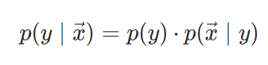
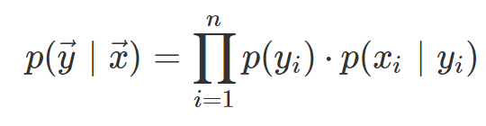

# 深度 | 从朴素贝叶斯到维特比算法：详解隐马尔科夫模型

选自 davidsbatista

**作者：David S. Batista**

**机器之心编译**

**参与：蒋思源、路雪**

> 本文首先简要介绍朴素贝叶斯，再将其扩展到隐马尔科夫模型。我们不仅会讨论隐马尔科夫模型的基本原理，同时还从朴素贝叶斯的角度讨论它们间的关系与局限性。

隐马尔科夫模型是用于标注问题的统计机器学习模型，是一种生成模型。隐马尔科夫模型是关于时序的概率模型，它描述了由一个隐藏的马尔科夫链随机生成不可观测的状态随机序列，再由各个状态生成一个观测而产生观测随机序列的过程。本文将重点介绍这种经典的机器学习模型。

**简介**

机器学习一个经典的问题就是学习一个能区分两个或多个类别的分类器，即在给定训练样本下能预测新样本所属的类别。机器学习分类器经常用于处理 NLP 任务，例如将邮件根据内容分类为垃圾邮件或正常邮件，将新闻按内容分为不同的主题等。但除了这种分类任务，NLP 还有很多都涉及到另一种与结构有关的预测，这种结构化预测一般可用概率图表示。

NLP 中一个经典的案例就是词性标注问题。在该任务中，x_i 表示一个个的单词，y_i 表示对应 x_i 的词性（如名词、动词和形容词等）。对于这种任务来说，输入的和输出都是一个序列，即给定一个单词序列，模型的输出为对应单词的标注序列，这种序列是与对应位置和上下文相关，所以是一种与结构相关的预测。

在这种序列预测问题中，数据由（x, y）的序列组成，即一个样本可描述为（x_1, x_2,...,x_m，y_1, y_2, ..., y_m）。我们要学习的是在给定一个 x 的序列下，各种 y 序列的概率是多少，即：

在大多数问题中，这些序列具有顺序相关性。即 x 近邻的值与 y 近邻的值具有相关性，或者也可以说 x_i 的近邻决定了 y_i 的属性。例如在英语中，介词 to（x_i）后面所带的单词常常是动词（y_i）。当然在机器学习中还有其它的任务涉及序列数据，例如在时序建模中，我们需要使用所有前面的观测值 y 在 t+1 步时预测新的 y。在序列监督学习中，我们必须序列地预测所有 y 值。

隐马尔科夫模型（HMM）是第一个针对序列分类所提出的算法。当然还有其它很多的序列模型，不过本文会从朴素贝叶斯模型开始逐步扩展到 HMM。

**朴素贝叶斯分类器**

朴素贝叶斯（分类器）是一种生成模型，它会基于训练样本对每个可能的类别建模。在预测中，朴素贝叶斯分类器在给定一个观察样本下，它会计算所有可能类别的概率并返回最可能由观察样本生成的类别。也就是说，朴素贝叶斯分类器会预测新样本最可能生成的类别是什么。相比之下，如 Logistic 回归那样的判别模型会尝试学习训练样本中的哪些特征最可能对区分类别起作用。

朴素贝叶斯模型在给定特征下最大化后验概率而返回最可能的类别：

其中 y 为类别，x arrow 为一个观察样本的特征向量。

NB 分类器是基于贝叶斯定理的，若我们将贝叶斯定理代入到上式，那么条件概率可以写为：

在训练中，对于一个给定的观察样本，我们可以用上式计算给定观察样本下是某个类别的概率，这样迭代地可以计算所有类别的概率。又因为分母对所有项都是相同的，且不影响最大化概率的结果，上式可以简写为以下：

如果我们将向量按分量分解出来，那么原式可以写为：

这个式子非常难以计算，因为它涉及到估计所有特征可能的组合。因此，我们可以根据朴素贝叶斯假设放宽各特征的条件。朴素贝叶斯定理假设：「给定一个类别，每一个特征都与其它特征条件独立」。该假设可以表示为 p(x_i | y, x_j)=p(x_i | y)，其中 i 不等于 j。在给定类别 y 的条件下，概率 p(x_i∣y) 是相互独立的，因此也就能如下简单地乘积表示联合分布： 

将上式带入后验概率可得：

上式就是我们最终得到的朴素贝叶斯模型，我们根据朴素贝叶斯假设大大地简化了计算。

**训练**

朴素贝叶斯的训练主要由计算特征和类别的频率而实现。以下描述的过程需要对每一个类别 y_i 都执行一次计算。为了计算先验概率，我们简单地通过计算所有样本中类别 y_i 占的比率而估计类别出现的概率：

为了计算似然度估计，我们需要计算 x_i 和 y_i 一同出现的次数占 y_i 所出现次数的比率，来估计在 y_i 出现的情况下，x_i 出现的概率：

该计算式将产生一个关于训练样本中所有类别特征的大型同现矩阵。

**分类**

当我们给一个新的样本进行分类，假设该样本的特征为 x_1、w_3、w_5。那么对于每一个类别 y_i，我们需要计算：

上式可以分解为：

该式需要对每一个类别 y_i 都执行一次计算，因此我们可以选出在这些特征出现的情况下，最可能出现的类别是什么。

**从朴素贝叶斯到隐马尔科夫模型**

前面展示的模型预测了在给定观察样本下最可能出现的类别。要想预测观察序列 x=(x_1, …, x_n) 对应的类别序列 y=(y_1, …, y_n)，可以使用多个朴素贝叶斯模型的累乘而构建一个序列模型：

该模型包括两个方面：

*   每个序列位置只有一个特征，即假设每个特征都以类 y_i 为基础独立生成时每个观察结果对应的特征。

*   该模型不捕捉可观察变量 x_i 之间的互动。

但是，假设在连续序列位置 y_i 上存在依赖项是合理的，还记得上文中关于词性标注的示例吗？这就是一阶马尔科夫模型，其引入了马尔科夫假设：「特定状态的概率仅依赖于前一个状态」。

更常见的形式是：

其中 Y 代表所有可能的标签序列 y arrow 的集合。

**隐马尔科夫模型**

隐马尔科夫模型（HMM）是一个序列分类器。和其他的机器学习算法一样，它可以被训练，即给定观察结果的标注序列，然后使用学得的参数给观察结果序列分配标签。我们可以把 HMM 框架定义为包含以下组件：

*   状态（如标签）：T=t_1, t_2, …, t_N

*   观察结果（如单词）：W=w_1, w_2, …, w_N

*   两个特殊状态：t_start 和 t_end，这两个状态与观察结果无关

和状态和观察结果相关的概率：

*   初始概率：状态的初始概率分布

*   最终概率：状态的最终概率分布

*   转移概率：从一个状态到另一个状态的概率矩阵 A

*   发射概率（emission probability）：从一个状态生成的观察结果的概率矩阵 B

一阶隐马尔科夫模型具备以下假设：

*   马尔科夫假设：特定状态的概率仅依赖于前一个状态。形式：P(t_i∣t_1, …, t_i−1)=P(t_i∣t_i−1)

*   输出的独立性：输出观察结果 wi 的概率仅依赖于输出观察结果 ti 的状态，而不是其他状态或观察结果。形式：P(w_i∣t_1…q_i, …, q_T, o_1, …, o_i, …, o_T)=P(o_i∣q_i)

注意：输出假设和前述朴素贝叶斯分类器紧密相关。下图便于理解该假设与朴素贝叶斯分类器之间的依赖性和关系：

*HMM 中的转移概率和发射概率。（图源：维吉尼亚大学 CS6501 课程）*

现在我们可以定义两个用 HMM 可以解决的问题。

*   学习和给定观察序列相关的参数，即训练。例如，给定一个句子中的单词和相关的词性标注，模型可以学到其潜在结构（latent structure）。

*   将训练后的 HMM 用于观察结果序列。例如，给定一个句子，使用 HMM 根据训练数据学得的潜在结构预测每个单词的词性。

**学习：估计转移矩阵和发射矩阵（emission matrices）**

给定一个观察结果序列 W 和相关状态 T，我们如何学习 HMM 参数，即矩阵 A 和 B？

在 HHM 监督场景下，可以使用最大似然估计原则来计算矩阵，从而完成参数学习。

过程为：计算每个事件在语料库中出现的次数，然后将次数归一化以形成适当的概率分布。我们需要对每个事件在语料库中出现的次数计算 4 次：

其中，M 代表训练样本的个数，N 代表序列长度，1 代表当特定事件发生时指示函数的值为 1，0 代表特定事件未发生。该公式概览了训练数据库，计算每个事件出现的频率。

然后将全部 4 次计算归一化，以得出正确的概率分布：

这些公式将输出转移概率矩阵 A 和发射概率矩阵 B。

**拉普拉斯平滑**

训练过程中，该模型如何处理未见过的单词？

当未见过的单词/观察结果出现了，P(W_i∣T_i)=0，且预测过程中将会作出错误的序列决策。

有一种技术可以处理这种情况，即拉普拉斯平滑（Laplace smoothing）：每个状态总有一个小发射概率要输出未见单词（可标注为 UNK）。每次 HMM 遇到未知单词，该模型将使用 P(UNK∣T_i) 的值作为发射概率。

**解码：为观察序列寻找隐藏状态序列**

给定一个已训练的 HNN，即转移矩阵 A 和 B 以及一个新的观察序列 W=w_1,w_2,…,w_N，我们希望找到最佳的状态序列 T=t_1,t_2,…,t_N 以解释该观察序列。

这一过程可以通过使用维特比算法（Viterbi algorithm）实现，该算法试图找到总体上最佳的状态序列 T=t_1,t_2,…,t_N。一般来说我们还可以使用另外一种后验解码的算法，该算法独立地为序列中每个位置 i 选择后验概率最高的状态。

**维特比算法**

维特比算法实际是用动态规划解隐马尔科夫模型的预测问题，即用动态规划求概率最大的路径，在 HMM 中，这些路径对应着一个状态序列。根据动态规划的原理，如果最优状态序列在时刻 i 通过结点 t_i，那么这一状态序列从结点 t_i 到终点 t 的部分状态序列，对于从 t_i 到 t 所有可能的部分状态序列来说，必须是最优的。因为如果不是最优的，那么我们就能从 t_i 到 t 寻找一个更好的状态序列以加大获得观察序列的概率。

定义在时刻 i 状态为 t 的所有单个路径中概率最大值为 δ，维特比算法可以通过使用马尔科夫假设和如下定义的两个函数计算上式单个路径的最大值。

如下计算每一个状态最可能的前面状态：

维特比算法使用使用一个被称之为 trellis 的 HMM 表征，它折叠了每一个位置的所有可能状态，并作出了非常明确的独立性假设：每一个位置仅依赖于前一个位置。

*HMM 的 trellis 表示。*

*发射概率矩阵和状态迁移概率矩阵。*

通过使用维特比算法，转移概率矩阵，我们可以将数据填充到 trellis 图表中，并快速高效地找到维特比路径。

*将数据填入 trellis 表示中。*

上图是 Roger Levy 展示的维特比算法，完全的案例可参考：http://www.davidsbatista.net/assets/documents/posts/2017-11-12-hmm_viterbi_mini_example.pdf。

**HMM 的重要观察结果**

*   本文的主要思想是看到朴素贝叶斯分类器和序列分类器 HMM 的联系。

*   如果我们使 HMM 的隐藏状态固定，则它就是朴素贝叶斯模型。

*   序列中每个单词／观察结果只有一个特征，即每个观察结果的值。

*   每个状态仅依赖于前一个状态，即每个状态 t_i 都独立于前面所有状态 t_1, t_2, …, t_i−2，除了紧挨着的前一个状态 t_i-1。

*   每一个观察结果变量 w_i 仅依赖于当前状态 t_i。

**软件包**

*   seqlearn：适合 Python 的序列分类库，包括隐马尔科夫模型实现，它使用 sklearn API。

*   NLTK HMM：NLTK 也包括一个可以实现隐马尔科夫模型框架的模块。

*   lxmls-toolkit：在里斯本机器学习夏季课程中使用的自然语言处理工具包，也包括隐马尔科夫模型实现。

*原文链接：http://www.davidsbatista.net/blog/2017/11/11/HHM_and_Naive_Bayes/*

****本文为机器之心编译，**转载请联系本公众号获得授权****。**

✄------------------------------------------------

**加入机器之心（全职记者/实习生）：hr@jiqizhixin.com**

**投稿或寻求报道：content@jiqizhixin.com**

**广告&商务合作：bd@jiqizhixin.com**