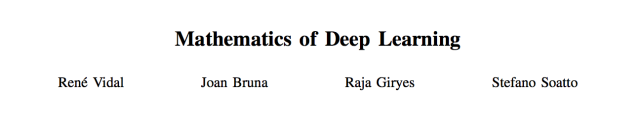
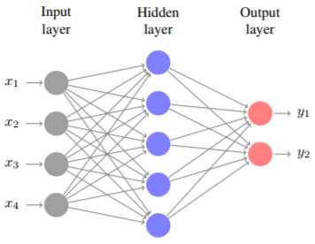
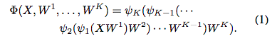
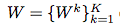
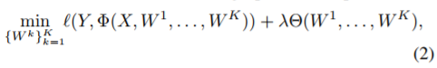
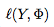
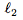
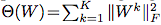
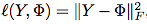
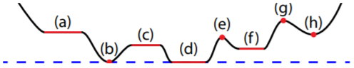

# 揭秘深度学习成功的数学原因：从全局最优性到学习表征不变性

选自 arXiv

**作者：**René** Vidal、Joan Bruna、Raja Giryes、Stefano Soatto**

**机器之心编译**

**参与：黄小天、路雪**

> 近年来，深度学习大获成功，尤其是卷积神经网络（CNN）在图像识别任务上的突出表现。然而，由于黑箱的存在，这种成功一度让机器学习理论学家颇感不解。本文的目的正是要揭示深度学习成功的奥秘。通过围绕着深度学习的三个核心要素——架构、正则化技术和优化算法，并回顾近期研究，作者为深层网络的若干属性，如全局最优性、几何稳定性、学习表征不变性，提供了一个数学证明。

**论文：Mathematics of Deep Learning**

论文链接：https://arxiv.org/abs/1712.04741

**摘要**：近期深度架构用于表征学习和分类之后，识别系统的性能获得了巨大提升。然而，这一成功的数学原因依然不得而知。本文将回顾近期研究，为深层网络的若干属性，如全局最优性、几何稳定性、学习表征不变性，提供一个数学证明。

**1. 引言**

深层网络 [1] 是在输入数据上执行序列操作的参数模型。通俗讲，每个这样的操作被称为「层」，每个层包括一个线性变换（比如其输入的卷积）和一个逐点非线性「激活函数」（比如 Sigmoid）。近期在语音、自然语言处理、计算机视觉的不同应用中，深层网络实现了分类性能的巨大提升。深层网络取得成功的关键原因是其较于传统神经网络有着大量的层；但也有其他架构调整，比如 ReLU [2] 和残差「捷径」连接（residual shortcut connections）[3]。成功的其他主要因素还包括海量数据集的可用性，比如 ImageNet 等数据集中的数百万张图像，以及用于解决由此产生的高维优化问题的高效 GPU 计算硬件（可能具备高达 1 亿个参数）。

深度学习的成功，尤其是 CNN 在图像任务上的成功，给理论学家带来了很多困惑。如果我们打算揭开其成功的奥秘，那么深度学习的三个核心因素——架构、正则化技术和优化算法，对训练优秀性能的深层网络、理解其必然性和互动尤其关键。

**A. 近似值、深度、宽度、不变性**

神经网络架构设计的一个重要属性是可以近似输入的任意函数。但是这个能力如何依赖于架构的参数，比如其深度和宽度？早期研究表明，具有单一隐藏层和 Sigmoid 激活函数的神经网络是通用函数近似器 [5] [6] [7] [8]。但是，宽的浅层网络的容量可被深层网络复制，且性能出现显著提升。一个可能的解释是深层架构相较于浅层架构可以更好地捕获数据的不变性。比如在计算机视觉中，物体的类别不会随着视角、照明等的变化而变化。对于为什么深层网络能够捕获此类不变性的数学分析仍然不得而知，但近期进展已经为深层网络的特定子类别提供了一些解释。特别是，散射网络 [9] 是一种深层网络，其卷积滤波器组由复杂的多分辨率小波族群给出。正由于这种额外结构，它们被证明是稳定和局部不变的信号表征，并揭示了几何和稳定性的基本作用，这是现代深度卷积网络架构泛化性能的基础（详见第四章）。

**B. 泛化和正则化**

神经网络架构的另一个重要属性是可以利用少量训练样本进行泛化。统计学习理论的传统结果 [10] 表明，实现良好泛化所需的训练样本数随网络大小呈现多项式增长。然而，在实践中，深层网络训练所需的参数数量要远大于数据量（N D regime），而使用非常简单的（看似相反）正则化技术可以防止过拟合，如 Dropout 在每次迭代中通过简单冻结参数的随机子集即可防止过拟合。

一个可能的解释是，更深层的架构产生输入数据的嵌入，近似地保留同一类中数据点之间的距离，同时增加类别之间的分离。本文将概述 [12] 的近期研究工作，它使用压缩感知和字典学习工具证明具有随机高斯权重的深层网络可以执行保留数据点距离的嵌入，其中相似输入可能具有相似输出。这些结果有助于理解网络的度量学习属性，并引出由输入数据的结构决定的泛化误差的范围。

**C. 信息论属性**

网络架构的另一个关键属性是产生良好「数据表征」的能力。简单说，表征是对一个任务有用的输入数据的任意函数。比如，最佳表征是由信息论、复杂性或不变性标准 [13] 量化出的「最有用」的一个表征。这类似于系统的「状态」，智能体将其存储在内存中以代替数据来预测未来的观察结果。例如，卡尔曼滤波器的状态是用于预测由具有高斯噪声的线性动态系统生成数据的最佳表征；即用于预测的最小充分统计量。对于数据可能被不包含任务信息的「麻烦」所破坏的复杂任务，人们也可能希望这种表征对这种麻烦具有「不变性」，以免影响未来的预测。通常来说，任务的最佳表征可被定义为最小充分统计量，并且对影响未来（「测试」）数据的各种变化保持不变性 [14]。尽管研究者对表征学习有着强烈兴趣，但是解释深层网络作为构建最优表征的性能的综合理论尚不存在。事实上，即使是充分性和不变性这样的基本概念也得到了不同的对待 [9] [14] [15]。

近期研究 [16]、[17]、[18] 已经开始为深层网络学习的表征建立信息论基础，包括观察到信息瓶颈损失 [13]（它定义了最小充分性的宽松概念）可被用于计算最佳表征。信息瓶颈损失可重写为交叉熵项的总和，这正是深度学习中最常用的损失，带有一个额外的正则化项。后者可通过在学习表征中引入类似自适应 dropout 噪声的噪声来实现 [17]。由此产生的正则化形式在 [17] 中被称为信息 dropout，表明在资源受限的条件下学习可以得到改善，并可导致「最大分离式」表征（「maximally disentangled」representation），即表征的组成部分之间的（总）相关性是最小的，使得数据具有独立特征的特征指标。此外，类似技术表明针对对抗扰动的鲁棒性有所改善 [18]。因此，研究者期望信息论在形式化和分析深层表征的属性以及提出新型正则化项方面起到关键作用。

**D. 优化**

训练神经网络的经典方法是使用反向传播最小化（正则化）损失 [19]，它是一种专门用于神经网络的梯度下降方法。反向传播的现代版本依靠随机梯度下降（SGD）来高效近似海量数据集的梯度。虽然 SGD 仅用于严格分析凸损失函数 [20]，但在深度学习中，损失函数是网络参数的非凸函数，因此无法保证 SGD 能够找到全局最小值。

*图 1：神经网络图示，其中 D = d_1 = 4 个输入，d_2 = 5 个隐藏层，C = d_3 = 2 个输出。输出可写为 y = (y_1, y_2) = ψ_2(ψ_1(xW¹ )W² )，其中 x = (x_1, . . . , x_4) 是输入，W¹ ∈ R⁴×5 是从输入层到隐藏层的权重矩阵，W² ∈ R⁵×2 是从隐藏层到输出层的权重矩阵，ψ_1 和 ψ_2 是激活函数。*

实践中有大量证据表明 SGD 为深层网络提供良好的解决方案。最近关于理解训练质量的研究认为，临界点更可能是鞍点而不是假的局部极小值 [21]，局部极小值集中在全局最优值附近 [22]。近期研究还揭示了 SGD 发现的局部极小值带来参数空间非常平坦区域的良好泛化误差 [23]。这激励了 Entropy-SGD 等专用于寻找此类区域的算法，并从统计物理学中的二进制感知机分析中得出相似的结果 [24]。它们已被证明在深层网络上表现良好 [25]。令人惊讶的是，这些统计物理学技术与偏微分方程（PDE）的正则化属性密切相关 [26]。例如，局部熵——Entropy-SGD 最小化的损失，是 HamiltonJacobi-Bellman 偏微分方程的解，因此可写成一个惩罚贪婪梯度下降的随机最优控制问题。这个方向进一步导致具备良好经验性能的 SGD 变体和凸优化标准方法（如 infconvolutions 和近端方法（proximal methods）。研究人员现在才刚刚开始从拓扑方面阐释深层网络的损失函数，拓扑决定了优化的复杂性，而它们的几何结构似乎与分类器的泛化属性有关 [27] [28] [29]。

本文将概述近期的研究论文，展示深度学习等高维非凸优化问题的误差曲面具有一些良性属性。例如，[30]、[31] 的工作表明，对于某些类型的神经网络，其损失函数和正则化项都是相同程度的正齐次函数的和，多个分量为零或逼近为零的局部最优解也将是或逼近全局最优解。这些结果也将为正齐次函数 RELU 的成功提供一个可能的解释。除了深度学习，这个框架的特殊情况还包括矩阵分解和张量分解 [32]。

**E. 论文大纲**

本论文的其余部分安排如下。第二章介绍深层网络的输入输出图。第三章研究深层网络的训练问题，并为全局最优性建立条件。第四章研究散射网络的不变性和稳定性。第五章研究深层网络的结构属性，如嵌入的度量属性以及泛化误差的界限。第六章研究深度表征的信息论属性。

**2. 预备工作**

**3. 深度学习中的全局最优性**

本章研究从 N 个训练样本 (X, Y ) 中学习深层网络的参数。在分类设置中，X ∈ R^N×D 的每一行代表 R^D 中的一个数据点，Y ∈ {0, 1} ^ N×C 的每一行代表每个数据点与 C 类别的从属关系，即如果 X 的第 j 行属于类 c ∈ {1, . . . , C}，则 Y_jc = 1，反之，则 Y_jc = 0。在回归设置中，Y ∈ R^N×C 代表 X 行的因变量（dependent variable）。学习网络权重 W 的问题可以表述为以下优化问题：

其中是损失函数，用于评估真正输出 Y 和预测输出 Φ(X, W)（公式 (1)）之间的一致程度；Θ 是正则化函数，用于防止过拟合，如通过正则化执行的权重衰减；λ>0 是平衡参数。

**A. 神经网络训练的非凸挑战**

神经网络训练的重要挑战是（2）中的优化问题是非凸的，即使损失函数通常是 Φ 的凸函数，如平方损失；Φ(X, W) 通常是 W 的非凸函数，因其是（1）中 W_k 变量和非线性函数 ψ_k 的积。这对现有优化算法来说是一个巨大的挑战，如梯度下降、随机梯度下降、交替最小化、块坐标下降、反向传播、拟牛顿法等，这些优化算法通常只能确保收敛至目标函数的临界点 [33] [34] [35] [36]。

但是，对于非凸问题，临界点集不仅包括全局最小值，还包括局部极小值、局部极大值、鞍点和鞍点 plateaus，如图 2 所示。因此，非凸问题使该模型呈现一定的不适定性，因其不仅是重要的模型公式也是实现细节，如模型如何初始化以及优化算法的细节，这对模型性能产生很大影响。

*图 2. 非凸函数的临界点示例（红色）。(a,c) plateaus；(b,d) 全局最小值；(e,g) 局部极大值；(f,h) 局部极小值。*

**B. 使用单个隐藏层的神经网络最优性 **

关于神经网络全局最优性的早期研究 [41] 展示了：使用线性激活函数和单个隐藏层的网络的平方损失有一个全局最小值，其他临界点均为鞍点。但是，[42] 中的网络示例证明，当激活函数非线性时，即使使用可分数据，网络中的反向传播算法 [19] 依然失败了。不过，这些网络示例不通用，[43]、[44] 展示了使用线性可分数据时，反向传播通常可以找到全局最小点。

**C. 使用随机输入和权重的神经网络最优性**

近期多个研究利用随机矩阵理论和统计物理学工具分析了多层神经网络的误差曲面。例如，[21] 的作者认为，在特定假设条件下，高维优化问题的临界点更有可能是鞍点而非局部极小点。

**D. 正齐次性网络（positively homogeneous network）的全局最优性**

近期研究 [30]、[31] 很大程度上沿用了上述论文的想法，但是使用的方法存在显著区别。具体来说，[30]、[31] 利用纯粹确定性方法分析了（2）中的优化问题，该方法不对输入数据分布、网络权重参数数据或网络初始化做任何假设。[30]、[31] 使用该方法证明只有鞍点和 plateaus 才是我们需要关心的临界点，因为对于足够规模的网络，不存在需要攀爬目标曲面再摆脱局部极小值（如图 2 中的 (f)、(h)）。

**4. 深度学习中的几何稳定性**

理解深度学习模型的重要问题是从数学角度定义其归纳偏置（inductive bias），即定义回归／分类任务的类别，这样它们可以实现优秀的性能，或至少比传统方法要好。

在计算机视觉任务中，卷积架构为最成功的深度学习视觉模型提供基础的归纳偏置。几何稳定性有助于我们理解其成功。

**5. 深度学习基于结构的理论**

**A. 神经网络中的数据结构**

理解深度学习的一个重要方面就是理解数据结构和深层网络之间的关系。对于正式分析来说，假设一个网络具备随机独立同分布高斯权重，这是深层网络训练中的常见初始化设置。近期研究 [56] 显示此类具备随机权重的网络将数据的度量结构沿层传播，实现网络计算特征的原始数据的稳定恢复，该特性经常会在一般深层网络中遇到 [57] [58]。

**B. 泛化误差**

上文说明数据结构和训练过程中获取的网络误差之间存在关系，这引发对深层网络的泛化误差与数据结构之间关系的研究。泛化误差——经验误差和期望误差之差，是统计学习理论中的基础概念。泛化误差有可能为利用训练样本学习的原因提供见解。**

**机器之心推出「****[Synced Machine Intelligence Awards](http://mp.weixin.qq.com/s?__biz=MzA3MzI4MjgzMw==&mid=2650734610&idx=5&sn=6c4c1d8659d6cfb10bfade8d79714f24&chksm=871ac46cb06d4d7a28ccd30f08558c2c85ba7cc7f69b9a335d86f4ef182a2400655f88ef7d04&scene=21#wechat_redirect)」2017，希望通过四大奖项记录这一年人工智能的发展与进步，传递行业启示性价值。**

 *********点****击「阅读原文」，立即报名。*****