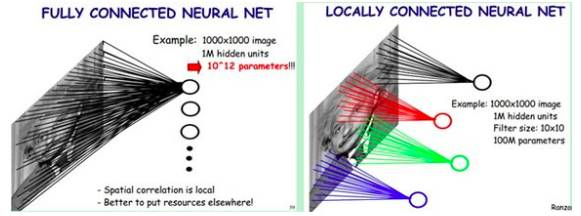
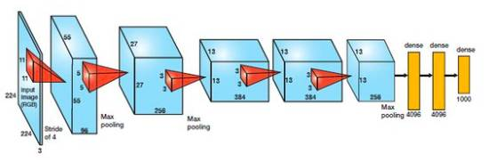
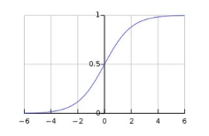
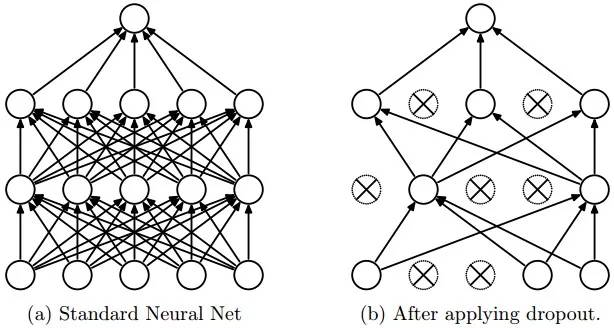
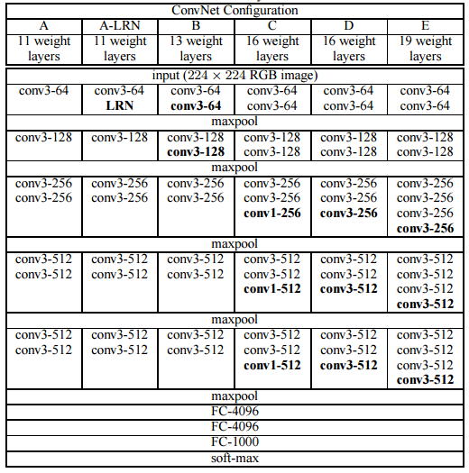
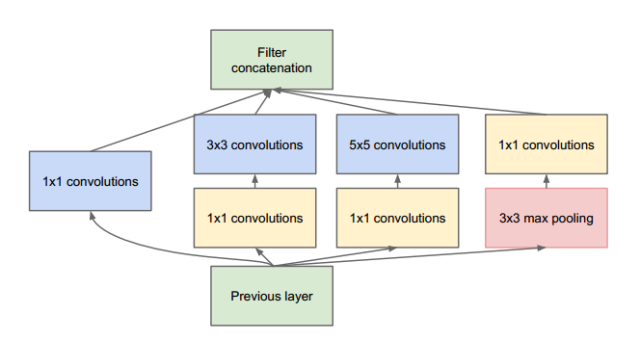
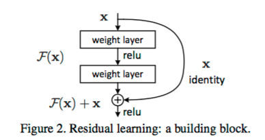
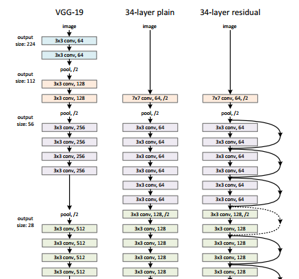
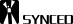

# 深度 | 从 AlexNet 到残差网络，理解卷积神经网络的不同架构

选自 cv-tricks

**机器之心编译**

**作者：KOUSTUBH**

**参与：路雪、****刘晓坤**

> 卷积神经网络对视觉识别任务很有帮助。优秀的卷积神经网络具有数百万个参数和大量隐藏层。事实上，一个错误的经验法则是：「隐藏层的数量越多，卷积神经网络越好」。流行的卷积神经网络有 AlexNet、VGG、Inception、ResNet。这些网络为什么性能如此好？它们是如何设计的呢？为什么它们的结构是现在这样？本文给出了一个简单而全面的概述。

这些问题的答案并不简单，无法全部涵盖在一篇博客中。在本文中，我将讨论这些问题。网络架构设计是一个复杂的过程，需要时间学习，需要更多时间去实验。但是，首先我们需要全面地了解它：

**卷积神经网络为什么能够打败传统的计算机视觉网络？**

图像分类任务需要把给定图像分类成一种预定义类别。传统的图像分类流程包括两个模块：特征提取和分类。

特征提取包括从原始像素值中提取出高级别的信息，以捕捉涉及类别之间区别的信息。特征提取通过无监督的方式完成，图像的类别与从像素中提取出的信息无关。GIST、HOG、SIFT、LBP 是其中一些传统和广泛使用的特征。特征提取完成之后，则需要利用图像及其标签训练分类模块。分类模块包括 SVM、Logistic 回归、随机森林、决策树等。

这一流程的问题在于特征提取无法根据类和图像进行调整。因此如果选择的特征缺少识别类别的表征，则分类模型的准确率会下降，不管使用的是何种分类策略。使用传统流程的顶尖方法通常采用的方法是使用多个特征提取器，先集合它们获取更好的特征。但是这种方法需要大量启发式和手动工作来根据领域调整参数，以达到良好的准确率。「良好」在这里的意思是接近人类水平。这就是构建优秀的计算机视觉系统（如 OCR、人脸校验、图像分类器、目标检测器等）需要数年的原因，这些系统可以使用传统的计算机视觉网络处理实际应用中遇到的各种数据。我们曾经仅花费 6 周时间就用 ConvNet 为一家公司输出了更好的结果，而如果使用传统的计算机视觉网络则需要将近一年。

这种方法的另一个问题是它与人类学习识别物体的方式完全不同。婴儿刚出生时无法感知周围环境，但是随着他不断进步和处理数据，他学会了识别物体。这是深度学习背后的哲学，不存在内置硬编码特征提取器。它将提取和分类模块整合进一个系统，它通过辨别不同图像的表征进行提取，根据监督数据进行分类。

这样的系统包括多层感知机，即多层神经元互相紧密相连的神经网络。深度 vanilla 神经网络就具备大量参数，因为缺乏充分的训练样本，它训练出的系统会发生模型过拟合的情况。但是如果使用卷积神经网络，从头训练网络的任务可以使用 ImageNet 等大型数据集。其背后的原因是神经元之间的参数共享和卷积层中的稀疏连接。在卷积操作中，一层的神经元仅与输入神经元存在局部连接，2-D 特征图共享参数集。

为了理解 ConvNet 的设计哲学，我们需要先了解：ConvNet 的目标是什么？

**A. 准确率**

如果你在构建一个智能机器，那么尽可能高的准确率绝对是关键。这里需要说明：准确率不仅依赖于网络，还依赖于训练数据量。因此，这些网络需要在标准数据集 ImageNet 上进行对比。

ImageNet 项目仍在进行中，目前有来自 21841 个不同类别的 14,197,122 张图像。自 2010 年以来，ImageNet 举办了视觉识别领域的年度竞赛赛事，为参赛者提供来自 1000 个不同类别的 120 万张图像。因此，每个网络架构的准确率建立在这 1200 万张图像之上。

**B.计算**

 ****大多数 ConvNet 对内存和计算的要求很高，尤其是训练。这是个很大的问题。类似地，如果你想部署一个移动端本地运行的模型，那么最终训练模型的规模也是你必须重点考虑的问题。和大家想的一样，要实现更好的准确率，网络需要的计算量更大。因此，在准确率和计算量之间通常有一个权衡。

此外，还有很多其他因素，如易训练性、网络的泛化能力等。下面介绍的网络都是最常用的，这些网络以先后发布的顺序排列，它们的准确率也是越来越好。

**AlexNet**

该架构是第一批采用比传统方法更大的步幅来提升 ImageNet 分类准确率的深层网络之一。它包括 5 个卷积层、3 个全连接层，如下图所示。

AlexNet 由 Alex Krizhevsky 提出，使用 ReLu 处理非线性的部分，而非传统神经网络早期的标准——Tanh 或 Sigmoid 函数。ReLu 的公式为：f(x) = max(0,x)。

ReLu 与 Sigmoid 相比，其优势在于训练速度更快，因为 Sigmoid 的导数在饱和区变得很小，导致权重几乎没有得到更新（见下图）。这种情况就是梯度消失问题。

在该网络中，ReLu 层在每个卷积和全连接层的后面。

该架构解决的另一个问题是在每个全连接层后面使用一个 Dropout 层，从而减少过拟合。Dropout 层设置的概率为 (p)，表示每个神经元连接到后层神经元的概率为 1-p。该架构以概率 p 随机关闭激活函数，如下图所示。

**Dropout 为什么奏效？**

Dropout 背后的原理与模型集成类似。由于 Dropout 层的作用，关闭的不同神经元集呈现一种不同的架构，并行训练所有这些不同架构，赋予每个子集权重，权重的总和为 1。如果 Dropout 连接了 n 个神经元，则子集架构的数量是 2^n。因此，预测是对所有这些模型的集成取平均。Dropout 有用的另一个原因是：由于神经元是随机选择的，因此它们更有可能避免产生共适应（co-adaptation），从而产生独立于其他神经元的有意义的特征。

**VGG16**

该架构由牛津大学的 VGG group 提出。它通过相继使用多个 3x3 卷积核大小的滤波器取代大尺寸卷积核滤波器（第一个和第二个卷积层分别有 11 个和 5 个滤波器）实现了优于 AlexNet 的性能。给定感受野（输出所依赖的输入图像有效区域大小），利用多个堆叠的更小尺寸的卷积核取得的效果优于使用更大尺寸的卷积核，因为多个非线性层会增加网络的深度，从而允许其学习更复杂的特征，并且计算成本更低。

例如，三个相继的 3x3 卷积核滤波器，步幅为 1，其感受野大小为 7，但其包含的参数数量为 3*(9C²)，而卷积核大小为 7 的滤波器参数数量为 49C²。这里，我们假设层的输入和输出通道数量都为 C。此外，3X3 卷积核可以保留图像更精细的特征。下表展示了该网络的架构。

你可以看到，VGG-D 中存在将相同大小的滤波器应用多次产生的 block，用于提取更复杂、更具代表性的特征。自 VGG 之后，block／模块（module）的概念逐渐变得普及。

VGG 卷积层后面是 3 个全连接层。该网络的宽度开始的值很小，只有 64，每经过一次子采样／池化层就增加 1 倍。VGG 在 ImageNet 上达到了 92.3 % 的 top-5 准确率。

**GoogLeNet/Inception**

虽然 VGG 在 ImageNet 数据集上取得了很高的准确率，但它的计算开销太大（无论是内存占用还是计算时间）。由于卷积层的宽度太大，VGG 的效率被降低。

例如，在 VGG 中一个具备 3x3 卷积核的卷积层拥有 512 个输入通道和 512 个输出通道，计算量级为 9x512x512。

对于一个位置的一次卷积运算，如果每个输出通道都和所有的输入通道相连接，我们称之为密集连接架构。建立 GoogLeNet 的基本思想是，深层网络中的大部分激活函数运算要么是不必要的（值为零），要么是冗余的（由于相互作用）。因此最高效的深度网络架构的激活函数之间的连接应该是稀疏的，这意味着上述例子中不应该令所有的 512 个输出通道和所有的 512 个输入通道相连。目前已经开发出了剪枝技术可以将网络修剪成稀疏权重/连接。但 BLAS 或 CuBlas（基于 GPU 的 CUDA）包中用于稀疏矩阵相乘的核并不是最优的，这使得其运算速度甚至比对应的密集网络更加缓慢。因此 GoogLeNet 设计了一个 inception 模块，使用普通的密集结构逼近一个稀疏 CNN（如下图所示）。如前所述，卷积层中仅有少数神经元是有效的，因此特定卷积核大小的卷积滤波器数或者宽度将保持小值。并且，它还使用了不同大小的卷积核来捕捉不同规模的细节特征（5x5、3x3、1x1）。

该模块的另一个重要特点是它拥有一个所谓的瓶颈层（图中的 1x1 卷积），它可以大幅减少计算开销。

以 GoogLeNet 的第一个 inception 模块为例，它有 192 个输入通道、128 个 3x3 卷积核滤波器、32 个 5x5 卷积核滤波器。5x5 卷积核滤波器的计算量级为 25x32x192，而当继续深入网络时，随着网络的深度和 5x5 卷积核滤波器数量的增加，计算量的增加是爆炸性的。为了避免这种情况，inception 模块在应用更大的卷积核之前使用 1x1 卷积以降低输入通道的维度。因此在第一个 inception 模块中，模块的输入首先馈送至具备 16 个滤波器的 1x1 卷积，然后再馈送至 5x5 卷积。从而，inception 模块将计算量减少为 16x192+25x32x16。所有这些变化使得网络可以拥有很大的宽度和深度，同时计算开销大大降低。

GoogLeNet 做出的另一个改变是，使用一个简单的全局平均池化层（global average pooling，对 2D 特征图的通道值取平均）取代网络末端的全连接层（在最后的卷积层之后）。这大大地减少了参数的总数。以 AlexNet 为例，它的全连接层包含了大约 90% 的参数。由于 GoogLeNet 网络的宽度和深度都很大，因此即使移去全连接层也不影响准确率。它在 ImageNet 上取得了 93.3% 的 top-5 准确率，并且运行速度比 VGG 快得多。

**残差网络**

按我们目前所看到的，增加深度应该能够提升网络的准确率，同时也会导致过拟合。但增加深度的问题在于，在网络末端通过预测值和真值比较得到的权重修改信号，到了之前的层会变得很微弱。这基本上意味着网络之前的层几乎没有进行学习。这被称为梯度消失现象。而另一个问题在于，需要在巨大的参数空间中执行优化，随意增加层数会导致更大的训练误差。残差网络通过使用残差模型模块构建网络，从而训练此类深层网络（如下图所示）。这称为退化（degradation）问题。对于其工作原理可做如下解释：

假设一个网络 A，训练误差为 x。在 A 的顶部添加几个层构建网络 B，这些层的参数对于 A 的输出没有影响，我们称这些层为 C。这意味着新网络 B 的训练误差也是 x。网络 B 的训练误差不应高于 A，如果出现 B 的训练误差高于 A 的情况，则使用添加的层 C 学习恒等映射（对输入没有影响）并不是一个平凡问题。为了解决这个问题，上图中的模块在输入和输出之间添加了一个直连路径，以直接执行映射。这时，C 只需要学习已有的输入特征就可以了。由于 C 只学习残差，该模块叫作残差模块。

此外，和 GoogLeNet 类似，它也在分类层之后连接了一个全局平均池化层。通过这些变化，ResNet 可以学习 152 个层的深层网络。它可以获得比 VGGNet 和 GoogLeNet 更高的准确率，同时计算效率比 VGGNet 更高。ResNet-152 可以取得 95.51% 的 top-5 准确率。

该网络的架构和 VGGNet 类似，主要包括 3x3 的卷积核。因此可以在 VGGNet 的基础上在层之间添加捷径连接以构建一个残差网络。下图展示了从 VGG-19 的部分早期层合成残差网络的过程。

论文 4 中的实验展示了残差网络的威力。普通的 34 层网络相比普通的 18 层网络有更高的验证误差。而同样的 34 层网络转换为残差网络之后，相比 18 层的残差网络，训练误差要小得多。

希望这篇文章能为你提供设计神经网络架构的一个好的视角。

*原文链接：http://cv-tricks.com/cnn/understand-resnet-alexnet-vgg-inception/*

****本文为机器之心编译，**转载请联系本公众号获得授权****。**

✄------------------------------------------------

**加入机器之心（全职记者/实习生）：hr@jiqizhixin.com**

**投稿或寻求报道：content@jiqizhixin.com**

**广告&商务合作：bd@jiqizhixin.com******