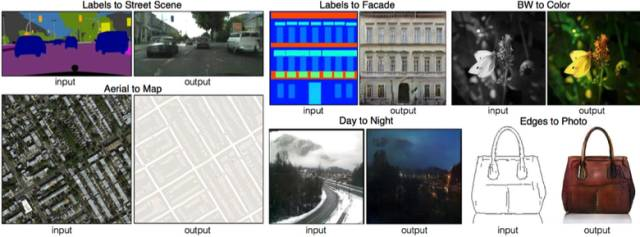
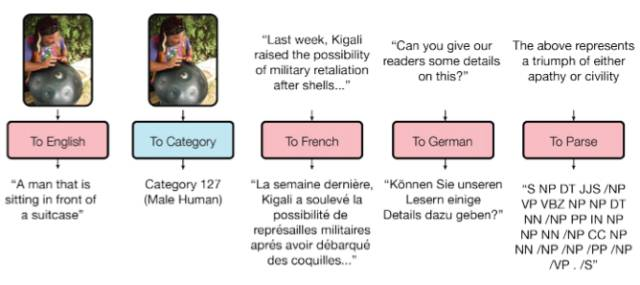

# 从 Pix2Code 到 CycleGAN：2017 年深度学习重大研究进展全解读

选自 Statsbot

**作者：Eduard Tyantov**

**机器之心编译**

> 2017 年只剩不到十天，随着 NIPS 等重要会议的结束，是时候对这一年深度学习领域的重要研究与进展进行总结了。来自机器学习创业公司的 Eduard Tyantov 最近就为我们整理了这样一份列表。想知道哪些深度学习技术即将影响我们的未来吗？本文将给你作出解答。

**1\. 文本**

**1.1 谷歌神经机器翻译**

去年，谷歌宣布上线 Google Translate 的新模型，并详细介绍了所使用的网络架构——循环神经网络（RNN）。

关键结果：与人类翻译准确率的差距缩小了 55-85%（研究者使用 6 个语言对的评估结果）。但是该模型如果没有谷歌的大型数据集，则很难复现这么优秀的结果。

参考阅读：

[重磅 | 谷歌翻译整合神经网络：机器翻译实现颠覆性突破（附论文）](http://mp.weixin.qq.com/s?__biz=MzA3MzI4MjgzMw==&mid=2650719470&idx=1&sn=3368dea980517ea7d7942967da2740dc&chksm=871b0090b06c89863620be4e75c757940d03d8a43cd3c1d9a8309b6594c1bccd769cab193177&scene=21#wechat_redirect)

[专访 | 谷歌神经网络翻译系统发布后，我们和 Google Brain 的工程师聊了聊](http://mp.weixin.qq.com/s?__biz=MzA3MzI4MjgzMw==&mid=2650719511&idx=1&sn=88bbb6bb3d28b3f0f62c5c5929968444&chksm=871b0169b06c887f302dc791c67f19ce4ba49c43744e11341b7bb225d9e22443ebf9e3b70339&scene=21#wechat_redirect)

**1.2 谈判会达成吗？**

你或许听说过「Facebook 因为聊天机器人失控、创造自己语言而关闭聊天机器人」的消息。这个机器人是用来进行谈判的，其目的是与另一个智能体进行文本谈判，然后达成协议：如何把物品（书籍、帽子等）分成两份。谈判中每个智能体都有自己的目标，而对方并不知道。谈判不可能出现未达成协议的情况。

研究者在训练过程中收集人类谈判的数据集，训练监督式循环网络。然后，让用强化学习训练出的智能体自己与自己交流，直到获得与人类相似的谈判模式。

该机器人学会了一种真正的谈判策略——对某个交易的特定方面假装产生兴趣，然后再放弃它们，以达到真实目标。这是第一次尝试此类互动机器人，而且也比较成功。

当然，称该机器人创造了一种新语言的说法过于夸张了。和同一个智能体进行谈判的训练过程中，研究者无法限制文本与人类语言的相似度，然后算法修改了互动语言。这是很寻常的事。

参考阅读：

[业界 | 让人工智能学会谈判，Facebook 开源端到端强化学习模型](http://mp.weixin.qq.com/s?__biz=MzA3MzI4MjgzMw==&mid=2650727938&idx=5&sn=a510cd99ed25f8d53a00cfaa9eba9b68&chksm=871b227cb06cab6a8d54016deb5aab6923ed491562bedcb55b2ca595be6359bb9b8e467ab57a&scene=21#wechat_redirect)

**2\. 语音**

**2.1 WaveNet：一种针对原始语音的生成模型**

DeepMind 的研究者基于先前的图像生成方法构建了一种自回归全卷积模型 WaveNet。该模型是完全概率的和自回归的（fully probabilistic and autoregressive），其每一个音频样本的预测分布的前提是所有先前的样本；不过研究表明它可以有效地在每秒音频带有数万个样本的数据上进行训练。当被应用于文本转语音时，它可以得到当前最佳的表现，人类听众评价它在英语和汉语上比当前最好的参数（parametric）和拼接（concatenative）系统所生成的音频听起来都显著更为自然。

单个 WaveNet 就可以以同等的保真度捕获许多不同说话者的特点，而且可以通过调节说话者身份来在它们之间切换。当训练该模型对音乐建模时，我们发现它可以生成全新的、而且往往具有高度真实感的音乐片段。该研究还证明其可以被用作判别模型，可以为音速识别（phoneme recognition）返回很有希望的结果。

该网络以端到端的方式进行训练：文本作为输入，音频作为输出。研究者得到了非常好的结果，机器合成语音水平与人类差距缩小 50%。

该网络的主要缺陷是低生产力，因为它使用自回归，声音按序列生成，需要 1-2 分钟的时间才能生成一秒音频。

参考阅读：

[DeepMind WaveNet，将机器合成语音水平与人类差距缩小 50%](http://mp.weixin.qq.com/s?__biz=MzA3MzI4MjgzMw==&mid=2650719022&idx=1&sn=3eeb1958e695388817dd32b0d228ced9&scene=21#wechat_redirect)

**2.2 唇读**

唇读（lipreading）是指根据说话人的嘴唇运动解码出文本的任务。传统的方法是将该问题分成两步解决：设计或学习视觉特征、以及预测。最近的深度唇读方法是可以端到端训练的（Wand et al., 2016; Chung & Zisserman, 2016a）。目前唇读的准确度已经超过了人类。

Google DeepMind 与牛津大学合作的一篇论文《Lip Reading Sentences in the Wild》介绍了他们的模型经过电视数据集的训练后，性能超越 BBC 的专业唇读者。

该数据集包含 10 万个音频、视频语句。音频模型：LSTM，视频模型：CNN + LSTM。这两个状态向量被馈送至最后的 LSTM，然后生成结果（字符）。

训练过程中使用不同类型的输入数据：音频、视频、音频+视频。即，这是一个「多渠道」模型。

参考阅读：

[如何通过机器学习解读唇语？DeepMind 要通过 LipNet 帮助机器「看」懂别人说的话](http://mp.weixin.qq.com/s?__biz=MzA3MzI4MjgzMw==&mid=2650720335&idx=1&sn=b030d7f82d10acde0378035c900264df&chksm=871b0c31b06c852746f35e16814808ceb13e91b091732afa48b2bb8c6d6f2f542df26e7f5575&scene=21#wechat_redirect)

**2.3 人工合成奥巴马：嘴唇动作和音频的同步**

华盛顿大学进行了一项研究，生成美国前总统奥巴马的嘴唇动作。选择奥巴马的原因在于网络上有他大量的视频（17 小时高清视频）。

研究者使用了一些技巧来改善该研究的效果。

**3\. 计算机视觉**

**3.1\. OCR：谷歌地图与街景**

谷歌大脑团队在其文章中报道了如何把新的 OCR（光学字符识别）引擎引入其地图中，进而可以识别街头的标志与商标。

在该技术的发展过程中，谷歌还给出了新的 FSNS（French Street Name Signs），它包含了大量的复杂案例。

为了识别标志，网络最多使用 4 张图片。特征通过 CNN 提取，在空间注意力（考虑像素坐标）的帮助下缩放，最后结果被馈送至 LSTM。

相同方法被用于识别广告牌上店铺名称的任务上（存在大量噪音数据，网络本身必须关注正确的位置）。这一算法被应用到 800 亿张图片之上。

**3.2 视觉推理**

视觉推理指的是让神经网络回答根据照片提出的问题。例如，「照片中有和黄色的金属圆柱的尺寸相同的橡胶物体吗？」这样的问题对于机器是很困难的，直到最近，这类问题的回答准确率才达到了 68.5%。

为了更深入地探索视觉推理的思想，并测试这种能力能否轻松加入目前已有的系统，DeepMind 的研究者们开发了一种简单、即插即用的 RN 模块，它可以加载到目前已有的神经网络架构中。具备 RN 模块的神经网络具有处理非结构化输入的能力（如一张图片或一组语句），同时推理出事物其后隐藏的关系。

使用 RN 的网络可以处理桌子上的各种形状（球体、立方体等）物体组成的场景。为了理解这些物体之间的关系（如球体的体积大于立方体），神经网络必须从图像中解析非结构化的像素流，找出哪些数据代表物体。在训练时，没有人明确告诉网络哪些是真正的物体，它必须自己试图理解，并将这些物体识别为不同类别（如球体和立方体），随后通过 RN 模块对它们进行比较并建立「关系」（如球体大于立方体）。这些关系不是硬编码的，而是必须由 RN 学习——这一模块会比较所有可能性。最后，系统将所有这些关系相加，以产生场景中对所有形状对的输出。

目前的机器学习系统在 CLEVR 上标准问题架构上的回答成功率为 68.5%，而人类的准确率为 92.5%。但是使用了 RN 增强的神经网络，DeepMind 展示了超越人类表现的 95.5% 的准确率。RN 增强网络在 20 个 bAbI 任务中的 18 个上得分均超过 95％，与现有的最先进的模型相当。值得注意的是，具有 RN 模块的模型在某些任务上的得分具有优势（如归纳类问题），而已有模型则表现不佳。

下图为视觉问答的架构。问题在经过 LSTM 处理后产生一个问题嵌入（question embedding），而图像被一个 CNN 处理后产生一组可用于 RN 的物体。物体（图中用黄色、红色和蓝色表示）是在卷积处理后的图像上使用特征图向量构建的。该 RN 网络会根据问题嵌入来考虑所有物体对之间的关系，然后会整合所有这些关系来回答问题。

参考阅读：

[关系推理水平超越人类：DeepMind 展示全新神经网络推理预测技术](http://mp.weixin.qq.com/s?__biz=MzA3MzI4MjgzMw==&mid=2650727591&idx=1&sn=176d4a7ab8e06451b0deb2d74c3a5794&chksm=871b20d9b06ca9cfa78c867e25f604a97ac594634dc4e244b2acebdacec6bbbf8a984cff1a65&scene=21#wechat_redirect)

**3.3 Pix2Code**

哥本哈根的一家初创公司 UIzard Technologies 训练了一个神经网络，能够把图形用户界面的截图转译成代码行，成功为开发者们分担了部分网站设计流程。令人惊叹的是，同一个模型能跨平台工作，包括 iOS、Android 和 Web 界面，从目前的研发水平来看，该算法的准确率达到了 77%。

为了实现这一点，研究者们需要分三个步骤来训练，首先，通过计算机视觉来理解 GUI 图像和里面的元素（按钮、条框等）。接下来模型需要理解计算机代码，并且能生成在句法上和语义上都正确的样本。最后的挑战是把之前的两步联系起来，需要它用推测场景来生成描述文本。

虽然该工作展示了这样一种能自动生成 GUI 代码的潜力系统，但该研究只是开发了这种潜力的皮毛。目前的 Pix2Code 模型由相对较少的参数组成，并且只能在相对较小的数据集上训练。而构建更复杂的模型，并在更大的数据集上训练会显著地提升代码生成的质量。并且采用各种正则化方法和实现注意力机制（attention mechanism [1]）也能进一步提升生成代码的质量。同时该模型采用的独热编码（one-hot encoding）并不会提供任何符号间关系的信息，而采用 word2vec [12] 那样的词嵌入模型可能会有所好转。因此将图片转换为 UI 代码的工作仍处于研究之中，目前尚未投入实际使用。

项目地址：https://github.com/tonybeltramelli/pix2code

参考阅读：

[深度学习助力前端开发：自动生成 GUI 图代码（附试用地址）](http://mp.weixin.qq.com/s?__biz=MzA3MzI4MjgzMw==&mid=2650728064&idx=1&sn=adb744e599299916faa23545c2ab436e&chksm=871b22feb06cabe83ba0e3268a7a8c0c486cf6f42427ab41814e69242f919b25bc7de06ea258&scene=21#wechat_redirect)

**3.4 SketchRNN：教机器画画**

你可能看过谷歌的 Quick, Draw! 数据集，其目标是 20 秒内绘制不同物体的简笔画。谷歌收集该数据集的目的是教神经网络画画。

研究者使用 RNN 训练序列到序列的变分自编码器（VAE）作为编解码机制。

最终，该模型获取表示原始图像的隐向量（latent vector）。

解码器可从该向量中提取图画，你可以改变它，生成新的简笔画。

甚至使用向量算术来绘制猫猪（catpig）：

参考阅读：

[谷歌发布 Quick Draw 涂鸦数据集：5000 万张矢量图，345 个类别](http://mp.weixin.qq.com/s?__biz=MzA3MzI4MjgzMw==&mid=2650726773&idx=3&sn=f73bf3d80218b87a92ef301ba84f2511&chksm=871b250bb06cac1d263721b3e28b51a9f1d6849f0eacdd81f37151694630cde3817fd9d946ff&scene=21#wechat_redirect)

**3.5 GAN**

GAN 是深度学习领域里的一个热门话题。目前这种方法大多用于处理图像，所以本文也主要介绍这一方面。GAN 的全称为生成对抗网络，是 2014 年由 Ian Goodfellow 及其蒙特利尔大学的同事们率先提出的。这是一种学习数据的基本分布的全新方法，让生成出的人工对象可以和真实对象之间达到惊人的相似度。

GAN 背后的思想非常直观：生成器和鉴别器两个网络彼此博弈。生成器的目标是生成一个对象（比如人的照片），并使其看起来和真的一样。而鉴别器的目标就是找到生成出的结果和真实图像之间的差异。鉴别器通常会从数据集中给出图像用于对比。

由于很难找出两个网络之间的平衡点，训练通常难以连续进行。大多数情况下鉴别器会获胜，训练陷入停滞。尽管如此，由于鉴别器的设计可以帮助我们从损失函数设定这样的复杂问题中解决出来（例如：提升图片质量），所以 GAN 获得了众多研究者的青睐。

典型的 GAN 训练结果——卧室和人脸。

在此之前，我们通常会考虑使用自编码器（Sketch-RNN），让其将原始数据编码成隐藏表示。这和 GAN 中生成器所做的事情一样。

你可以在这个项目中（http://carpedm20.github.io/faces/）找到使用向量生成图片的方法。你可以自行尝试调整向量，看看生成的人脸会如何变化。

这种算法在隐空间上同样适用：「一个戴眼镜的男人」减去「男人」加上「女人」就等于「一个戴眼镜的女人」。

参考阅读：

[深入浅出：GAN 原理与应用入门介绍](http://mp.weixin.qq.com/s?__biz=MzA3MzI4MjgzMw==&mid=2650730028&idx=1&sn=21d57cf54f257aeab15ebd4058671a2b&chksm=871b2a52b06ca3449f255549a914e8ab8d85bb4d43e0487a95fd9ffd97e708d9eac7a1f9943b&scene=21#wechat_redirect)

**3.6 使用 GAN 改变面部年龄**

如果在训练过程中获得一个可控制的隐向量参数，我们就可以在推断阶段修改这个向量以控制图像的生成属性，这种方法被称为条件 GAN。

论文 Face Aging With Conditional Generative Adversarial Networks 的作者使用在 IMDB 数据集上预训练模型而获得年龄的预测方法，然后研究者基于条件 GAN 修改生成图像的面部年龄。

参考阅读：

[解读 | 艺术家如何借助神经网络进行创作？](http://mp.weixin.qq.com/s?__biz=MzA3MzI4MjgzMw==&mid=2650725277&idx=3&sn=a0b08a2b34b1d1af93b960339665f781&chksm=871b1fe3b06c96f5b06b69b3cf9b8ef31345f30e65ee7e7b2c36942ae4c3e0b489655e762c9b&scene=21#wechat_redirect)

**3.7 专业摄影作品**

谷歌已经开发了另一个非常有意思的 GAN 应用，即摄影作品的选择和改进。开发者在专业摄影作品数据集上训练 GAN，其中生成器试图改进照片的表现力（如更好的拍摄参数和减少对滤镜的依赖等），判别器用于区分「改进」的照片和真实的作品。

训练后的算法会通过 Google Street View 搜索最佳构图，获得了一些专业级的和半专业级的作品评分。

参考阅读：

[谷歌「虚拟摄影师」：利用深度学习生成专业级摄影作品](http://mp.weixin.qq.com/s?__biz=MzA3MzI4MjgzMw==&mid=2650728920&idx=3&sn=6855f86ee84df6fb9af49ba713d782ff&chksm=871b2da6b06ca4b07b804ec6988cd3cd50d625a9aeffcffe4a6a4efe83a61bfe99ca34975370&scene=21#wechat_redirect)

**3.8 pix2pix**

伯克利人工智能研究室（BAIR）在 2016 年非常引人注目的研究 Image-to-Image Translation with Conditional Adversarial Networks 中，研究人员解决了图像到图像的生成问题。例如需要使用卫星图像创建地图，或使用素描创建逼真的目标纹理等。

这里有另一个非常成功的条件 GAN 应用案例。在该情况下，条件将变为整张图像。此外，UNet 在图像分割中十分受欢迎，经常用于生成器的体系结构，且该论文使用了新型 PatchGAN 分类器作为处理模糊图像的判别器。

该论文的作者还发布了他们网络的在线演示：https://affinelayer.com/pixsrv/

源代码：https://github.com/phillipi/pix2pix

参考阅读：

[教程 | 你来手绘涂鸦，人工智能生成「猫片」：edges2cats 图像转换详解](http://mp.weixin.qq.com/s?__biz=MzA3MzI4MjgzMw==&mid=2650723632&idx=3&sn=88f89ee39a145f4bf0c0add7a42fa4ca&chksm=871b114eb06c985809a27507310d1d1394f908c9cd231d3bf0c9180f462d2fedd1a60f505ab6&scene=21#wechat_redirect)

**3.9 CycleGAN**

为了应用 Pix2Pix，我们需要包含了不同领域图像对的数据集。收集这样的数据集并不困难，但对于更复杂一点的转换目标或风格化目标等操作，原则上是找不到这样的目标对。

因此，Pix2Pix 的作者为了解决这样的问题提出了在不同图像领域之间转换而不需要特定图像对的 CycleGAN 模型，原论文为《Unpaired Image-to-Image Translation》。

该论文的主要想法是训练两对生成器-判别器模型以将图像从一个领域转换为另一个领域，在这过程中我们要求循环一致性。即在序列地应用生成器后，我们应该得到一个相似于原始 L1 损失的图像。因此我们需要一个循环损失函数（cyclic loss），它能确保生成器不会将一个领域的图像转换到另一个和原始图像完全不相关的领域。

这个方法允许我们学习将马映射到斑马。

这样的转换通常是不稳定的，并且经常创建一些不成功的案例：

源代码：https://github.com/junyanz/CycleGAN

参考阅读：

[学界 | 让莫奈画作变成照片：伯克利图像到图像翻译新研究](http://mp.weixin.qq.com/s?__biz=MzA3MzI4MjgzMw==&mid=2650725257&idx=4&sn=bf367ff90e03f8189f7c67ae0e5ab76f&chksm=871b1ff7b06c96e1e355d8b360abd0c256af04e2ba72a8d2a3364bfea8ff80b347a734d17e9d&scene=21#wechat_redirect)

**3.10 肿瘤分子学的进展**

机器学习正在帮助改善医疗的手段，它除了在超声波识别、MPI 和诊断等方面的应用，还能寻找对抗癌症的性药物。

简单来说，在对抗自编码器（AAE）的帮助下，我们可以学习药物分子的潜在表征，并用来搜索新的药物结构。该项研究中，研究者发现了 69 个分子，且有一半的分子可用来治疗癌症和其它一些比较严重的疾病。

参考阅读：

[深入浅出：GAN 原理与应用入门介绍](http://mp.weixin.qq.com/s?__biz=MzA3MzI4MjgzMw==&mid=2650730028&idx=1&sn=21d57cf54f257aeab15ebd4058671a2b&chksm=871b2a52b06ca3449f255549a914e8ab8d85bb4d43e0487a95fd9ffd97e708d9eac7a1f9943b&scene=21#wechat_redirect)

**3.11 对抗性攻击**

对抗性样本这一领域也有非常大的活力，研究者希望找到这种令模型不稳定的因素而提升识别性能。例如在 ImageNet 中，训练的模型在识别加了一些噪点的样本会完全识别错误，这样加了噪点的图像可能在我们人眼看来是没有问题的。这一问题展现在下图中，熊猫的图像加了一点噪声就会被错误识别为长臂猿。

Goodfellow et al. (2014b) 表明，出现这些对抗样本的主要原因之一是模型过度线性化。神经网络主要是基于线性模块而构建的，因此它们实现的整体函数被证明是高度线性的。虽然这些线性函数很容易优化，但如果一个线性函数具有许多输入，那么它的值可以非常迅速地改变。如果我们用 ϵ 改变每个输入，那么权重为 w 的线性函数改变可以达到 ϵ∥w∥_1，如果 w 的维度较高，那么这会是一个非常大的数值。对抗训练通过鼓励网络在训练数据附近的局部区域恒定来限制这一高度敏感的局部线性行为。这可以被看作是一种明确地向监督神经网络引入局部恒定先验的方法。

下面一个例子表示特殊的眼镜可以欺骗人脸识别系统，所以在训练特定的模型时，我们需要考虑这种对抗性攻击并使用对抗性样本提高模型的鲁棒性。

这种使用符号的方法也不能被正确地识别。

参考阅读：

[学界 | OpenAI 探讨人工智能安全：用对抗样本攻击机器学习](http://mp.weixin.qq.com/s?__biz=MzA3MzI4MjgzMw==&mid=2650723269&idx=2&sn=76dc6e857444d70b4f5f7127bac1d628&chksm=871b17bbb06c9eadc2881a5e1aeb325f8192c5122558f9a51cf6ef2d69e2bf41a33660558935&scene=21#wechat_redirect)

**4 强化学习**

强化学习（RL）或使用了强化机制的学习也是机器学习中最有趣和发展活跃的方法之一。

该方法的本质是在一个根据经验给予奖励（正如人类的学习方式）的环境中学习智能体的成功行为。

RL 在游戏、机器人和系统控制（例如，交通）中被广泛应用。

当然，每个人都已经听说了 AlphaGo 在游戏中击败过多个顶尖专业选手。研究者使用 RL 训练 AlphaGo 的过程是：让机器通过自我对弈提升决策能力。

**4.1 结合非受控辅助任务的强化训练**

去年，DeepMind 通过使用 DQN 玩电子游戏取得了超越人类的表现。最近，人们已经开发出了能让机器玩更加复杂的游戏（如 Doom）的算法。

大多数研究关注于学习加速，因为学习智能体与环境交互的经验需要在现代 GPU 上执行很长时间的训练。

DeepMind 的博客（https://deepmind.com/blog/reinforcement-learning-unsupervised-auxiliary-tasks/）中报告了引入附加损失（辅助任务）的办法，例如预测帧变化（像素控制）使智能体更充分地理解动作的后果，可以显著加快学习过程。

参考阅读：

[突破 | DeepMind 为强化学习引入无监督辅助任务，人工智能的 Atari 游戏水平达到人类的 9 倍](http://mp.weixin.qq.com/s?__biz=MzA3MzI4MjgzMw==&mid=2650720561&idx=1&sn=ef09af7ff21f7b61bed28076c349e6ec&chksm=871b0d4fb06c845965a37c5cdcfd2fae46b38bf42478423564e06021c02d37aeb33e53eea2ef&scene=21#wechat_redirect)

**4.2 学习机器人**

OpenAI 对在虚拟环境中训练智能体进行了积极的研究，相比在现实世界中进行实验要安全得多。

在其中一个研究中（https://blog.openai.com/robots-that-learn/），他们证明了一次性学习（one-shot learning）是可能实现的：在 VR 中的一个人展示如何执行任务，并且算法只需要一次展示就能学会然后在实际条件下将其重现。

如果只有人类有这个能力就好了。:)

参考阅读：

[学界 | OpenAI 推出机器人新系统：机器可通过 VR 演示自主学习新任务](http://mp.weixin.qq.com/s?__biz=MzA3MzI4MjgzMw==&mid=2650726684&idx=4&sn=6ddfbdbf132af24fa265b3f5aafc7e5e&chksm=871b2562b06cac748d0c30b558860be6ffbf1c9e60ce1a7d96b05f838b77083996baca6fa13a&scene=21#wechat_redirect)

**4.3 学习人类的偏好**

这是 OpenAI（https://blog.openai.com/deep-reinforcement-learning-from-human-preferences/）和 DeepMind 都曾研究过的课题。基本目标是智能体有一个任务，算法为人类提供两个可能的解决方案，并指出那个更好。该过程需要重复迭代，并且算法接收来自学习如何解决问题的人类的 900 比特大小的反馈（二进制标记）。

一如既往，人类必须谨慎判断，思考他教给机器究竟是什么。例如，评估器得出算法确实想要拿到某个物体，但实际上，人类只是想进行一次模拟实验。

参考阅读：

[OpenAI 联合 DeepMind 发布全新研究：根据人类反馈进行强化学习](http://mp.weixin.qq.com/s?__biz=MzA3MzI4MjgzMw==&mid=2650727887&idx=1&sn=e2a03a5e80d344ca51774823a95cf69a&chksm=871b21b1b06ca8a707ad7546e24a582995a8e2463d3bcb916bea2dbe67bf0d98d3725f1639db&scene=21#wechat_redirect)

**4.4 在复杂环境中的运动**

这是 DeepMind 的另一项研究（https://deepmind.com/blog/producing-flexible-behaviours-simulated-environments/）。为了教会机器人执行复杂的行为（行走、跳跃，等），甚至达到类似人体的动作，你需要非常重视损失函数的选择，以获得想要的行为。然而，让算法自身通过简单的奖励机制学习复杂的行为或许会有更好的效果。

为了达到这个目标，研究者通过构建一个包含障碍物的复杂环境教智能体（人体模拟器）执行复杂的动作，结合简单的奖励机制提高动作质量。

可以通过视频查看研究取得的令人印象深刻的结果。

最后，我给出 OpenAI 近日发布的应用强化学习的算法的链接（https://github.com/openai/baselines）。这个解决方案比标准的 DQN 方法更好。

参考阅读：

[学界 | DeepMind 论文三连发：如何在仿真环境中生成灵活行为](http://mp.weixin.qq.com/s?__biz=MzA3MzI4MjgzMw==&mid=2650728869&idx=2&sn=da7625441db0362d748b2de5f8837a55&chksm=871b2ddbb06ca4cdf19bef6280d0b1eaab4b66dcbc0ef7b34739aa35bbd71c885aa666dc6896&scene=21#wechat_redirect)

**5 其它**

**5.1 数据中心冷却系统**

在 2017 年 7 月，谷歌报告称他们利用 DeepMind 的机器学习研究成果降低了数据中心的能耗。

基于来自数据中心的几千个传感器的信息，谷歌开发者训练一个神经网络集成预测能量利用效率（PUE）以及更高效的数据中心管理方法。这是机器学习中非常令人印象深刻和重要的实际应用案例。

**5.2 通用模型**

如你所知，已训练模型的任务迁移性能很差，因为每个模型都是为特定的任务而设计的。谷歌大脑的一篇论文（https://arxiv.org/abs/1706.05137）在通用模型的研究上跨出了一小步。

研究者训练了一个模型，可以执行 8 个不同领域（文本、语音和图像）的任务。例如，不同语言的翻译、文本解析，以及图像、语音识别。

为了达到这个目的，他们使用多种不同的模块构建了一个复杂的网络架构以处理不同的输入数据并生成结果。编码器/解码器模块包含三种类型：卷积、注意和 MoE（https://arxiv.org/abs/1701.06538）。

他们几乎得到了完美的模型（作者并没有细调超参数）。

模型中存在不同领域知识的迁移，即，相比使用大量数据训练的任务（无迁移），该模型能获得几乎相同的性能。并且这个模型在小数据任务上表现得更好（例如，文本解析）。

不同任务所需的模块之间并不会互相干扰，有时甚至能互相辅助，例如，MoE 可以辅助 ImageNet 图像识别任务。

模型的 GitHub 地址：https://github.com/tensorflow/tensor2tensor/blob/master/tensor2tensor/models/multimodel.py

参考阅读：

[一个模型库学习所有：谷歌开源模块化深度学习系统 Tensor2Tensor](http://mp.weixin.qq.com/s?__biz=MzA3MzI4MjgzMw==&mid=2650728195&idx=1&sn=fee60fcf9d65a7fc1a4724c36518abc5&chksm=871b237db06caa6b4ec51f4bdb26d4f300d1fdb7883d067d16bb028fad5eeda85f9da205cafe&scene=21#wechat_redirect)

**5.3\. 一小时训练 ImageNet**

Facebook 在其博文中告诉我们其工程师能够用 1 小时的时间通过 Imagenet 教会 ResNet-50 模型，不过其实现需要 256 块 GPU (Tesla P100)。

他们通过 Gloo 和 Caffe2 实现分布式学习。为了更有效，采用大批量的学习策略很有必要：梯度平均、特定学习率等。

结果，当从 8 块 GPU 扩展到 256 块时，效率可高达 90%。现在，Facebook 可以更快地进行实验。

参考阅读：

[Facebook「1 小时训练 ImageNet」论文与 MXNet 团队发生争议，相关研究介绍](http://mp.weixin.qq.com/s?__biz=MzA3MzI4MjgzMw==&mid=2650727726&idx=3&sn=f0e007ee08a1ea8f53446a4e37b195af&chksm=871b2150b06ca846e5b546c35dcb2009a55dd0d01955a662d1a246ea6b456b0b4b0de5cc18d0&scene=21#wechat_redirect)

**6\. 新闻**

**6.1\. 自动驾驶**

自动驾驶领域正密集地发展，测试也在积极地开展。从最近事件中我们注意到英特尔收购 MobilEye，Uber 从谷歌剽窃自动驾驶技术的丑闻，以及首个自动驾驶死亡案例等等。

这里我提醒一件事：谷歌 Waymo 推出了 beta 版。谷歌是该领域的先驱者，可以假定他们的技术很好，因为其自动驾驶汽车里程已超过 300 万英里。

更近的事件则有自动驾驶汽车已在美国所有州允许上路测试。

**6.2\. 医疗**

就像我说的，现代机器学习正开始应用于医疗。比如，谷歌与某医疗中心展开合作提升诊断。DeepMind 甚至还为此成立了一个独立部门。

在今年的 Data Science Bowl 上，有一个奖金高达 100 万美元的竞赛，根据标注图像预测一年之中的肺癌情况。

**6.3\. 投资**

正如之前的大数据，机器学习当下也涌入了大量资本。中国在 AI 领域的投资高达 1500 亿美元，从而成为行业领导者之一。

相比之下，百度研究院拥有 1300 名员工，而 Facebook FAIR 则只有 80 名。在今年闭幕的 KDD 2017 上，阿里巴巴介绍了其参数服务器鲲鹏，它带有万亿个参数，并使得运行 1000 亿个样本成为常规任务。

人工智能仍处于起步阶段，入门学习机器学习永远不嫌晚。不管怎样，所有开发者会慢慢用起机器学习，这项技术会成为程序员的必备技能之一，就像现在每个人都会使用数据库一样。  ************

****原文链接：https://blog.statsbot.co/deep-learning-achievements-4c563e034257****

**机器之心推出「****[Synced Machine Intelligence Awards](http://mp.weixin.qq.com/s?__biz=MzA3MzI4MjgzMw==&mid=2650734610&idx=5&sn=6c4c1d8659d6cfb10bfade8d79714f24&chksm=871ac46cb06d4d7a28ccd30f08558c2c85ba7cc7f69b9a335d86f4ef182a2400655f88ef7d04&scene=21#wechat_redirect)」2017，希望通过四大奖项记录这一年人工智能的发展与进步，传递行业启示性价值。**

********点****击「阅读原文」，立即报名。****