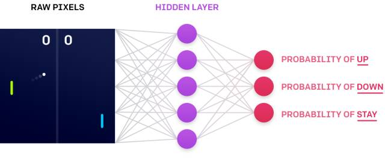
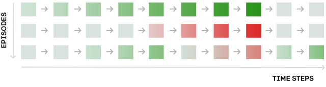
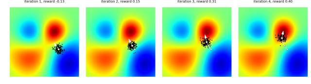
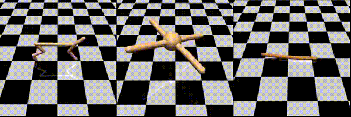
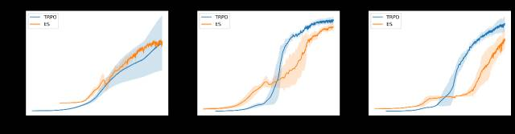
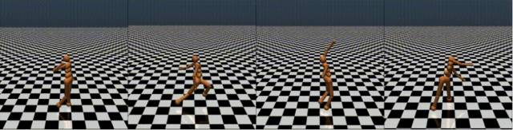
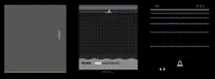

# OpenAI 详解进化策略方法：可替代强化学习

 *选自 OpenAI

**作者：Andrej Karpathy 等**

**机器之心编译**

**参与：吴攀、李亚洲**

> *让机器具备生物一样的进化能力一直是计算机科学的一个热门研究领域，OpenAI 前几天发表了一篇相关研究的论文《用作强化学习的可扩展替代的进化策略（Evolution Strategies as a Scalable Alternative to Reinforcement Learning）》，机器之心当时也对那篇论文和另一篇来自谷歌的相关论文进行了介绍，参阅《[深度 | 谷歌和 OpenAI 新研究：如何使用达尔文进化论辅助设计人工智能算法？](http://mp.weixin.qq.com/s?__biz=MzA3MzI4MjgzMw==&mid=2650724513&idx=3&sn=ed7053307e24a0fea9d9638f87bbb641&chksm=871b1cdfb06c95c90fec64e565a0420571ee6dd0c2dda4d93a0d16812086bd07a465a42d6f50&scene=21#wechat_redirect)》。今天，OpenAI 的博客深度解析了该研究机构的这项新研究，机器之心对该解读进行了编译介绍，论文可点击文末「阅读原文」查看。*

进化策略（ES：evolution strategy）是一种已存在了数十年的优化技术，其在现代强化学习基准（如 Atari/MuJoCo）上的表现可以比肩标准的强化学习技术，同时还能克服强化学习的许多不便。

特别的几点包括：进化策略的实现更加简单（不需要反向传播），更容易在分布式环境中扩展，不会受到奖励稀疏的影响，有更少的超参数。这个结果令人吃惊，因为进化策略就好像是在一个高维空间中简单地爬山，每一步都沿着一些随机的方向实现一些有限的差异。

我们的发现是这种已有数十年之久思想强大结果的现代延续。比如说，在 2012 年，AlexNet 论文表明可以如何设计、扩展和训练卷积神经网络（CNN）以在图像识别任务上实现极其优秀的结果，而那时候大多数研究者还认为 CNN 并不是一种有希望的计算机视觉技术。类似地，在 2013 年，深度 Q 学习（Deep Q-Learning）论文表明可以将 Q 学习与 CNN 结合起来以成功地解决 Atari 游戏，从而使强化学习（RL）发展成为了一个有激动人心的实验结果的研究领域，而不再只是理论构想了。同样，我们的研究也表明进化策略可以在强化学习基准上实现优秀的表现，从而消除了人们之前普遍认为的进化策略方法不能用于高维问题的观点。

进化策略易于实现和扩展。我们的实现运行在一个包含了 80 台机器和 1440 个 CPU 内核的计算集群上，其可以仅在 10 分钟内就训练出一个 3D MuJoCo 人形步行者（在 32 核上，A3C 需要大约 10 小时）。使用 720 核，我们也能在 Atari 上实现可与 A3C 媲美的表现，同时还能将训练时间从 1 天降低至 1 小时。

下面，我们将首次简要描述传统的强化学习方法与我们的进化策略方法的对比，还会讨论进化策略和强化学习之间的权衡，最后还会突出介绍我们的一些实验。

**强化学习**

首先让我们简单看看强化学习的工作方式。假设我们有一些环境（比如游戏），我们想要在其中训练一个代理。为了描述该代理的行为，我们要定义一个策略函数（policy function），这是该代理的大脑，用于计算该代理如何在一个给定的情形中采取行动。在实践中，这个策略通常是一个神经网络，其输入是该游戏的当前状态，然后计算可用的所有允许动作的概率。一个典型的策略函数可能有大约 1,000,000 个参数，所以我们的任务就是找到这些参数的确切配置，以使得该策略能够实现良好的表现（即在很多游戏中获胜）。



*上图：在 Pong 游戏中，策略根据输入的屏幕像素来计算移动玩家拍子的概率（右边绿色的拍子）：上、下或不动。*

该策略的训练过程如下所示。首先是一个随机初始化，我们让该代理与环境进行一阵交互，然后收集交互的「剧情（episode）」（比如，每个 episode 就是一局 Pong 游戏）。由此我们就能得到情况的完整记录：遇到了什么样的状态序列、在每个状态采取了什么动作、每一步的奖励如何。下图给出了一个例子，这三个 episode 每个都表示在一个假想环境中的 10 个时间步骤。其中每个矩形都是一个状态，如果奖励是正面的（比如把球击回给了对方），那么矩形就是绿色；如果奖励是负面的（比如没有接到球），那么矩形则为红色：



这幅图给出了改善策略的一个方法；导致绿色状态的行为是好的行为，导致红色的行为则很糟糕。然后我们可以使用反向传播来计算该网络参数的一次小的更新，该更新将使得未来的状态更有可能是绿色、更少可能是红色。我们预计更新后的策略会更好一点。然后我们迭代这一过程：收集另一批 episode，进行另一次更新……

通过在这些动作中注入噪声来进行探索。我们在强化学习中通常使用的策略是随机的，它们仅计算采取任何动作的概率。通过这种方法，代理可能会在训练过程中发现自己在不同时间处在同一个特定状态，而且由于采样的情况，它也将在不同的时间采取不同的动作。这能提供学习所需的信号：这些动作中有一些会导致好的结果，这些动作就会得到鼓励；另一些则不会奏效，就会被抑制。因此我们可以说，我们通过向代理的动作注入噪声而为其学习过程引入了探索（exploration）——我们可以通过在每个时间步骤从动作分布中采样来做到这一点。这与进化策略不同。

**进化策略**

关于「进化（Evolution）」。在我们探讨进化策略（ES）之前，有必要强调一下尽管这种方法名字中有「进化」这个词，但进化策略和生物进化关系不大。也许这项技术的早期版本从生物进化上获得了一些启发——在一定的抽象程度上，这种方法可被视为这样一个过程：从个体构成的群体中采样并让其中成功的个体引导未来后代的分布。但是，其数学细节在生物进化方法的基础上实现了很大的抽象，我们最好将进化策略看作是一类黑箱的随机优化技术。

黑箱优化。在进化策略中，让我们完全忘记代理、环境、涉及的神经网络和其中的交互吧。进化策略的整个设置就是一大堆数字输入（假设和前面提到的策略网络的参数数量一样，有 1,000,000 个数字），然后输出 1 个数字（对应总奖励），我们需要找到这 1,000,000 个数字的最好配置。在数学上，我们可以说是根据输入向量 w（该网络的参数/权重）来优化一个函数 f(w)，但我们不对 f 的结构做出任何假设，我们只能对其进行评估（因此被称为「黑箱」）。

进化策略算法。直观上来讲，这种优化就是一种「猜测然后检测」的过程，即我们从一些随机参数开始，然后重复执行以下过程：1）随机对该猜测进行一点调整，2）让我们的猜测向效果更好的方向移动一点。具体而言，就是在每个步骤输入一个参数向量 w，然后通过高斯噪声对 w 进行抖动来生成一群（比如 100 个）有稍微改变的参数向量 w1, w2……w100。然后我们在环境中分别运行这 100 个候选项所对应的策略网络，从而独立地对这 100 候选项分别进行评估，然后将每个案例中的奖励加起来。然后其更新后的参数就变成了这 100 个向量的加权和，其中每个权重都正比于其总奖励。（即，我们想让更成功的候选项有更高的权重。）在数学上，你也会注意到这就相当于使用有限差分法（finite difference）来估计参数空间中预期奖励的梯度，只是我们是沿着 100 个随机方向来做的。

我们要看的另一种方法是仍然使用强化学习（策略梯度，具体来说是 REINFORCE），其中的代理的动作是使用高斯策略得出整个参数向量。



上图：进化策略优化过程，这个环境中只有两个参数和一个奖励函数（红色=高、蓝色=低）。在每次迭代，我们都会展示当前参数值（白色）、一群经过抖动的样本（黑色）和估计的梯度（白色箭头）。我们不断将该参数移动到该箭头的顶点，直到我们收敛到了一个局部最优值。你可以使用本文的代码重现这些图。

代码示例。为了得到具体的核心算法并突出其简洁性，这里给出了一段使用进化策略优化二次函数的短代码实例（更长的版本见文末链接）。

```py
# simple example: minimize a quadratic around some solution point import numpy as np   solution = np.array([0.5, 0.1, -0.3])   def f(w): return -np.sum((w - solution)**2) npop = 50      # population size   sigma = 0.1    # noise standard deviation   alpha = 0.001  # learning rate   w = np.random.randn(3) # initial guess   for i in range(300):    N = np.random.randn(npop, 3)  R = np.zeros(npop)  for j in range(npop):    w_try = w + sigma*N[j]    R[j] = f(w_try)  A = (R - np.mean(R)) / np.std(R)  w = w + alpha/(npop*sigma) * np.dot(N.T, A)
```

向参数中注入噪声。注意这里的目标与强化学习优化的目标是一样的：预期的奖励。但是，强化学习是将噪声注入动作空间并使用反向传播来计算参数更新，而进化策略则是直接向参数空间注入噪声。换个说话，强化学习是在「猜测然后检验」动作，而进化策略则是在「猜测然后检验」参数。因为我们是在向参数注入噪声，所以就有可能使用确定性的策略（而且我们在实验中也确实是这么做的）。也有可能同时将噪声注入到动作和参数中，这样就有可能实现两种方法的结合。

**进化策略和强化学习间的权衡**

相比于强化学习算法，进化策略有多个优势（一些优势有些技术性）：

*   不需要反向传播。进化策略只需要策略的前向通过，不需要反向传播（或价值函数评估），这使得代码更短、在实践中速度快了 2-3 倍。在内存有限的系统中，也不需要保留 episode 的记录从而进行后续的更新。我们也不需要担心 RNN 中的梯度爆炸问题。最后，我们能够探索更大类别的策略函数，包括不可微分的网络（比如二值网络），或者包括复杂模块的网络（例如包括 pathfinding 或多种优化层）。

*   高度可并行。进化策略只需要工作器彼此之间进行少量纯数量的通信，然而在强化学习中需要同步整个参数向量（可能会是百万数值的）。直观来看，这是因为我们在每个工作器（worker）上控制随机 seeds，所以每个工作器能够本地重建其他工作器的微扰（perturbations）。结果是，在实验中我们观察到，随着我们以千为单位增加 CPU 进行优化时，有线性的加速。

*   高度稳健。在强化学习实现中难以设置的数个超参数在进化策略中被回避掉了。例如，强化学习不是「无标度（scale-free）的」，所以在 Atari 游戏中设置不同的跳帧（frame-skip）超参数会得到非常不同的学习输出。就像我们所展现的，进化策略在任何跳帧上有同样的结果。

*   架构探索。一些强化学习算法（特别是策略梯度）用随机策略进行初始化，这总是表现为在一个位置有长时间的随机跳跃。这种影响在 Q 学习方法中因为 epsilon-greedy 策略而有所缓和，其中的 max 运算能造成代理暂时表现出一些一致的动作（例如，维持一个向左的箭头）。如果代理在原地跳动，在游戏中做一些事情是更有可能的，就像策略梯度的例子一样。类似于 Q 学习，进化策略也不会受这些问题的影响，因为我们可以使用确定性策略来实现一致的探索。通过研究进化策略和强化学习梯度评估器，我们能看到进化策略是一个有吸引力的选择，特别是在 episode 中的时间步骤量很长的时候，也就是动作会有长时间的影响。或者是在没有好的价值函数评估的时候进化策略也是好的选择。

对应地，在实践中我们也发现了应用进化策略的一些挑战。一个核心问题是为了让进化策略工作，在参数中加入噪声必然会导致不同的输出，从而获得一些梯度信号。就像我们在论文中详细说明的，我们发现使用虚拟 batchnorm 能帮助缓和这一问题，但在有效地参数化神经网络上还有进一步的工作要做，从而有不同的行为作为噪声的功能。还有一个相关的困难，我们发现在 Montezuma’s Revenge 游戏中，用随机网络很难在一级的时候得到钥匙，然而用随机动作能偶尔获得钥匙。

**进化策略可媲美于强化学习**

在两个强化学习基准上我们对比了进化策略和强化学习的表现：MuJoCo 控制任务和 Atari 游戏。每个 MuJoCo 任务（看以下示例）包含一个模拟身体的铰接式人物，策略网络获得所有关节的位置信息，需要输出每个关节的力矩（torques）从而前行。以下是在三个 MuJoCo 控制任务上训练的代理示例，任务目标是前行。



我们通常观察学习数据的效率来对比算法的表现。作为我们观察到的多少状态的函数，什么是我们的平均奖励？以下是我们获得的学习曲线，与强化学习进行了对比（在此案例中用的是 TRPO 强化学习算法，参考 https://arxiv.org/abs/1502.05477）:



数据学习效率对比。以上对比表明进化策略（橘黄）有着与 TRPO 算法（蓝色）相媲美的表现，尽管在所有情况下它不完全匹配或超越 TRPO 算法。此外，通过水平扫描我们可看到进化策略效率略低，但不低于 1/10（注意横坐标是指数标度）。

时间对比。取代观察看到的状态原数量，我们可以认为要观察的最重要的标准是时间：解决一个问题需要多久（以秒为计）？这一数值最终指示了一个研究人员可完成的迭代速度。因为进化策略算法需要的工作器（worker）之间的通信几乎可以忽略，我们能够使用 80 台机器上的 1440 个 CPU，10 分钟就解决最难的 MuJoCo 任务（3D 人形）。作为对比，在典型的一台机器上 32 个 A3C 工作器配置中，解决该任务需要 10 小时左右。用算法与工程上的努力，当然也能改进强化学习的表现，但我们发现在标准的云 CPU 环境中单纯延展 A3C 非常难，因为需要高通信带宽。

以下是用进化策略训练的 3D 人形任务行走的动图。就像我们所看到的，根据优化最终收敛到的局部最优值，结果挺多样的。



在 Atari 游戏中，用 1 小时在 720 核上训练进化策略取得了的表现可媲美于在 32 核上训练一天的 A3C。下面是在 Pong、Seaquest 和 Beamrider 游戏中的结果片段。这些片段显示了预处理的画面，也就是代理在玩游戏时所看到的：



特别要注意 Seaquest 游戏中的潜水艇在氧气值低的时候学习准确率会上升。

**相关研究**

进化策略是源自神经进化系的算法。神经进化在人工智能中有着很长的历史，完整文献原因超出本文所覆盖的范围。我们鼓励感兴趣的读者查阅 Wikipedia、Scholarpedia 的相关文献，以及 Jurgen Schmidhuber 的回顾文章（Section 6.6)。最影响我们研究的一项工作是 Wierstra 等人在 2014 年作出的自然进化策略（Natural Evolution Strategies）。相比于该工作以及它所启发出的其他工作，我们专注于将这些算法延展到大规模的、分布式环境中，寻找让这些算法能与深度神经网络很好结合的组件，并在现在的强化学习基准上评估这些算法。

还值得注意的是神经进化相关的方法最近在机器学习研究中有所复苏（resurgence），例如 HyperNetworks、Large-Scale Evolution of Image Classifiers 和 Convolution by Evolution。HyperNetworks,「Large-Scale Evolution of Image Classifiers」和「Convolution by Evolution」.

**结论**

我们的研究表明神经进化方法在现在的代理-环境基准上，可与强化学习的方法相媲美，同时在代码复杂性上也有重大收益、易于延展到大规模分布式环境。我们也期望通过重新回顾这条线上的其他观点从而作出更多激动人心的工作，比如间接编码方法，或者除了参数以外用其他方法进化网络架构。

注意监督学习：要注意的一点是监督学习问题（例如图像分类、语音识别或者产业中的大部分其他任务）并不受这些成果的直接影响。监督学习可以用反向传播方法直接计算损失函数的确切梯度。例如，在初步试验中我们使用进化策略在 MNIST 数字识别任务上评估梯度，发现它要比使用反向传播的方法慢 1000 倍。只有在强化学习环境中，也就是必须要用采样评估预期奖励（expected reward）的梯度，进化策略才具有可比性。

代码发布：最后，如果你想要尝试运行下进化策略，你可以阅读以下论文，或了解 GitHub repo 的详细细节。 

论文：

https://arxiv.org/abs/1703.03864

Github：

https://github.com/openai/evolution-strategies-starter

******本文为机器之心编译，***转载请联系本公众号获得授权******。***

✄------------------------------------------------

**加入机器之心（全职记者/实习生）：hr@jiqizhixin.com**

**投稿或寻求报道：editor@jiqizhixin.com**

**广告&商务合作：bd@jiqizhixin.com***