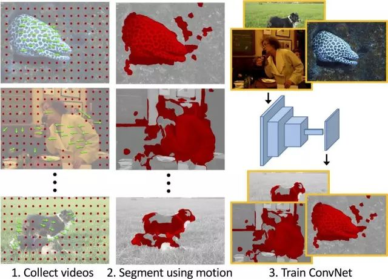

# 从自编码器到生成对抗网络：一文纵览无监督学习研究现状

选自 Medium

**机器之心编译**

**参与：Nurhachu、蒋思源、吴攀**

> *无监督学习是深度学习的圣杯。它的目的是希望能够用极少量且不需要标注的数据训练通用系统。本文将从无监督学习的基本概念开始再进一步简述无监督学习的各个基础算法及其优缺点。本文作者为专注机器人与视觉研究的 e-Lab 的研究者 Eugenio Culurciello。*

如今深度学习模型都需要在大规模的监督数据集上训练。这意味着对于每一个数据，都会有一个与之对应的标签。在很流行的 ImageNet 数据集中，其共有一百万张带人工标注的图片，即 1000 类中的每一类都有 1000 张。创建这么一个数据集是需要一番功夫的，可能需要很多人花数月的功夫完成。假定现在要创建一个有一百万类的数据集，那么就必须给总共 1 亿帧视频数据集中的每一帧做标注，这基本是无法实现的。

现在，回想一下在你很小的时候，自己是如何得到教导的。没错，我们的确受到了一些监督，但是当你的父母告诉你这是一只「猫」之后，他们不会在日后的生活中每一次观察到猫时都告诉你这是「猫」！而如今的监督式学习是这样的：我一次又一次地告诉你「猫」是什么样的，也许会重复一百万次。然后你的深度学习模型就领会了关于猫的知识。

理想情况下，我们希望有一个更像我们的大脑一样去运行得模型。它仅仅需要很少的一些标签就能够理解现实世界中的很多类事物。在现实世界中，我指的类是物体类别、动作类别、环境类别、物体的部分的类别，诸如此类还有很多很多。

正如你会在这篇评论中看到的一样，最成功的模型就是那些能够预测视频中即将出现的画面的模型。很多这类技术面临并正尝试解决的一个问题，即为了达到良好的全局表现，训练要在视频上进行，而不是静态的图片上。这是将学习到的表征应用在实际任务中的唯一途径。

**基本概念**

无监督学习研究的主要目标就是要预训练出能够用于其他任务的模型（即鉴别器或者编码器）。编码器的特点应该尽可能的通用，以便可以用在分类任务中（如在 ImageNet 上进行训练），并且提供尽可能像监督模型一样好的结果。

最新的监督模型总是表现得比无监督预训练模型更好。那是因为，监督会允许模型能够更好的编码数据集上的特征。但是当模型应用在其他的数据集上时，监督会衰减。在这方面，无监督训练有希望提供更加通用的特性来执行任何任务。

如果以实际生活中的应用为目标，例如无人驾驶、动作识别、目标检测和实时提取中的识别，那么算法需要在视频上训练。

**自编码器**

UC Davis 的 Bruno Olshausen 和康奈尔大学的 David Field 于 1996 年的发表的论文《Sparse Coding with an Overcomplete Basis Set: A Strategy by V1?》(论文链接：http://redwood.psych.cornell.edu/papers/olshausen_field_1997.pdf) 表明，编码理论可以被用在视觉皮层的接收域中。他们证明了我们大脑中的基本视觉旋涡 (V1) 使用稀疏性原理来创建一个能够被用于重建输入图像的基本功能的最小集合。

下面的链接是 2014 年伦敦微软 Bing 团队的 Piotr Mirowski 关于自动编码器的一个很好的综述。

链接：https://piotrmirowski.files.wordpress.com/2014/03/piotrmirowski_2014_reviewautoencoders.pdf

Yann LeCun 的团队也从事这个领域的研究。在链接网页中的 demo 中，你可以看到像 V1 一样的滤波器是如何学习的。(链接：http://www.cs.nyu.edu/~yann/research/deep/)

通过重复贪婪逐层训练的过程，堆栈式自编码器（Stacked-auto encoder）也被使用了。

自动编码器方法也被称为直接映射方法。

**自动编码器/稀疏编码/堆叠式自动编码的优点和缺点**

优点：

*   简单的技术：重建输入

*   多层可堆叠

*   直观和基于神经科学的研究

缺点

*   每一层都被贪婪地（greedily）训练

*   没有全局优化

*   比不上监督学习地性能

*   多层失效

*   对通用目标地表征而言，重建输入可能不是理想的指标

**聚类学习**

它是用 k-means 聚类在多层中学习滤波器的一种技术。

我们组把这项技术命名为：聚类学习（见论文：Clustering Learning for Robotic Vision）、聚类连接 (见论文：An Analysis of the Connections Between Layers of Deep Neural Networks），以及卷积聚类 (见论文：Convolutional Clustering for Unsupervised Learning）。就在最近，这项技术在流行地无监督学习数据集 STL-10 上实现了非常好的结果。

我们在这个领域的研究和 Adam Coates 与 Andrew Ng 在基于 k-means 学习特征表示 ( Learning Feature Representations with K-means ) 中发表的研究成果是独立的。

众所周知，由于在求解配分函数时的数值问题，受限波尔兹曼机（RBM），深波尔兹曼机（DBM），深度信念网络（DBN/参见 Geoffrey E. Hinton 等人的研究：A fast learning algorithm for deep belief net）等模型已经很难去训练了。因此，它们没有广泛应用于解决问题中。

**聚类学习的优缺点：**

优点：

*   简单的技术：得到相似群集的输出

*   多层可堆叠

*   直观和基于神经科学的研究

缺点：

*   每一层都被贪婪地训练

*   没有全局优化

*   在某些情况下可以和监督学习的性能媲美

*   多层递增式失效==性能回报递减

**生成对抗网络模型**

生成对抗网络尝试通过鉴别器和生成器的对抗而得来一个优良的生成模型，该网络希望能够生成足以骗过鉴别器的逼真图像。生成模型这一领域近年来十分优秀的生成对抗网络正是由 Ian Goodfellow 和 Yoshua Bengio 等人在论文《Generative Adversarial Nets》中提出。这里还有 OpenAI 的研究员 Ian 在 2016 年底做的关于生成对抗网络 (GANS) 的总结，视频链接:https://channel9.msdn.com/Events/Neural-Information-Processing-Systems-Conference/Neural-Information-Processing-Systems-Conference-NIPS-2016/Generative-Adversarial-Networks。

由 Alec Radford、 Luke Metz 以及 Soumith Chintala 等人实例化的一个被称作 DCGAN 的生成对抗模型取得了非常好的结果。他们的研究发表在论文：Unsupervised Representation Learning with Deep Convolutional Generative Adversarial Networks。

Vincent Dumoulin 和 Ishmael Belghazi 等人对这个模型做了一个比较好的解释（链接：https://ishmaelbelghazi.github.io/ALI/）。

DCGAN 鉴别器被设计来判断一副输入图片是真实的（来源于某个数据集的真实图片）或虚假的（来源于某个生成器）。生成器将随机地噪声向量（例如 1024 个数值）作为输入，并生成一副图片。

在 DCGAN 中，生成器网络如下：

尽管这个鉴别器是一个标准的神经网络。具体的细节可以参考下文提及的代码。

关键是要并行地去训练这两个网络，同时不要完全过拟合，因此才会复制数据集。学习到的特征需要泛化在未知的样本上，所以学习数据集将不会有用。

在 Torch7 上训练 DCGAN 的代码（https://github.com/soumith/dcgan.torch）也被提供了。这需要大量的实验，相关内容 Yann LeCun 在 Facebook 中也分享过：https://www.facebook.com/yann.lecun/posts/10153269667222143

当生成器和鉴别器都被训练之后，你可以同时使用两者。主要的目标就是训练出一个能够被用于其他任务的鉴别器网络，例如在其他数据集上可以分类。生成器可以用来从随机向量中生成图片。这些图片有着非常有趣的属性。首先，它们从输入空间中提供了平滑的变换。如下所示的例子展示了在 9 个随机输入向量中移动而生成的图片：

输入向量空间也提供了数学属性，证明学习到的特征是按照相似性来组织的，如下图所示：

生成器学习到的平滑空间启示鉴别器也要有类似的属性，这使得鉴别器在编码图像时成了一个很棒的通用特征提取器。这有助于解决 CNN 在训练不连续图像的时候由于对抗噪声而造成的失败（详见 Christian Szegedy 等人的文章《Intriguing properties of neural networks》，https://arxiv.org/abs/1312.6199）。

GAN 最新的进展，在仅有 1000 个标签样本的 CIFAR-10 数据集上实现了 21% 的错误率，参见 OpenAI 的 Tim Salimans 等人的论文《Improved Techniques for Training GANs》，论文链接：https://arxiv.org/pdf/1606.03498v1.pdf。

最近关于 infoGAN 的论文《InfoGAN: Interpretable Representation Learning by Information Maximizing Generative Adversarial Nets》（链接：https://arxiv.org/abs/1606.03657）中，能够产生特征非常清晰的图像，并且这些图像具有更加有趣的意义。然而，他们并没有公布学习到的特征在某项任务或某个数据集中的性能对比。

在如下所示的博客和网站中也有关于生成对抗模型的总结，参见 OpenAI 的技术博客 https://blog.openai.com/generative-models/ 和网页 https://code.facebook.com/posts/1587249151575490/a-path-to-unsupervised-learning-through-adversarial-networks/。

另一个非常有趣的例子如下，在例子中，作者用生成对抗训练去学习从文本描述中生成图像。参见论文《Generative Adversarial Text to Image Synthesis》，链接：https://arxiv.org/abs/1605.05396。

我最欣赏这项工作的地方在于它所使用的网络用文本描述作为生成器的输入，而不是随机向量，这样就可以精确地控制生成器的输出。网络模型结构如下图所示：

**生成对抗模型的缺点和优点**

优点：

*   对整个网络的全局训练

*   易于编程和实现

缺点：

*   难以训练和转换问题

*   在某些情况下可以比得上监督学习的性能

*   需要提升可用性（这是所有无监督学习算法面临的问题）

**可以从数据中学习的模型**

通过设计不需要标签的无监督学习任务和旨在解决这些任务的学习算法，这些模型直接从无标签的数据中学习。

在视觉表征中通过解决拼图问题来进行无监督学习确实是一个聪明的技巧。作者将图像分割成了拼图，并且训练深度网络来解决拼图问题。最终得到的网络的表现足以比肩最好的预训练网络。详见论文《Unsupervised Learning of Visual Representations by Solving Jigsaw Puzzles》，链接：https://arxiv.org/abs/1603.09246

在视觉表征中通过图像补丁和布局来进行无监督学习也是一个聪明的技巧。他们让同一幅图像上的两个补丁紧密分布。这些补丁在统计上来讲是同一个物体。第三个补丁选择随机的图像，并且布局在随机的位置，从统计上来讲与前两个补丁并不是同一类物体。然后训练一个深度网络来区分两个属于同一类的补丁和另一个不同类别的补丁。最终得到的网络具有和最高性能精调网络之一相同的性能。详情参见论文《Learning visual groups from co-occurrences in space and time》，链接：https://arxiv.org/abs/1511.06811。

从立体图像重建中进行的无监督学习模型采用立体图像作为输入，例如图像一帧的左半部分，然后重建出图像的右半部分。虽然这项工作并不针对无监督学习，但是它可以用作无监督学习。这种方法也可以用来从静态图片生成 3D 电影。参见论文《Deep3D: Fully Automatic 2D-to-3D Video Conversion with Deep Convolutional Neural Networks》，链接：https://arxiv.org/abs/1604.03650，github 上的 Python 源码：https://github.com/piiswrong/deep3d。

利用替代类别的无监督学习视觉表征使用图像不行来创建非常大的替代类。这些图像补丁然后被增强，然后被用来训练基于增强替代类的监督网络。这在无监督特征学习中给出了最好的结果。详情参见论文《Discriminative Unsupervised Feature Learning with Exemplar Convolutional Neural Networks》，链接：https://arxiv.org/abs/1406.6909。

使用视频的无监督学习视觉表征采用了基于 LSTM 的编码器-解码器对。编码 LSTM 运行在视频帧的序列上以生成一个内部表征。随后这些表征通过另一个 LSTM 被解码以生成一个目标序列。为了使这个变成无监督的，一种方法是预测与输入相同的序列。另一种方式是预测未来的帧。详情参见论文《Unsupervised Learning of Visual Representations using Videos》，链接:https://arxiv.org/abs/1505.00687。

另一篇使用视频的文章出自 MIT 的 Vondrick 和 Torralba 等人（http://arxiv.org/abs/1504.08023），有着非常惹人注目的结果。这项工作背后的思想是从视频输入中预测未来帧的表示。这是一种优雅的方法。使用的模型如下：

这项技术的一个问题就是：一个训练在静态图像帧上的神经网络被用来解释视频输入。这种网络不会学习到视频的时间动态变化以及在空间运动的物体的平滑变换。所以我们认为这个网络并不适合用来预测未来视频中的画面。

为了克服这个问题，我们团队创建了一个大型的视频数据集 eVDS（https://engineering.purdue.edu/elab/eVDS/），可用来直接从视频数据上训练新的（递归和反馈）网络模型。

**PredNet**

PredNet 是被设计来预测视频中未来帧的网络。在这个博客中可以看到一些例子，博客链接：https://coxlab.github.io/prednet/。

PredNet 是一个非常聪明的神经网络型，在我们看来，它将在将来的神经网络中起着重要的作用。PredNet 学习到了超越监督式 CNN 中的单帧图片的神经表征。

PredNet 结合了生物启发的双向 [人脑模型]（详见论文《Unsupervised Pixel-prediction》，https://papers.nips.cc/paper/1083-unsupervised-pixel-prediction.pdf）。它使用了 [预测编码和神经模型中的反馈连接]（详见论文《Neural Encoding and Decoding with Deep Learning for Dynamic Natural Vision》，http://arxiv.org/abs/1608.03425）。下面是 PredNet 模型以及一个具有两个堆叠层的例子：

*PredNet 结合了生物启发的双向人脑模型*

这个模型有以下这几个优点：

*   可使用无标签的数据来训练

*   在每一层嵌入了损失函数来计算误差

*   具有执行在线学习的能力，通过监控错误信号，当模型不能预测输出的时候，它会知道需要学习误差信号

PredNet 存在的一个问题是，对第一层的一些简单的基于运动的滤波器而言，预测未来输入的帧是相对容易的。在我们所做的 PredNet 的实验中，PredNet 在重建输入帧的时候学会了在重建输入帧时达到很好的效果，但是更高层不会学到较好的表征。事实上，在实验中更高层连简单的分类任务都解决不了。

事实上，预测未来的帧是不必要的。我们愿意做的就是去预测下一帧的表征，就像 Carl Vondrick 做的一样。详见论文《Anticipating Visual Representations from Unlabeled Video》，链接：https://arxiv.org/abs/1504.08023。

**通过观察物体的运动来学习特征**

最近的这篇论文通过观察视频中物体的运动来训练无监督模型（《Learning Features by Watching Objects Move》，https://people.eecs.berkeley.edu/~pathak/unsupervised_video/）。运动以光流的形式被提取出来，并被用作运动物体的分割模板。尽管光流信号并没有提供任何一个接近良好的分割模板，但是在大规模数据集上的平均效果使得最终的网络会表现良好。例子如下所示：

这项工作是非常激动人心的，因为它遵循关于人类视觉皮层如何学习分割运动物体的神经学理论。参见论文《Development of human visual function》，链接：http://www.sciencedirect.com/science/article/pii/S004269891100068X。

**未来**

未来需要你们来创造。

无监督训练仍然还是一个有待发展的主题，你可以通过以下方式做出较大的贡献：

*   创建一个新的无监督任务去训练网络，例如：解决拼图问题、对比图像补丁、生成图像等......

*   想出能够创造很棒的无监督功能的任务，例如：像我们人类视觉系统的工作方式一样，理解立体图像和视频中什么是物体、什么是背景。**

*原文链接：**https://medium.com/intuitionmachine/navigating-the-unsupervised-learning-landscape-951bd5842df9*

 *读者福利：即日起至 GMIS 2017 大会当天，读者在头条文章下留言，机器之心会在次日选出最专业或最有见解的一条评论赠送 GMIS 2017 双日票一张！

查看大会详情及购票信息，请点击「阅读原文」。

 *****