# 从决策树到随机森林：树型算法的原理与实现

选自 Github.io

**作者：Sadanand Singh**

**机器之心编译**

> 基于树（Tree based）的学习算法在数据科学竞赛中是相当常见的。这些算法给预测模型赋予了准确性、稳定性以及易解释性。和线性模型不同，它们对非线性关系也能进行很好的映射。常见的基于树的模型有：决策树（decision trees）、随机森林（random forest）和提升树（boosted trees）。

在本篇文章中，我们将会介绍决策树的数学细节（以及各种 Python 示例）及其优缺点。你们将会发现它们很简单，并且这些内容有助于理解。然而，与最好的监督学习方法相比，它们通常是没有竞争力的。为了克服决策树的各种缺点，我们将会聚焦于各种概念（附有 Python 实例），比如自助聚集或袋装（Bootstrap Aggregating or Bagging），还有随机森林（Random Forests）。另一种广泛使用的提升方法会在以后进行单独讨论。每种方法都包括生成多种树，这些树被联合起来，生成一个单一的一致性预测结果，并且经常带来预测精度的显著提升。

#### **决策树**

决策树是一种监督学习算法。它适用于类别和连续输入（特征）和输出（预测）变量。基于树的方法把特征空间划分成一系列矩形，然后给每一个矩形安置一个简单的模型（像一个常数）。从概念上来讲，它们是简单且有效的。首先我们通过一个例子来理解决策树。然后用一种正规分析方法来分析创建决策树的过程。考虑一个简单的借贷公司顾客的数据集合。我们给定了所有客户的查询账户余额、信用记录、任职年限和先前贷款状况。相关任务是预测顾客的风险等级是否可信。该问题可以使用下列决策树来解决：

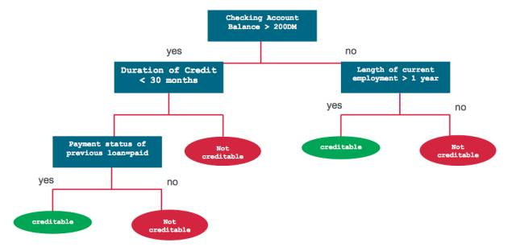

分类和回归树（简称 CART）是 Leo Breiman 引入的术语，指用来解决分类或回归预测建模问题的决策树算法。它常使用 scikit 生成并实现决策树： sklearn.tree.DecisionTreeClassifier 和 sklearn.tree.DecisionTreeRegressor 分别构建分类和回归树。

**CART 模型**

CART 模型包括选择输入变量和那些变量上的分割点，直到创建出适当的树。使用贪婪算法（greedy algorithm）选择使用哪个输入变量和分割点，以使成本函数（cost function）最小化。

树建造的结尾使用了一个预定义的停止准则，比如分配到树上每一个叶结点的训练样本达到最小数量。

其他决策树算法：

*   ID3：Iterative Dichotomiser 3

*   C4.5：ID3 算法的改进

*   CHAID：Chi-squared Automatic Interaction Detector

*   MARS：决策树的扩展式，以更好地解决数值型预测。

*   条件推断树

**回归树**

我们现在关注一下回归树的 CART 算法的细节。简要来说，创建一个决策树包含两步：

1. 把预测器空间，即一系列可能值 X_1，X_2，...，X_p 分成 J 个不同的且非重叠的区域 R_1，R_2，...，R_J。

2. 对进入区域 R_J 的每一个样本观测值都进行相同的预测，该预测就是 R_J 中训练样本预测值的均值。

为了创建 J 个区域 R_1，R_2，...，R_J，预测器区域被分为高维度的矩形或盒形。其目的在于通过下列式子找到能够使 RSS 最小化的盒形区域 R_1，R_2，...，R_J，

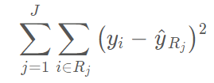

其中，yhat_Rj 即是第 j 个盒形中训练观测的平均预测值。

鉴于这种空间分割在计算上是不可行的，因此我们常使用贪婪方法（greedy approach）来划分区域，叫做递归二元分割（recursive binary splitting）。

它是贪婪的（greedy），这是因为在创建树过程中的每一步骤，最佳分割都会在每个特定步骤选定，而不是对未来进行预测，并选取一个将会在未来步骤中出现且有助于创建更好的树的分隔。注意所有的划分区域 R_j 都是矩形。为了进行递归二元分割，首先选取预测器 X_j 和切割点 s 

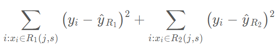

其中 yhat_R1 为区域 R_1(j,s) 中观察样本的平均预测值，yhat_R2 为区域 R_2(j,s) 的观察样本预测均值。这一过程不断重复以搜寻最好的预测器和切分点，并进一步分隔数据以使每一个子区域内的 RSS 最小化。然而，我们不会分割整个预测器空间，我们只会分割一个或两个前面已经认定的区域。这一过程会一直持续，直到达到停止准则，例如我们可以设定停止准则为每一个区域最多包含 m 个观察样本。一旦我们创建了区域 R_1、R_2、...、R_J，给定一个测试样本，我们就可以用该区域所有训练样本的平均预测值来预测该测试样本的值。

**分类树**

分类树和回归树十分相似，只不过它是定性地预测响应值而非定量预测。从上文可知，回归树对一个观察值所预测的连续型数值就是属于同一叶结点训练样本观察值的均值。但是对于分类树来说，我们所预测的类别是训练样本观察值在某区域下最常见的类别，即训练观察值的模式响应（mode response）。为了达到分类目的，很多时候系统并不会只预测一个类别，它常常预测一组类别及其出现的概率。

分类树的生成和回归树的生成十分相似。正如在回归树中那样，我们一般使用递归性的二元分割来生成分类树。然而在分类树中，RSS 不能作为二元分割的标准。我们需要定义叶结点的不纯度量 Q_m 来替代 RSS，即一种可以在子集区域 R_1,R_2,...,R_j 度量目标变量同质性的方法。在结点 m 中，我们可以通过 N_m 个样本观察值表示一个区域 R_m 所出现类别的频率，第 k 个类别在第 m 个区域下训练所出现的频率可表示为：

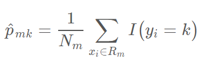

其中，I(y_i=k) 为指示函数，即如果 y_i = k，则取 1，否则取零。

不纯性度量 Q_m 一个比较自然的方法是分类误差率。分类误差率描述的是训练观察值在某个区域内不属于最常见类别的概率：

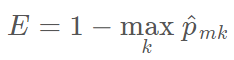

考虑到该函数不可微，因此它不能实现数值优化。此外，该函数在结点概率改变上并不敏感，因此这种分类误差率对于生成树十分低效。我们一般使用 Gini 指数和交叉熵函数来衡量结点的误差度量。

Gini 指数可以衡量 k 个类别的总方差，它一般定义为：

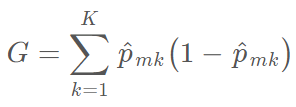

较小的 Gini 指数值表示结点包含了某个类别大多数样本观察值。

在信息论里面，交叉熵函数用来衡量系统的混乱度。对于二元系统来说，如果系统包含了一个类别的所有内容，那么它的值为零，而如果两个类别的数量一样多，那么交叉熵达到最大为 1。因此，和 Gini 指数一样，交叉熵函数同样能用于度量结点的不纯度：

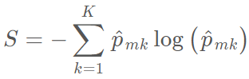

和 G 一样，较小的 S 值表示区域内结点包含了单个类别中的大多数观察值。

**决策树常见参数和概念**

如果我们希望以数学的方式理解决策树，我们首先需要了解决策树和树型学习算法的一般概念。理解以下的术语同样能帮助我们调整模型。

*   根结点：表示所有数据样本并可以进一步划分为两个或多个子结点的父结点。

*   分裂（Splitting）：将一个结点划分为两个或多个子结点的过程。

*   决策结点：当一个子结点可进一步分裂为多个子结点，那么该结点就称之为决策结点。

*   叶/终止结点：不会往下进一步分裂的结点，在分类树中代表类别。

*   分枝/子树：整棵决策树的一部分。

*   父结点和子结点：如果一个结点往下分裂，该结点称之为父结点而父结点所分裂出来的结点称之为子结点。

*   结点分裂的最小样本数：在结点分裂中所要求的最小样本数量（或观察值数量）。这种方法通常可以用来防止过拟合，较大的最小样本数可以防止模型对特定的样本学习过于具体的关系，该超参数应该需要使用验证集来调整。

*   叶结点最小样本数：叶结点所要求的最小样本数。和结点分裂的最小样本数一样，该超参数同样也可以用来控制过拟合。对于不平衡类别问题来说，我们应该取较小的值，因为属于较少类别的样本可能数量上非常少。

*   树的最大深度（垂直深度）：该超参数同样可以用来控制过拟合问题，较小的深度可以防止模型对特定的样本学习过于具体的关系，该超参数同样需要在验证集中调整。

*   叶结点的最大数量：叶结点的最大个数可以替代数的最大深度这一设定。因为生成一棵深度为 n 的二叉树，它所能产生的最大叶结点个数为 2^n。

*   分裂所需要考虑的最大特征数：即当我们搜索更好分离方案时所需要考虑的特征数量，我们常用的方法是取可用特征总数的平方根为最大特征数。

**分类树的实现**

为了展示不同的前文所述的决策树模型，我们将使用 Kaggle 上的美国收入数据集，我们都可以在 Kaggle.com 上下载该数据集。下面的代码可以展示该数据集的导入过程和部分内容：

```py
  import pandas as pdimport numpy as npfrom plotnine import *import matplotlib.pyplot as pltfrom sklearn.preprocessing import LabelEncoderfrom sklearn_pandas import DataFrameMapperfrom sklearn.tree import DecisionTreeClassifierfrom sklearn.ensemble import RandomForestClassifier training_data = './adult-training.csv'test_data = './adult-test.csv'columns = ['Age','Workclass','fnlgwt','Education','EdNum','MaritalStatus','Occupation','Relationship','Race','Sex','CapitalGain','CapitalLoss','HoursPerWeek','Country','Income'] df_train_set = pd.read_csv(training_data, names=columns) df_test_set = pd.read_csv(test_data, names=columns, skiprows=1) df_train_set.drop('fnlgwt', axis=1, inplace=True) df_test_set.drop('fnlgwt', axis=1, inplace=True)

```

在上面的代码中，我们首先需要导入所有需要的库和模块，然后再读取数据和结构到训练数据和验证数据中。我们同样去除 fnlgwt 列，因为该数据行对于模型的训练并不重要。

输入以下语句可以看到训练数据的前五行：

```py
  df_train_set.head()

```

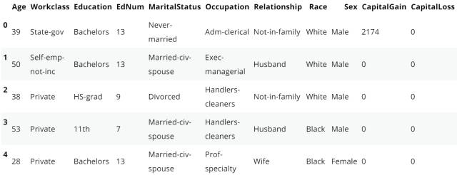

如下所示，我们还需要做一些数据清洗。我们需要将所有列的的特殊字符移除，此外任何空格或者「.」都需要移除。

```py
  #replace the special character to "Unknown"for i in df_train_set.columns:    df_train_set[i].replace(' ?', 'Unknown', inplace=True)    df_test_set[i].replace(' ?', 'Unknown', inplace=True)for col in df_train_set.columns:if df_train_set[col].dtype != 'int64':        df_train_set[col] = df_train_set[col].apply(lambda val: val.replace(" ", ""))        df_train_set[col] = df_train_set[col].apply(lambda val: val.replace(".", ""))        df_test_set[col] = df_test_set[col].apply(lambda val: val.replace(" ", ""))        df_test_set[col] = df_test_set[col].apply(lambda val: val.replace(".", ""))

```

正如上图所示，有两行描述了个人的教育：Eduction 和 EdNum。我们假设这两个特征十分相关，因此我们可以移除 Education 列。Country 列对预测收入并不会起到什么作用，所以我们需要移除它。

```py
  df_train_set.drop(["Country", "Education"], axis=1, inplace=True) df_test_set.drop(["Country", "Education"], axis=1, inplace=True)

```

Age 和 EdNum 列是数值型的，我们可以将连续数值型转化为更高效的方式，例如将年龄换为 10 年的整数倍，教育年限换为 5 年的整数倍，实现的代码如下：

```py
  colnames = list(df_train_set.columns) colnames.remove('Age') colnames.remove('EdNum') colnames = ['AgeGroup', 'Education'] + colnames labels = ["{0}-{1}".format(i, i + 9) for i in range(0, 100, 10)] df_train_set['AgeGroup'] = pd.cut(df_train_set.Age, range(0, 101, 10), right=False, labels=labels) df_test_set['AgeGroup'] = pd.cut(df_test_set.Age, range(0, 101, 10), right=False, labels=labels) labels = ["{0}-{1}".format(i, i + 4) for i in range(0, 20, 5)] df_train_set['Education'] = pd.cut(df_train_set.EdNum, range(0, 21, 5), right=False, labels=labels) df_test_set['Education'] = pd.cut(df_test_set.EdNum, range(0, 21, 5), right=False, labels=labels) df_train_set = df_train_set[colnames] df_test_set = df_test_set[colnames]

```

现在我们已经清理了数据，下面语句可以展示我们数据的概况：

```py
  df_train_set.Income.value_counts()
<=50K    24720
>50K      7841
Name: Income, dtype: int64
df_test_set.Income.value_counts()
<=50K    12435
>50K      3846
Name: Income, dtype: int64

```

在训练集和测试集中，我们发现 <=50K 的类别要比>50K 的多 3 倍。从这里我们就可以看出来样本数据并不是均衡的数据，但是在这里为了简化问题，我们在这里将该数据集看作常规问题。

### **EDA**

现在，让我们以图像的形式看一下训练数据中的不同特征的分布和相互依存（inter-dependence）关系。首先看一下关系（Relationships）和婚姻状况（MaritalStatus）特征是如何相互关联的。

```py
  (ggplot(df_train_set, aes(x = "Relationship", fill = "MaritalStatus"))+ geom_bar(position="fill")+ theme(axis_text_x = element_text(angle = 60, hjust = 1)))

```

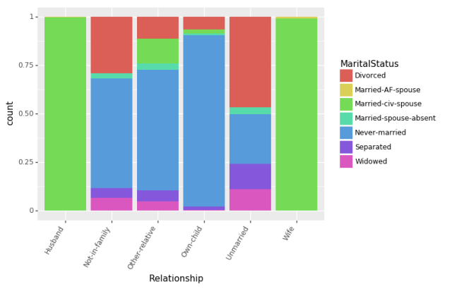

让我们首先看一下不同年龄组中，教育对收入的影响（用受教育的年数进行衡量）。

```py
  (ggplot(df_train_set, aes(x = "Education", fill = "Income"))+ geom_bar(position="fill")+ theme(axis_text_x = element_text(angle = 60, hjust = 1))+ facet_wrap('~AgeGroup'))

```

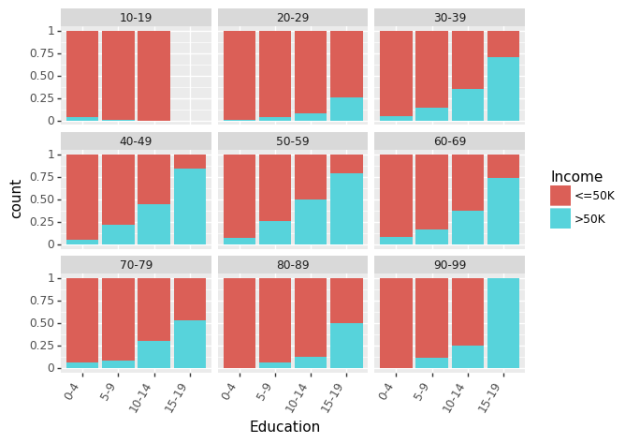

最近，有很多关于性别对收入差距的影响的相关说法。我们可以分别看见男性和女性的教育程度和种族间的影响。

```py
  (ggplot(df_train_set, aes(x = "Education", fill = "Income"))+ geom_bar(position="fill")+ theme(axis_text_x = element_text(angle = -90, hjust = 1))+ facet_wrap('~Sex'))

```

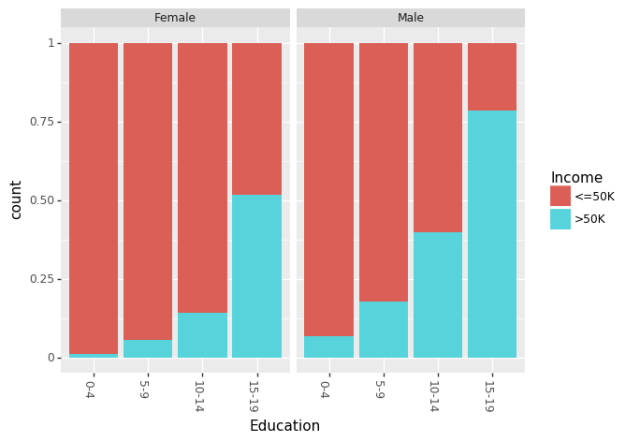

```py
  (ggplot(df_train_set, aes(x = "Race", fill = "Income"))+ geom_bar(position="fill")+ theme(axis_text_x = element_text(angle = -90, hjust = 1))+ facet_wrap('~Sex'))

```

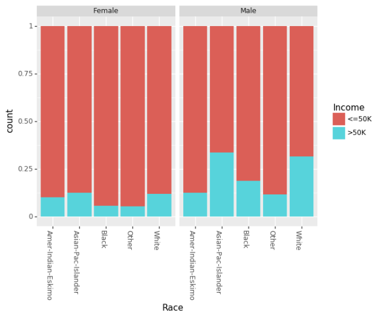

直到现在，我们仅关注了非数值特征（non-numeric）的相互关系。现在我们看一下资本收益（CapitalGain）和资本损失（CapitalLoss）对收入的影响。

```py
  (ggplot(df_train_set, aes(x="Income", y="CapitalGain"))+ geom_jitter(position=position_jitter(0.1)))

```

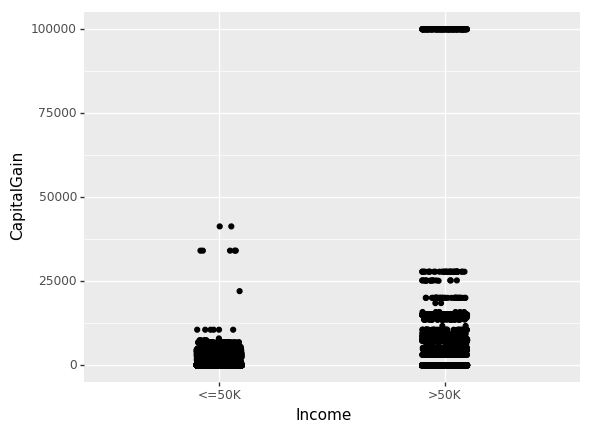

```py
  (ggplot(df_train_set, aes(x="Income", y="CapitalLoss"))+ geom_jitter(position=position_jitter(0.1)))

```

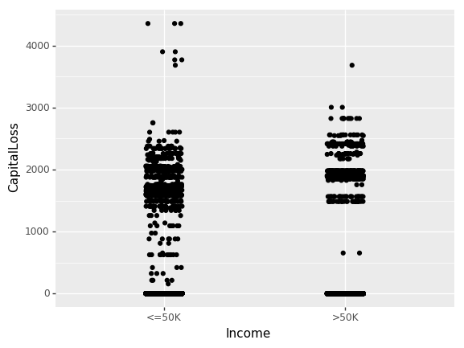

### **树分类器**

现在我们理解了我们数据中的一些关系，所以就可以使用 sklearn.tree.DecisionTreeClassifier 创建一个简单的树分类器模型。然而，为了使用这一模型，我们需要把所有我们的非数值数据转化成数值型数据。我们可以直接在 Pandas 数据框架中使用 sklearn.preprocessing.LabeEncoder 模块和 sklearn_pandas 模块就可以轻松地完成这一步骤。

```py
  mapper = DataFrameMapper([('AgeGroup', LabelEncoder()),('Education', LabelEncoder()),('Workclass', LabelEncoder()),('MaritalStatus', LabelEncoder()),('Occupation', LabelEncoder()),('Relationship', LabelEncoder()),('Race', LabelEncoder()),('Sex', LabelEncoder()),('Income', LabelEncoder())], df_out=True, default=None) cols = list(df_train_set.columns) cols.remove("Income") cols = cols[:-3] + ["Income"] + cols[-3:] df_train = mapper.fit_transform(df_train_set.copy()) df_train.columns = cols df_test = mapper.transform(df_test_set.copy()) df_test.columns = cols cols.remove("Income") x_train, y_train = df_train[cols].values, df_train["Income"].values x_test, y_test = df_test[cols].values, df_test["Income"].values

```

现在我们用正确的形式对数据进行了训练和测试，已创建了我们的第一个模型！

```py
  treeClassifier = DecisionTreeClassifier() treeClassifier.fit(x_train, y_train) treeClassifier.score(x_test, y_test)

```

最简单的且没有优化的概率分类器模型可以达到 83.5% 的精度。在分类问题中，混淆矩阵（confusion matrix）是衡量模型精度的好方法。使用下列代码我们可以绘制任意基于树的模型的混淆矩阵。

```py
  import itertoolsfrom sklearn.metrics import confusion_matrixdef plot_confusion_matrix(cm, classes, normalize=False):"""    This function prints and plots the confusion matrix.    Normalization can be applied by setting `normalize=True`.    """    cmap = plt.cm.Blues    title = "Confusion Matrix"if normalize:        cm = cm.astype('float') / cm.sum(axis=1)[:, np.newaxis]        cm = np.around(cm, decimals=3)    plt.imshow(cm, interpolation='nearest', cmap=cmap)    plt.title(title)    plt.colorbar()    tick_marks = np.arange(len(classes))    plt.xticks(tick_marks, classes, rotation=45)    plt.yticks(tick_marks, classes)    thresh = cm.max() / 2.for i, j in itertools.product(range(cm.shape[0]), range(cm.shape[1])):        plt.text(j, i, cm[i, j],                 horizontalalignment="center",                 color="white" if cm[i, j] > thresh else "black")    plt.tight_layout()    plt.ylabel('True label')    plt.xlabel('Predicted label')

```

现在，我们可以看到第一个模型的混淆矩阵：

```py
  y_pred = treeClassifier.predict(x_test) cfm = confusion_matrix(y_test, y_pred, labels=[0, 1]) plt.figure(figsize=(10,6)) plot_confusion_matrix(cfm, classes=["<=50K", ">50K"], normalize=True)

```

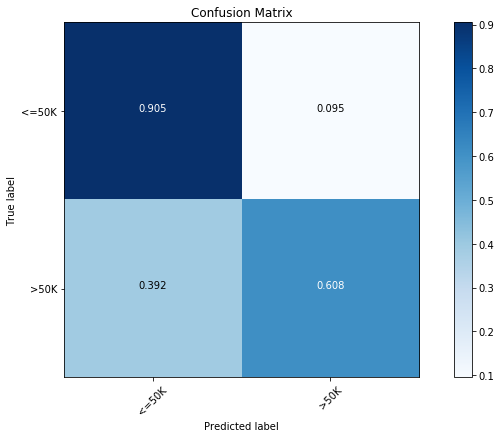

我们发现多数类别（<=50K）的精度为 90.5%，少数类别（>50K）的精度只有 60.8%。

让我们看一下调校此简单分类器的方法。我们能使用带有 5 折交叉验证的 GridSearchCV() 来调校树分类器的各种重要参数。

```py
  from sklearn.model_selection import GridSearchCV
parameters = {'max_features':(None, 9, 6),'max_depth':(None, 24, 16),'min_samples_split': (2, 4, 8),'min_samples_leaf': (16, 4, 12)}

clf = GridSearchCV(treeClassifier, parameters, cv=5, n_jobs=4)
clf.fit(x_train, y_train)
clf.best_score_, clf.score(x_test, y_test), clf.best_params_
(0.85934092933263717,
 0.85897672133161351,
 {'max_depth': 16,
  'max_features': 9,
  'min_samples_leaf': 16,
  'min_samples_split': 8})

```

经过优化，我们发现精度上升到了 85.9%。在上方，我们也可以看见最优模型的参数。现在，让我们看一下 已优化模型的混淆矩阵（confusion matrix）：

```py
  y_pred = clf.predict(x_test) cfm = confusion_matrix(y_test, y_pred, labels=[0, 1]) plt.figure(figsize=(10,6)) plot_confusion_matrix(cfm, classes=["<=50K", ">50K"], normalize=True)

```


经过优化，我们发现在两种类别下，预测精度都有所提升。

**决策树的局限性**

决策树有很多优点，比如：

*   易于理解、易于解释

*   可视化

*   无需大量数据准备。不过要注意，sklearn.tree 模块不支持缺失值。

*   使用决策树（预测数据）的成本是训练决策时所用数据的对数量级。

但这些模型往往不直接使用，决策树一些常见的缺陷是：

*   构建的树过于复杂，无法很好地在数据上实现泛化。

*   数据的微小变动可能导致生成的树完全不同，因此决策树不够稳定。

*   决策树学习算法在实践中通常基于启发式算法，如贪婪算法，在每一个结点作出局部最优决策。此类算法无法确保返回全局最优决策树。

*   如果某些类别占据主导地位，则决策树学习器构建的决策树会有偏差。因此推荐做法是在数据集与决策树拟合之前先使数据集保持均衡。

*   某些类别的函数很难使用决策树模型来建模，如 XOR、奇偶校验函数（parity）和数据选择器函数（multiplexer）。

大部分限制可以通过改善决策树轻易解决。在下面的内容中，我们将介绍相关的几个概念，重点介绍袋装和随机森林。

**剪枝**

由于决策树容易对数据产生过拟合，因此分支更少（即减少区域 R_1, … ,R_J）的小树虽然偏差略微高一点，但其产生的方差更低，可解释性更强。处理上述问题的一种方法是构建一棵树，每个分支超过某个（高）阈值造成叶结点误差率 Qm 下降，则结束构建。但是，由于分裂算法的贪婪本质，它其实很短视。决策树早期看似无用的一次分裂有可能会导致之后一次优秀的分裂，并使得 Qm 大幅下降。

因此，更好的策略是构建一个非常大的树 T_0，然后再剪枝，得到一棵子树。剪枝可以使用多种策略。代价复杂度剪枝（Cost complexity pruning），又叫最弱连接剪枝（weakest link pruning），就是其中一种行之有效的策略。除了考虑每一个可能的子树之外，还需要考虑由非负调参（nonnegative tuning parameter）α 索引的树序列。每一个 α 值都对应一个尽可能小的子树 T⊂T_0。

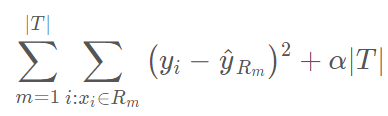

这里∣T∣代表树 T 中叶结点的数量，R_m 代表第 m 个叶结点对应的矩形（预测器空间的子集），yhat_Rm 是 Rm 的预测值，即 Rm 中训练样本预测值的均值（或分类树中的模式响应）。调整参数 α 控制子树复杂度之间的权衡，对训练数据进行拟合。当 α= 0 的时候，子树 T 等同于 T_0。当α的值增长时，构建具备多个子结点的树需要付出代价，这样，要想得到更小的子树，上述公式将达到最小化。我们可以使用某种交叉验证方法选择剪枝参数 α 。

注意，目前 sklearn.tree 决策树分类器（和回归器）不支持剪枝。

### **袋装（Bootstrap Aggregating——Bagging）**

在统计学中，Bootstrap 是依靠替换随机采样的任意试验或度量。我们从上文可以看见，决策树会受到高方差的困扰。这意味着如果我们把训练数据随机分成两部分，并且给二者都安置一个决策树，我们得到的结果可能就会相当不同。Bootstrap 聚集，或者叫做袋装，是减少统计学习方法的方差的通用过程。

给定一组 n 个独立的样本观测值 Z_1，Z_2，...，Z_n，每一个值的方差均为 *σ^*2，样本观测值的均值方差为 *σ^*2/*n*。换句话说，对一组观测值取平均会减小方差。因此一种减小方差的自然方式，也就是增加统计学习方法预测精度的方式，就是从总体中取出很多训练集，使用每一个训练集创建一个分离的预测模型，并且对预测结果求取平均值。

这里有一个问题，即我们不能获取多个训练数据集。相反，我们可以通过从（单一）训练数据集提取重复样本进行自助法（bootstrap）操作。在这种方法中，我们生成了 B 个不同的自助训练数据集。我们随后在第 b 个自助训练数据集得到了一个预测结果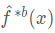，从而获得一个聚集预测（aggregate prediction）。

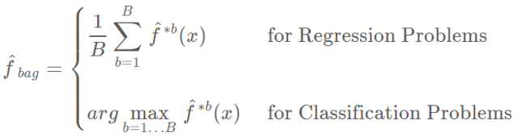

这就叫做袋装（bagging）。注意，聚集（aggregating）在回归和分类问题中可能有不同的均值。当平均预测值在回归问题中的效果很好时，我们将会需要使用多数票决（majority vote）：由于分类问题中的聚集机制，整体预测就是在 B 个预测值中最常出现的那个主要类别。

**Out-of-Bag（OOB）误差**

Bagging 方法最大的优势是我们可以不通过交叉验证而求得测试误差。回想一下，Bagging 方法的精髓是多棵树可以重复地拟合观察样本的自助子集。平均而言，每一个袋装树可以利用 2/3 的观察样本。而剩下的 1/3 观察样本就可以称为 out-of-bag (OOB) 观察样本，它们并不会拟合一一棵给定袋装树。我们可以使用每一棵树的 OOB 观察样本而计算第 i 个观察样本的预测值，这将会导致大约有 B/3 的预测值可以预测第 i 个观察样本。现在我们可以使用和 Bagging（平均回归和大多数投票分类）类似的聚集技术，我们能获得第 i 个观察样本的单一预测值。我们可以用这种方式获得 n 个观察样本的 OOB 预测，因此总体的 OOB MSE（回归问题）和分类误差率（分类问题）就能计算出来。OOB 误差结果是 Bagging 模型测试误差的有效估计，因为每一个样本的预测值都是仅仅使用不会进行拟合训练模型的样本。

**特征重要性度量**

通过使用单一树，Bagging 通常会提升预测的精确度。但是，解释最终的模型可能很困难。当我们袋装大量的树时，就不再可能使用单一的树表征最终的统计学习流程，因此，Bagging 是以牺牲阐释性能力为代价来提升预测精确度的。有趣的是，一个人可使用 RSS（用于 bagging 回归树）或者基尼指数（用于 bagging 分类树）得到每一个预测器的整体总结。在 bagging 回归树的情况中，我们可以记录由于所有的 B 树上平均的给定预测分子分裂而造成的 RSS 减少的所有数量。一个大的值表示一个重要的预测器。相似地，在 bagging 分类树的情况下，我们可以添加由于所有的 B 树上平均的给定预测分子分裂而造成的基尼系数降低的所有数量。一旦训练完成，sklearn 模块的不同袋装树（bagged tree）学习方法可直接访问特征的重要性数据作为属性。

### **随机森林模型**

虽然袋装技术（Bagging）通过降低方差而提高了一般决策树的预测性能，但它还遇到了其他缺点：Bagging 要求我们在自助样本上生成整棵树，这就增加了 B 倍计算复杂度。此外，因为基于 Bagging 的树是相关联的，预测精度会根据 B 而饱和。

随机森林通过随机扰动而令所有的树去相关，因此随机森林要比 Bagging 性能更好。随机森林不像 Bagging，在构建每一棵树时，每一个结点分割前都是采用随机样本预测器。因为在核心思想上，随机森林还是和 Bagging 树一样，因此其在方差上有所减少。此外，随机森林可以考虑使用大量预测器，不仅因为这种方法减少了偏差，同时局部特征预测器在树型结构中充当重要的决策。

随机森林可以使用巨量的预测器，甚至预测器的数量比观察样本的数量还多。采用随机森林方法最显著的优势是它能获得更多的信息以减少拟合数值和估计分割的偏差。

通常我们会有一些预测器能主导决策树的拟合过程，因为它们的平均性能始终要比其他一些竞争预测器更好。因此，其它许多对局部数据特征有用的预测器并不会选定作为分割变量。随着随机森林计算了足够多的决策树模型，每一个预测器都至少有几次机会能成为定义分割的预测器。大多数情况下，我们不仅仅只有主导预测器，特征预测器也有机会定义数据集的分割。

随机森林有三个主要的超参数调整：

*   结点规模：随机森林不像决策树，每一棵树叶结点所包含的观察样本数量可能十分少。该超参数的目标是生成树的时候尽可能保持小偏差。

*   树的数量：在实践中选择数百棵树一般是比较好的选择。

*   预测器采样的数量：一般来说，如果我们一共有 D 个预测器，那么我们可以在回归任务中使用 D/3 个预测器数作为采样数，在分类任务中使用 D^(1/2) 个预测器作为抽样。 

**随机森林模型案例**

使用和上文一样的收入数据，现在我们构建一个包含 500 棵树的简单随机森林分类器模型：

```py
  rclf = RandomForestClassifier(n_estimators=500) rclf.fit(x_train, y_train) rclf.score(x_test, y_test)

```

即使没有任何优化，我们仍然发现模型性能可以和已优化决策树分类器相媲美，并且测试分达到了 85.1%。按照下面的混淆矩阵，我们发现简单的随机森林和经过优化的树型分类器表现差不多，其在主要类别（<=50K 收入）的预测精度达到了 92.1%，而在少数类别（>50K 收入）上达到了 62.6%。

```py
  rclf = RandomForestClassifier(n_estimators=500) rclf.fit(x_train, y_train) rclf.score(x_test, y_test)

```


正如前面所探讨的，随机森林模型还提供了特征重要性的度量方法。我们可以在下图中看到目前模型不同特征的重要性：

```py
  importances = rclf.feature_importances_ indices = np.argsort(importances) cols = [cols[x] for x in indices] plt.figure(figsize=(10,6)) plt.title('Feature Importances') plt.barh(range(len(indices)), importances[indices], color='b', align='center') plt.yticks(range(len(indices)), cols) plt.xlabel('Relative Importance')

```

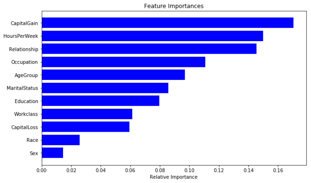

现在我们可以尝试优化我们的随机森林模型，如下我们可以使用带 5-折交叉验证的 GridSearchCV() 操作来优化随机森林：

```py
  parameters = {'n_estimators':(100, 500, 1000),'max_depth':(None, 24, 16),'min_samples_split': (2, 4, 8),'min_samples_leaf': (16, 4, 12)} clf = GridSearchCV(RandomForestClassifier(), parameters, cv=5, n_jobs=8) clf.fit(x_train, y_train) clf.best_score_, clf.best_params_ 0.86606676699118579 {'max_depth': 24, 'min_samples_leaf': 4, 'min_samples_split': 4, 'n_estimators': 1000}
0.86606676699118579
{'max_depth': 24,
 'min_samples_leaf': 4,
 'min_samples_split': 4,
 'n_estimators': 1000}

```

我们可以看到现在的模型要显著地比前面的更好一些，并且预测率达到了 86.6%。按照下面的混淆矩阵，新模型在主要类别的预测精度上有显著的提升，并且在少数类别的预测上精度只稍微降低了一点。这是非平衡数据普遍存在的问题。

```py
  rclf2 = RandomForestClassifier(n_estimators=1000,max_depth=24,min_samples_leaf=4,min_samples_split=8) rclf2.fit(x_train, y_train) y_pred = rclf2.predict(x_test) cfm = confusion_matrix(y_test, y_pred, labels=[0, 1]) plt.figure(figsize=(10,6)) plot_confusion_matrix(cfm, classes=["<=50K", ">50K"], normalize=True)

```

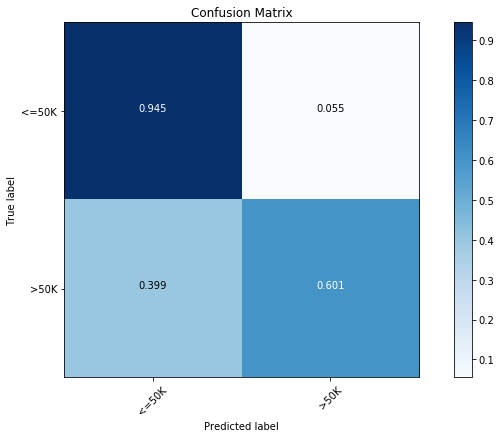

最后，下面展示了对优化后模型比较重要的特征。

```py
  importances = rclf2.feature_importances_ indices = np.argsort(importances) cols = [cols[x] for x in indices] plt.figure(figsize=(10,6)) plt.title('Feature Importances') plt.barh(range(len(indices)), importances[indices], color='b', align='center') plt.yticks(range(len(indices)), cols) plt.xlabel('Relative Importance')

```

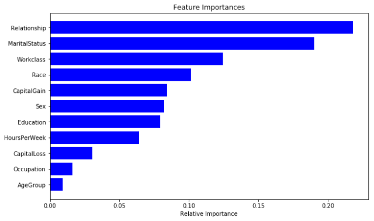

**随机森林的局限性**

除了 Bagging 树模型的一般局限性外，随机森林还有一些局限性：

*   当我们需要推断超出范围的独立变量或非独立变量，随机森林做得并不好，我们最好使用如 MARS 那样的算法。

*   随机森林算法在训练和预测时都比较慢。

*   如果需要区分的类别十分多，随机森林的表现并不会很好。

总的来说，随机森林在很多任务上一般要比提升方法的精度差，并且运行时间也更长。所以在 Kaggle 竞赛上，有很多模型都是使用的梯度提升树算法或其他优秀的提升方法。

*原文链接：https://sadanand-singh.github.io/posts/treebasedmodels/*

 *******本文为机器之心编译，***转载请联系本公众号获得授权******。***

✄------------------------------------------------

**加入机器之心（全职记者/实习生）：hr@jiqizhixin.com**

**投稿或寻求报道：editor@jiqizhixin.com**

**广告&商务合作：bd@jiqizhixin.com***