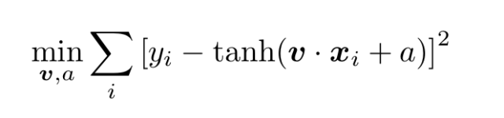

# 从概率论到多分类问题：综述贝叶斯统计分类

机器之心编译

**参与：刘晓坤、路雪**

> 概率论是人类描述宇宙的最基本的工具之一。它与统计分类尤其相关，可推导出大量重要结果，提升人类对外部世界的认知。本文作者 Peter Mills 将为大家扼要介绍概率论与贝叶斯定理，及其在统计分类上的应用，帮助大家改善与简化分类模型。

从贝叶斯学习入门统计分类，我将会提供将贝叶斯定理和概率论应用于统计分类的若干应用实例。本文还将覆盖基础概率论之外的其他重要知识，比如校准与验证（calibration and validation）。

这篇文章虽然针对初学者，但也需要你具备大学一年级和部分二年级的数学知识，尤其是线性代数，以及一些单变量和多变量微积分的知识。如果一些等式看起来令人困惑，尝试将精力集中于解决实际问题的过程。

比起只是阅读或者浏览等式，通过学习一些例子可以学到更多概率和统计分类的知识。因此，我们在文章结尾准备了几个问题供大家学习。

**概率论基础知识回顾**

扔出一个骰子，有六种可能的结果，每一种结果的概率都是 1/6。

i 代表骰子顶面的数字。由于至少会有一面朝上，则：

(1)

其中 n=6 代表所有可能结果的总数。

现在扔出两个骰子，得到 36 对结果中任意一个的联合概率为：

i 为第一个骰子的数字，j 为第二个骰子的数字。

如果忽略第二个骰子的数字，那么得到第一个骰子的某个结果（比如 6）的概率为：

(2)

这就是所谓的先验概率。

从这里开始会变得复杂起来，当给定一个骰子上的数字时，另一个骰子得到一个确定数字的概率是多少？在这个例子中，两个事件是不相关的，因此这个概率值总是 1/6，但该例子中的情况不是全部。

再考虑 21 点游戏的例子。当上一张牌值十分（10 或者 JQK）的时候，下一张牌值十分的概率是多少？

假设牌堆上只剩 34 张牌并包括 7 张十分的牌，现在当前事件发生的概率将依赖于过去事件的结果。如果上一张牌值十分，有 6/34=3/17 的机会得到值十分的牌，反之，则概率只有 7/34。

由于上一张牌值十分的概率也是 7/34，那么两个事件都发生的联合概率为：

P_i 是上一张牌值十分的概率，而 P(j|i) 是下一张牌也值十分的条件概率。

定义了先验概率、联合概率和条件概率之后，现在可以开始介绍贝叶斯定理了。注意这些定义对 i 和 j 是对称的，因此：

(3)

这是贝叶斯定理的对称形式。

**连续型概率**

向连续型概率或者概率密度的推广是很直观的。假设有一个连续型随机变量 x 服从概率分布 P(x)。那么 x 位于 x_0 和 x_0+dx 之间的概率为：

(4)

当随机变量是连续的时候，加和变成了积分，从而式 (2) 将变成：

P(x,y) 是 x 和 y 的联合概率，对所有 x 求积分就可以得到 y 的边缘概率。

在统计分类中处理的概率问题都有确定的形式。一种是标量的和离散的，另一种是向量的和连续的：

(6)

其中 i 是类别或者类别标签，而 x 是属性或者特征的向量。

通常基于贝叶斯定理的统计分类是为了估计联合概率 P(x,i) 或者条件概率 P(i|x)，类别通常通过最大似然的计算得出：

(7)

其中 c 是类别的最大似然估计，即条件概率的最大值。

> 注意对于给定的测试点，P(x) 都是相等的，因此使用联合概率或者条件概率会产生相同的结果。特征空间中的条件概率 P(x|i)，对描述每一个独立分类的分布同样重要：就是说，去掉所有其它的类别标签，只留下 i，剩下的分布就是所需要的。

只需要去掉取极限符号，就可以用式 (4) 中的概率密度的定义导出一种最古老、最复杂的统计分类方法。在测试点 x 上取一个半径，然后数出在那个半径距离内的训练样本在一个类别或者另一个类别中的数量。

这个方法的问题在于有时其封闭内不包含任何样本，有时候又特别多。因此，与其固定距离，不如固定样本数量，而去测量距离。这就是 k 最近邻分类器（k-nearest-neighbors (KNN) classifier），其中 k 是每一类别中的最近邻样本数。

**二元分类器**

二元分类器比较特别，因为很多例子都可以在特征空间上画出一个超平面来分离两个类别。超平面就是比其嵌入的空间少一个维度的子空间。对于一个二维特征空间来说，其超平面（边界）就是一条线，而在三维空间中就是一个平面。

大多数二元分类器的结果不是返回两个整数，而是一个连续的决策函数。条件概率的差值可以作为决策函数的一种方便的形式：

(8)

为了方便，我们将类别的值设为-1 和+1。

可惜，大多数统计分类器并不能返回一个能很好地估计这个量的决策函数，因此本文将大篇幅介绍校准决策函数的方法，以使其能做出很好的估计。

考虑一对形状相同的一维高斯函数，二者宽度 h 相等，期望值分别是-b 和+b。则条件概率的差异定义为：

经过参数调整后将变成以下形式：

(9)

即一对大小相同的一维高斯函数的决策函数是一个双曲正切函数。

这个例子看起来可能并不重要，然而，tanh 函数实际上在深度学习中随处可见。在统计分类中，它通常被用以校准决策函数以更好地估计条件概率。

tanh 决策函数被应用于 LIBSVM 的库，例如在我自己的机器学习库 libAGF 中就应用了这个方法。这个例子展示了，条件概率的差异 R，比起反曲函数（sigmoidal），通常更接近类别的决策边界。

考虑 logistic 回归的例子。在 logistic 回归中，决策函数为：

(10)

其中 v 是一个向量，a 是常数。

函数的参数通过最小化代价函数（如最小方差）进行拟合：

(11)

为了进行拟合或训练，需要用训练数据。训练数据即在特征空间中与类别的值 {x_i：y_i} 一一映射的有序向量对的集合。其中 yi 取值-1 或+1，即*y*ᵢ ∈ {-1, +1}。

训练数据表示真实值（「ground truth』』），可以通过多种方法获得。在一个陆地分类问题中：卫星测量地面多个频带发出的电磁辐射，并利用这些数据将地面按类型分类，比如田野、森林、城市、水域等等。

如果能用一个算法利用描述地表类型的不同参数输出陆地表面的辐射值，那么它就是可建模的。在这个例子中，得到的训练数据规模可能是极大的，虽然并不需要很精确。

或者训练数据由真实仪器测量得到，但是需要手动分类。用一个简单的 app 展示图片，每一个像素都能用鼠标点击选取颜色进行分类。

式 (10) 和 (11) 提供了完整统计分类过程的简要展示。(11) 给出了训练阶段，该阶段模型被导出。在这个例子中，模型包含了一个函数参数的小集合，属于参量统计学的范围。

与之相反，非参量统计模型如 KNN 在每一次分类中都使用所有的训练数据。对于 logistic 分类器，拟合是非线性的，这是另一种常见的机器学习技巧。

非线性优化通常假定问题不存在闭合型解析解，使用迭代的数值计算算法。这个领域很宽泛，这里我们就不深入讨论了。你们可以在问题集中查阅更多信息。

**校准**

使用连续决策函数进行二元分类的优势在于它允许一定程度上的校准（calibration），考虑以下分类器：

随着分类阈值 f_0 的改变，我们能调整分类器的敏感度，这一点在医疗诊断中尤为重要。

> 注意：在 f=f_0 的情况下函数并没有得到定义。为了修正偏差，在数值计算阶段出现该问题时应该返回一个随机值。

假定使用服从于先验类别分布 P'(i) 的数据训练一个分类器，且真实的总体分布为 P(i)。若 f 能精确地估计 R，那么我们就会发现 f_0 的值（即样本统计量）可以精确逼近至总体变量值：

为了更进一步解释，下面可以考虑混淆矩阵（confusion matrix）。混淆矩阵第 i 行、第 j 列的元素告诉我们：对于所有的测试数据，有多少测试样本的标注为第 i 个类别，但分类器返回的预测类别为 j。

通过将测试样本按数量分割，混淆矩阵可以使用一个联合概率近似表达出来。考虑如下二元分类器：

其中：

*   nt=nTN+nFP+nFN+nTP 代表测试样本的总数

*   nTN 代表真负类的数量

*   nFP 代表假正类的数量

*   nFN 代表假负类的数量

*   nTP 代表真正类的数量

完美的分类器应该返回一个对角矩阵：只有当 i=j 时，一个元素才是非零的。

根据这五个参数，你可以写下简单二元分类器所有可能的技术得分。受试者工作特性（ROC）曲线的受试者通过在分类阈值变动的情况下绘制两个此类技术得分的对比图得出。以下是命中率：

误报率：

上图绘制出 (9) 中一维 logistic 分类器的 ROC 曲线，h=1，具备不同的 b 值。该分类器被认为是对条件概率的完美估计量。

一个更复杂的校准实践可以转换决策函数，使之正确展现条件函数的不同。考虑以下公式，该公式从前两部分展示的背景材料中严格地导出：

(13)

其中δ是狄拉克δ函数：

一个校准好的（well-calibrated）条件概率估计量应该遵守该公式。

**验证**

一旦导出了一个分类，就需要在测试数据上验证它。测试数据应该和训练数据不同，否则技术得分（skill score）将过分乐观。这就是所谓的交叉验证。混淆矩阵能表示一个给定数据集的离散分类器准确率的所有细节，可以用来组成任何可能的技术得分。在这里我要介绍两个在文献中比较少见的度量方法，通过下面的介绍，你将会明白其重要性。

最基本的技术得分是精确度：

用最大似然分类算法可以最大化精确度。精确度有其局限性，可以通过以下的替代度量降低其局限性。

第一个是不确定性系数。这个度量基于香农的信息容量，所以我们首先需要定义信息熵。对于离散概率，信息熵为：

该公式告诉我们在先验分布是 P_i 的情况下，表示事件 i 需要多少信息。这个度量可以推广到多变量分布。其条件熵的表达式为：

一旦定义了这两个量，就可以写出不确定性系数（uncertainty coefficient）：

(14)

这告诉我们单个分类结果 j 中有多少信息能使我们获得真正的类别值 i。这使它成为优秀的技术得分，因为最低可能的值为 0，意味着该分类器不提供任何真正类别值的信息；最高可能的值为 1，意味着该分类器提供了真正类别值的全部信息。

对于二元分类器而言，我还推荐皮尔森相关系数（Pearson correlation coefficient）：

(15)

最后，对于返回连续决策函数（continuum decision function）而不是离散的二值分类器，我们可以通过计算 ROC 曲线下面积来度量所有可能阈值的平均技术得分（average skill）。

对于完美的判别器而言，ROC 曲线应该在单位正方形中，在 F=0 时，H=1，并且曲线一直停留在 H=1，因此该区域面积为 1。区域为 0 的分类器也是完美分类器，但是它的判定完全和正确的是相反的，没有判别值的分类器将在面积为 0.5 的对角线内。

> 注意：比如，示例曲线下的面积如何随着类别之间的距离增加而变大。

**多类别分类**

我们刚才用了大量时间讨论二元分类器。假设我们可以使用的唯一一个合适的统计分类器是二元分类器，我们如何才能将其泛化到超过两个类别的分类问题中呢？现在我们使用概率论来推导出答案。

假设我们通过多次将类别分成两个集合来设计二元分类器集合。编码矩阵 A 代表分割方式：矩阵第 i 行代表在第 j 列使用-1/+1 来分隔第 i 个二元分类器，也就是说第 j 个类别标签被转换成用于训练的-1/+1 和代表完全被排除的 0。

多类别问题的条件概率与二元分类器条件概率之间的关系如下：

(16)

重新排列之后，我们可以将其转换成线性系统：

(17)

其中，Ri 代表第 i 个二元分类器的条件概率的差分。

例如，使用「一对多」方法进行多类别分类。这里，我们比较每个类别和其他类别。编码矩阵如下（与狄拉克δ函数类似）：

(18)

前面假设二元分类器的条件概率得到正确评估。否则，我们需要给得到的多类别概率加上约束条件。忽视第二个参数，条件概率与单变量概率具有同样的属性。首先，它们的总和都应该为 1：

(19)

其次，它们都是正值：

(18) 中的等式约束「归一化约束」（normalization constraint）最容易执行。一种方法就是引入一个「松弛」变量：

(20)

其中 Qp = b 是无约束问题的线性系统，𝜆是松弛变量。

使用「一对多」方法进行多类别分类时，我们依次对比每个类别和其他所有类别，我们只需要做这些。结果是，一旦归一化约束得到执行，则所有其他类别也都会就位，该解只有正值元素。

> 注意：由于方程组是由多个因素决定的，所以它需要作为一个最小二乘问题来解决，而且还有一个注意事项：归一化必须与最小二乘最小化分开进行。

也就是说，我们首先用 (17) 构造正规方程（normal equations），然后将其置入 (20)。想了解正规方程，请查看我之后的文章《Mastering Singular Value Decomposition》。

**问题**

问题清单帮助你学习贝叶斯知识和概率论，以及得出与统计分类有关的有用公式。它们还可以帮你思考该领域的一些基础问题。

1\. 为什么 (10) 中适合 logistic 分类器的算法必须是非线性的？这有什么好处呢？ 

2\. 进行在线研究，找出适合 logistic 分类器的非线性优化算法。

3\. 导出公式 (12)（这非常难）。你认为这对于校正类别分布的重要性如何？请解释原因。

4\. 如何计算图中的 ROC 曲线？填写公式 (8) 到 (9) 之间缺少的步骤，并计算 ROC 曲线。

5\. 导出公式 (13)。

6\. 列出不定系数和相关系数（用于二元分类器）作为分类技术的度量的优势。（a）当类别标签重新排列，（b）测试数据中的类别标签分布被改变时会发生什么？以及会对结果产生什么影响？

7\. 从皮尔森相关系数的通式中得出公式 (15)。注意：这可不是无关紧要的事。

8\. 相关系数通常情况下不适用于多类别分类问题，为什么？哪种问题是例外？

9\. 从公式 (16) 中得出公式 (17)。提示：完成该推导需要 P(i|x̄) 的什么属性？

10\. (18) 中的「一对多」编码矩阵可以使用公式 (17) 的简化版。请解释原因。

11\. 写下「一对多」多类别分类器的编码矩阵。

12\. 从网络上找出一些统计分类数据或者自己创建，如通过对图像中的像素进行分类创建统计分类数据。通过对每个类别拟合多维度高斯分布来执行统计分类。

Σ代表协方差矩阵（covariance matrix），𝜇代表平均值，D 代表数据特征的维度。不要忘记评估你的结果的准确率，即将数据分为测试集和训练集。

**结论**

希望大家能够学会贝叶斯统计分类。数学模型不是封闭的系统，它们可以扩展、再利用和重新连接。

概率论和贝叶斯定理的应用和我们可以使用它们解决的问题只会被我们的想象力所限制。这里，我们展示了多种方法，使用这些工具帮助复杂的计算学习算法获取立足之地。

*原文链接：https://blog.statsbot.co/bayesian-learning-for-statistical-classification-f2362d620428*

****本文为机器之心编译，**转载请联系本公众号获得授权****。**

✄------------------------------------------------

**加入机器之心（全职记者/实习生）：hr@jiqizhixin.com**

**投稿或寻求报道：content@jiqizhixin.com**

**广告&商务合作：bd@jiqizhixin.com**