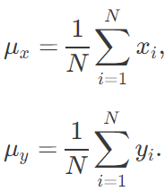

# 从遗传算法到 OpenAI 新方向：进化策略工作机制全解

选自 otoro.net

**机器之心编译**

**参与：陈韵竹、刘晓坤**

> 在这篇文章中，作者用一些简单的视觉案例解释了进化策略（Evolution Strategies）的工作方式，其中包括了简单进化策略、简单遗传算法、CMA-ES、自然进化策略以及 OpenAI 的进化策略，并给出了形象的动态图过程展示。


*「适者生存」*

我尽量简化了公式，如果读者想理解更多的细节，我提供了原始文章的链接。这是这一系列文章的第一篇，在文章中，我将展现如何将这些算法应用到诸如 MNIST、OPENAI Gym、Roboschool 和 PyBullet 等多种环境中。

**简介**

神经网络模型具有高度的表达性和灵活性。如果能找到一系列合适的模型参数，我们就可以运用神经网络去解决许多有挑战性的问题。深度学习的成功主要来源于反向传播算法，因为它可以有效地使用每个模型的参数去计算目标函数的梯度。有了这些梯度，我们就能有效地在参数空间中选取好的解，来解决我们的神经网络解决难题。

然而，也有许多反向传播算法无法应用的问题。举个例子，在强化学习（reinforcement learning）当中，我们同样可以训练一个神经网络，从而形成一系列的行动决策，去完成环境中的某些任务。然而，特别是在未来多个时间步才能实现回报的情况下，通过当下的动作去估计未来奖励信号的梯度是非常重要的。退一步说，即使我们可以计算准确的梯度，在强化学习中也有许多陷入局部最优的情况。


*「陷入局部最优」*

整个强化学习领域都致力于研究这个信度分配问题（credit-assignment problem），近年来也有很大的进展。然而，当奖励信号非常稀疏时，信度分配问题仍非常困难。在真实世界里，奖励可能是稀疏且有噪声的。有时候，我们只是得到了一个简单的奖励，比如一张年终奖金支票，而且其数目取决于我们的雇佣者，我们可能很难确切地知道为什么奖金如此之低。对于这些问题，与其依赖这些高噪声、且很有可能无意义的未来梯度信号估计，我们不如直接忽略任何的梯度信号，并尝试着使用一些黑箱优化技术（black-box optimization），例如遗传算法（genetic algorithms）或进化策略。

OpenAI 发表了一篇名为「用作强化学习的可扩展替代的进化策略」（Evolution Strategies as a Scalable Alternative to Reinforcement Learning (https://blog.openai.com/evolution-strategies/)）的论文，（机器之心文章：[深度 | 谷歌和 OpenAI 新研究：如何使用达尔文进化论辅助设计人工智能算法？](http://mp.weixin.qq.com/s?__biz=MzA3MzI4MjgzMw==&mid=2650724513&idx=3&sn=ed7053307e24a0fea9d9638f87bbb641&chksm=871b1cdfb06c95c90fec64e565a0420571ee6dd0c2dda4d93a0d16812086bd07a465a42d6f50&scene=21#wechat_redirect)）其中表示，尽管进化策略比强化学习的数据效率低，它仍然有许多优势。进化策略摈弃梯度计算的方法，从而能更有效地评价这些算法。同时，利用进化策略算法，很容易将计算分配到上千台机器中完成并行计算。研究发现，通过多次运行进化策略算法，相较于强化学习算法，使用进化策略算法发现的策略种类更多。

我想指出，即使是对那些识别机器学习模型的问题，如设计一个神经网络的架构，我们也无法直接计算梯度。尽管诸如强化学习、进化策略、遗传算法，能够被应用于搜索模型空间以及用于解决实际问题的模型参数，这篇文章只会关注一部分，即将这些算法应用到预定义的模型中，并找寻模型参数。

**什么是进化策略？**


*「二维 Rastrign 函数有许多局部最优（来源：维基百科）」*

下面的图片是转换的二维 Schaffer 函数和 Rastrigin 函数的俯视图，作为简单的工具常常被用于测试连续的黑箱优化算法。图中颜色更浅的区域代表了更大的函数值 F(x, y) 。正如你所见，这个函数中有许多的局部最优。我们的工作就是去寻找一系列的模型参数 (x, y)，使得 F(x, y) 能够尽量接近全局最大值。


进化策略的定义多种多样。我们可以将之定义为，一种为用户提供多个竞争方案以评估问题的算法。这个评估是基于一个给定解决方案的目标函数，并会返回单个拟合（fitness）值。基于当下解决方案的拟合结果，算法会接着提供下一代的竞争方案，与当前代的方案相比，这些方案更有可能会得到更好的结果。一旦提出了用户满意的最佳方案，迭代进程就会结束。

假设我们的算法命名为 EvolutionStrategy，我们可以运用如下的方式：

```py

    1.  `solver = EvolutionStrategy()`

     `*   `while True:`

     `*   `# ask the ES to give us a set of candidate solutions`

    *   `# 使用进化策略（ES）给出多个竞争方案`

    *   `solutions = solver.ask()`

     `*   `# create an array to hold the solutions.`

    *   `# 创建一个数组，保存这些方案`

    *   `fitness_list = np.zeros(solver.popsize)`

     `*   `# evaluate the fitness for each given solution.`

    *   `# 评估每个方案的拟合度`

    *   `for i in range(solver.popsize):`

    *   `fitness_list[i] = evaluate(solutions[i])`

     `*   `# give list of fitness results back to ES`

    *   `# 将拟合结果返回给 ES`

    *   `solver.tell(fitness_list)`

     `*   `# get best parameter, fitness from ES`

    *   `#　从 ES 得到最佳参数和拟合度`

    *   `best_solution, best_fitness = solver.result()`

     `*   `if best_fitness > MY_REQIRED_FITNESS:`

    *   `break``````py`` 
```

 ``通常来说，会将每一代竞争方案的规模保持为常量，但其实这并不必要。进化策略可以根据所需，形成许多竞争方案。这是因为这些由进化策略给出的方案是从一个分布函数中抽样的，而这些分布函数将会在每一代被进化策略更新。我会使用一个简单进化策略的例子解释这个抽样的过程。

**简单进化策略**

可以想象，一种最简单的进化策略，就是单纯地从正态分布（平均值为 μ，标准差为 σ）中直接抽样。在我们的二维问题中，有 μ=(μ_x,μ_y) 以及 σ = (σ_x, σ_y)。首先初始化一个μ值。在拟合度结果被评估之后，我们将平均值μ设定为本代竞争方案中最优解，并且在这个新的均值周围进行下一代解决方法的抽样。以下就是把这个算法用于之前提过的两个问题的 20 代的表现：


在上述的可视化表示中，绿色圆点表示每代分布的平均值，蓝色圆点表示被抽样的方案，而红色圆点就是当前被我们的算法找到的最佳方案。

这个简单的算法通常只对简单的问题有效。因为它贪婪的本性，算法会抛弃除了最佳方案外的一切方案，所以可能在更困难的问题中倾向于陷入局部最优。如果能够从一个表示更多种方案的概率分布中为下一代抽样，而不是只从当前代的最优解附近抽样，可能更为有利。

**简单遗传算法**

遗传算法是最古老的黑箱优化算法之一。遗传算法有许多的变形和不同程度的复杂度，但在此只阐明最简单的版本。

这个遗传算法的思想非常简单：只保留当前代最佳的前 10% 的方案，舍弃其他方案。在下一代中，抽样一个新的方案的办法是，随机选取前一代的两个方案作为双亲，并重新组合这些参数，从而形成一个新的方案。这种交叉重新组合的方法使用了掷硬币的办法，决定从双亲中的哪一方获取每一个参数。在我们的二维函数中，我们的新方案会以 50% 的几率从双亲的任何一方中继承 x 或 y。在重新组合之后，有着固定标准差的高斯噪声也会出现在每一个新的方案中。


上面的图片阐述了简单遗传算法是如何工作的。绿色圆点表示了上一代中的精英方案，蓝色圆点便是竞争方案的子代，而红色圆点是最优解。

遗传算法通过与不同种类的竞争方案保持联系的方法生成下一代，从而保证了多样性。然而，在实际过程中，大部分留存下来的精英方案倾向于逐渐收敛到局部最优。遗传算法有许多复杂的变形，比如 CoSyNe、ESP 和 NEAT，它们的想法主要是将类似的解决方案集聚到不同的种类中，从而更好地在过程中更好地保持多样性。

**协方差矩阵适应性进化策略（CMA-ES）**

简单进化策略和遗传算法的一个共同缺点是，标准差的噪声参数是固定的。有时候，我们会想探索更多可能，并增加我们的搜索空间的标准差；有时候，我们有自信正在一个最优值附近，只是想微调这个方案。基本上来说，我们希望我们的研究进程像下图这样展现：


是不是很神奇？上述图像所展示的研究策略，就运用了协方差矩阵自适应进化策略（Covariance-Matrix Adaptation Evolution Strategy , 以下简称 CMA-ES）。CMA-ES 是这样一种算法，它可得到每一代的结果，并且适应性的增加或减小下一代的搜索范围。它不只是根据 μ 和 σ 调整适应性，还会计算整个参数空间的协方差矩阵。在每一代中，CMA-ES 会提供一个多变量的正态分布的参数，用于下一代的抽样。那么，它是如何增加或减少搜索范围的呢？

在我们讨论它使用的方法之前，让我们复习一下如何评估一个协方差矩阵。这对于之后研究 CMA-ES 的方法非常重要。如果我们想评估一个大小为 N 的样本的协方差矩阵，我们可以使用下面的方程去计算协方差矩阵 C 的最大似然估计。我们首先计算了样本中 x_i 和 y_i 的平均值：



一个 2x2 的协方差矩阵 C 的元素是这样的：


当然，产生的平均值 μ_x 和 μ_y 以及协方差σ_x、σ_y 和σ_xy 只是对于实际的、原始抽样的协方差矩阵的一个估计，对我们而言并不是非常有用。

CMA-ES 聪明地修改了上述的协方差计算公式，使得它能够适应一个优化问题。我会一步一步地讲解这是怎么做的。首先，它关注的是当前代的 N_best 个最优解。为了简化，我们取 N_best 为解中的前 25%。在根据拟合度挑选出方案之后，我们仅通过当前代（g）样本的 25% 的解去计算下一代（g+1）的平均值μ^(g+1)，比如：


接下来，我们仅仅使用解中最佳的 25% 去估计下一代的协方差矩阵 C^(g+1)，但我们用了一个聪明的办法：在计算中没有使用更新的 μ^(g+1)，而使用当前代的 μ^(g)：


在有了下一代（g+1）的一系列参数μ_x, μ_y, σ_x, σ_y, 和 σ_xy 之后，我们现在可以抽样出下一代的竞争方案了。

下面是一系列视觉图像，清晰地展现了如何使用当前代（g）的结果去构建下一代的方案：


1\. 计算第 g 代中每一个竞争方案的拟合度；

2\. 挑选出第 g 代的最佳 25% 的方案，如图中紫色圆点所示；

3\. 仅仅使用这些最优解，以及当前代的平均值μ^g（图中绿色圆点），计算下一代的协方差矩阵 C^(g+1)；

4\. 使用更新的平均值μ^(g+1) 和协方差矩阵 C^(g+1) 进行新一组的竞争方案抽样。

让我们把这些策略再一次在整个搜索过程中可视化，以下是这两个问题的可视化结果：


因为 CMA-ES 可以使用最优解的信息对它的平均值和方差同时进行调整，所以它可以在最优解距离很远时扩大搜索范围，或在最优解很近的时候缩小搜索范围。为了便于理解，我对于这个简单二维问题的 CMA-ES 算法的解释进行了高度简化。如果你想了解更多的细节，建议阅读 CMA-ES 作者 Nikolaus Hansen 所准备的 CMA-ES 教程（https://arxiv.org/abs/1604.00772）。

CMA-ES 算法，作为无梯度优化算法中最流行的算法之一，已经成为许多研究者和实践者的选择。它真正唯一的缺点是，当我们需要解决的模型参数太多时，协方差的计算复杂度将变成 O(N²)，尽管现在已经将其近似成为 O(N)。在参数的数量小于 1000 时，我会选用 CMA-ES。当然，如果足够耐心，我发现此算法也可以用于上至 10000 个参数的情形。

**自然进化策略**

假设你建立了一个人造生存模拟器，并抽取一些神经网络去控制一个蚁群中每个蚂蚁的行为。如果我们使用简单进化策略，蚂蚁的行为和特性将会朝着独自受益的方向发展。因此在每一代中，我们的蚁群里将充满着只管自己死活的「精英」蚂蚁。

如果我们不使用上述只考虑自我拟合度的法则，转而使用拟合度的总和作为变量，并且在每一代中对于整个蚁群的整体幸福感做优化，结果会如何呢？好吧，你最终将会创造一个马克思主义的理想蚁国了。

迄今，上述算法的直观缺点在于，抛弃了大部分的方案，只保留了部分最佳的方案。其实，那些不好的方案保留了关于「不要做什么」的关键信息，对于更好地计算、评估下一代有重要作用。许多研究强化学习的人会对于这篇 REINFORCE 论文（http://www-anw.cs.umass.edu/~barto/courses/cs687/williams92simple.pdf）比较熟悉。在这篇 1992 年发表的论文当中，关于策略神经网络的模型参数，作者 Williams 简单概述了一种评估期望奖励的方案。同时，在论文的第六部分，文章提议使用强化学习（REINFORCE）作为进化策略的手段。随后 Policy Exploring Policy Gradients (PEPG, 2009) 和 Natural Evolution Strategies(NES,2014) 两篇文章，将本论文中使用强化学习-进化策略（REINFORCE-ES）的特例进行了扩充和发展。

在这种方案当中，我们想使用每一代中每个方案的全部信息，无论是好是坏。这样，有了这些梯度信号的评估，我们就能将全部方案在下一代中朝着更好的方向发展。既然我们需要评估梯度，我们就可以使用应用于深度学习的标准随机梯度下降算法（SGD）。当然，我们也可以使用动量随机梯度下降算法（Momentum SGD），均方根传播算法（RMSProp），或 Adam 算法进行优化。

我们需要的是对于一个抽样方案进行期望拟合度评分（fitness score）的优化。如果期望结果足够好，那么在抽样的一代中，表现最佳的方案可能表现更好，所以对期望进行优化是一个明智的方案。将某个抽样方案的期望拟合度评分最大化，其实几乎等同于将全体的拟合度评分进行最大化。

假设 z 是概率分布函数 π(z,θ) 的抽样方案向量，我们可以将目标函数 F 的期望值定义为：


其中θ表示概率分布函数的参数。举例来说，如果 π 是一个正态分布，那么 θ 就是指 μ 和 σ。对于我们的简单二维问题，每一个 z 的整体都是一个二维向量 (x,y)。

在「自然进化策略」（http://www.jmlr.org/papers/volume15/wierstra14a/wierstra14a.pdf）这篇论文中，说明了关于 θ 的 J(θ) 的梯度的来历。使用与 REINFORCE 算法中同样的对数似然法，我们可以计算 J(θ) 的梯度：


在一个大小为 N 的样本中，我们有方案 z¹, z², ...... z^N，从而可以用求和的方式估计这个梯度：


有了上述的梯度，我们可以使用一个学习率 α（比如 0.01），并且开始我们关于概率分布函数π的θ参数优化，从而使得我们的抽样方案在目标函数 F 上获得更高的拟合度评分。使用 SGD 或 Adam 算法，我们可以将 θ 在下一代进行更新：


在概率分布函数更新之后，我们可以进行新的竞争方案 z 的抽样，直到我们得到一个适当的解。

在 REINFORCE 论文的第六部分，Williams 还推导了封闭型的梯度公式 ∇_θlogπ(z^i,θ)，这主要是为了那些向量化多变量正态分布的 π(z,θ) 所设计的（即，相关参数是零）。在这种特殊情况下，θ是μ和σ向量。因此，解的每一个元素可以从一个单变量的正态分布 z_j∼N(μ_j,σ_j) 中抽样而来。

对于每一个方案 i 的θ向量中每一个独立元素，这个封闭的梯度公式∇_θ logN(z^i,θ) 可以被推导成：


为了清楚地表示，我使用角标 j 表示参数空间，而上标 i 表示群体中的每一个样本，它们不应该被混淆。对于本文的二维问题来说，z_1 = =x, z_2 = y, μ_1=μ_x, μ_2=μ_y, σ_1=σ_x, σ_2=σ_y。

我们可以把这两个公式放回到两个近似梯度公式中，对 μ 和 σ 进行清晰的更新。上文提及的论文中有着更加明晰的更新规则，包含了一个基准，并且可以引入例如 PEPG 中的对立抽样等其他技巧，而这正是我的执行方案的基础。但是，这个概念基本与其他进化策略算法相同，即，在每一代更新多变量正态分布的平均值和标准差，并从新的分布之中进行取样。下面是使用上述公式的本算法图解：


我们可以看到，这种算法可以根据需要动态地改变 σ，以继续探索或者调整解的空间。不像 CMA-ES，我们的实现中并没有相关结构，所以我们只是没有得到对角型的椭圆样本，而是得到了垂直或水平的样本，尽管理论上来说，如有需要，我们能够以计算效率为代价，推导出更新规则，从而纳入整个协方差矩阵。

我喜欢这个算法。因为它正如 CMA-ES 那样，这里的标准差可以调整，然后搜索空间可以在过程中增大或者缩小。由于并没有使用相关参数，这个算法的效率是 O(N)，所以在 CMA-ES 的表现不太好时，我会使用 PEPG。我经常在参数超过几千的时候使用 PEPG。

**OpenAI 的进化策略**

在 OpenAI 的论文中，他们使用了一种新的遗传策略，是上面提到的 REINFORCE-ES 算法的特例。特别地，σ 被定为一个常量，只有 μ 在每一代中被更新。下面就是将 σ 定义为常量之后这个策略执行的样子：


在这个简化之外，该论文同样提出了更新规则的修正，从而适用于不同工作机器的并行计算。该更新规则使用一个固定值种子预计算一大群随机数。这样的话，每个工作机器可以复制其他机器的参数，并且每个机器只需要与其他机器进行一个数字的简单通信，这个数字也就是最终的拟合度结果。如果我们想将进化策略扩展到成千上万个不同的工作机器中去，这就显得非常重要了。因为在每一代的更新中，每次都将一整个解向量传输上百万次并不太现实，但是只传输最终的拟合度结果却也许可行。这篇论文展示，通过利用亚马逊 EC2 的 1440 个机器，他们可以使用十几分钟的时间解决 Mujoco 仿真机器人步行问题。

在理论上，我以为这个并行更新规则对那些同样可以调整 σ 的原始算法也有效。但也许在实际上，他们只是想在大型并行计算实验中，把可变的部分减小到最小值。这篇富有启发性的论文同样讨论了许多其他将进化策略应用到强化学习方面的实际案例。我非常推荐大家继续深入学习。

**拟合度塑造**

上述大部分算法通常会与拟合度塑造（fitness shaping）方法相结合。下面我想说说基于等级的拟合度塑造方法（rank-based fitness shaping method）。拟合度塑造会避免当前样本中的异常值主导（上文提到的）近似梯度计算：


如果一个特殊的 F(z^m) 比当前样本中其他 F(z^i) 都大得多，梯度就可能被这个异常值所主导，从而增大了算法陷入局部最优的可能性。为了减轻这个问题，可以应用拟合度的等级转化。我们将给结果进行评级，不使用实际的拟合度函数，而是使用一个与解的等级成比例的增强拟合度函数（augmented fitness function）。下面就是原始拟合度和基于等级的拟合度的结果对比：


假设我们有一个大小为 101 的样本。我们会根据实际拟合度函数评价每一个样本，然后根据拟合度挑选解。比如，我们会给最差的方案提供一个增强拟合度函数值，-0.50，然后给第二差的方案标值为 -0.49，……，给次优方案标值 0.49，给最优方案标值 0.50。这个增强拟合度值的集合将会取代实际的拟合度值，被用于计算下一次梯度更新。从某种程度上，这有点类似于用更直接一点的办法，即对结果使用批标准化（Batch Normalization）。也有一些拟合度塑造的其他类似方法，不过它们最后都基本会给出一个类似的结论。

我发现拟合度塑造在这种强化学习中非常有用：在策略神经网络中，并具有非确定性目标函数。此外，它同时作用于这样的情况——地图是随机形成且竞争方案有随机策略；而这也是强化学习环境常常会出现的情况。对于那些确定性的、表现良好的函数而言，使用拟合度塑造塑形用处不大，而且有时会拖慢找到优化解的时间。

**MNIST 数据集**

比起基于梯度的算法，进化策略可能是一个发现更多新颖解决方案的算法。然而，进化策略在许多可计算高质量梯度的问题中，比基于梯度的算法仍然要差得多。比如，只有傻子才会用遗传算法做图像分类。但是，有时候这种人真的存在，并且有时候这种探索还是富有成效的呢！

既然所有的机器学习算法都应该在 MNIST 上进行测试，我也尝试着用这些进化策略算法，使用一个 2 层的用于分类 MNIST 的卷积网络寻找权重。当然，这只是想看看我们跟随机梯度下降相比处在什么位置。因为这个卷积网络只有约 1.1 万个参数，所以我们使用了较慢一点的 CMA-ES 算法。在 https://github.com/hardmaru/pytorch_notebooks/tree/master/mnist_es 中，可以获得相关代码和实验过程。

下面是使用了不同进化策略的结果。我们用大小为 101 的样本计算了 300 代。我们持续追踪了每一代结束时表现最好的模型参数，并且在进行 300 代计算之后在测试集中评估了这个模型。有趣的是，有时候测试集的精确度比那些得分较低的训练集模型的精确度高。


不过，我们要怀着怀疑的眼光看待这个结果，因为我们只运行了一次，而不是对 5-10 次实验取了平均。这个基于一次运行的结果表明，CMA-ES 在 MNIST 训练集任务当中表现得最好，不过 PEPG 算法也紧随其后。两者都达到了近 98% 的准确度，比 SGD 或 Adam 算法的基准线大约低 1%。也许那种动态改变协方差矩阵的能力，以及逐代改变标准差参数的能力，使得它能较好地调节权重，这比简单的 OpenAI 的 ES 算法要略胜一筹。

**自己动手**

文章提到的上述算法很有可能有开源执行方案。CMA-ES 的作者，Nikolaus Hansen, 已经在维护一个基于 numpy 的 CMA-ES 方案，这个方案还有许多附加功能。他的这个 python 方案，使我之前接触了训练循环的接口。因为这个接口非常容易使用，我使用这个接口执行了一些其他的算法，比如简单遗传算法、PEPG 算法，还有 OpenAI 的 ES 算法等等。我把它们放在了一个简单的 python 文件中，名为 es.py，并且把原始的 CMA-ES 也放了进去。这样的话，我就可以只通过改变代码中的一两行，快速比较不同的 ES 算法：

```py

    1.  `import es`

     `*   `#solver = es.SimpleGA(...)`

    *   `#solver = es.PEPG(...)`

    *   `#solver = es.OpenES(...)`

    *   `solver = es.CMAES(...)`

     `*   `while True:`

     `*   `solutions = solver.ask()`

     `*   `fitness_list = np.zeros(solver.popsize)`

     `*   `for i in range(solver.popsize):`

    *   `fitness_list[i] = evaluate(solutions[i])`

     `*   `solver.tell(fitness_list)`

     `*   `result = solver.result()`

     `*   `if result[1] > MY_REQIRED_FITNESS:`

    *   `break``````py``` 
```

 ``你可以在 Github 和 Ipython notebook 上看到使用不同进化策略的实例：https://github.com/hardmaru/estool/blob/master/simple_es_example.ipynb

在这个携带有 es.python 的 Ipython notebook ( https://github.com/hardmaru/estool/blob/master/simple_es_example.ipynb) 上，我向你展示了使用 es.py 中的进化策略，解决具有更多局部最优的十维 Ras 函数优化问题的办法。这个十维版本的问题比上述用于可视化的二维版本的问题更难。以下是上述讨论过的算法的性能比较：


在这个十维 Ras 问题中，没有一个优化方案达到了全局最优解。不过 CMA-ES 比较接近，远远超过了其他任何算法。PEPG 和 NES 在第二位，OpenAI-ES 以及遗传算法落在后面。我不得不使用退火办法减小 OpenAI-ES 的 σ 值，让它在这个任务中表现得好一些。**


*原文链接：http://blog.otoro.net/2017/10/29/visual-evolution-strategies/*


点击【阅读原文】报名参赛，美国赛区报名请点击大赛首页 US 进入美国赛区报名通道````