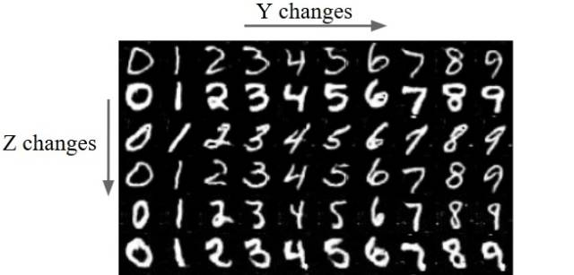
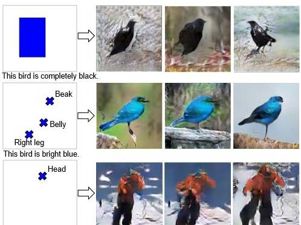
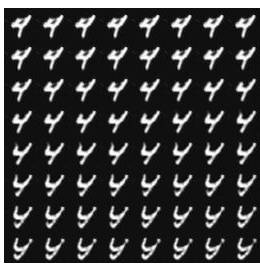

# 综述 | 一文帮你发现各种出色的 GAN 变体

 *选自 Guimperarnaublog

**作者：Guim Perarnau**

**机器之心编译**

**参与：赵华龙、黄小天**

 *> *你是否曾经想了解生成对抗网络（GAN）？也许你只是想赶时髦？或者也许只想看看这些网络在过去几年中的改进？那么在这些情况下，你没准会对这篇文章感兴趣！*

**本文不涉及的内容**

首先，你不会在本文中发现：

*   复杂的技术说明

*   代码（尽管有为那些感兴趣的人留的代码链接）

*   详尽的研究清单（点击这里进行查看 链接：http://suo.im/2opXlF）

**本文涉及的内容**

*   关于 GAN 的相关主题的总结

*   许多其他网站、帖子和文章的链接，帮助你确定专注点

**目录**

1\. 理解 GAN

2\. GAN： 一场革命

 1\. DCGAN

 2\. 改进的 DCGAN

 3\. 条件性 GAN

 4\. InfoGAN

 5\. Wasserstein GAN

3\. 结语

**理解 GAN**

如果你熟悉 GAN，可以跳过本节。

如果你正在阅读本文，很有可能已听说 GAN 大有前途。这种夸张说法合理吗？以下是 Facebook 人工智能研究室主任杨立昆（Yann LeCun）对 GAN 的看法：

> *生成对抗网络（GAN）是过去十年机器学习中最有趣的想法。*

我个人认为，GAN 有巨大的潜力，但我们还有很多事情要搞明白。

那么，什么是 GAN？接下来我将要对其做一个简要描述。如果你不熟悉并想了解更多，有很多很棒的网站有很好的解释。我个人推荐 Eric Jang（链接：http://suo.im/4y0bxU）和 Brandon Amos（链接：http://suo.im/3Ur3DW）的博客。

GAN 最初由 Ian Goodfellow 提出，它有两个网络：生成器和鉴别器。两个网络在同一时间进行训练，并在极小极大（minimax）游戏中相互博弈。生成器通过创建逼真的图像来愚弄鉴别器，而鉴别器被训练从而不被生成器所愚弄。

**训练概述**

首先，生成器生成图像。它通过从简单分布中（例如正态分布）采样向量噪声 Z，然后将该矢量上采样到图像来生成图像。在第一次迭代中，这些图像看起来很嘈杂。然后，鉴别器被给予真、假图像，并学习区分它们。生成器稍后通过反向传播步骤接收鉴别器的「反馈」，在产生图像时变得更好。最后，我们希望假图像的分布尽可能接近真实图像的分布。或者，简单来说，我们希望假图像看起来尽可能貌似真实。

值得一提的是，由于 GAN 中使用的极小极大（minimax）优化，训练有可能相当不稳定。但是，有一些技巧可以用来使得训练更鲁棒。

这就是使得生成的脸部图像逐渐变得更加真实的一个例子：

https://v.qq.com/iframe/preview.html?vid=f0387sqe6al&width=500&height=375&auto=0

*前两个阶段 GAN 的输出结果。使用的数据集是 CelebA。*

**代码**

如果您对 GAN 的基本实现感兴趣，这里是一些简短代码的链接：

*   Tensorflow（链接：http://suo.im/pLYbO）

*   Torch 和 Python（PyTorch）：[代码]（链接：http://suo.im/1LcbX5）[博客文章]（链接：http://suo.im/2V9ICE）

*   Torch 和 Lua

这些不是最先进的，但它们很好地抓住了核心思想。如果你正在寻找最佳实现来做自己的东西，请看下一节。

**GAN: 一场革命**

在这里，我将按照时间顺序大体描述一下过去几年出现的一些有关 GAN 的进展和类型。

**深度卷积 GAN（DCGAN）**

TL; DR：DCGAN 是 GAN 架构的第一大改进。它们在训练方面更稳定，并产生更高质量的采样。

[文章]（链接：https://arxiv.org/abs/1511.06434）

DCGAN 的作者着重于改进初始 GAN 的架构。我认为他们花了很长时间来做深度学习里最令人兴奋的事情：尝试很多参数！好极了！最后，它完全有了回报。除此之外，他们发现：

*   两个网络都必须进行批量归一化。

*   采用完全隐藏的连接层不是一个好主意。

*   避免池化（pooling），简单地跨越你的卷积！

*   ReLU 激活是你的朋友（几乎总是）。

DCGAN 也是相关的，因为它们已经成为实现和使用 GAN 的主要基准之一。在本文发表之后不久，Theano、Torch、Tensorflow 和 Chainer 中有容易获得的不同实现用于测试你所能想到的任何数据集。因此，如果你遇到奇怪的生成数据集，你完全可以责怪这些人。

**在以下情况，你可能想要使用 DCGAN：**

*   你想要比常规 GAN 更好的东西（或者说，总是）。常规 GAN 可以在简单的数据集上工作，但是 DCGAN 相比要好得多。

*   你正在寻找一个坚实的基准，以便与最新、最先进的 GAN 算法进行比较。

从这一点上，我将描述的所有类型的 GAN 都被假定为具有 DCGAN 架构，除非明确说明。

**改进的 DCGAN**

TL; DR：一系列改进以前 DCGAN 的技术。比如，这个改进的基准允许生成更好的高分辨率图像。

[文章]（链接：https://arxiv.org/abs/1606.03498）

与 GAN 有关的主要问题之一是它们的收敛性。它是不能保证的，而且即使优化了 DCGAN 架构，训练仍然相当不稳定。在这篇文章中，作者提出了对 GAN 训练的不同增强方案。这里是其中的一些：

*   特征匹配：他们没有使生成器尽可能地欺骗鉴别器，而是提出了一个新的目标函数。该目标要求生成器生成与实际数据的统计信息相匹配的数据。在这种情况下，鉴别器仅用于指出哪些是值得匹配的统计信息。

*   历史平均：更新参数时，还要考虑其过去值。

*   单边标签平滑：这一点很简单：只需将你的鉴别器目标输出从 [0 = 假图像，1 = 真图像] 切换到 [0 = 假图像，0.9 =真图像]。是的，这改善了训练。

*   虚拟批量归一化：通过使用在一个参考批处理中收集的统计信息，避免同一批次的数据依赖性。它在计算上的代价很大，所以仅用于生成器。

所有这些技术都可以使模型更好地生成高分辨率图像，这是 GAN 的弱点之一。作为对比，请参见原始 DCGAN 与改进的 DCGAN 在 128x128 图像上的区别：

这些应该是狗的图像。如你所见，DCGAN 无法表征它们，而使用改进的 DCGAN，你至少可以看到有一些像小狗一样的东西。这也暴露了 GAN 的另一个局限，即生成结构化的内容。

**你也许想要使用改进的 DCGAN，如果：**

*   你想要一个改进版本的 DCGAN（我确信你原本不指望：P）以生成更高分辨率的图像。

**条件性 GAN（CGAN）**

TL; DR：这些是使用额外标签信息的 GAN。这会带来更好质量的图像，并能够在一定程度上控制生成图像的外观。

[来源文章]（https://arxiv.org/abs/1411.1784）

条件性 GAN 是 GAN 框架的扩展。这里我们有条件信息 Y 来描述数据的一些方面。例如，如果我们正在处理人脸，则 Y 可以描述头发颜色或性别等属性。然后，将该属性信息插入生成器和鉴别器。

*具有面部属性信息的条件性 GAN 概述。*

条件性 GAN 有趣的原因有两个：

1\. 当你向模型输入更多信息时，GAN 学习利用它，因此能够生成更好的样本。

2\. 我们有 2 种方式来控制图像表示。没有条件性 GAN，所有的图像信息都被编码在 Z 中。有了 cGAN，当我们添加条件信息 Y 时，现在这两个 Z 和 Y 将编码不同的信息。例如，假设 Y 编码手写数的数字（从 0 到 9）。然后，Z 将编码所有不在 Y 中编码的其它变量。例如，可以是数字的样式（大小、重量、旋转等）。

*MNIST 样本上 Z 和 Y 之间的差异。Z 固定在行上，Y 在列上。Z 编码数字的样式，Y 编码数字本身。*

**最近的研究**

有很多关于这个主题的有趣文章。我重点说这其中的两个：

*   学习画什么和在哪里画 [文章]（链接：https://arxiv.org/abs/1610.02454）[代码]（链接：https://github.com/reedscot/nips2016）：在这篇文章中，作者提出了一种机制来告诉 GAN（通过文本描述），（a）你想要得到的图像内容是什么样，（b）通过边界框/地标来告知元素的位置。看看它的生成结果：

*   StackGAN [article]（链接：https://arxiv.org/abs/1612.03242）[code]（https://github.com/hanzhanggit/StackGAN）：这篇文章与前一篇相似。在这种情况下，他们专注于通过同时使用 2 个 GAN 来提高图像的质量：Stage-I 和 Stage-II。Stage-I 用于获取包含图像「一般」构想的低分辨率图像。Stage II 采用更多的细节和更高的分辨率来优化 Stage-I 的图像。据我所知，这篇在生成高质量图像里是最好的模型之一。请自己看：

**你也许想要使用条件性 GAN，如果：**

*   你有一个已标记的训练集，并希望提高生成图像的质量。

*   你想要明确控制图像的某些方面（例如，我想在这一特定位置生成这一尺寸的红鸟）。

**InfoGANs**

TL; DR：能够以无监督的方式在噪声向量 Z 的一部分中编码有意义的图像特征的 GAN。例如，对一个数字的旋转进行编码。

[文章]（https://arxiv.org/abs/1606.03657）

你有没有想过输入噪声 Z 在一个 GAN 中编码的信息是什么？它通常以非常「嘈杂」的方式编码图像不同类型的特征。例如，你可以选择 Z 向量的一个位置，并将其值从 -1 和 1 插值。这是你会在一个通过 MNIST 数字数据集训练的模型上看到的：

*对 Z 插值。左上图像的 Z 位置设置为 -1。然后，它被内插到 1（右下图像）。*

在上图中，生成的图像看上去像是数字 4 慢慢变换成「Y」（最可能的是 4 和 9 之间的混合）。所以，这就是我所指的通过嘈杂的方式编码这个信息：Z 的单一位置是图像多个特征的参数。在这种情况下，这个位置改变了数字本身（某种程度上从 4 到 9）和样式（从粗体到斜体）。然后，你无法定义 Z 的该位置的任何确切含义。

如果我们可以有一些 Z 的位置来表示唯一和受限的信息会怎么样呢，就像 cGAN 中的条件信息 Y 一样？例如，如果第一个位置是一个 0 到 9 之间的值，它来控制数字的数量，而第二个位置控制其旋转，这会怎样呢？这正是作者在文章中提出的。有意思的部分是，与 cGAN 不同，他们以无监督的方式实现了这一点，无需标签信息。

将 Z 矢量分成两部分——C 和 Z——是他们成功的原因：

*   C 对数据分布的语义特征进行编码。

*   Z 编码该分布的所有非结构噪声。

他们如何强制 C 对这些特征进行编码？他们改变了损失函数以防止 GAN 简单地忽略 C。因此，他们采用一个信息理论的规则，来确保 C 与生成器分配之间的高互信息。换句话说，如果 C 改变，生成的图像也需要改变。结果，你无法明确控制哪种类型的信息会被编码进 C，但 C 的每个位置都具有唯一的含义。看一些视觉示例：

*C 的第一个位置编码数字类别，而第二个位置编码旋转。*

但是，不使用标签信息需要付出代价。这里的限制是这些编码仅适用于相当简单的数据集，例如 MNIST 数字。此外，你仍然需要「手工制作」C 的每个位置。例如在文章中，他们需要指定 C 的第一个位置是 0 到 9 之间的整数，因此它适用于数据集的 10 个数字类别。所以，你可能会认为这不是 100％ 无监督，因为你可能需要向模型提供一些小细节。

你也许想要使用 infoGAN，如果：

*   你的数据集不是很复杂。

*   你想训练 cGAN，但你没有标签信息。

*   你希望看到数据集的主要的有意义的图像特征是什么，并且可以控制它们。

**Wasserstein GAN**

TL; DR：改变损失函数以包含 Wasserstein 距离。结果，WassGAN 具有与图像质量相关的损失函数。此外，训练稳定性也提高了，而且不依赖于架构。

[文章]（https://arxiv.org/abs/1701.07875）

GAN 一直在收敛性方面存在问题，结果是，你不知道何时停止训练。换句话说，损失函数与图像质量不相关。这是一个头痛的大问题，因为：

*   你需要不断查看样本，以了解你的模型是否在正确训练。

*   你不知道何时应该停止训练（没有收敛）。

*   你没有一个量化数值告诉你调整参数的效果如何。

例如，看这两个能够完美生成 MNIST 样本的 DCGAN 的毫无信息量的损失函数图：

*仅通过看这个图你知道什么时候停止训练吗？我也不行。*

这个可解释性问题是 Wasserstein GAN 旨在解决的问题之一。怎么样？GAN 可被解释以最小化 Jensen-Shannon 发散，如果真和假的分布不重叠（通常是这种情况），则它为 0。所以，作者使用了 Wasserstein 距离，而不是最小化 JS 发散，它描述了从一个分布到另一个分布的「点」之间的距离。这大概是其主要思想，但如果你想了解更多，我强烈建议你访问这一链接（http://suo.im/1wmf2t）进行更深入的分析或阅读文章本身。

因此，WassGAN 具有与图像质量相关的损失函数并能够实现收敛。它也更加稳定，也就意味着它不依赖于架构。例如，即使你去掉批处理归一化或尝试奇怪的架构，它也能很好地工作。

*这是 WassGAN 损失函数的图。损失越低，图像质量越高。整齐！*

**你也许想要使用 Wasserstein GAN，如果：**

*   你正在寻找具有最高训练稳定性的最先进的 GAN。

*   你想要一个有信息量的可解释的损失函数。

**结语**

所以，现在就是这些！我知道还有更有趣的研究去评论，但在这篇文章中，我决定专注于一个有限的集合。只是举几个例子，下面是一些我没有评论的文章的简短列表，也许你想去看看：

*   GAN 应用于视频：https://github.com/SKTBrain/DiscoGAN

*   图像完成：https://arxiv.org/abs/1609.04802

*   GAN + 可变性 AutoEncoder 混合：https://github.com/junyanz/iGAN

*   向 GAN 添加一个编码器以重建样本：https://phillipi.github.io/pix2pix/

*   图像到图像的翻译：https://ishmaelbelghazi.github.io/ALI/

*   交互式图像生成：https://arxiv.org/abs/1512.09300

*   使用 GAN 增加图像质量：https://bamos.github.io/2016/08/09/deep-completion/

*   将鞋子变成等价的包（DiscoGAN）：http://web.mit.edu/vondrick/tinyvideo/

更广泛的研究列表，请查看此链接：https://github.com/zhangqianhui/AdversarialNetsPapers。

此外，在这个 repo（https://github.com/wiseodd/generative-models）中，你会发现 Tensorflow 和 Torch 中的各种 GAN 实现。 

最后，机器之心所关注的 GAN 文章列表：

*   [Wasserstein GAN 的 TensorFlow 实现](http://mp.weixin.qq.com/s?__biz=MzA3MzI4MjgzMw==&mid=2650723201&idx=3&sn=204b20981a52c8e190624e0c0e445857&chksm=871b17ffb06c9ee9b4fc57ea05762dde2f54229f7510c1f60deb7b6707ec3647066aa192a0a5&scene=21#wechat_redirect)

*   [FAIR 提出常见 GAN 训练方法的替代方法：WGAN](http://mp.weixin.qq.com/s?__biz=MzA3MzI4MjgzMw==&mid=2650722818&idx=3&sn=03cb67c8a8ee7f83a7448b518f4336ab&chksm=871b167cb06c9f6a018a99b79d8b2764b207be2b4d03f132151d99124edf2aff4c116a9dc98d&scene=21#wechat_redirect)

*   [最小二乘 GAN：比常规 GAN 更稳定，比 WGAN 收敛更迅速](http://mp.weixin.qq.com/s?__biz=MzA3MzI4MjgzMw==&mid=2650723893&idx=5&sn=bed0e585bba8ad01824a8d80603dbea6&chksm=871b124bb06c9b5d5f3b290ad02fb43ba02bdf7cbd04d53cfe839213ad7e57c0426555500e24&scene=21#wechat_redirect)

*   [新论文提出用 GAN 构建不同年龄时的样貌：可让你提前看到年老时的模样](http://mp.weixin.qq.com/s?__biz=MzA3MzI4MjgzMw==&mid=2650723678&idx=5&sn=c9d8114359cf3597e45cb102154b918e&chksm=871b1120b06c9836367e8f32177b59736f304d055b9ffdb2bb2c5d98398b555bf0461c99d336&scene=21#wechat_redirect)

*   [谷歌新论文提出适应性生成对抗网络 AdaGAN：增强生成模型](http://mp.weixin.qq.com/s?__biz=MzA3MzI4MjgzMw==&mid=2650722239&idx=4&sn=3544eee8b2bf5eeab1ae852ba9fde64c&chksm=871b0bc1b06c82d74fa57cbcb0d9f6178a78d474c6bfe93db174dd0c8f580272e398006b0f14&scene=21#wechat_redirect)

*   [GAN 之父 NIPS 2016 演讲现场直击：全方位解读生成对抗网络的原理及未来](http://mp.weixin.qq.com/s?__biz=MzA3MzI4MjgzMw==&mid=2650721284&idx=1&sn=427e7f45c8253ab22a3960978409f5d1&chksm=871b087ab06c816c424ad03810be3e1b3aa9d6e99a5f325047796f110d178a07736f667d1a10&scene=21#wechat_redirect)

*   [直观理解 GAN 背后的原理：以人脸图像生成为例](http://mp.weixin.qq.com/s?__biz=MzA3MzI4MjgzMw==&mid=2650723168&idx=2&sn=68b21b815688443a0dd7caa115cc13fa&chksm=871b171eb06c9e085ab0f2223e6bab04d2eecfa430ca071b19d5c377d909d46724269126dbf3&scene=21#wechat_redirect)

*   [学界 | Yann LeCun 最新论文：基于能量的生成对抗网络（附论文）](http://mp.weixin.qq.com/s?__biz=MzA3MzI4MjgzMw==&mid=2650719118&idx=3&sn=4565fb14db41208571b808956a39e310&scene=21#wechat_redirect)

*原文地址：http://guimperarnau.com/blog/2017/03/Fantastic-GANs-and-where-to-find-them*

******本文为机器之心编译，***转载请联系本公众号获得授权******。***

✄------------------------------------------------

**加入机器之心（全职记者/实习生）：hr@jiqizhixin.com**

**投稿或寻求报道：editor@jiqizhixin.com**

**广告&商务合作：bd@jiqizhixin.com****