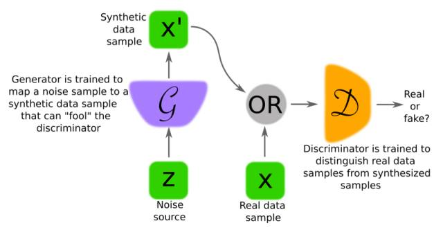

# 生成对抗网络综述：从架构到训练技巧，看这篇论文就够了

选自 arXiv

**机器之心编译**

**参与：路雪、刘晓坤、**蒋思源****

> 近日，帝国理工学院、蒙特利尔大学等研究机构共同发表论文并梳理了生成对抗网络，该论文从最基本的 GAN 架构及其变体到训练过程和训练技巧全面概述了生成对抗网络的概念、问题和解决方案。机器之心简要介绍了该论文。

原 GAN（Goodfellow et al., 2014）的完整理论推导与 TensorFlow 实现请查看机器之心的 GitHub 项目与文章：[GAN 完整理论推导与实现](https://mp.weixin.qq.com/s?__biz=MzA3MzI4MjgzMw==&mid=2650731540&idx=1&sn=193457603fe11b89f3d298ac1799b9fd&chksm=871b306ab06cb97c502af9552657b8e73f1f5286bc4cc71b021f64604fd53dae3f026bc9ac69&scene=21#wechat_redirect)。下面，我们将为各位读者介绍该综述论文。

论文地址：https://arxiv.org/pdf/1710.07035.pdf

生成对抗网络（GAN）提供了一种不需要大量标注训练数据就能学习深度表征的方式。它们通过反向传播算法分别更新两个网络以执行竞争性学习而达到训练目的。GAN 学习的表征可用于多种应用，包括图像合成、语义图像编辑、风格迁移、图像超分辨率技术和分类。这篇论文的目的是为信号处理社区做一个 GAN 的综述。除了介绍训练和构建 GAN 的不同方法以外，我们还讨论了其理论和应用中尚存在的挑战。

**1\. 引言**

生成器和判别器通常由包含卷积和（或）全连接层的多层网络构成。生成器和判别器必须是可微的，但并不必要是直接可逆的（理论分析上必须可逆）。如果生成网络由某些表征空间映射得到，即映射一个隐空间到数据空间中（我们需要把注意力集中在图像上），用更加形式化的表示为：G : G(z) → R^|x|，其中 z ∈ R^|z|是隐空间中的一个样本，x ∈ R^|x|是一张图像，| · |表示维数。

原始 GAN 的判别网络 D 可以看成是将图像数据映射到（该图像是来自真实数据分布，而不是生成器分布）判别概率的函数 D : D(x) → (0, 1)。对于一个固定的生成器 G，判别器 D 可能被训练用于分辨图像是来自训练数据（真，概率接近 1）还是来自生成器（假，概率接近 0）。若判别器已经是最好的，它将变得无法被欺骗，而这时生成器 G 需要继续训练以降低判别器的准确率。如果生成器分布足以完美匹配真实数据分布，那么判别器将会被最大地迷惑而对所有输入给出 0.5 的概率值。在实践中，判别器可能无法训练到理想状态，我们将在第 4 节更深入地探索训练过程。

*图 1\. 这张图分别展示了 GAN 中的判别器 D 和生成器 G 的训练流程。通常利用神经网络实现，但实际上它们可以用任意形式的（将数据从一个空间映射到另一个的）可微系统实现。*

**3.GAN 架构**

*图 2\. 在 GAN 的训练过程中，生成器可以生成一个样本分布 p_g（x）以匹配真实数据 p_data（x）。通过适当参数化并训练 GAN，这些分布将变得难以区分。GAN 的表征分布可以通过生成网络和判别网络的学习参数（权重）而构建。*

**A. 全连接 GAN**

首个 GAN 架构在生成器与鉴别器上皆使用全连接神经网络。这种架构类型被应用于相对简单的图像数据库，即 MNIST（手写数字）、CIFAR-10（自然图像）和多伦多人脸数据集（TFD）。

**B. 卷积 GAN**

因为 CNN 非常适合处理图像数据，所以从全连接到卷积神经网络是一个自然的扩展。早期在 CIFAR-10 上进行的试验表明，用监督学习相同水平和表征能力的 CNN 训练生成器和鉴别器网络会更加困难。

通过使用多尺度分解生成过程的形式，拉普拉斯金字塔形对抗网络（LAPGAN）[13] 为这一问题贡献了一个方案：真值图像本身被分解成拉普拉斯金字塔（Laplacian pyramid），并且条件性卷积 GAN 被训练在给定上一层的情况下生成每一层。

此外，Radford et al.[5]（为「深度卷积 GAN」）提出了一种称之为 DCGAN 的网络架构族，它允许训练一对深度卷积生成器和判别器网络。DCGAN 在训练中使用带步长的卷积（strided convolution）和小步长卷积（fractionally-strided convolution），并在训练中学习空间下采样和上采样算子。这些算子处理采样率和位置的变化，这是图像空间到低维潜在空间、从图像空间到判别器映射的重要要求。Section IV-B 将详细介绍 DCGAN 架构和训练。

作为 2D 图像合成的扩展，Wu et al. [14] 展示了使用体积卷积（volumetric convolution）合成 3D 数据样本的 GAN。Wu et al. [14] 合成包括新物体，如椅子、桌子和汽车；此外，他们还展示了一种从 2D 图像映射到 3D 图像的方法。

**C. 条件 GAN**

Mirza 等人通过将生成器和判别器改造成条件类（class-conditional）而将（2D）GAN 框架扩展成条件设置。条件 GNN 的优势在于可以对多形式的数据生成提供更好的表征。条件 GAN 和 InfoGAN[16] 是平行的，它可以将噪声源分解为不可压缩源和一个「隐编码」（latent code），并可以通过最大化隐编码和生成器之间的交互信息而发现变化的隐藏因子。这个隐编码可用于在完全无监督的数据中发现目标类，即使这个隐编码是不明确的。由 InfoGAN 学到的表征看起来像是具备语义特征的，可以处理图貌中的复杂纠缠因素（包括姿势变化、光照和面部图像的情绪内容）。

**D.GAN 推断模型**

GAN 的初始形式无法将给定的输入 x 映射为隐空间中的向量（在 GAN 的文献中，这通常被称为一种推断机制）。人们提出了几种反转预训练 GAN 的生成器的技术，比如各自独立提出的对抗性学习推断（Adversarially Learned Inference，ALI）和双向 GAN（Bidirectional GANs），它们能提供简单而有效的扩展，通过加入一个推断网络，使判别器共同测试数据空间和隐空间。

这种形式下的生成器由两个网络组成：即编码器（推断网络）和解码器。它们同时被训练用于欺骗判别器。而判别器将接收到一个向量对（x,z）（见图 4 所示），并决定其是否包含一个真实图像以及其编码，或者一个生成的图像样本以及相关的生成器的隐空间输入。

理想情况下，在一个编码-解码模型中的输出（作为输入的重构）应该和输入相似。通常情况下，使用 ALI/BiGAN 合成的重构数据样本的保真度都很低。通过额外添加（数据样本和它们的重构的）对抗代价函数可以提高样本的保真度。

**E. 对抗自编码器（AAE）**

自编码器是由编码器和解码器组成的网络，学习将数据映射到内部隐表征中，再映射出来，即从数据空间中学习将图像（或其它）通过编码映射到隐空间中，再通过解码从隐空间映射回数据空间。这两个映射形成了一种重构运算，而这两个映射将被训练直到重构图像尽可能的接近初始图像。

*图 3\. 图左，条件 GAN（Conditional GAN），由 Mirza 等人提出，可以根据条件（class-condition）合成图像；判别器根据条件类判定图像为真或假。图右，InfoGAN，其判别器还可以估计类别标签。*

*图 4\. ALI/BiGAN 的结构，由三个网络构成。其中一个是判别器，还有一个网络将噪声向量从隐空间映射到图像空间（解码器，以 G 表示），最后一个网络（编码器，以 E 表示）将真实图像从图像空间映射到隐空间。*

**4\. 训练 GAN**

**A. 引言**

GAN 的训练目标是获得令判别器分类准确率最大化的参数，以及获得最大化欺骗判别器的生成器参数。训练过程已在图 5 中总结。

训练的代价由一个价值函数 V(G,D) 评估，其包含了生成器和判别器的参数。

训练过程可表示如下：

训练过程中，其中一个模型的参数被更新，同时另一个模型的参数固定不变。Goodfellow 等人证明对于一个固定的生成器存在唯一的最优判别器 D∗ (x) = p_data(x) /(p_data(x)+p_g(x))。他们还证明了生成器 G 在 pg(x) = pdata(x) 的时候是最优的，这等价于最优判别器对所有的样本 x 都给出 0.5 的概率值。换个说法就是当判别器 D 被最大化迷惑而无法区分真假样本的时候，生成器 G 是最优的。

理想情况下，判别器将被训练到对当前生成器为最优；然后生成器再次被更新。然而实际情况下，判别器可能无法训练到最优，因此常用的策略是，判别器只会经过少量的迭代训练，而且生成器和判别器同步更新。此外，生成器通常使用一种交替的、非饱和的训练规范，即使用 max_G log D(G(z))，而不使用 min_G log(1 − D(G(z)))。

尽管理论上存在唯一的解，GAN 的训练还是存在着挑战，经常出现不稳定的状况，原因有好几个。一种提升 GAN 训练效率的办法是追踪训练过程中可能遇到的经验症状，这包括：

*   两个模型（生成器、判别器）无法收敛 [5]；

*   生成器「崩溃」，即用不同的输入生成相似的样本 [25]；

*   判别器的损失很快收敛为零，从而没有足够强的梯度路径可以继续更新生成器。

*图 5\. GAN 训练的主要循环。新型数据样本 x' 可以通过传递随机样本得出，z 为抽取的随机噪声并作为生成器网络的输入。生成器更新一次之前，判别器可能需要更新 k 次。*

**B. 训练技巧**

用于图像生成的 GAN 训练的第一个重大改进是 Radford et al. [5] 提出的 DCGAN 架构。该研究是计算机视觉领域之前使用的 CNN 架构的进一步探索，并且带来了一系列构建和训练生成器、判别器的准则。在 Section III-B 中，我们提到带步长的卷积和小步长卷积的重要性 [27]，它们是架构设计的重要组件。这允许生成器和判别器学习优秀的上采样和下采样操作，这些操作可能提升图像合成的质量。具体到训练中，研究者推荐在两种网络中使用批量归一化 [28]，以稳定深层模型中的训练。另一个建议是最小化用于提升深层模型训练可行性的全连接层的数量。最后，Radford et al. [5] 认为在判别器中间层使用 leaky ReLU 激活函数的性能优于使用常规的 ReLU 函数。

Salimans et al. [25] 进一步提出稳定 GAN 训练的启发式方法。首先，特征匹配稍稍改变生成器的目标，以增加可获取的信息量。具体来说，判别器仍然需要训练来区分真样本和假样本，但是生成器的训练目标是匹配判别器中假样本和真样本的期望中间激活值（特征）。第二，小批量判别（mini-batch discrimination）向判别器额外添加输入，该特征对小批量中的给定样本和其他样本的距离进行编码。目的在于防止模式崩溃（mode collapse），因为判别器能够轻易判断生成器是否生成同样的输出。

第三个启发式技巧是启发式平均（heuristic averaging），如果网络参数偏离之前值的运行平均值，则会受到惩罚，这有助于收敛到平衡态。第四个技巧是虚拟批量归一化（virtual batch normalization），它可减少小批量内样本对其他样本的依赖性，方法是使用训练开始就确定的固定参考小批量（reference mini-batch）样本计算归一化的批量统计（batch statistics）。

最后，单边标签平滑（one-sided label smoothing）将判别器的目标从 1 替换为 0.9，使判别器的分类边界变得平滑，从而阻止判别器过于自信，为生成器提供较差的梯度。Sønderby et al. [29] 改进了这个想法，他在将样本馈送至判别器之前向样本中添加噪声来挑战判别器。Sønderby et al. [29] 认为单边标签平滑偏向最佳判别器，而他们的技术——样本噪声（instance noise）使真样本和假样本的流形（manifold）更加接近，同时防止判别器轻易找到完全分离真假样本的判别器边界。该技巧在实践中可以通过向合成图像和真实图像中添加高斯噪声来实现，使标准差随着时间逐渐减小。后来 Arjovsky et al. [26] 把向数据样本添加噪声来稳定训练的过程形式化。

**C. 成本函数的修正**

1）GAN 成本函数的泛化：Nowozin et al. [30] 认为 GAN 训练可以泛化至不仅最小化 JS 散度（Jensen-Shannon divergence），同时还最小化 f 散度的估计值。这些可以称为 f-GAN。

2）防止梯度消失的其他成本函数：Arjovsky et al. [32] 提出 WGAN，一种带有其他成本函数的 GAN 网络，该函数从近似 Wasserstein 距离中推导出。

**7\. 讨论**

**A. 开放性问题**

1）Mode Collapse：如第四章所述，GAN 的普遍问题是生成器崩溃（generator collapsing），只能输出一小类类似样本（部分崩溃），最坏的情况是仅能生成一个简单样本（完全崩溃）[26], [48]。

2）训练不稳定——鞍点：在 GAN 中，损失函数的海森矩阵（Hessian）变得非正定。因此，二阶矩阵非正定只能找到一个鞍点而不是局部极小值。

**B. 结论**

对 GAN 的研究兴趣不只是因为它们可以从潜在空间和数据空间之间的映射和逆映射中学习深度、高度非线性的映射，还因为它们可以利用大量非标注图像数据，这种操作类似深度表征学习。在 GAN 训练中，存在很多理论和算法的发展机会。有了深度网络的帮助，新应用存在大量机会。

****本文为机器之心编译，**转载请联系本公众号获得授权****。**

✄------------------------------------------------

**加入机器之心（全职记者/实习生）：hr@jiqizhixin.com**

**投稿或寻求报道：content@jiqizhixin.com**

**广告&商务合作：bd@jiqizhixin.com**

**点击「阅读原文」，参与「PaperWeekly」论文讨论**