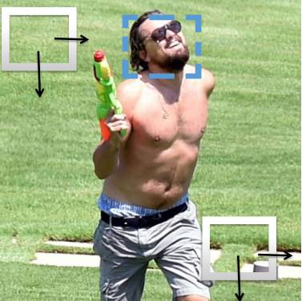
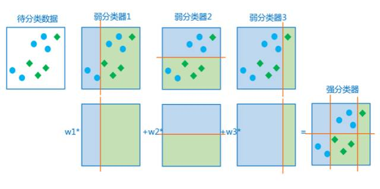
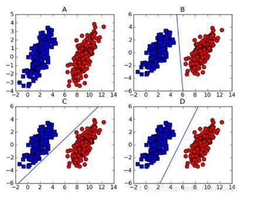
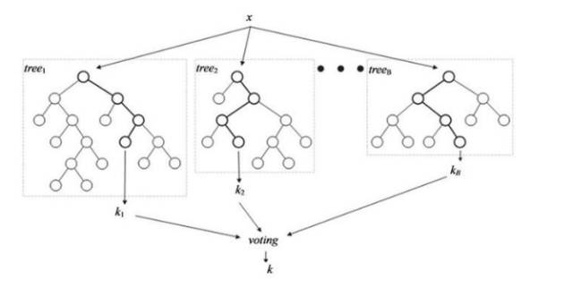
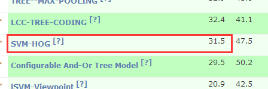
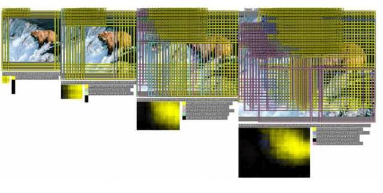

# 干货 | 物体检测算法全概述：从传统检测方法到深度神经网络框架

机器之心转载

**公众号：阅面科技（ID：readsense)**

**作者：童志军**

> *物体检测一向是比较热门的研究方向，它经历了传统的人工设计特征+浅层分类器的框架，到基于大数据和深度神经网络的 End-To-End 的物体检测框架的发展，然而许多人其实并未系统的了解过物体检测算法的整个发展内容。正因如此，本次阅面科技邀请了资深研究员童志军从传统检测算法核心、深度神经网络框架、检测技术难点等方面来进行干货分享。*
> 
> *童志军：阅面科技资深研究员，2012 年毕业于东南大学获硕士学位，先后加入虹软、阿里巴巴从事图像算法和机器学习工作，曾参与淘宝“拍立淘图像搜索”、“3D 试衣”等产品研发，目前主要专注于深度学习的视觉检测分类和移动端深度学习模型压缩技术。*

在传统视觉领域，物体检测是一个非常热门的研究方向。受 70 年代落后的技术条件和有限应用场景的影响，物体检测直到上个世纪 90 年代才开始逐渐走入正轨。物体检测对于人眼来说并不困难，通过对图片中不同颜色、纹理、边缘模块的感知很容易定位出目标物体，但对于计算机来说，面对的是 RGB 像素矩阵，很难从图像中直接得到狗和猫这样的抽象概念并定位其位置，再加上物体姿态、光照和复杂背景混杂在一起，使得物体检测更加困难。

检测算法里面通常包含三个部分，第一个是检测窗口的选择， 第二个是特征的设计，第三个是分类器的设计。随着 2001 年 Viola Jones 提出基于 Adaboost 的人脸检测方法以来，物体检测算法经历了传统的人工设计特征+浅层分类器的框架，到基于大数据和深度神经网络的 End-To-End 的物体检测框架，物体检测一步步变得愈加成熟。 

**传统检测算法**

在 2001 年，一篇基于 Haar+Adaboost 的检测方法在学术界和工业界引起了非常大的轰动，它第一次把检测做到实时，并且在当时的技术限制下，检测性能也做的非常亮眼。纵观 2012 年之前的物体检测算法，可以归结为三个方面的持续优化：

**检测窗口的选择**

拿人脸检测举例，当给出一张图片时，我们需要框出人脸的位置以及人脸的大小，那么最简单的方法就是暴力搜索候选框，把图像中所有可能出现框的位置从左往右、从上往下遍历一次。并且通过缩放一组图片尺寸，得到图像金字塔来进行多尺度搜索。

但是这种方法往往计算量很大并且效率不高，在实际应用中并不可取。人脸具有很强的先验知识，比如人脸肤色 YCbCr 空间呈现很紧凑的高斯分布，通过肤色检测可以去除很大一部分候选区域，仅留下极小部分的区域作为人脸检测搜索范围。由于肤色的提取非常快，只是利用一些颜色分布的信息，把每个像素判断一下，整体速度提升很多。但肤色提取只是用到简单的颜色先验，如果遇到和肤色很像的，比如黄色的桌子，很有可能被误判成人脸的候选检测区域。

进一步提高精度衍生出如 Selective Search 或 EdgeBox 等 proposal 提取的方法，基于颜色聚类、边缘聚类的方法来快速把不是所需物体的区域给去除，相对于肤色提取精度更高，极大地减少了后续特征提取和分类计算的时间消耗。

**特征的设计**

在传统的检测中，Haar 由于提取速度快，能够表达物体多种边缘变化信息，并且可以利用积分图快速计算，得到广泛的应用；LBP 更多的表达物体的纹理信息，对均匀变化的光照有很好的地适应性；HOG 通过对物体边缘使用直方图统计来进行编码，特征表达能力更强，在物体检测、跟踪、识别都有广泛的应用。传统特征设计往往需要研究人员经验驱动，更新周期往往较长，通过对不同的特征进行组合调优，从不同维度描述物体可以进一步提升检测精度，如 ACF 检测，组合了 20 种不同的特征表达。

**分类器的设计**

传统的分类器包含 Adaboost、SVM、Decision Tree 等。

**Adaboost**

一个弱分类器往往判断精度不高，通过 Adaboost 自适应地挑选分类精度高的弱分类器并将它们加权起来，从而提升检测性能。比如说，人脸检测中一个候选窗口需要判断是否为人脸，其中一些弱分类器为颜色直方图分量（如红黄蓝三种颜色），如果黄色分量大于 100，那我就认为这块可能是人脸的候选区域，这就是个非常简单的弱分类器。可是，单个这么弱的分类器判断是很不准的，那么我们就需要引入另外一些分量做辅助。比如再引入红色分量大于 150，将几个条件叠加起来，就组成了一个比较强的分类器。

这里弱分类器的设计往往就是确定颜色判断的阈值，为什么会选择 100 呢？其实这是我们需要学习得到的阈值，学习得到，当阈值设定为 100 时，分类的精度是最高的。另外，为什么要选择红黄蓝三种颜色？同样，因为它们分类的精度更高。通过不断进行特征挑选并学习弱分类器，最终组合提升为 Adaboost 强分类器。

**SVM 分类器**

SVM 通过最大化分类间隔得到分类平面的支持向量，在线性可分的小数据集上有不错的分类精度，另外通过引入核函数将低维映射到高维，从而线性可分，在检测场景被广泛使用。

比如线性 SVM 分类器就是一些支持向量，将物体表示为一些特征向量，实际当中学到的分类器就是一些系数向量，这些系数向量和特征向量做一个加权的话可以得到分类分数，对分数进行阈值判断，就可以判断是否是某一类。

**Decision Tree**

决策树是一种树形结构，其中每个内部节点表示一个属性上的测试，每个分支代表一个测试输出，每个叶子节点代表一种类别。

用从树根到树叶的二叉树来举个简单例子。假如从树根进来有个二分类，我们需要区分它是人脸或者是非人脸，左边是非人脸，右边是人脸。当我进入第一个二叉树分类器节点判断，如果是非人脸的话直接输出结果，如果是人脸候选的话进入下一层再做进一步的分类。通过学习每个节点的分类器来构造决策树，最终形成一个强分类器。

**Random Forest**

通过对决策树进行 Ensemble，组合成随机森林更好的提高分类或者回归精度。假设刚刚提到的决策树是一棵树，那么现在我想学十棵树，每个树采用不同的输入或者分类准则，从不同维度来做分类。以十棵树的分类结果进行投票，8 个树认为这个框是人脸，2 个认为是非人脸，最终输出为人脸。投票策略可以更好地降低分类误差，在实际场景中得到广泛应用。

**从传统方法到深度学习**

众所周知，检测算法的演变分为两个阶段，一个就是基于传统特征的解决方法，另外一个就是深度学习算法。在 2013 年之前传统方法还算是主流，大家都是基于传统的 feature 优化检测方法。然而，在 2013 年之后，,整个学术界和工业界都逐渐利用深度学习来做检测。

实际上，这是由于深度学习在分类上超越了很多传统的方法，在 2012 年的 ImageNet 上，Hinton 两个学生就曾用 ConvNet 获得了冠军。与传统方法相比，深度学习在分类精度上提高很多。起先，深度学习只是在分类上有非常明显的提升，之后也带动了检测这一块。从物体分类到物体检测，利用了深度学习比较强的 feature 的表达能力，可以进一步提高检测的精度。

检测方面有两个比较典型的公开测试集，PASCAL VOC 和 COCO。从这两个测试集上可以看到传统的检测方法和深度学习的检测方法在精度上的差别非常的大。传统的物体检测方法因为其特征比较弱，所以每类都需要训练一个检测器。每个检测器都是针对特定的物体训练，如果有 20 类的话，就需要跑 20 次前向预测，相当于单次检测的 20 倍，作为一个 2C 端产品，时间消耗和精度性能使得传统方法检测的应用场景不是很多。

目前最新的检测都是基于深度学习的方法，最开始的 RCNN，它算是深度学习应用到检测里的鼻祖，从起初它平均 49.6 的精度记录，到如今已然提升了快 40 个点。而在传统的方法中 SVM-HOG，它的精度才到了 31.5，和深度学习相比低了很多。

值得注意的是，传统检测方法随着数据量增大检测性能会趋于饱和，也就是说随着数据量的增大，检测性能会逐渐提高，但到了一定程度之后数据量的提高带来的性能增益非常少。而深度学习的方法则不同，当符合实际场景分布的数据越来越多时，其检测性能会越来越好。

**深度学习的物体检测**

深度学习早期的物体检测，大都使用滑动窗口的方式进行窗口提取，这种方式本质是穷举法 R-CNN。后来提出 Selective Search 等 Proposal 窗口提取算法，对于给定的图像，不需要再使用一个滑动窗口进行图像扫描，而是采用某种方式“提取”出一些候选窗口，在获得对待检测目标可接受的召回率的前提下，候选窗口的数量可以控制在几千个或者几百个。

之后又出现了 SPP，其主要思想是去掉了原始图像上的 crop/warp 等操作，换成了在卷积特征上的空间金字塔池化层。那么为什么要引入 SPP 层呢？其实主要原因是 CNN 的全连接层要求输入图片是大小一致的，而实际中的输入图片往往大小不一，如果直接缩放到同一尺寸，很可能有的物体会充满整个图片，而有的物体可能只能占到图片的一角。SPP 对整图提取固定维度的特征，首先把图片均分成 4 份，每份提取相同维度的特征，再把图片均分为 16 份，以此类推。可以看出，无论图片大小如何，提取出来的维度数据都是一致的，这样就可以统一送至全连接层。

实际上，尽管 R-CNN 和 SPP 在检测方面有了较大的进步，但是其带来的重复计算问题让人头疼，而 Fast R-CNN 的出现正是为了解决这些问题。 Fast R-CNN 使用一个简化的 SPP 层 —— RoI（Region of Interesting） Pooling 层，其操作与 SPP 类似，同时它的训练和测试是不再分多步，不再需要额外的硬盘来存储中间层的特征，梯度也能够通过 RoI Pooling 层直接传播。Fast R-CNN 还使用 SVD 分解全连接层的参数矩阵，压缩为两个规模小很多的全连接层。

Fast R-CNN 使用 Selective Search 来进行区域提取，速度依然不够快。Faster R-CNN 则直接利用 RPN（Region Proposal Networks)网络来计算候选框。RPN 以一张任意大小的图片为输入，输出一批矩形区域，每个区域对应一个目标分数和位置信息。从 R-CNN 到 Faster R-CNN，这是一个化零为整的过程，其之所以能够成功，一方面得益于 CNN 强大的非线性建模能力，能够学习出契合各种不同子任务的特征，另一方面也是因为人们认识和思考检测问题的角度在不断发生改变，打破旧有滑动窗口的框架，将检测看成一个回归问题，不同任务之间的耦合。

R-CNN 到 Faster R-CNN 都是一些通用的检测器。深度学习中还有许多特定物体检测的方法，如 Cascade CNN 等，随着技术的发展，深度学习的检测越来越成熟。

**难点**

尽管深度学习已经使得检测性能提升了一大截，但其实依旧存在许多难点。主要难点就是复杂光照情况（过暗、过曝）以及非刚性物体形变（如人体、手势的各种姿态）、低分辨率和模糊图片的检测场景。

众所周知，目前大多数检测算法还是静态图的检测，而海量视频数据已然出现了，未来检测数据支持的类别肯定越来越多，涵盖的面越来越广，检测技术在这方面也需要继续发展。基于视频时序连续性的物体检测和像素级的实例检测将是未来重点突破的方向。

******本文为机器之心转载，***转载请联系原公众号获得授权******。***

✄------------------------------------------------

**加入机器之心（全职记者/实习生）：hr@jiqizhixin.com**

**投稿或寻求报道：editor@jiqizhixin.com**

**广告&商务合作：bd@jiqizhixin.com**