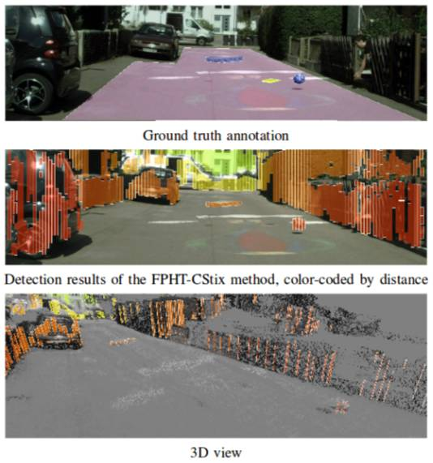
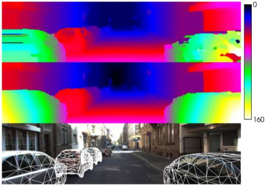

# 重磅 | 自动驾驶计算机视觉研究综述：难题、数据集与前沿成果（附 67 页论文下载）

选自 arXiv

**机器之心编译**

**参与：李亚洲、微胖、黄小天、蒋思源**

> *近日，德国马克斯普朗克智能系统研究所（Max Planck Institute for Intelligent Systems）的自动驾驶视觉组联合苏黎世联邦理工学院（ETH-Zurich）计算机视觉与几何组发表了一篇 67 页的论文，介绍用于自动驾驶的计算机视觉方面的研究，从自动驾驶的历史开始，谈到了数据集与基准、摄像头模型与校准、目标识别、追踪等问题中的难题与顶尖研究成果。此篇文章对该论文进行了简介，因为篇幅过长，机器之心只对文章结构与引导阅读的内容进行了介绍，想要深入了解的读者可点击阅读原文下载此论文。此外，为了方便阅读，作者们还给出了一个交互式在线工具，用图的方式可视化了相关研究的分类，提供了额外的信息与论文链接，项目地址如下。*

项目地址：http://www.cvlibs.net/projects/autonomous_vision_survey/

文章基本结构

*   前言

*   自动驾驶历史

*   数据集&基准

*   摄像头模型&校准

*   表征

*   目标识别

*   语义分隔

*   再建构

*   动作&姿势估测

*   追踪

*   场景理解

*   传感器运动控制的端到端学习

*   结论

**摘要**

近年来计算机视觉、机器学习和自动驾驶等人工智能相关领域发生了惊人的进展。然而，和每一个快速发展的领域一样，人工智能领域也出现了业内人员难以跟上行业节奏或者业外人员难入行的问题。虽然已编写过几篇专题调查论文，但是到目前为止，还没有关于自动驾驶计算机视觉（computer vision for autonomous vehicle）的难题、数据集和方法的综合性调查。本文通过提供有关自动驾驶计算机视觉这一主题的最新调查以填补这一空白。我们的调查既包括最为相关的历史资料，也包括识别、重建、运动估测、追踪、场景理解以及端到端学习等当前最先进的专业主题。为了完成这一目标，我们首先通过分类学对每个方法进行分类，接着在 KITTI、ISPRS、MOT 和 Cityscapes 等若干个挑战性的基准数据集上分析每个方法的最佳性能。此外，我们还讨论了一些开放问题和当前的研究挑战。考虑到访问的轻松性和缺失的引用，我们还提供了一个具有主题和方法导航功能的互动平台，提供额外信息和每篇论文的项目链接。

**导语**

从 20 世纪 80 年代首次成功演示以来（Dickmanns & Mysliwetz (1992); Dickmanns & Graefe (1988); Thorpe et al. (1988)），自动驾驶汽车领域已经取得了巨大进展。尽管有了这些进展，但在任意复杂环境中实现完全自动驾驶导航仍被认为还需要数十年的发展。原因有两个：首先，在复杂的动态环境中运行的自动驾驶系统需要人工智能归纳不可预测的情境，从而进行实时推论。第二，信息性决策需要准确的感知，目前大部分已有的计算机视觉系统有一定的错误率，这是自动驾驶导航所无法接受的。

在此论文中，我们聚焦于第二个问题，也就是自动驾驶视觉（autonomous vision)，并调查了目前自动驾驶汽车中感知系统的表现。面向此目标，我们首先给出了问题分类，归类了已有的数据集，以及在这些类别中可使用的技术（论文成果），描述了每种方法的优缺点。第二，我们在数个流行数据集上分析了一些顶尖成果的表现。特别是我们给出了 KITTI 基准的全新深度质量分析，基于提交到平谷服务器上的方法展现了最容易与最困难的例子。基于这些分析，我们讨论了开放的研究问题和挑战。为了更轻松的阅读，我们还给出了一个交互式在线工具，使用图像可视化了我们的分类，并用简单可用的方式提供了额外的信息与链接。通过提供详尽的综述，我们希望该成果能够成为自动驾驶视觉领域研究员进行研究的有用工具，也能降低新人进入该领域的门槛。

*作者们给出的自动驾驶视觉领域中问题的分类。在此交互式工具中，点击这些主题就能搜索相关论文。*

目前也有其他相关的研究。Winner et al. (2015) 详细解释了主动安全性与驾驶辅助系统，考虑到了它们的结构与功能。他们的研究注重覆盖到辅助驾驶系统的所有方面，但关于机器视觉的章节只覆盖到了自动驾驶视觉问题中最基础的概念。Klette (2015) 给出了基于视觉的驾驶辅助系统的概述。他们描述了高层次的感知问题的大部分方面，但并不像我们一样提供了在各种任务上顶级成果的深度评测。

Zhu et al. (2017) 提供了智能汽车环境感知的概述，聚焦于车道检测、交通信号／灯识别以及汽车追踪问题，该论文可与我们的研究互补。但相较之下，我们的目标是通过提供广泛的综述和对比（包括所有领域的成果），在机器人、智能汽车、摄影测绘学和计算机视觉社区之间架起一座桥梁。

**1\. 自动驾驶历史**

*   1.1 自动驾驶项目

*   1.2 自动驾驶竞赛

**2\. 数据集和基准**

数据集通过提供专门的真值（ground truth）问题实例，从而在许多研究领域之中发挥了关键作用。通过提供有关其能力与局限的核心信息，数据集还可以对方法进行量化评估。

*   2.1 真实数据集

*   立体与 3D 重建类数据集

*   光流类数据集

*   对象识别与分割类数据集

*   追踪类数据集

*   航空图像数据集

*   自动驾驶数据集

*   长期自控（Long-Term Autonomy）类数据集

*   2.2 合成类数据集

*   MPI Sintel

*   飞行椅和飞行物

*   游戏引擎

**3\. 摄像头模型与校准**

*   3.1 校准

*   3.2 全向摄像头

*   3.3 事件摄像头

*图 4（a）一个标准的 CMOS 摄像头以固定帧频输出图像，运动视觉传感器（DVS）及时输入波峰事件（spike event）（当他们变红时）。每个事件对应一个局部、像素级别的亮度变化。（b）DVS 盯着一个旋转点上的输出视觉化。用颜色的点用于标记个体事件。不属于螺旋的部分是由传感器噪音引起的。*

**4\. 表征**

*图 5: Pfeiffer & Franke (2011) 的多层 Stixel 世界表征。这一场景被切割为叫做 Stixels 的平面部分。与 Stixel World of Badino et al. (2009) 相反，它可以将目标定位在一单个图像列中的多个深度位置。颜色代表的是与障碍物的距离，红色代表靠近，绿色代表还离得比较远。*

*   3D 基元（primitives）

**5\. 目标识别**

*   传感器

*   标准流程

*图 6: Deformable Part Model 进行样本侦测，模型是 Felzenszwalb et al. (2008) 提出的。DPM 包括一个和多个高分辨率模型，还有一个用来限制每部分位置的 spatial constellation 模型。*

*   分类

*   5.1 2D 目标检测

*图 7：Cai et al. (2016) 提出的提议子网络（proposal sub-network），在多输出层中进行识别，匹配不同尺度的目标。可以综合特定尺度侦测器，生成一个强大的多尺度目标侦测器。*

*图 8：Chen et al. (2016b) 提出的网络综合了来自鸟类视野的分区（region-wise）特征，LiDAR 点云前视图以及 RGB 作为 deep fusion network 的输入。*

*   5.2 从 2D 图像构建 3D 目标侦测

*   5.3 从 3D 点云构建 3D 目标侦测

*   5.4 行人检测

*   5.5 行人姿势估测

*   5.6 讨论

*图 9：KITTI 汽车检测分析。每个部分分别展示了包含大量真正例（TP) 检测、假正例（FP）检测和假负例（FN) 检测的图像。如果所有的检测器的 TP、FP 或 FN 一致，目标被标记为红色。如果只有一部分检测器一致，目标标记为黄色。通过 KITTI 评测服务器上公开的 15 种顶级方法，我们已经建立了排名。*

*图 10：KITTI 行人检测分析。每个部分分别展示了包含大量真正例（TP) 检测、假正例（FP）检测和假负例（FN) 检测的图像。如果所有的检测器的 TP、FP 或 FN 一致，目标被标记为红色。如果只有一部分检测器一致，目标标记为黄色。通过 KITTI 评测服务器上公开的 15 种顶级方法，我们已经建立了排名。*

*图 11：KITTI 自行车检测。每个部分分别展示了包含大量真正例（TP) 检测、假正例（FP）检测和假负例（FN) 检测的图像。如果所有的检测器的 TP、FP 或 FN 一致，目标被标记为红色。如果只有一部分检测器一致，目标标记为黄色。通过 KITTI 评测服务器上公开的 15 种顶级方法，我们已经建立了排名。*

*图 12：Cordts 等人做的 Cityscapes 数据集场景语义分割，2016 年记录于苏黎世*

**6\. 语义分割**

*   方程（formulation）

*   结构化 CNN

*图 13： Zhao et al. (2016) 提出的方法的概览。金字塔解析模块（c）被用于一个 CNN 的特征图（b）上，并被输入一个卷积层用于像素水平的估测（d）。*

*   条件随机场（conditional random field）

*   讨论

*   基于建议的样例分割（Proposal-based Instance Segmentation）

*   无需建议的样例分割

*   6.2 . Label Propagation

*   6.3 多框架语义分割（Semantic Segmentation with Multiple Frames）

*   6.4 3D 数据的语义分割

*   在线方法

*   3D CNN

*   6.5 街景的语义分割

*图 16：Mathias et al. (2016) 提出用于外表面解析的三层解决方案。他们首先分割外表面，并将概率分布分配给语义类作为提取视觉特征。下一层他们使用特定目标的检测器，比如门或窗的检测器从底层改进分类器的输出。最后，他们结合弱架构先验，并使用基于采样的方法搜索最优表面标记。*

*   6.6\. Semantic Segmentation of Aerial Images

*图 17：ISPRS Vaihingen 采用由 Marmanis et al. (2016b) 提出的 FCN 集合进行场景的语义分割。源自 Marmanis et al. (2016b)。*

*   6.6.1 ISPRS 分割挑战赛

*   6.7 道路分割

*   6.7.1 可用空间估计

*图 18：该图片源自 Pinggera et al. (2016)，其展示了在失物招领（Lost and Found）数据集上提出方法的障碍物检测。*

**7\. 再建构**

*   7.1 立体方法

*图 19：使用目标知识解决立体匹配模糊问题。立体方法通常在无纹理或半透明表面（顶部，Zbontar & LeCun (2016)）无法反射。而使用目标知识，通过加强对模糊表面（中间）不一致性的认同，可以在保持数量上和质量上优良结果的同时，恢复场景目标的 3D 几何形（底部）。源自 Guney & Geiger (2015)。*

*图 20：立体匹配的深度学习。训练 Siamese 网络以提取所有像素可能差异的边缘分布。源自 Luo et al. (2016)。*

*   7.2 多视角 3D 重构

*图 21：KITTI 2015 立体分析。该图展示了在 KITTI 2015 立体基准上发布的 15 个最佳立体方法的累积误差。根据 Menze & Geiger (2015) 定义的 3px/5% 标准，红色对应着大多数方法会导致坏像素的区域，黄色对应着某些方法失效的区域，透明对应着所有方法都正确估计。*

*   7.3 再建构与识别

*图 22：Haene et al. (2013) 连结 3D 场景重建和分类。上面一行显示输入图像及其 2D 语义分割与深度图的示例。下面显示了连接优化和分类所得出的几何形。源自 Haene et al. (2013)。*

**8\. 运动与姿势估测**

*   8.1 2D 运动估测-光学流

*   8.2 3D 运动估测-场景流

*图 27： 场景流。基于图像场景流的最小设置由两个连续的立体图像对给出。源自 Menze & Geiger (2015)。*

*   8.3\. Ego-Motion 估计

*图 30：Scaramuzza & Fraundorfer (2011) 的视觉测距问题图例。Tk,k−1 转换在两个相邻机位（或相机系统位置）由使用视觉特征而获得。所有转换的累积服从相对于初始坐标系 k = 0 的绝对姿态 Ck。源自 Scaramuzza & Fraundorfer (2011).*

*图 31：Engel et al. (2015) 提出的立体 LSD-SLAM 方法能计算精确相机运动和实时半稠密（semi-dense）概率深度图。深度可视化使用蓝色代表远处场景点，红色代表近处目标。源自 Engel et al. (2015)。*

*   8.4\. 同步定位与构图 (SLAM)

*   8.5\. 定位

**9\. 追踪**

追踪的目标是给定传感器测量数据的情况下实时评估一个或多个目标的状态。典型来说，目标的状态由它在一定时间的位置、速度和加速度来表达。追踪其他车辆对自动驾驶任务而言非常重要。举个例子，汽车刹车距离随速度变化会有次方级的变化。为了防止相撞，系统需要足够提前做出反应。其他车辆的轨迹足以预测停车的位置和可能相撞的情况。

在自行车和行人的案例中，比较难以预测未来的行为，因为他们可能会突然改变方向。然而，结合其他车辆的分类进行追踪，能够调整汽车在这种情况下的速度。此外，追踪其他汽车可被用来进行自动距离控制，提前预估其他车辆可能做的变动。

*   9.1 立体追踪

*   9.2 行人追踪

*   9.3 顶级成果

*   9.4 讨论

**10\. 场景理解**

自动驾驶的基本需求之一是充分理解其周遭环境，比如复杂的交通场景。户外场景理解的复杂任务包括若干个子任务，比如深度估计、场景分类、目标探测与追踪、事件分类以及更多，其中每一个子任务描述场景的一个特定方面。联合建模这些特定方面以利用场景不同元素之间的关系并获得一个整体理解，这样做是有益的。大多数场景理解模型的目标是获得一个丰富但紧凑的场景表征，这个场景包含所有的元素，比如布局元素、交通参与者以及彼此之间的关系。相比于 2D 图像域中的推理，3D 推理在解决几何场景理解的问题上起着重要作用，并以 3D 目标模型、布局元素、闭塞关系等形式促使场景产生了更多的信息表征。场景理解的一个特殊挑战是城市市区与郊区交通情景的阐释。相较于高速公路和农村公路，市区场景包含了很多独立移动的交通参与者，道路与十字路口几何布局中的更多变化性，以及由于模糊的视觉特征和光照变化所带来的难度升级。

*   从单一图像到视频

*   结合目标探测与跟踪

*图 41：Wojek et al. (2013) 概述了被结合的目标探测与带有明确闭塞推理的跟踪系统。改编自 Wojek et al. (2013)。*

*   其他表征

**11\. 传感器运动控制的端到端学习**

当前最先进的自动驾驶方法包含大量的模型，例如（交通信号、灯、汽车、行人的）探测、（车道、门面的）分割、运动估计、交通参与者的跟踪，重建。然后，这些组件的结果按照控制系统的规则组合起来。但是，为了解决操控汽车方向和速度的问题，这需要稳健地解决场景理解中的诸多开放性难题。最近的文献提出了作为替代性方案的若干个端到端自动驾驶方法。端到端驾驶使用的是从一个感觉输入（比如，正面摄像头图像）直接映射到驾驶操作（比如，转向角）的独立系统。

**结论**

本文中，我们就自动驾驶计算机视觉的难题、数据集和方法提供了一个综合性调查。为了完成这一目标，我们的调查同时涵盖了最为相关的历史资料，以及识别、重建、运动估测、追踪、场景理解、端到端学习等当前最先进的专门主题。通过使用 KITTI 基准的全新深入质量分析并考虑其他数据集，我们还讨论了开放问题和当前这些主题下的研究挑战。我们的交互式在线工具平台运用图形可视化了分类方法，从而可使你轻松浏览被调查的文献。将来，我们计划在这一交互式平台上不断更新相关文献，为这一领域提供一个实时的概观。我们希望该项调查和该工具平台可进一步激发新研究，并且通过这一详尽的概述，使得初学者更容易进入该领域。**

******本文为机器之心编译，***转载请联系本公众号获得授权******。***

✄------------------------------------------------

**加入机器之心（全职记者/实习生）：hr@jiqizhixin.com**

**投稿或寻求报道：editor@jiqizhixin.com**

**广告&商务合作：bd@jiqizhixin.com**