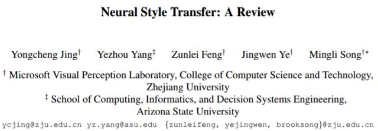
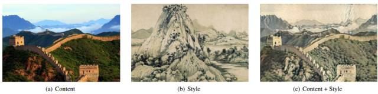
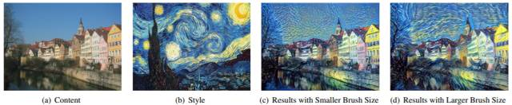
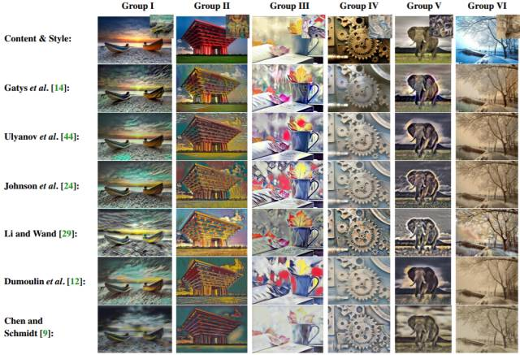
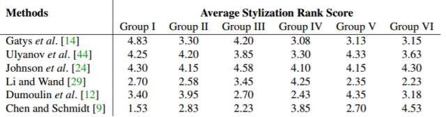
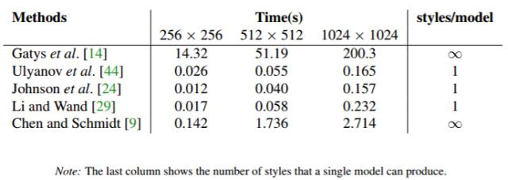
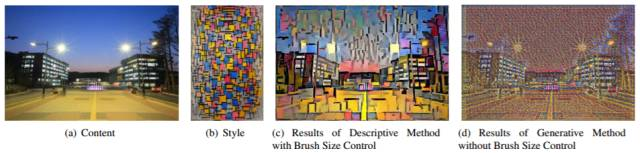
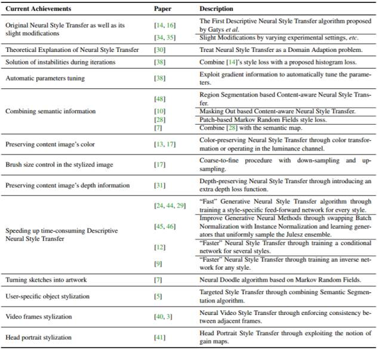

# 神经风格迁移研究概述：从当前研究到未来方向（附论文和代码）

选自 arXiv

**作者：Yongcheng Jing 等**

**机器之心编译**

> > > *风格迁移是近来人工智能领域内的一个热门研究主题，机器之心也报道了很多相关的研究。近日，来自浙江大学和亚利桑那州立大学的几位研究者在 arXiv 上发布了一篇「神经风格迁移（Neural Style Transfer）」的概述论文，对当前神经网络风格迁移技术的研究、应用和难题进行了全面的总结。机器之心对该论文的部分内容进行了编译介绍，论文原文请访问：https://arxiv.org/abs/1705.04058。此外，为方便进一步的扩展阅读，机器之心还在文末汇总了我们曾经发布过的风格迁移相关文章。*
> > 
> > 
> > 
> > **摘要**
> > 
> > Gatys 等人的近期研究证实了卷积神经网络（CNN）的力量：通过分离和重新组合图片内容与风格，CNN 可以创作出具有艺术魅力的作品。使用 CNN 将一张图片的语义内容与不同风格融合起来的过程被称为神经风格迁移（Neural Style Transfer）。从那以后，在学术研究和产业应用中，神经风格迁移已成为一个很受欢迎的主题，不仅日益受到计算机视觉研究者的关注，研究人员还提出了几种方法来提升或扩展 Gatys et al. 提出的神经算法。不过，有关这方面的全面综述、总结性文献还付之阙如。这篇论文回顾了神经网络风格迁移研究近期取得的进展，并讨论了这一技术的不同应用以及尚未解决的问题，这也是未来研究的方向。
> > 
> > 
> > 
> > *图 1：使用了 Gatys 等人的风格迁移算法的例子，将中国画风格（b）转移到了一张长城相片（a）上。提供风格的那幅作品是黄公望的《富春山居图》。*
> > 
> > **1 引言**
> > 
> > 本文的余下部分的逻辑结构如下。第 2 节对现有的神经风格迁移方法进行分类，并详细解释了这些方法。第 3、4 节介绍了这些方法的一些改进以及扩展。文章第 5 节给出了风格化输出效果的评估方法。第 6 节讨论了这些神经风格迁移方法的商业化应用。最后，第 7 节总结了当前面临的挑战以及可能的解决方案。第 8 部分总结全文并抛出了几个有前途的研究方向。
> > 
> > 文章所涉论文以及相应的代码、预训练模型请移步至：https://github.com/ ycjing/Neural-Style-Transfer-Papers
> > 
> > **2 神经风格迁移方法的二分法**
> > 
> > 在这一部分，我们提出了一种分类方法。当前的神经风格迁移方法符合其中之一：基于图片迭代的描述性神经方法（Descriptive Neural Methods Based On Image Iteration）和基于模型迭代的生成式神经方法（Generative Neural Methods Based On Model Iteration）。第一类方法通过直接迭代更新图片像素来实现图像风格迁移，第二种方法首先会迭代优化生成模型，接着通过一个单独前向通过来生成风格化图像。
> > 
> > **2.1 基于图像迭代的描述性神经方法（Descriptive Neural Methods Based On Image Iteration）**
> > 
> > 第一个用来转移图片风格的神经方法就是描述性神经方法。这一方法会从随机噪音开始，通过反向传播迭代更新（尚未知晓的）风格化图像。图像迭代的目标是最小化总损失，这样风格化后的图像就能同时将内容图像的内容与风格图像的风格匹配起来。
> > 
> > 神经风格迁移的关键之一就是风格表征（representation of style），即预定义的风格损失函数。风格损失函数会被优化以匹配风格图像特征统计。根据采用的风格损失函数不同，我们可以进一步将这一方法分为基于最大均值差（MMD）的方法和基于马尔科夫随机场（MRF）的方法。简便起见，我们称之为基于 MMD 和基于 MRF 的方法。
> > 
> > **2.1.1 基于 MMD 的描述性神经方法**
> > 
> > MMD 是一个很受欢迎的评估两个分布之差的标准，以希尔伯特空间特征均值为基础［20］。最近，Li 等人的研究表明风格迁移能够被视为一个从内容图像到风格图像的分布对齐过程 [30]。因此，MMD 能被用于测量风格差异。基于 MMD 的描述性神经方法是指使用带有不同核函数的 MMD 作为优化的风格损失的神经方法。
> > 
> > **2.1.2 基于 MRF 的描述性神经方法**
> > 
> > MRF 是一种用于图像合成的经典框架。假设局部图像块包含了一张图像中的最相关统计依存性。描述性神经方法的第二类是以 MRF 为基础的，还考虑到了局部水平的神经风格迁移，比如局部图像块的风格匹配。
> > 
> > **2.2 基于模型迭代的生成式神经方法**
> > 
> > 尽管描述性神经方法能够生成出色的风格化图像，但仍有局限性。其中之一就是效率问题。第二类，亦即基于模型迭代的生成式神经方法（在某些论文中，也被成为「快速」神经风格迁移）解决了速度和计算成本问题，不过牺牲了模型的灵活性。关键思想就是在每个针对特定风格图像的大型图像数据集上提前训练一个前馈网络。使用梯度下降，通过迭代式地更新模型来优化网络模型。
> > 
> > **3 当前方法上的轻微修改**
> > 
> > 有几项研究提出了基于目前最好的神经网络风格迁移算法的改进版。这些改进版保留了现有算法的架构和处理过程，但稍稍改变了损失函数来获得更好的性能。
> > 
> > 
> > 
> > *图 2：控制神经风格迁移中的画笔大小可以生成不同风格的结果。风格样式来自梵高的《The Starry Night》*
> > 
> > **3.1 描述性神经方法的衍生**
> > 
> > **3.2 生成式神经方法的衍生**
> > 
> > **4 特定类型图像的扩展**
> > 
> > 上述神经风格迁移方法都是对静态图像进行处理的。它们可能不适用于其他类型的图像（如涂鸦、头像和视频）。目前已有很多研究正试图将最先进的神经风格迁移算法应用到这些特殊类型的图像，或指定目标的图像风格迁移中。
> > 
> > 在涂鸦中的神经风格迁移。Champandard 完成了一些有趣的研究 [7]（如 2.1.2 节所示）。除了将语义映射引入到神经风格迁移算法中以外，人们也可以通过这种方法在图像中输入高级注释来把简单的草图转换为精细的图画。
> > 
> > 头像的神经风格转移。尽管 Gatys 等人的算法已可以进行通用图像的风格转移，但它还不适用于头像的风格转移。由于空间约束不强，直接应用 Gatys 等人的方法可能会使人物头部变形。它对于这种类型的风格转移是不可接受的。Selim 等人 [41] 经过研究解决了这一问题，他们拓展了 Gatys 等人的算法。他们使用了增益图（gain maps）的概念来约束空间，从而在风格迁移的同时可以保留人物的面部轮廓。
> > 
> > 指定对象的神经风格迁移。Castillo 等人 [5] 提出了指定风格迁移目标的算法。该算法是在图像中仅对单个用户指定的对象进行风格化的过程。这个想法是使用最先进的语义分割算法从风格化图像中分割目标对象，然后提取风格迁移后的对象与非风格化背景合并。
> > 
> > 对视频的神经风格迁移。Ruder 等人 [40] 拓展了 Gatys 等人的研究，用神经风格前以算法对视频图像序列进行了处理，在本文中神经视频风格迁移中有提到。给定目标风格图片，Ruder 等人的算法引入时间损失函数来让整个视频都可以得到风格迁移。该算法背后的关键思想是使用时间约束来保持各帧之间的平滑过渡，即惩罚沿着点轨迹的偏差。Ruder 等人的算法已被证明可以能够在大多数情况下消除人工痕迹，并产生平滑的风格化视频。另一个此方向上的研究由 Anderson 等人 [3] 提出，它能够利用光流对风格迁移进行初始化，为一段影片进行渲染。
> > 
> > **5 评估方法**
> > 
> > 对于神经风格迁移问题，并不存在什么 ground truth。神经风格迁移是一种艺术创作。不同的人可能会对同一个迁移后的结果有不同乃至截然相反的看法。因此，对神经风格迁移算法所得到的视觉结果的评估仍然还是一个悬而未决的重要问题。
> > 
> > 从我们的角度来看，在神经风格迁移领域有两种类型的评估方法可以使用，即：定性评估（qualitative evaluation）和定量评估（quantitative evaluation）。定性评估要求参与者评估排序不同算法的结果，这依赖于参与者的观察（被称为「风格感知研究（Stylization Perceptual Studies）」）。这种评估结果可能会因参与者属性（比如年龄、职业）的不同而不同。尽管在定性评估方法上存在一定程度的不确定性，但该方法至少能够提供一些有关人们的神经艺术风格偏好的信息。而定量评估则侧重于在算法上的精确评估指标（比如时间复杂度）。
> > 
> > 在目前的神经风格迁移领域，生成式的神经方法已经成为了一个热门的主题，其中速度是工业应用所考虑的主要问题之一。但就我们所知，之前还没有研究在同样的实验设置下运行过所有当前最佳的生成式神经方法，并在定性和定量上对它们进行比较。因此，在这一章中，我们的目标是比较 5 种当前最佳的生成式神经方法，并且使用了 Gatys et al. 的描述式神经方法作为参考。
> > 
> > 实验设置。总体而来，实验使用了 10 张风格图像和 20 张内容图像。所有风格转换结果都是使用作者提供的代码 [43, 23, 27, 19, 8] 得到的，但 [14] 是例外。对于 [14]，我们使用了一种有所修改的（见第三章）流行的开源代码 [22]。我们的实验中使用的所有这些代码的参数都是原作者对应论文提供的默认参数，但 [12, 9] 是例外。我们为 [12,9] 使用了作者提供的预训练的模型。对于我们实验中所有的生成式神经方法，所有测试内容图像在训练过程中都没有被观察过。
> > 
> > **5.1 定性评估**
> > 
> > 
> > 
> > *图 3：定性评估的一些结果示例*
> > 
> > 
> > 
> > *表 1：对于图 3 中图像上的六种算法的平均风格排名分数（∈ [1, 6]）*
> > 
> > **5.2 定量评估**
> > 
> > 
> > 
> > *表 2：在 256×256、512×512、1024×1024 三种像素大小上的神经风格迁移算法的速度比较（硬件：NVIDIA Quadro M6000）*
> > 
> > **6 应用**
> > 
> > 因为神经风格迁移的结果惊人，所以也带来了很多成功的业界应用并且也开始实现了商业回报。同时，也有一些应用论文调查了神经风格迁移技术在不同应用领域的应用方式 [4,25]。本节对这些应用进行了总结，并提出了一些潜在的用途。
> > 
> > **6.1 社交**
> > 
> > **6.2 辅助用户创作的工具**
> > 
> > **6.3 用于娱乐应用的生产工具**
> > 
> > **7 难题与可能的解决方案**
> > 
> > 神经风格迁移领域的进展惊人，在产业中也已有所应用。尽管目前的算法取得了惊人的结果，该领域仍有一些挑战与仍待解决的问题。在此章节中，我们将总结神经风格迁移领域内的问题，并讨论对应的解决方案。
> > 
> > **7.1 难题**
> > 
> > *   参数调整的问题
> >     
> >     
> > *   笔触方向控制问题
> >     
> >     
> > *   神经风格迁移中「快」与「更快」的问题
> >     
> >     
> > 
> > 
> > 
> > *图 4：带有画笔大小控制的描述性神经方法的高分辨率结果，以及不带画笔大小控制的生成式神经方法的高分辨率结果。*
> > 
> > **7.2 可能的解决方案**
> > 
> > 参数调整问题的解决方案。在未来自动参数调整问题的研究中，我们分别讨论了对描述性神经方法和生成式方法的解决方案。对描述性神经方法，可能的一个解决方案是跟随 Risser 等人的方法，进一步的结合一些无梯度信息，比如损失的量级以及损失内的统计。另一个方向是从分类问题中使用的自动参数优化策略获取灵感（例如，Domhan 等人的研究 [11]，Luo 的研究 [32]）。
> > 
> > 对生成式神经方法，一种思路是研究不需要为不同风格训练单独模型的新方法（就像 [9]），同时还要保证结果的高质量。（也就是，突破速度、灵活性和质量之间的权衡）。然后参数调整的过程就不会特别耗费时间，而且把参数调整交给用户也可接受。此外，目前自动参数优化策略中的一些方法对生成式神经方法中的自动参数调整也会有帮助。
> > 
> > 对笔触方向控制问题的可能解决方案。目前的神经风格迁移算法不考虑对笔触方向的控制。相反，在非真实感绘制技术（NPR：Non-photorealistic Rendering）领域，对笔触方向控制有很好的研究 [39]。我们相信 NPR 领域中的一些思路可被借鉴来解决神经风格迁移中的方向问题。例如，Zhang 等人要求用户明确笔触方向的位置与方式 [49]，因为不同的用户有不同的偏好。同样的思路可借鉴到神经风格迁移算法中，要求用户提前选择全局笔触方向。此外，结合神经风格迁移算法和 NPR 领域中指导笔触方向的策略（例如，[50] 中的向量场方法）是该问题的另一个潜在的解决方案。
> > 
> > 神经风格迁移中「快」与「更快」问题的解决方案。该研究方向的关键问题是如何突破速度、灵活性、质量三者的权衡。可能的一个解决方案是跟随 Chen 和 Schmidt 的研究 [9]。他们的算法是目前最有效的算法，但图片质量并不高。改进他们的方法所产生的风格迁移图像的质量是突破速度、灵活性、质量三者权衡的有潜力的方向。目前已有一些相关工作，比如 [51]。
> > 
> > 对神经风格迁移算法「快」与「更快」的笔触大小控制而言，思路类似于之前提到的笔触方向控制的可能解决方案。在 NPR 领域，有大量的研究人员在做笔触大小控制。若要进行回顾，我们推荐 [39] 中的章节 1。
> > 
> > **8 结论和未来工作**
> > 
> > 过去三年来，神经风格迁移已经持续成长为了一个蓬勃发展的研究领域。这一研究领域内越来越多的活动受到了科学挑战和工业需求的推动。而且在神经风格迁移领域内，研究者们也已经进行了数量可观的研究。这一领域内的关键进展见于表 3。总体而言，这篇概述提供了对神经风格迁移现有研究的广泛调研，覆盖了当前方法的类别、它们的改进和扩展、评估方法以及现有的挑战和对应的可能解决方案。此外，我们还概述了神经风格迁移的三个应用领域，包括社交、辅助用户创作的工具和用于娱乐应用的产品工具。
> > 
> > 
> > 
> > *表 3：总结神经风格迁移领域内的当前进展*
> > 
> > 未来研究神经风格迁移，有前景的方向主要集中在两个方面。一是解决前面提到的当前算法所面临的难题，即参数微调问题、笔触方向控制问题和神经风格迁移中「快」与「更快」的问题。对这些难题及其对应的可能解决方案的描述见于第 7 节。第二个有前景的方向是关注神经风格迁移的新扩展（比如，时尚风格迁移和字符风格迁移），在这个方向上已经有了一些初步的研究成果，比如最近 Yang et al. [47] 的关于文本效果迁移（Text Effects Transfer）的研究。这些有趣的扩展可能会变为未来的研究主题趋势，之后又可能会创造出新的相关领域。
> > 
> > 致谢与参考文献（略）****
> > 
> > **机器之心风格迁移相关文章：**
> > 
> > *   [重磅 | Facebook 贾扬清宣布新机器学习系统 Caffe2Go：可在移动设备上实现实时风格迁移](http://mp.weixin.qq.com/s?__biz=MzA3MzI4MjgzMw==&mid=2650720399&idx=1&sn=2b5e854e6606eaf556a73e83d179eb5c&chksm=871b0cf1b06c85e7547b69a44471d377eca83cbdeaec379fabc187218280c761824a5600e1ac&scene=21#wechat_redirect)
> >     
> >     
> > *   [开源 | 汉字风格迁移项目 Rewrite：利用神经网络学习设计汉字新字体](http://mp.weixin.qq.com/s?__biz=MzA3MzI4MjgzMw==&mid=2650720285&idx=4&sn=209c40398e94f0883b832c697d4d9158&chksm=871b0c63b06c8575a492d4fbd04c943cf41ce54d275265b2573172ea8117bed9e01aa123b7c8&scene=21#wechat_redirect)
> >     
> >     
> > *   [开源 | 怎么让你的照片带上艺术大师风格？李飞飞团队开源快速神经网络风格迁移代码](http://mp.weixin.qq.com/s?__biz=MzA3MzI4MjgzMw==&mid=2650719733&idx=3&sn=950a7adb4e93bca22e4ef975877482a9&chksm=871b018bb06c889ddc87bccaa0f35de5ca5a35c156cf1164d134d5010065d68dd06ba6e7cdfa&scene=21#wechat_redirect)
> >     
> >     
> > *   [深度 | 谷歌增强型风格迁移新算法：实现基于单个网络的多种风格实时迁移（附论文）](http://mp.weixin.qq.com/s?__biz=MzA3MzI4MjgzMw==&mid=2650720113&idx=1&sn=b45bd28cef19a06c717717d3622d58de&chksm=871b030fb06c8a199334d745ad1be56b6b7aeb364596743be7215cc7c6a15a23053c8b60639f&scene=21#wechat_redirect)
> >     
> >     
> > *   [资源 | 下一代 PS 工具：Adobe 照片级图像风格转换的 Torch 实现](http://mp.weixin.qq.com/s?__biz=MzA3MzI4MjgzMw==&mid=2650724939&idx=4&sn=0f18b339d0bcb09de1c1efd5cff978a8&chksm=871b1e35b06c972387569f7222f834ad848c63777ed9ae6b0f78ba67a5e55bd63b5f9da8c769&scene=21#wechat_redirect)
> >     
> >     
> > *   [前沿 | 梵高究竟长啥样？深度神经网络根据油画重建出他的照片](http://mp.weixin.qq.com/s?__biz=MzA3MzI4MjgzMw==&mid=2650717418&idx=2&sn=51ec2463c40d069c9b6e48ff73d20b17&scene=21#wechat_redirect)
> >     
> >     
> > *   [学界 | 让黑白影像重获新生：UC Berkeley 提出实时神经网络着色模型](http://mp.weixin.qq.com/s?__biz=MzA3MzI4MjgzMw==&mid=2650726327&idx=5&sn=865cffa1f9b7bc414292588e33c76323&chksm=871b1bc9b06c92df1a748d9de8814a18294b7c8f18b6f88ea09fe8c68d0ee79d65f27330c756&scene=21#wechat_redirect)
> >     
> >     
> > *   [学界 | 让莫奈画作变成照片：伯克利图像到图像翻译新研究](http://mp.weixin.qq.com/s?__biz=MzA3MzI4MjgzMw==&mid=2650725257&idx=4&sn=bf367ff90e03f8189f7c67ae0e5ab76f&chksm=871b1ff7b06c96e1e355d8b360abd0c256af04e2ba72a8d2a3364bfea8ff80b347a734d17e9d&scene=21#wechat_redirect)
> >     
> >     
> > *   [学界 | 风格迁移新方法：微软与上海交大提出深度图像类比技术](http://mp.weixin.qq.com/s?__biz=MzA3MzI4MjgzMw==&mid=2650726358&idx=5&sn=668a3ec6e2810e7b4ff069fc864c684b&chksm=871b1ba8b06c92be06c0da76a3c427b66d42daa4b16916a4b2fc70cd49e49c1f2a982a9e4b91&scene=21#wechat_redirect)
> >     
> >     
> > *   [学界 | 卷积神经网络新玩法：分分钟让你变脸尼古拉斯·凯奇](http://mp.weixin.qq.com/s?__biz=MzA3MzI4MjgzMw==&mid=2650721033&idx=4&sn=8d14786e553f30301f97ee04e3262da0&chksm=871b0f77b06c866102dec9cb0b53494f8af0276693e0427cd2351b6916c9e22d5fa79e62c879&scene=21#wechat_redirect)
> >     
> >     
> > *   [业界 | 跨界人工智能，暮光之城女主角发表学术论文](http://mp.weixin.qq.com/s?__biz=MzA3MzI4MjgzMw==&mid=2650722569&idx=3&sn=6ca8e1b70a80f57ad3d356ac48960c7e&chksm=871b1577b06c9c61a3637aa4a4bcba91bf5544e0f020d6b31016f7ce2d45b1c0ac6eb187c41b&scene=21#wechat_redirect)
> >     
> >     
> > 
> > 读者福利：即日起至 GMIS 2017 大会当天，读者在头条文章下留言，机器之心会在次日选出最专业或最有见解的一条评论赠送 GMIS 2017 双日票一张！
> > 
> > 查看全部嘉宾阵容并报名参与机器之心 GMIS 2017，请点击「阅读原文」。
> > 
> > 